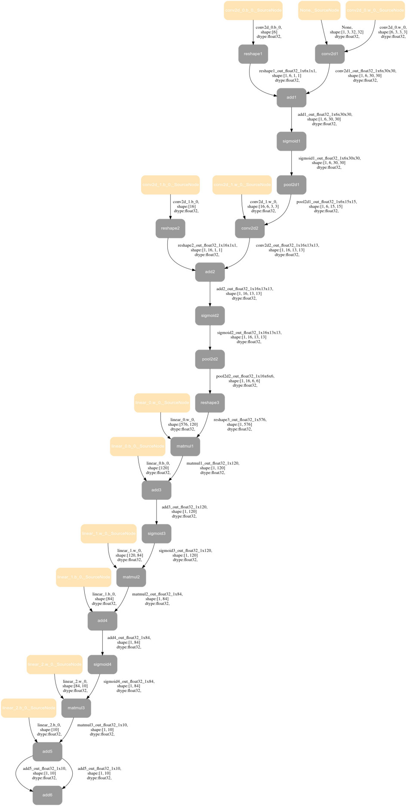
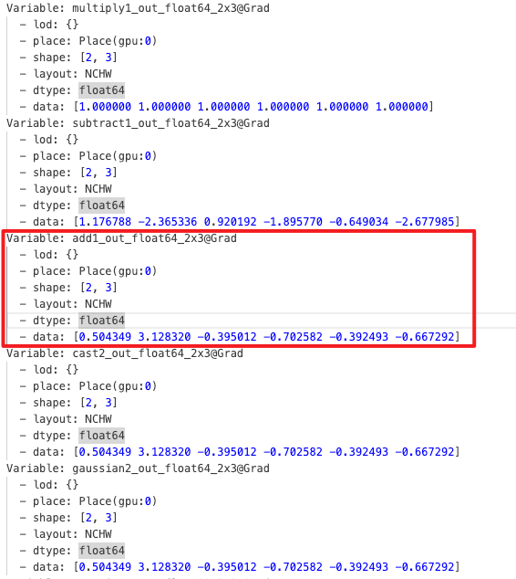
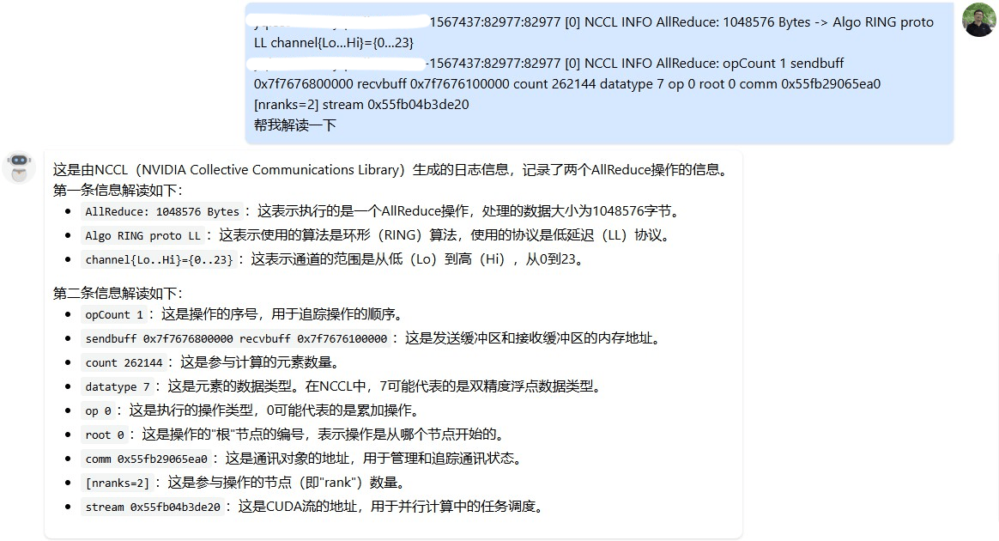
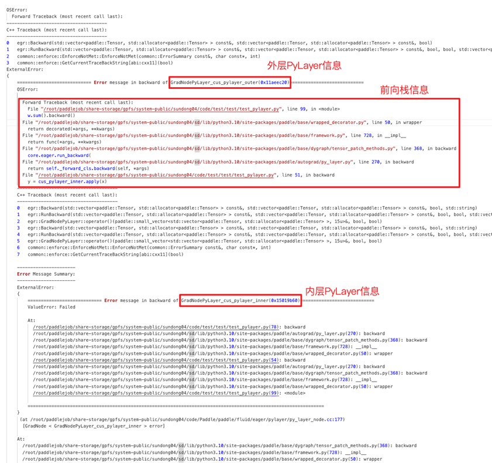
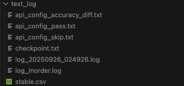

本文档用于汇集 Paddle 同学们分享的一些日常调试方法、技巧。互相分享，营造良好的技术氛围，提升大家认知、提升日常工作效率。

<!-- more -->

---

[[toc]]

---

## 前言

程序调试的本质，是将问题的来龙去脉、有效信息全面的呈现给大脑，信息收集到位后问题自然定位。因此调试过程就是信息收集过程。

本文档希望汇集一些常见问题、常见场景的调试方法、技巧。但日常工作中，更多的问题有其特殊性，汇集的方法不能完全适用。一些通用的调试原则、建议在此汇集：

- 避免“手懒，脑子勤快”。（By 王欢）
   - 避免总在脑子里推演、猜想，而不验证。尽量将猜测通过实验做实，要么认定“肯定是 xxx 方向的问题”，要么认定“xxx 方向没问题需要往别的方向找”，依据猜测前行会没有动力，也可能走弯路。
   - 手勤快的表现：
      - 黑盒问题，通过外围实验找规律。比如：简化问题、“这么写就对那么写就崩”、注释掉一半代码试试，回退版本等。
      - 白盒问题，通过 Vlog、print、std::cout 多带来信息：程序路径是啥样的？各个变量的值（沾边儿的都打印看看）。
      - 日志量太大，大脑是处理不过来的。需要精简重要日志、或者花一些功夫考虑以什么形式呈现问题。
- 对程序越熟悉，越能做出正确的调试决策。[pfcc/paddle-code-reading](https://github.com/PaddlePaddle/community/tree/master/pfcc/paddle-code-reading) 里有很多 Paddle 机制的介绍。（By 王欢）
- ...

## 1.Paddle 的一些调试工具

### 1.1. FLAGS_call_stack_level 报错栈级别控制 & inplace version 问题调试（By 王欢）

- FLAGS_call_stack_level 默认值为 1，代表只打印崩溃时的 Python 栈和 C++的报错提示
- export FLAGS_call_stack_level=2 后，可以打印崩溃时的 Python 栈、**C++栈**和 C++的报错提示
- export FLAGS_call_stack_level=3 后，在动态图反向执行崩溃时，可以打印 Python 栈、C++栈和 C++的报错提示，**外加反向节点对应的前向 Python 栈，** 这样有助于知道反向崩溃对应的前向逻辑在哪里。

> [!NOTE]
> 注意：FLAGS_call_stack_level=1、FLAGS_call_stack_level=2 几乎性能无损，而 FLAGS_call_stack_level=3 是性能有损的（损耗的是 CPU 调度性能，但不会引发 GPU Sync 或 GPU Kernel 变慢）！

以如下代码为例（以下代码是一个 inplace version 异常的 case，当日常遇到 inplace version 时，可以使用 export FLAGS_call_stack_level=3 调试，可以看到前向“不希望被 inplace”的 Tensor 位置）：

```python
import paddle
var_a = paddle.ones(shape=[4, 2, 3], dtype="float32")
var_a.stop_gradient = False

var_b = var_a**2
var_c = var_b**2  # ⚠️ pow_grad need var_b
var_b[1:2] = 3.3  # ⚠️ bug var_b is modified inplace after using it
var_d = var_b**2
loss = paddle.nn.functional.relu(var_c + var_d)
loss.backward()
```

默认情况报错如下：

```log
W0911 06:14:45.186664 28140 backward.cc:462] While running Node (PowGradNode) raises an EnforceNotMet exception
Traceback (most recent call last):
  File "/data/Eager/Paddle2/test.py", line 10, in <module>
    loss.backward()
  File "/usr/local/lib/python3.9/dist-packages/decorator.py", line 232, in fun
    return caller(func, *(extras + args), **kw)
  File "/usr/local/lib/python3.9/dist-packages/paddle/base/wrapped_decorator.py", line 40, in __impl__
    return wrapped_func(*args, **kwargs)
  File "/usr/local/lib/python3.9/dist-packages/paddle/base/framework.py", line 722, in __impl__
    return func(*args, **kwargs)
  File "/usr/local/lib/python3.9/dist-packages/paddle/base/dygraph/tensor_patch_methods.py", line 371, in backward
    core.eager.run_backward([self], grad_tensor, retain_graph)
RuntimeError: (PermissionDenied) Tensor '' used in gradient computation has been modified by an inplace operation. Its version is 1 but the expected version is 0. Please fix your code to void calling an inplace operator after using the Tensor which will used in gradient computation.
  [Hint: Expected tensor_version == wrapper_version_snapshot, but received tensor_version:1 != wrapper_version_snapshot:0.] (at /data/Eager/Paddle/paddle/fluid/eager/tensor_wrapper.h:246)
```

export FLAGS_call_stack_level=2 后

```log
W0911 06:12:25.607916 27765 backward.cc:462] While running Node (PowGradNode) raises an EnforceNotMet exception
Traceback (most recent call last):
  File "/data/Eager/Paddle2/test.py", line 10, in <module>
    loss.backward()
  File "/data/Eager/Paddle2/build/python/paddle/base/wrapped_decorator.py", line 50, in wrapper
    return decorated(*args, **kwargs)
  File "/data/Eager/Paddle2/build/python/paddle/base/framework.py", line 722, in __impl__
    return func(*args, **kwargs)
  File "/data/Eager/Paddle2/build/python/paddle/base/dygraph/tensor_patch_methods.py", line 368, in backward
    core.eager.run_backward([self], grad_tensor, retain_graph)
RuntimeError:

--------------------------------------
C++ Traceback (most recent call last):
--------------------------------------
0   egr::Backward(std::vector<paddle::Tensor, std::allocator<paddle::Tensor> > const&, std::vector<paddle::Tensor, std::allocator<paddle::Tensor> > const&, bool)
1   egr::RunBackward(std::vector<paddle::Tensor, std::allocator<paddle::Tensor> > const&, std::vector<paddle::Tensor, std::allocator<paddle::Tensor> > const&, bool, bool, std::vector<paddle::Tensor, std::allocator<paddle::Tensor> > const&, bool, std::vector<paddle::Tensor, std::allocator<paddle::Tensor> > const&)
2   PowGradNode::operator()(paddle::small_vector<std::vector<paddle::Tensor, std::allocator<paddle::Tensor> >, 15u>&, bool, bool)
3   egr::EagerUtils::RecoverTensorWrapper(egr::TensorWrapper*)
4   egr::TensorWrapper::recover()
5   egr::TensorWrapper::check_inplace_version()
6   common::enforce::EnforceNotMet::EnforceNotMet(common::ErrorSummary const&, char const*, int)
7   common::enforce::GetCurrentTraceBackString[abi:cxx11](bool)

----------------------
Error Message Summary:
----------------------
PermissionDeniedError: Tensor '' used in gradient computation has been modified by an inplace operation. Its version is 1 but the expected version is 0. Please fix your code to void calling an inplace operator after using the Tensor which will used in gradient computation.
  [Hint: Expected tensor_version == wrapper_version_snapshot, but received tensor_version:1 != wrapper_version_snapshot:0.] (at /data/Eager/Paddle2/paddle/fluid/eager/tensor_wrapper.h:264)
```

export FLAGS_call_stack_level=3 后

```log
W0911 06:12:47.854785 27875 backward.cc:462] While running Node (PowGradNode) raises an EnforceNotMet exception
Traceback (most recent call last):
  File "/data/Eager/Paddle2/test.py", line 10, in <module>
    loss.backward()
  File "/data/Eager/Paddle2/build/python/paddle/base/wrapped_decorator.py", line 50, in wrapper
    return decorated(*args, **kwargs)
  File "/data/Eager/Paddle2/build/python/paddle/base/framework.py", line 722, in __impl__
    return func(*args, **kwargs)
  File "/data/Eager/Paddle2/build/python/paddle/base/dygraph/tensor_patch_methods.py", line 368, in backward
    core.eager.run_backward([self], grad_tensor, retain_graph)
RuntimeError:

  Forward Traceback (most recent call last):
    File "/data/Eager/Paddle2/test.py", line 6, in <module>
    var_c = var_b**2


--------------------------------------
C++ Traceback (most recent call last):
--------------------------------------
0   egr::Backward(std::vector<paddle::Tensor, std::allocator<paddle::Tensor> > const&, std::vector<paddle::Tensor, std::allocator<paddle::Tensor> > const&, bool)
1   egr::RunBackward(std::vector<paddle::Tensor, std::allocator<paddle::Tensor> > const&, std::vector<paddle::Tensor, std::allocator<paddle::Tensor> > const&, bool, bool, std::vector<paddle::Tensor, std::allocator<paddle::Tensor> > const&, bool, std::vector<paddle::Tensor, std::allocator<paddle::Tensor> > const&)
2   PowGradNode::operator()(paddle::small_vector<std::vector<paddle::Tensor, std::allocator<paddle::Tensor> >, 15u>&, bool, bool)
3   egr::EagerUtils::RecoverTensorWrapper(egr::TensorWrapper*)
4   egr::TensorWrapper::recover()
5   egr::TensorWrapper::check_inplace_version()
6   common::enforce::EnforceNotMet::EnforceNotMet(common::ErrorSummary const&, char const*, int)
7   common::enforce::GetCurrentTraceBackString[abi:cxx11](bool)

----------------------
Error Message Summary:
----------------------
PermissionDeniedError: Tensor '' used in gradient computation has been modified by an inplace operation. Its version is 1 but the expected version is 0. Please fix your code to void calling an inplace operator after using the Tensor which will used in gradient computation.
  [Hint: Expected tensor_version == wrapper_version_snapshot, but received tensor_version:1 != wrapper_version_snapshot:0.] (at /data/Eager/Paddle2/paddle/fluid/eager/tensor_wrapper.h:264)
  [GradNode < PowGradNode > error]
```

### 1.2. GLOG 常规日志打印（By 孙东）

#### 1.2.1. GLOG 基本用法介绍

- 环境变量`GLOG_v=<level>` ，`<level>`为一个数字表示 GLOG 输出日志的级别，GLOG_v 是全局的日志级别控制变量对所有的模块（编译单元）都生效，GLOG_v 等级越高（数字越大）则输出的 LOG 信息越丰富。
- 环境变量 `GLOG_vmodule=<module>=<level>[,<module2>=<level2>,...]`，其中 `<module>` 是文件名（不含扩展名），`<level>` 是日志级别。`GLOG_vmodule`是一个模块级别的日志控制变量，允许为一个或者多个特定的 C++ 源文件设置不同的日志级别。
- 输出格式的介绍。设置完日志等级之后，输出的 LOG 信息的前缀如下：

   ```bash
   I0910 10:19:39.953390  7128 dygraph_functions.cc:94539]  xxxx
   ```

   解释：
   1. **I**: 表示日志分类。Glog 中有四种日志分类：
      - I: INFO，信息日志，用于输出一般信息。
      - W: WARNING，警告日志，用于输出警告信息。
      - E: ERROR，错误日志，用于输出错误信息。
      - F: FATAL，严重错误日志，输出后会导致程序终止。
   2. **0910**: 表示日期，格式为 MMDD，即 09 月 10 日。
   3. **10:19:39.953418**: 表示时间，格式为 HH:MM:SS.ssssss，其中 HH 是小时，MM 是分钟，SS 是秒，ssssss 是微秒。
   4. **7128**: 这是记录日志的线程或进程的 ID
   5. **api.cc**: 这是源文件的名称，表示日志输出的代码所在的文件。
   6. **94539**: 这是源文件中的行号，表示日志输出的代码所在的行。
   7. xxxx : 这是实际的日志消息内容，输出具体的信息或调试数据。

- **GLOG_v=10 python xxx**: log 信息最全的日志打印等级
- 动态图关键执行路径的日志打印：
   - **GLOG_v=4 python xxx**: 动态图执行时从 pybind 到 kernel 每一层的关键函数调用、kernel 选择、输入输出 tensor 以及 gradnode 的指针等信息。
   - **GLOG_v=5 python xxx**: 在 GLOG_v=4 的基础上看到输入 tensor 的 dtype、shape 等属性、Promotion、Autocast、Layout autotune 细节、GradNode 构建的关键信息等。
   - **GLOG_v=6 python xxx**: 在 GLOG_v=5 的基础上 Tensor、API、GradNode 有唯一命名，内存分配/拷贝信息。更详细的前向和反向的提示信息。
- **日常建议开 `GLOG_v=6` 做调试，不要开 GLOG_v=10，因为 GLOG_v=10 有很多冗余干扰信息**

   例子：`GLOG_v=6` 时的 GLOG

   ```log
   ==========================Running_AD_API: add==========================
   W1207 23:45:28.132709 2778380 dygraph_functions.cc:120152] Got different data type, run type promotion automatically, this may cause data type been changed.
   I1207 23:45:28.132722 2778380 dygraph_functions.cc:120155] Got different data type, run type promotion automatically. The type after type promotion is float64 #发生类型提升
   I1207 23:45:28.132733 2778380 dygraph_functions.cc:17205]
   ==========================Running_AD_API: cast========================== #类型提升用到的cast
   I1207 23:45:28.132736 2778380 dygraph_functions.cc:17217]  No AMP for cast_ad_func because it is a inplace or cast api.
   I1207 23:45:28.132741 2778380 dygraph_functions.cc:17220]  No Type Promotion for cast_ad_func api.
   I1207 23:45:28.132743 2778380 dygraph_functions.cc:17223]  No Type Autocast for cast_ad_func api.
   I1207 23:45:28.132809 2778380 dygraph_functions.cc:17259] { Input: [  #cast的输入信息
   ( x , {
           Name: gaussian1_out_float32_2x3,
           Initialized: 1,
           Tensor_Ptr:0x7ffe507a1070,
           Tensor_Impl_Ptr: 0x7ea8ec0,
           TensorInfo: {
                   Type: DenseTensor,
                   Dtype: float32,
                   Place: Place(gpu:0),
                   Shape: 2, 3,
                   DistAttr: Unknown

           },
           ADInfo:{
                   Grad:  {
                           Name: Tensor_b4e4e80,
                           Initialized: 0,
                           Tensor_Ptr:0xb4e4e80,
                           Tensor_Impl_Ptr: 0,
                           TensorInfo: { Unknown
                           },
                           ADInfo:{ None
                           }
                   } ,
                   GradNode:
                           BackwardOutMeta:   {
                                   SlotSize: [1]:
                                   SlotID: 0,
                                   StopGradients: 0, ,
                                   Edges[ { NULL Edge } ]

                                   }  ,
                           BackwardInMeta:   {
                                   SlotSize: [1]:
                                   SlotID: 0,
                                   StopGradients: 0, ,
                                   Edges[ { NULL Edge } ]

                                   }
                           ,
                   StopGradient: [ 0 ]
           }
   }), ]}
   I1207 23:45:28.132863 2778380 dygraph_functions.cc:17278] Create node CastGradNode addr 0xb4e6d30 #创建反向GradNode
   I1207 23:45:28.132956 2778380 dygraph_functions.cc:17308]
   ==========================Running_C++_API: cast1==========================  #调用 C++ kernel
   I1207 23:45:28.132970 2778380 api.cc:22899] cast API kernel key: [GPUDNN, NCHW, float32]
   I1207 23:45:28.132978 2778380 api.cc:22906] cast kernel: {"input":[
           backend: GPU,  layout: NCHW,  dtype: float32
   ],
   "output":[
           backend: GPU,  layout: NCHW,  dtype: Undefined
   ],
   "attribute":[
           "DataType"
   ]}
   I1207 23:45:28.133036 2778380 auto_growth_best_fit_allocator.cc:258] Not found and reallocate 256(0x7fa263e00400), and remaining 0
   I1207 23:45:28.144747 2778380 dygraph_functions.cc:17311]
   ==========================Finish_C++_API: cast1==========================
   I1207 23:45:28.144778 2778380 grad_node_info.cc:402] Add Edges for slot: 0, the Edge is from cast1GradNode(0xb4e6d30) to GradNodeAccumulation(0xa4a4820) #反向图建图信息
   I1207 23:45:28.144852 2778380 dygraph_functions.cc:17376]
   Forward Debug Info { #运行结束后cast的输入输出Tensor信息。前向图画图也会用到
   API_Name: cast1
   Input: [
   ( x , {
           Name: gaussian1_out_float32_2x3, #唯一命名
           Initialized: 1,
           Tensor_Ptr:0x7ffe507a1070,
           Tensor_Impl_Ptr: 0x7ea8ec0,
           TensorInfo: {
                   Type: DenseTensor,
                   Dtype: float32,
                   Place: Place(gpu:0),
                   Shape: 2, 3,
                   DistAttr: Unknown

           },
           ADInfo:{
                   Grad:  {
                           Name: Tensor_b4e4e80,
                           Initialized: 0,
                           Tensor_Ptr:0xb4e4e80,
                           Tensor_Impl_Ptr: 0,
                           TensorInfo: { Unknown
                           },
                           ADInfo:{ None
                           }
                   } ,
                   GradNode:
                           BackwardOutMeta:   {
                                   SlotSize: [1]:
                                   SlotID: 0,
                                   StopGradients: 0, ,
                                   Edges[ { NULL Edge } ]

                                   }  ,
                           BackwardInMeta:   {
                                   SlotSize: [1]:
                                   SlotID: 0,
                                   StopGradients: 0, ,
                                   Edges[ { NULL Edge } ]

                                   }
                           ,
                   StopGradient: [ 0 ]
           }
   }), ]
   Output: [
   ( out , {
           Name: cast1_out_float64_2x3,
           Initialized: 1,
           Tensor_Ptr:0x7ffe507a0760,
           Tensor_Impl_Ptr: 0x8b49730,
           TensorInfo: {
                   Type: DenseTensor,
                   Dtype: float64,
                   Place: Place(gpu:0),
                   Shape: 2, 3,
                   DistAttr: Unknown

           },
           ADInfo:{
                   Grad:  {
                           Name: Tensor_dba5d80,
                           Initialized: 0,
                           Tensor_Ptr:0xdba5d80,
                           Tensor_Impl_Ptr: 0,
                           TensorInfo: { Unknown
                           },
                           ADInfo:{ None
                           }
                   } ,
                   GradNode:
                           BackwardOutMeta:   {
                                   SlotSize: [1]:
                                   SlotID: 0,
                                   StopGradients: 0, ,
                                   Edges[  { [0, 0]: [0xa4a4820, GradNodeAccumulation] },  ]

                                   }  ,
                           BackwardInMeta:   {
                                   SlotSize: [1]:
                                   SlotID: 0,
                                   StopGradients: 0, ,
                                   Edges[ { NULL Edge } ]

                                   }
                           ,
                   StopGradient: [ 0 ]
           }
   }), ] }
   I1207 23:45:28.144996 2778380 dygraph_functions.cc:17382]
   ==========================Finish_AD_API: cast==========================
   I1207 23:45:28.145004 2778380 dygraph_functions.cc:120111]
   ==========================Running_AD_API: add==========================
   I1207 23:45:28.145011 2778380 dygraph_functions.cc:120164]  No Type Autocast for add_ad_func api.
   I1207 23:45:28.145047 2778380 dygraph_functions.cc:120206] { Input: [
   ( x , {
           Name: cast1_out_float64_2x3,
           Initialized: 1,
           Tensor_Ptr:0x7ffe507a0ca0,
           Tensor_Impl_Ptr: 0x8b49730,
           TensorInfo: {
                   Type: DenseTensor,
                   Dtype: float64,
                   Place: Place(gpu:0),
                   Shape: 2, 3,
                   DistAttr: Unknown

           },
           ADInfo:{
                   Grad:  {
                           Name: Tensor_dba5d80,
                           Initialized: 0,
                           Tensor_Ptr:0xdba5d80,
                           Tensor_Impl_Ptr: 0,
                           TensorInfo: { Unknown
                           },
                           ADInfo:{ None
                           }
                   } ,
                   GradNode:
                           BackwardOutMeta:   {
                                   SlotSize: [1]:
                                   SlotID: 0,
                                   StopGradients: 0, ,
                                   Edges[  { [0, 0]: [0xa4a4820, GradNodeAccumulation] },  ]

                                   }  ,
                           BackwardInMeta:   {
                                   SlotSize: [1]:
                                   SlotID: 0,
                                   StopGradients: 0, ,
                                   Edges[ { NULL Edge } ]

                                   }
                           ,
                   StopGradient: [ 0 ]
           }
   }),
   ( y , {
           Name: gaussian2_out_float64_2x3,
           Initialized: 1,
           Tensor_Ptr:0x7ffe507a0d60,
           Tensor_Impl_Ptr: 0xa5af450,
           TensorInfo: {
                   Type: DenseTensor,
                   Dtype: float64,
                   Place: Place(gpu:0),
                   Shape: 2, 3,
                   DistAttr: Unknown

           },
           ADInfo:{
                   Grad:  {
                           Name: Tensor_b4e5030,
                           Initialized: 0,
                           Tensor_Ptr:0xb4e5030,
                           Tensor_Impl_Ptr: 0,
                           TensorInfo: { Unknown
                           },
                           ADInfo:{ None
                           }
                   } ,
                   GradNode:
                           BackwardOutMeta:   {
                                   SlotSize: [1]:
                                   SlotID: 0,
                                   StopGradients: 0, ,
                                   Edges[ { NULL Edge } ]

                                   }  ,
                           BackwardInMeta:   {
                                   SlotSize: [1]:
                                   SlotID: 0,
                                   StopGradients: 0, ,
                                   Edges[ { NULL Edge } ]

                                   }
                           ,
                   StopGradient: [ 0 ]
           }
   }), ]}
   I1207 23:45:28.145219 2778380 dygraph_functions.cc:120226] Create node AddGradNode addr 0xdba67f0
   I1207 23:45:28.145329 2778380 dygraph_functions.cc:120257]
   ==========================Running_C++_API: add1==========================
   I1207 23:45:28.145346 2778380 api.cc:136898] add API kernel key: [GPUDNN, NCHW, float64]
   I1207 23:45:28.145354 2778380 api.cc:136905] add kernel: {"input":[
           backend: GPU,  layout: STRIDED,  dtype: float64,
           backend: GPU,  layout: STRIDED,  dtype: float64
   ],
   "output":[
           backend: GPU,  layout: STRIDED,  dtype: float64
   ],
   "attribute":[
   ]}
   I1207 23:45:28.145421 2778380 auto_growth_best_fit_allocator.cc:258] Not found and reallocate 256(0x7fa263e00600), and remaining 0
   I1207 23:45:28.266152 2778380 dygraph_functions.cc:120260]
   ==========================Finish_C++_API: add1==========================
   I1207 23:45:28.266209 2778380 grad_node_info.cc:402] Add Edges for slot: 0, the Edge is from add1GradNode(0xdba67f0) to cast1GradNode(0xb4e6d30)
   I1207 23:45:28.266230 2778380 grad_node_info.cc:402] Add Edges for slot: 1, the Edge is from add1GradNode(0xdba67f0) to GradNodeAccumulation(0xb4e5090)
   I1207 23:45:28.266325 2778380 dygraph_functions.cc:120329]
   Forward Debug Info {
   API_Name: add1
   Input: [
   ( x , {
           Name: cast1_out_float64_2x3,
           Initialized: 1,
           Tensor_Ptr:0x7ffe507a0ca0,
           Tensor_Impl_Ptr: 0x8b49730,
           TensorInfo: {
                   Type: DenseTensor,
                   Dtype: float64,
                   Place: Place(gpu:0),
                   Shape: 2, 3,
                   DistAttr: Unknown

           },
           ADInfo:{
                   Grad:  {
                           Name: Tensor_dba5d80,
                           Initialized: 0,
                           Tensor_Ptr:0xdba5d80,
                           Tensor_Impl_Ptr: 0,
                           TensorInfo: { Unknown
                           },
                           ADInfo:{ None
                           }
                   } ,
                   GradNode:
                           BackwardOutMeta:   {
                                   SlotSize: [1]:
                                   SlotID: 0,
                                   StopGradients: 0, ,
                                   Edges[  { [0, 0]: [0xa4a4820, GradNodeAccumulation] },  ]

                                   }  ,
                           BackwardInMeta:   {
                                   SlotSize: [1]:
                                   SlotID: 0,
                                   StopGradients: 0, ,
                                   Edges[ { NULL Edge } ]

                                   }
                           ,
                   StopGradient: [ 0 ]
           }
   }),
   ( y , {
           Name: gaussian2_out_float64_2x3,
           Initialized: 1,
           Tensor_Ptr:0x7ffe507a0d60,
           Tensor_Impl_Ptr: 0xa5af450,
           TensorInfo: {
                   Type: DenseTensor,
                   Dtype: float64,
                   Place: Place(gpu:0),
                   Shape: 2, 3,
                   DistAttr: Unknown

           },
           ADInfo:{
                   Grad:  {
                           Name: Tensor_b4e5030,
                           Initialized: 0,
                           Tensor_Ptr:0xb4e5030,
                           Tensor_Impl_Ptr: 0,
                           TensorInfo: { Unknown
                           },
                           ADInfo:{ None
                           }
                   } ,
                   GradNode:
                           BackwardOutMeta:   {
                                   SlotSize: [1]:
                                   SlotID: 0,
                                   StopGradients: 0, ,
                                   Edges[ { NULL Edge } ]

                                   }  ,
                           BackwardInMeta:   {
                                   SlotSize: [1]:
                                   SlotID: 0,
                                   StopGradients: 0, ,
                                   Edges[ { NULL Edge } ]

                                   }
                           ,
                   StopGradient: [ 0 ]
           }
   }), ]
   Output: [
   ( out , {
           Name: add1_out_float64_2x3,
           Initialized: 1,
           Tensor_Ptr:0x7ffe507a0700,
           Tensor_Impl_Ptr: 0xdba6e50,
           TensorInfo: {
                   Type: DenseTensor,
                   Dtype: float64,
                   Place: Place(gpu:0),
                   Shape: 2, 3,
                   DistAttr: Unknown

           },
           ADInfo:{
                   Grad:  {
                           Name: Tensor_1675ddd0,
                           Initialized: 0,
                           Tensor_Ptr:0x1675ddd0,
                           Tensor_Impl_Ptr: 0,
                           TensorInfo: { Unknown
                           },
                           ADInfo:{ None
                           }
                   } ,
                   GradNode:
                           BackwardOutMeta:   {
                                   SlotSize: [2]:
                                   SlotID: 0,
                                   StopGradients: 0, ,
                                   Edges[  { [0, 0]: [0xb4e6d30, cast1GradNode] },  ]

                                   SlotID: 1,
                                   StopGradients: 0, ,
                                   Edges[  { [0, 0]: [0xb4e5090, GradNodeAccumulation] },  ]

                                   }  ,
                           BackwardInMeta:   {
                                   SlotSize: [1]:
                                   SlotID: 0,
                                   StopGradients: 0, ,
                                   Edges[ { NULL Edge } ]

                                   }
                           ,
                   StopGradient: [ 0 ]
           }
   }), ] }
   I1207 23:45:28.266567 2778380 dygraph_functions.cc:120335]
   ==========================Finish_AD_API: add==========================
   ```

#### 1.2.2. 如何在巨量 Log 中找到你关注的关键信息

##### 1.2.2.1. 使用 GLOG_vmodule

举例：

- 仅打印重点动态图信息：
   - `GLOG_vmodule=dygraph_functions=4,nodes4,tracer=3,backward=3,sync_batch_norm_node=4,run_program_op_func=4,run_program_op_node=4,utils=6`
- 打印 Allocator 申请、释放信息
   - `GLOG_vmodule=stream_safe_cuda_allocator=10`

##### 1.2.2.2. 使用 vlog_guard & backward_vlog_guard & set_vlog_level

- 控制某段代码的 Vlog 级别

```python
with paddle.base.framework.vlog_guard({"dygraph_functions": 4, "nodes": 5}):
    x3 = x1 + x2
    y3 = y1 - y2
    z = x3 * y3
    z.backward()
```

- 我想看的更局部

```python
x3 = x1 + x2
with paddle.base.framework.vlog_guard({"dygraph_functions": 6}):
    y3 = y1 - y2   # ⚠️ 只打印这一行的前向，在dygraph_functions中的Vlog
z = x3 * y3
z.backward()
```

- 我只看某段逻辑对应的反向 Vlog

```python
x3 = x1 + x2
with backward_vlog_guard(6): # ⚠️ 注意！backward_vlog_guard不支持这种传参：{"dygraph_functions": 6, "nodes": 6}
    y3 = y1 - y2   # ⚠️ 只打印这一行逻辑对应的反向Vlog
z = x3 * y3
z.backward()
```

- 我想看某段逻辑对应的前+反向 Vlog

```python
x3 = x1 + x2
with paddle.base.framework.vlog_guard(6):
    with backward_vlog_guard(6):
        y3 = y1 - y2
z = x3 * y3
z.backward()
```

- 更灵活的控制：使用 paddle.base.core.set_vlog_level 在运行时动态设置 VLOG 的级别

```python
# case1: Set GLOG_v=1
 paddle.base.core.set_vlog_level(1)
# case2: Another way to set GLOG_v=1
 paddle.base.core.set_vlog_level({"*": 1})
 # case3: Set GLOG_vmodule=dygraph_functions=4,nodes=5
 paddle.base.core.set_vlog_level({"dygraph_functions": 4, "nodes": 5})
 # 对 module 设置的优先级高于全局设置的优先级，因此⚠️必须自己手动关闭 log 打印，需要将之前对 module 设置日志等级复原为0
paddle.base.core.set_vlog_level({"dygraph_functions": 0, "nodes": 0, "*": 0})
```

> vlog_guard & backward_vlog_guard & set_vlog_level 注意事项：该功能在 2025.12.2 陆续完成迭代，此前版本可能缺少部分或全部功能

#### 1.2.2.3. Vlog API name、Tensor name 唯一命名

目前动态图 Vlog 6 以上，为每个 API、输入输出 Tensor、GradNode 都做了唯一命名，且 Vlog 中还明确打印了 GradNode 的 this 指针。这些唯一名字可供大家做上下文检索，寻找上下关联。

```bash
API: matmul2 # API + 第几次调用
Tensor: matmul2_out_float32_2x10、 matmul2_out_float32_2x10@Grad
# 命名格式：
# - 前向：API name_API的输出变量名_dtype信息_shape信息；
# - 反向：前向Tensor name + @Grad 表示前向输出对应的梯度信息
GradNode: matmul2GradNod # 前向API + GradNode 表示前向API对应的反向节点
```

### 1.3 动态图前、反向图打印可视化（By 王欢、孙东）

#### 1.3.1. 前向图可视化

```python
import os
import paddle
import paddle.nn as nn
class Model(nn.Layer):
    def __init__(self):
        super(Model, self).__init__()
        self.conv = nn.Sequential(
            nn.Conv2D(3, 6, 3, 1), nn.Sigmoid(), nn.MaxPool2D(2, 2),
            nn.Conv2D(6, 16, 3, 1), nn.Sigmoid(), nn.MaxPool2D(2, 2)
        )
        self.fc = nn.Sequential(
            nn.Linear(16*6*6, 120), nn.Sigmoid(), nn.Linear(120, 84),
            nn.Sigmoid(), nn.Linear(84, 10)
        )
    def forward(self, img):
        feature = self.conv(img)
        output = self.fc(feature.reshape([img.shape[0], -1]))
        return output
if __name__ == '__main__':
    model = Model()
    x = paddle.randn([1, 3, 32, 32])
    # ⚠️ 参数为保存的文件名前缀，如"./resnet_graph_test" 则会生成"resnet_graph_test.svg" 文件
    with paddle.utils.capture_fwd_graph_guard("./resnet_graph_test"):
    # 上面的API不行可以换成 paddle.utils.capture_forward_subgraph_guard用法一样
        y = model(x)
        z = y + y  # ⚠️ 这行对loss没有贡献，如果是画反向图是不会绘制的，但是画前向图可以画出来
    y.sum().backward()
```

示例图如下：



- **前向图导出的原理为：VLog 中有所有 API 的唯一名字，每个 API 的输入输出有唯一名字。通过 VLog 关键字提取获得每个 API 之间的关联关系绘制成图。**

> [!NOTE]
> 注意：对于模型中有 PyLayer 的情况，**我们只画到 PyLayer 这一级** PyLayer 内部结构不做展示，主要原因有——1）图片太大了不具备阅读性；2） PyLayer 子图与主图的嵌套关系不好展示。如果需要看 PyLayer 内部的结构，可以在 PyLayer 内部单独加 capture_forward_graph_guard，单独绘制子图。

#### 1.3.2. 反向图可视化

##### 1.3.2.1 使用方法

Paddle 目前对`Tensor.backward`、`paddle.grad`、`paddle.autograd.backward` 这三个 API 支持了`dump_backward_graph_path`参数。参数涵义为：backward 过程涉及的 debug 信息(反向图、前向图、调用栈)输出的目录路径。

```python
import os
import paddle
import paddle.nn as nn
class Model(nn.Layer):
    def __init__(self):
        super(Model, self).__init__()
        self.conv = nn.Sequential(
            nn.Conv2D(3, 6, 3, 1), nn.Sigmoid(), nn.MaxPool2D(2, 2),
            nn.Conv2D(6, 16, 3, 1), nn.Sigmoid(), nn.MaxPool2D(2, 2)
        )
        self.fc = nn.Sequential(
            nn.Linear(16*6*6, 120), nn.Sigmoid(), nn.Linear(120, 84),
            nn.Sigmoid(), nn.Linear(84, 10)
        )
    def forward(self, img):
        feature = self.conv(img)
        output = self.fc(feature.reshape([img.shape[0], -1]))
        return output
if __name__ == '__main__':
    model = Model()
    x = paddle.randn([1, 3, 32, 32])
    y = model(x)
    # ⚠️ 反向计算, 反向计算相关的反向图、对应的前向图、每个GradNode对应的调用栈输出到debug_info目录
    y.sum().backward(dump_backward_graph_path="./debug_info")
```

`FLAGS_enable_unique_name=True FLAGS_call_stack_level=3 python test2.py`后在`./debug_info`下会产生 3 个文件：

```log
2025-12-05_02:44:06.840446_backward_graph.dot：反向图的 dot 文件，可以通过 https://dreampuf.github.io/GraphvizOnline/ 导出 svg 图
2025-12-05_02:44:06.840446_call_stack.log: 每个反向节点对应的前向 Python 栈，如果不需要则可以不加 FLAGS_call_stack_level=3
2025-12-05_02:44:06.840446_ref_forward_graph.dot：将反向图反过来画的前向图，如有必要可以看
```

`FLAGS_enable_unique_name=True`是为了给 Node、Tensor 一个唯一命名，如果不需要可以不加。

##### 1.3.2.2 反向图的解释

- 图中的每一个 Node 代表 backward 的 GradNode，可以看到对应的 GradNode 的 name 和指针。
- 图中的每一个 Edge 对应由 backward 的上一个节点传递下来的梯度，（上一个 GradNode 的输出 Tensor），可以看到 Tensor 的 place、dtype、shape 信息。
- 箭头的方向表示梯度传递的方向。

使用时可以结合 **backward_graph** 与 **call_stack**，使用 GradNode 的名字、this 指针互相检索。找到 GradNode 对应的 Python 栈。

- 2025-12-05_02:44:06.840446\_**backward_graph.dot**
  

- 2025-12-05_02:44:06.840446\_**call_stack.log**

```log
Note : If you want to see the call stack information of each Node, please make sure FLAGS_call_stack_level=3 is set at runtime.
GradNodeBase add3GradNode ptr : 0x156a5090 call stack:
  File "/data/Eager/Paddle/test2.py", line 22, in <module>
    y = model(x)
  File "/usr/local/lib/python3.9/dist-packages/paddle/nn/layer/layers.py", line 1832, in __call__
    return self.forward(*inputs, **kwargs)
  File "/data/Eager/Paddle/test2.py", line 17, in forward
    output = self.fc(feature.reshape([img.shape[0], -1]))
  File "/usr/local/lib/python3.9/dist-packages/paddle/utils/decorator_utils.py", line 603, in wrapper
    return func(*args, **kwargs)
  File "/usr/local/lib/python3.9/dist-packages/paddle/tensor/manipulation.py", line 5440, in reshape
    out = _C_ops.reshape(x, new_shape)
GradNodeBase sigmoid3GradNode ptr : 0x156a7600 call stack:
  File "/data/Eager/Paddle/test2.py", line 22, in <module>
    y = model(x)
  File "/usr/local/lib/python3.9/dist-packages/paddle/nn/layer/layers.py", line 1832, in __call__
    return self.forward(*inputs, **kwargs)
  File "/data/Eager/Paddle/test2.py", line 17, in forward
    output = self.fc(feature.reshape([img.shape[0], -1]))
  File "/usr/local/lib/python3.9/dist-packages/paddle/nn/layer/layers.py", line 1832, in __call__
    return self.forward(*inputs, **kwargs)
  File "/usr/local/lib/python3.9/dist-packages/paddle/nn/layer/container.py", line 792, in forward
    input = layer(input)
  File "/usr/local/lib/python3.9/dist-packages/paddle/nn/layer/layers.py", line 1832, in __call__
    return self.forward(*inputs, **kwargs)
  File "/usr/local/lib/python3.9/dist-packages/paddle/nn/layer/activation.py", line 888, in forward
    return F.sigmoid(x, self.name)
  File "/usr/local/lib/python3.9/dist-packages/paddle/base/dygraph/generated_tensor_methods_patch.py", line 106, in _sigmoid
    return _C_ops.sigmoid(*args, **kwargs)
GradNodeBase GradNodeAccumulation ptr : 0x2954180 call stack:
  File "/data/Eager/Paddle/test2.py", line 20, in <module>
    model = Model()
  File "/data/Eager/Paddle/test2.py", line 12, in __init__
nn.Linear(16*6*6, 120), nn.Sigmoid(), nn.Linear(120, 84),
  File "/usr/local/lib/python3.9/dist-packages/paddle/utils/decorator_utils.py", line 61, in wrapper
    return func(*processed_args, **processed_kwargs)
  File "/usr/local/lib/python3.9/dist-packages/paddle/nn/layer/common.py", line 219, in __init__
self.weight = self.create_parameter(
  File "/usr/local/lib/python3.9/dist-packages/paddle/nn/layer/layers.py", line 956, in create_parameter
    return self._helper.create_parameter(
  File "/usr/local/lib/python3.9/dist-packages/paddle/base/layer_helper_base.py", line 444, in create_parameter
    param = self.main_program.global_block().create_parameter(
  File "/usr/local/lib/python3.9/dist-packages/paddle/base/framework.py", line 4658, in create_parameter
    param = EagerParamBase(*args, **kwargs)
  File "/usr/local/lib/python3.9/dist-packages/paddle/base/wrapped_decorator.py", line 50, in wrapper
    return decorated(*args, **kwargs)
  File "/usr/local/lib/python3.9/dist-packages/paddle/base/framework.py", line 728, in __impl__
    return func(*args, **kwargs)
  File "/usr/local/lib/python3.9/dist-packages/paddle/base/framework.py", line 7775, in __init__
self.__init_by_shape__(*args, **kwargs)
  File "/usr/local/lib/python3.9/dist-packages/paddle/base/framework.py", line 7801, in __init_by_shape__
    super().__init__(
  File "/usr/local/lib/python3.9/dist-packages/paddle/__init__.py", line 169, in new_init
    original_init(self, *args, **kwargs)
...
...
```

##### 1.3.2.3 注意事项

1. `dump_backward_graph_path`参数是一个目录的路径，并非常规文件，当目录不存在时会尝试创建目录。
2. 反向图、调用栈的获取和前向图的生成都是在 run_backward 过程，因此会出现如下几种情况：
   1. 每调用一次 backward 或者 grad，就会生成一组 call_stack.log 、ref_forward_graph.dot 、backward_graph.dot；以调用时的时间戳作为文件前缀区分多次调用。
   2. 生成的前向计算图并非广义上的前向计算图，**不参与反向计算的 Tensor / Node 将不会体现在计算图中**。尽管对应的前向图的是在 run_backward 阶段生成的，但是前向图的 Edge，也就是 Tensor，它的 dtype、shape 等信息取自于前向计算时 API 的输出，并非其梯度信息。
3. 注意，模型可能执行多个 step，或者每个 step 中某个位置的`paddle.grad`/`paddle.Tensor.backward` 可能被执行多次。此时，Paddle 会 dump 多组文件（前向图、反向图、调用栈）。如果期望只 dump 1 份，需要上层应用逻辑做好控制。

#### 1.3.3. 反向图子图可视化

如果 loss.backward 的反向图过大，不易阅读，我们可以打印反向图**子图**，方法如下：

```python
import os
import paddle
import paddle.nn as nn
class Model(nn.Layer):
    def __init__(self):
        super(Model, self).__init__()
        self.conv = nn.Sequential(
            nn.Conv2D(3, 6, 3, 1), nn.Sigmoid(), nn.MaxPool2D(2, 2),
            nn.Conv2D(6, 16, 3, 1), nn.Sigmoid(), nn.MaxPool2D(2, 2)
        )
        self.fc = nn.Sequential(
            nn.Linear(16*6*6, 120), nn.Sigmoid(), nn.Linear(120, 84),
            nn.Sigmoid(), nn.Linear(84, 10)
        )
    def forward(self, img):
        feature = self.conv(img)
        # ⚠️ dump_dir_path 表示存放反向子图信息的目录
        # ⚠️ need_dump_grad_tensors 表示是否需要dump出子图在中的梯度
        with paddle.utils.capture_backward_subgraph_guard(dump_dir_path="./debug_info",need_dump_grad_tensors=True):
        # 如果上面不行可以用下面这行 with paddle.utils.capture_backward_subgraph_guard(dump_dir_path="./debug_info",need_dump_grad_tensors =True):
            output = self.fc(feature.reshape([img.shape[0], -1]))
        return output
if __name__ == '__main__':
    model = Model()
    x = paddle.randn([1, 3, 32, 32])
    y = model(x)
    y.sum().backward()
```

`FLAGS_enable_unique_name=True FLAGS_call_stack_level=3 python test.py`后在`./debug_info`下会产生 4 个文件：

```log
2025-12-05_06:58:48.328456_backward_graph.dot：反向图的dot文件，可以通过https://dreampuf.github.io/GraphvizOnline/导出svg图
2025-12-05_06:58:48.328456_call_stack.log: 每个反向节点对应的前向Python栈，如果不需要则可以不加FLAGS_call_stack_level=3
2025-12-05_06:58:48.328456_grad_tensors.log：反向梯度的Tensor具体数据，如果不需要将need_dump_grad_tensors设置为False
2025-12-05_06:58:48.328456_ref_forward_graph.dot：将反向图反过来画的前向图，如有必要可以看
```

`FLAGS_enable_unique_name=True`是为了给 Node、Tensor 一个唯一命名，如果不需要可以不加。

具体例子以及解释：

```python
import paddle
from paddle.utils import capture_backward_subgraph_guard,backward_vlog_guard
x = paddle.randn([2,3],dtype="float32")
y = paddle.randn([2,3],dtype="float64")
x.stop_gradient = False
y.stop_gradient = False

z1 = x - y
with capture_backward_subgraph_guard(dump_dir_path = "./subgraph_dir",need_dump_grad_tensors = True):
    z2 = x + y
    z3 = z1 * z2
z4 = z3.sum()
loss = z4
loss.sum().backward()

```

反向图及对应的 Tensor：

<div style="display: flex; justify-content: center; gap: 16px;">
   <figure style="margin: 0;">
      
   </figure>
   <figure style="margin: 0;">
      
   </figure>
</div>

解释：

1. 边为具体 Tensor，节点为 GradNode
2. 灰色的 Node 表示在 Guard 内创建的 GradNode
3. 黄色的 Node 表示不在 Guard 内创建但是和子图有关联（子图的输入输出）
4. 绿色为 AccumulationNode 通常是叶子节点

> [!NOTE]
> **注意：**
>
> 1. **need_dump_grad_tensors 要非常慎用，因为往往实际 Tensor 的规模很大，Tensor 数据值 dump 到文件很慢、很占硬盘**
> 2. **反向图中有 PyLayer，只绘制 PyLayerGradNode，不绘制 PyLayer backward 里的细节**

#### 1.3.4. 使用 Netron 可视化动态图前向模型（By 王欢）

动态图模型是逐行、实时执行的，是没有“图”的。但我们可以通过动转静，将模型转成静态图并 save。将 save 得到的 json 模型文件交由 https://netron.app/ 查看。举例如下：

```python
import paddle
class LinearNet(paddle.nn.Layer):
    def __init__(self, in_size, out_size):
        super().__init__()
        self._linear = paddle.nn.Linear(in_size, out_size)

    def forward(self, x):
        return self._linear(x)
layer = LinearNet(784, 1)
paddle.jit.save(
    layer, "/data/model/linear", input_spec=[paddle.static.InputSpec([784], name='x', dtype="float32")]
)
```

以上 case 可以在 /data/model/ 下得到一个 linear.json 文件，下载该文件，使用 https://netron.app/ 打开该文件，即看到：


有时候大模型 save 比较困难、涉密，本方法不推荐使用。

#### 1.3.5. 使用 paddleviz 可视化动态图反向模型（By 王欢）

具体可参考 https://github.com/PFCCLab/paddleviz

1.3.1 和 1.3.2 的方法完胜 paddleviz，因此不推荐使用

### 1.4. 动态图 Python 栈与 VLog、前/反向图联动分析 bug（By 孙东）

```python
import os
import paddle
import paddle.nn as nn
class Model(nn.Layer):
    def __init__(self):
        super(Model, self).__init__()
        self.conv = nn.Sequential(
            nn.Conv2D(3, 6, 3, 1), nn.Sigmoid(), nn.MaxPool2D(2, 2),
            nn.Conv2D(6, 16, 3, 1), nn.Sigmoid(), nn.MaxPool2D(2, 2)
        )
        self.fc = nn.Sequential(
            nn.Linear(16*6*6, 120), nn.Sigmoid(), nn.Linear(120, 84),
            nn.Sigmoid(), nn.Linear(84, 10)
        )
    def forward(self, img):
        feature = self.conv(img)
        output = self.fc(feature.reshape([img.shape[0], -1]))
        return output
if __name__ == '__main__':
    model = Model()
    x = paddle.randn([1, 3, 32, 32])
    # ⚠️ 参数为保存的文件名前缀，如"./debug_info/resnet_graph_test" 则会生成"resnet_graph_test.svg" 文件
    with paddle.utils.capture_fwd_graph_guard("./debug_info/resnet_graph_test"):
        y = model(x)
        z = y + y
    y.sum().backward()
```

```bash
GLOG_v=6 \
FLAGS_enable_unique_name=True \ #为了有唯一name
FLAGS_call_stack_level=3 \ #为了反向Node可以记录前向Python堆栈
FLAGS_dump_grad_node_forward_stack_path="./debug_info/grad_node_forward_stack.txt" \
FLAGS_dump_api_python_stack_path="./debug_info/api_forward_stack.txt" \
python test.py > ./debug_info/vlog.log 2>&1
```

以上模型代码在执行完以上命令后，会在 debug_info 中产生如下文件：

```log
api_forward_stack.txt.16554：API唯一name对应的Python栈
grad_node_forward_stack.txt.16554：反向Node唯一name及this指针对应的Python栈
resnet_graph_test.svg：模型前向图
vlog.log：VLOG
```

我们可以结合栈、图、日志联动分析问题，他们之间可以通过唯一 name、this 指针联动检索。

注：文件名后缀`.16554`是进程 ID，多卡多进程情况下，每个卡产生一个文件。

### 1.5. FLAGS_check_cuda_error 以及 \_for_test_check_cuda_error CUDA Error 调试工具（By 王欢）

模型运行中可能崩溃在 CUDA Error 上，常见的比如**CUDA 700、CUDA 9、CUDA 719**等。由于 GPU Kernel 大多是**异步运行**的，CUDA Error 报错具有**延迟**性，往往是 bug 发生位置运行后很长时间才报错。这导致 CUDA Error 问题很难查。export FLAGS_check_cuda_error=1，会在动态图 ad_function、反向节点执行前后做 Sync 操作，再做 CUDA Error 的检查。那么 bug 一般发生在最后一次报错和前一次检查之间。

CUDA 700 是显存越界访问，Paddle 使用了显存缓冲池，有时候 Kernel 虽然越界，但访问地址如果还在 Allocator 池子中，则不能第一时间发现越界问题。因此**CUDA 700 建议 export FLAGS_use_system_allocator=1**和 export FLAGS_check_cuda_error=1 同时使用。

FLAGS_check_cuda_error 的核心逻辑是：

```c
void inline CUDAErrorCheck(const std::string& check_tag) {
#ifdef PADDLE_WITH_CUDA
  std::cout << check_tag << " checking..." << std::endl;
  PADDLE_ENFORCE_GPU_SUCCESS(cudaDeviceSynchronize());
  PADDLE_ENFORCE_GPU_SUCCESS(cudaGetLastError());
  std::cout << check_tag << " check done." << std::endl;
#endif
}
```

以如下代码为例：

```python
import paddle
value = paddle.ones(shape=[1], dtype="float32")
index = paddle.full([1], 9999999999, "int64")

result = paddle.index_select(value, index) # ⚠️ index值超出了value shape范围，发生越界，即CUDA700
```

FLAGS_check_cuda_error=1 python test.py 结果如下：

```log
full_ad_func begin checking...
full_ad_func begin check done.
W0911 07:23:32.070081  6408 gpu_resources.cc:114] Please NOTE: device: 0, GPU Compute Capability: 7.0, Driver API Version: 12.0, Runtime API Version: 12.0
full_ad_func finish checking...
full_ad_func finish check done.
full_ad_func begin checking...
full_ad_func begin check done.
full_ad_func finish checking...
full_ad_func finish check done.
index_select_ad_func begin checking...
index_select_ad_func begin check done.
index_select_ad_func finish checking...
Traceback (most recent call last):
  File "/data/Eager/Paddle2/test2.py", line 5, in <module>
    result = paddle.index_select(value, index)
  File "/usr/local/lib/python3.9/dist-packages/paddle/tensor/search.py", line 418, in index_select
    return _C_ops.index_select(x, index, axis)
OSError: (External) CUDA error(700), an illegal memory access was encountered.
  [Hint: 'cudaErrorIllegalAddress'. The device encountered a load or store instruction on an invalid memory address. This leaves the process in an inconsistentstate and any further CUDA work will return the same error. To continue using CUDA, the process must be terminated and relaunched. ] (at /data/Eager/Paddle/paddle/fluid/eager/utils.h:361)
```

`index_select_ad_func begin checking...` 代表刚刚进入 index_select_ad_func 时开始启动检查。

`index_select_ad_func begin check done.`代表刚刚进入 index_select_ad_func 时检查未发现问题。

`index_select_ad_func finish checking...`代表 index_select_ad_func 函数执行完毕，即将离开时开始启动检查。

而未出现`index_select_ad_func finish check done.`，说明检查失败了，并给出了发生 CUDA 700 的前向 Python 栈。

**FLAGS_check_cuda_error=1 还可以配合 FLAGS_call_stack_level=3 一起使用，对于反向 CUDA Error，理论上可以给出对应的前向栈。**

FLAGS_check_cuda_error=1 是在每次 API 调用后触发 cudaDeviceSynchronize 的，这会导致模型运行大幅变慢。而且某些时序相关的 bug，可能在 Sync 后就不再能复现了。**Paddle 还提供了轻量的 CUDA Error 检查工具`paddle.base.core.eager._for_test_check_cuda_error()`**，可以在 python 端需要做检查是，自己手动调用，或者在模型端利用`paddle.base.core.eager._for_test_check_cuda_error()`手动二分定位问题。

### 1.6. FLAGS_check_nan_inf 查找 Nan Inf 问题（By 刘益群）

如题，在工作中发生 nan、inf 时，可以通过`export FLAGS_check_nan_inf=1`排查。使用方法与 FLAGS_check_cuda_error 等同。

### 1.7. FLAGS_alloc_fill_value 查找算子没有给输出 Tensor 写值的问题（By 锦乐）

过去我们出现过 fused_linear、softmax 等算子反向输出 Tensor 没有写值（相当于仅调用了 paddle.empty）的问题。`FLAGS_alloc_fill_value`是一个[0, 255]的 int 值，其意义是每次显存分配结束时给显存空间填值（调用 cudaMemset）。

因此，原则上如果算子没有问题，FLAGS_alloc_fill_value=0 和 FLAGS_alloc_fill_value=255 的计算结果是完全一致的，通过此标准可判定是否存在算子没有给输出 Tensor 写值的问题。尤其是当 FLAGS_alloc_fill_value=255 时，FP64、FP32、FP16、BF16 对应的浮点数均为 NaN，一般而言 loss 会快速出 NaN，可以快速定位到算子是否有问题。

## 2. 常见问题

### 2.1. CoreDump 问题（By 王欢、曾锦乐）

CoreDump 通常是我们程序的 bug 造成了进程直接崩掉，这种情况下，Paddle 的报错栈无法提供太多有效调试信息。

CoreDump 问题首先要定位到**造成 CoreDump 的 C++的某行代码**，然后查看**上下文，加一些打印**看看哪些变量异常。这里给出一些所定 C++代码行的方法，或者如何收集一些有效的调试信息。

- **方法 1：GLOG_v=10 python xxx**

   这是 Paddle 日志量最全的 GLOG，那么**崩溃前最后一行日志打印，以及“下一行打印该是啥了？”**。这两行之间，往往是崩溃的地方。可以再加一些 std::cout 进一步定位具体行。如果出现随机挂（崩溃位置随机），这种方法不适用。

- **方法 2：GDB 分析 dump 文件**

   首先通过`ulimit -c unlimited` 来设置 core dump 的大小为无限制

   产生 core.xxx dump 文件后，通过`gdb python core.xxx`解析 dump 文件。使用`bt`（backtrace）命令可以显示由崩溃点开始的函数调用栈，这基本能为我们提供信息锁定较小范围的代码行。但有些时候栈的信息很少。如果出现随机挂（崩溃位置随机），这种方法不适用。

- **方法 3：根据 CoreDump 时的 signal 信息、`dmesg`查到的内核消息做排查**

   由于手头没有实际 CoreDump 的 case，我们举两个例子来演示。实际 CoreDump 可以用等同的方法。

   **例子 1：** 以下是 Paddle 发生 CUDA 700 时的一个 CoreDump 栈

   ```log
   terminate called after throwing an instance of 'common::enforce::EnforceNotMet'
   what():  (External) CUDA error(700), an illegal memory access was encountered.
   [Hint: Please search for the error code(700) on website (https://docs.nvidia.com/cuda/cuda-runtime-api/group__CUDART__TYPES.html#group__CUDART__TYPES_1g3f51e3575c2178246db0a94a430e0038) to get Nvidia's official solution and advice about CUDA Error.] (at /data/Eager/Paddle2/paddle/phi/core/platform/device/gpu/gpu_info.cc:348)


   --------------------------------------
   C++ Traceback (most recent call last):
   --------------------------------------
   0   phi::DenseTensor::~DenseTensor()
   1   std::_Sp_counted_deleter<phi::Allocation*, std::function<void (phi::Allocation*)>, std::allocator<void>, (__gnu_cxx::_Lock_policy)2>::_M_dispose()
   2   paddle::memory::allocation::CUDAAllocator::FreeImpl(phi::Allocation*)

   ----------------------
   Error Message Summary:
   ----------------------
   FatalError: `Process abort signal` is detected by the operating system.
   [TimeInfo: *** Aborted at 1757588325 (unix time) try "date -d @1757588325" if you are using GNU date ***]
   [SignalInfo: *** SIGABRT (@0x7385) received by PID 29573 (TID 0x7f591891f740) from PID 29573 ***]

   Aborted (core dumped)
   ```

   Process abort signal 和 SIGABRT 提示了问题类型，我们可以网上查查介绍。看看这个类型的问题可能得原因。

   ```log
   https://github.com/openbsd/src/blob/master/sys/sys/signal.h
   SIGABRT    Process abort signal.
   SIGALRM    Alarm clock.
   SIGBUS    Access to an undefined portion of a memory object.
   SIGCHLD    Child process terminated, stopped,
   [XSI]     or continued.
   SIGCONT    Continue executing, if stopped.
   SIGFPE    Erroneous arithmetic operation.
   SIGHUP    Hangup.
   SIGILL    Illegal instruction.
   SIGINT    Terminal interrupt signal.
   SIGKILL    Kill (cannot be caught or ignored).
   SIGPIPE    Write on a pipe with no one to read it.
   SIGQUIT    Terminal quit sign
   SIGSEGV    Invalid memory reference.
   SIGSTOP    Stop executing (cannot be caught or ignored).
   SIGTERM    Termination signal.
   SIGTSTP    Terminal stop signal.
   SIGTTIN    Background process attempting read.
   SIGTTOU    Background process attempting write.
   SIGUSR1    User-defined signal 1.
   SIGUSR2    User-defined signal 2.
   [XSI]     Pollable event.
   SIGPOLL
   SIGPROF    Profiling timer expired.
   SIGSYS    Bad system call.
   SIGTRAP    Trace/breakpoint trap.
   SIGURG    High bandwidth data is available at a socket.
   [XSI]     Virtual timer expired.
   SIGVTALRM
   SIGXCPU    CPU time limit exceeded.
   SIGXFSZ    File size limit exceeded.
   ```

   `Aborted at 1757588325 (unix time) try "date -d @1757588325" if you are using GNU date`提示了问题发生时间，我们执行如下命令：可以看到发生时间为`11 Sep 2025 10:58:45`

   ```log
   # date -d @1757588325
   Thu 11 Sep 2025 10:58:45 AM UTC
   ```

   我们再执行`dmesg -T`命令，可以在其中找到`11 Sep 2025 10:58:45`时间附近的一条内核消息`NVRM: Xid (PCI:0000:3f:00): 31, pid=2038, name=python, Ch 00000010, intr 00000000. MMU Fault: ENGINE GRAPHICS GPCCLIENT_T1_0 faulted @ 0x7f60_d72f8000. Fault is of type FAULT_PDE ACCESS_TYPE_VIRT_READ`：

   

   让大模型解读一下这段字符付下：（这种渠道也提示到了错误的显存访问）

   

   **例子 2**：我们模拟制造一个 Segmentation fault 举例：

   

   我们再执行`dmesg -T`命令，可以看到：`python[9912]: segfault at 0 ip 00007f717944612f sp 00007ffe2b951c60 error 4 in _ctypes.cpython-39-x86_64-linux-gnu.so[7f7179443000+f000]`：

   

   让大模型解读一下这段字符付下：

   

- **方法 4**：如果以上方法都不好用，那 CoreDump 问题应该参考“**黑盒问题**”的方法：通过外围实验找规律。比如：**简化问题、“这么写就对那么写就崩”、注释掉一半代码试试，回退版本**等。

### 2.2. Hang 问题（By 王欢）

Paddle 中 Hang 的问题比如：**多卡通信 Hang**、CPU/GPU 运算**时间过长**/**死循环**Hang、**死锁**等。其中多卡通信 Hang 最常见。死锁只发生过一次，且不好调试：https://github.com/PaddlePaddle/Paddle/pull/73463

#### 2.2.1. 多卡通信 Hang

通信 Hang，**最典型的表现为 GPU 利用率 100%**，比如 8 张卡利用率 100%或者 7 张卡利用率 100%始终不变。

此类问题，往往是多卡间通信不匹配导致的，比如有的卡在 AllReduce 有的卡在 AllGather，或者都在 AllReduce 但是期望通信的字节长度不一样。

**首先**，我们可以`dmesg -T`看看，一般内核消息中会有类似`[Rank 0] Watchdog caught collective operation timeout: WorkNCCL(SeqNum=xx, OpType::YYY, Numelln=xxx, NumelOut=xxx, Timeout(ms)=60000)`的表述。通过`dmesg -T`也可能发现 Hang 不是类型不匹配导致的，可能是硬件出现了啥异常，不是 Bug。我们这里主要讨论通信不匹配问题的调试思路。

- **思路 1**：打开`export NCCL_DEBUG=INFO export NCCL_DEBUG_SUBSYS=ALL`可以看看 NCCL 的日志，或许可以发现蛛丝马迹。如果 PDC 上 NCCL 日志没有打印到 worklog 中，可以到`/root/paddlejob/workspace/log`中找找。典型的 NCCL 日志如下：

   ```log
   -1567437:82977:82977 [0] NCCL INFO AllReduce: 1048576 Bytes -> Algo RING proto LL channel{Lo…Hi}={0…23}
   -1567437:82977:82977 [0] NCCL INFO AllReduce: opCount 1 sendbuff 0x7f7676800000 recvbuff 0x7f7676100000 count 262144 datatype 7 op 0 root 0 comm 0x55fb29065ea0 [nranks=2] stream 0x55fb04b3de20
   ```

   Hang 发生时，不同卡最后调用的 API 不一样，比如有的是 AllReduce 有的不是。或者通信长度比如`count`或者`datatype`不一样。没有找到 NCCL 日志的官网介绍，但一般肉眼读下来都能读的懂，也可以让大模型解读一下：

   

- **思路 2**：我们最有必要知道，发生 Hang 时，每张卡都是**Hang 在了 Paddle 哪行代码上**。`export CUDA_LAUNCH_BLOCKING=1`+`export GLOG_v=10`，或者`export CUDA_LAUNCH_BLOCKING=1`+`export GLOG_vmodule=dygraph_functions=4,nodes4,tracer=3,backward=3,sync_batch_norm_node=4,run_program_op_func=4,run_program_op_node=4`通过 VLOG 日志，往往可以让我们初步缩小范围。
   - 如果是**前向 Hang** 住，可以通过**VLOG+FLAGS_dump_api_python_stack_path** dump 前向 API 对应的 Python 栈。看看 Vlog 中最后一个执行的 API 的唯一命名，根据唯一命名到 Python 栈中找到其代码位置。如有必要，再深入 C++所定到具体哪一行。看看不同卡执行的 diff。大概率是因为控制流，同步卡走向了不同逻辑导致的。
   - 如果是**反向 Hang** 住，可以通过 **VLOG+FLAGS_dump_grad_node_forward_stack** dump 反向节点的前向栈。看看 Vlog 中最后一个执行的 GradNode 的 this 指针或唯一命名，**通过 this 指针找到其对应的前向栈**。再分析原因。
      - 反向 Hang 住可能是：1）前向多卡控制流 diff，反应在了反向上；2）**前向的通信节点，在特定卡上对 loss 没有贡献，导致反向在特定卡上被裁剪掉了。**
   - 注意，以上试验**必须在`export CUDA_LAUNCH_BLOCKING=1`下进行**

- **思路 3**：在`export CUDA_LAUNCH_BLOCKING=1`下复现 Hang，通过`gdb python3.10 pid`附加到 Hang 的进程中，通过`bt`命令查看 Hang 时的调用堆栈
   - 此外，基础平台组也给出了一个抓取调用栈的工具：[hang 诊断](https://ku.baidu-int.com/knowledge/HFVrC7hq1Q/jPVgeifnCf/kPjJC7cmS_/ZUDiuqer_EdUmz)注意需要在`export CUDA_LAUNCH_BLOCKING=1`下复现 Hang 的情况下使用。

- **思路 4**：如果有重点怀疑的通信位置，可以**局部关掉个别通信**，看看是否就不 Hang 了。进而定位代码位置。

#### 2.2.2. 其它 Hang

无论是死锁 Hang 还是死循环等，恐怕都得先**定位到 Hang 的代码行**，才能做下一步分析，因此只能提一些通用建议：

- **思路 1：** GLOG_v=10 python xxx

   这是 Paddle 日志量最全的 GLOG，那么 Hang 前最后一行日志打印，以及“下一行打印该是啥了？”。这两行之间，往往是 Hang 的地方。可以再加一些 std::cout 进一步定位具体行。

- **思路 2：** 参考“黑盒问题”的方法：通过外围实验找规律。比如：简化问题、“这么写就对那么写就崩”、注释掉一半代码试试，回退版本等。

### 2.3. PyLayer 问题（By 王欢）

**最常见的问题**是给 PyLayer**传入 PyLayer 不支持的参数类型或格式**。PyLayer 在 C++处理 Python 参数，“智能”性很差，大家可以阅读附录中的 [PyLayer 交互参数的简单说明](#pylayer-交互参数的简单说明) 看看。

此外，大模型下 PyLayer 被各种使用，有时候 PyLayer 套 PyLayer 很多层，导致问题出在哪儿很迷茫。目前最新框架增强了 PyLayer 的调试能力：

1. 报错栈优化，包括：
   1. **多层 PyLayer Python 栈**，让你知道 PyLayer 的嵌套关系，最终崩溃的 PyLayer Python 调用路径。（**反向需要加上 FLAGS_call_stack_level=3**）
   2. **不同层次加缩进可折叠**，更易阅读
2. PyLayer **VLOG 缩进可折叠**：解决看 Vlog 不知道当前 log 在哪层的问题

<div style="display: flex; justify-content: center; gap: 16px;">
   <figure style="margin: 0;">
      
   </figure>
   <figure style="margin: 0;">
      
   </figure>
</div>

### 2.4 显存相关

#### 2.4.1. CUDA 700（By 王欢）

CUDA 700 是显存越界，他有两个特点：

- 所谓“越界”即本进程访问了非本进程权属范围的显存。假如某个 Kernel 发生了越界，但恰巧越界访问的是进程权属范围内的显存，那么系统是检测不到的。由于 cudaMalloc、cudaFree 是异步操作，影响性能，Paddle 底层 Allocator 机制，会预申请大量显存，形成显存池。在上次需要时直接分配使用，防止每次都调用 cudaMalloc、cudaFree。但 Allocator 机制可能导致 CUDA 700 不能及时发现，而发生 Nan、精度等问题。
   - 因此，有时候 Nan、精度问题可以`export FLAGS_use_system_allocator=1`跑跑，看看是不是越界导致的
   - 在调试 CUDA 700 问题时，需要`export FLAGS_use_system_allocator=1`第一时间、暴露第一个越界位置
- 系统不会实时监测越界问题，因此 CUDA 700 报错往往是越界发生后，“过段时间”才报错，往往会报在如：cudaDeviceSynchronize、cudaFree、cudaMemcpyAsync 的地方。我们需要在 Paddle 中引入 Sync 机制，在每个 Kernel 运行结束时触发一次检测，可以“第一时间、暴露第一个越界位置”。1.5 节的`FLAGS_check_cuda_error` `_for_test_check_cuda_error`就是专门做这个用的。

此外，**cuda-memcheck**是 Nvidia 提供的检测工具，也可以用于 CUDA 700 问题的分析，注意，cuda-memcheck 也需要在`export FLAGS_use_system_allocator=1`下使用更好。

#### 2.4.2. 显存用量/碎片

模型运行中出现 OOM 或者 CUDNN_STATUS_NOT_INITIALIZED，可能是 BatchSize 过大，也可能是碎片问题。这里提供一些显存“用量”的一些分析方法。

##### 2.4.2.1. 显存用量统计的一些方法/工具（By 王欢）

- **方法 1**：export FLAGS_enable_gpu_memory_usage_log=1，这个 FLAGS 会让 Paddle 在程序结束时打印诸如`[Memory Usage (MB)] gpu 0 : Reserved = 367.985, Allocated = 241.834`，Reserved 代表程序向 GPU 申请的显存峰值。Allocated 代表模型实际使用的显存峰值。

- **方法 2**：Paddle 提供的显存用量统计 API

   ```text
   paddle.device.cuda.memory_allocated 当前、实时，模型实际显存用量
   paddle.device.cuda.memory_reserved 当前、实时，Paddle向GPU申请显存实际量/Allocator实际缓存显存量
   paddle.device.cuda.max_memory_allocated 模型实际显存用量，峰值
   paddle.device.cuda.max_memory_reserved Paddle向GPU申请显存实际量/Allocator实际缓存显存量， 峰值
   paddle.device.cuda.reset_max_memory_allocated reset峰值统计
   paddle.device.cuda.reset_max_memory_reserved reset峰值统计
   对等的Torch API：
   torch.cuda.memory.memory_allocated
   torch.cuda.memory.memory_reserved
   torch.cuda.memory.max_memory_allocated
   torch.cuda.memory.max_memory_reserved
   torch.cuda.memory.reset_max_memory_allocated
   常用的对比方法：
   print("paddle memory dbg1: memory_allocated = ", paddle.device.cuda.memory_allocated() // (1000 ** 2), "max_memory_allocated = ", paddle.device.cuda.max_memory_allocated() // (1000 ** 2))
   print("torch memory dbg1: memory_allocated = ", torch.cuda.memory.memory_allocated() // (1000 ** 2), "max_memory_allocated = ", torch.cuda.memory.max_memory_allocated() // (1000 ** 2))
   ```

- **方法 3**：Python 中动态“nvidia-smi”

   ```python
   import pynvml
   pynvml.nvmlInit()
   handler = pynvml.nvmlDeviceGetHandleByIndex(0)
   meminfo = pynvml.nvmlDeviceGetMemoryInfo(handler)
   used = round(meminfo.used / 1000 / 1000, 2)
   ```

##### 2.4.2.2. 显存碎片（By 张婷，王欢）（持续更新中）

由于 cudaMalloc、cudaFree 是异步操作，影响性能，Paddle 底层 Allocator 机制，会预申请大量显存，形成显存池。在上次需要时直接分配使用，防止每次都调用 cudaMalloc、cudaFree。Allocator 在运行过程中，将显存池中的显存块按需切分给上层使用，过程中必然存在切分碎片。因此，碎片必然存在，但碎片太严重影响模型整体表现。我们通常以`paddle.device.cuda.max_memory_reserved() - paddle.device.cuda.max_memory_allocated()`描述碎片的多少。

由于不同模型使用显存的“风格”是不同的，因此没有严格最好的 Allocator 策略，在各种模型上表现都最优。我们调试碎片问题，往往需要了解 Allocator 的策略，通过调整 Allocator 提供的策略 FLAGS，降低碎片量。

[TBD] AutoGrowth 机制及相关 FLAGS 的介绍。

[TBD] VMM 机制及相关 FLAGS 的介绍。

此外，“长生命周期”的 Tensor，往往会让碎片问题变得严重。如何发现“长生命周期”Tensor、未及时 GC Tensor，需要未来逐步探索。

##### 2.4.2.3. 显存泄露/显存释放不符合预期（By 王欢）

###### 2.4.2.3.1. 从 Tensor、Allocation 生命周期看显存回收

- `paddle.Tensor`是 Python 端的 Tensor，在 C++端为`paddle::pybind::TensorObject`。TensorObject 通过`paddle::Tensor tensor;`持有`phi::Tensor`
- `phi::Tensor`是动态图 C++端“大”Tensor，通过`std::shared_ptr<phi::TensorBase> impl_{nullptr};`持有`phi::TensorBase`，`phi::DenseTensor`是`phi::TensorBase`的子类，也是 99.9%场景使用的子类。
- `phi::DenseTensor`通过`std::shared_ptr<phi::Allocation> holder_;`持有一个`phi::Allocation`。`holder_`生命周期结束则显存释放回 Allocator。

一块显存的释放，需要：1）Python 端`paddle.Tensor`引用计数归零；2）`phi::Tensor::impl_`引用计数归零；3）`phi::DenseTensor::holder_`引用计数归零

因此，如果一块显存没有释放，我们需要考虑：

- `paddle.Tensor`，PyObject 的引用计数是否归零，是否触发了 GC。会不会还被某个容器持有着？比如 list、dict 等。
- `phi::Tensor`，会不会发生了两个`phi::Tensor`共用一个`phi::DenseTensor`的情况？比如，会不会，反向图还没执行，前向 Tensor 需要 Hold 给反向使用？
- `phi::DenseTensor`，会不会静态图的 Scope 中还持有着`phi::DenseTensor`没有 Clear？
- `phi::Allocation`，会不会有如下情况：对于 View 类 API，input 和 output 是共享显存的。比如 a = paddle.sliec(b)。即便 a 的生命周期全部结束，但 a、b 共同持有相同的`holder_`，导致`holder_`的引用计数不会归零。

###### 2.4.2.3.2. 从 API 执行视角看显存申请

Paddle 的显存绝大多数都是在 Kernel 执行时，通过诸如`dev_ctx.template Alloc<T>(out);`分配的。我们可以通过如下 GLOG 查看动态图 API 执行，以及显存 Alloc、Free 的日志，从中可以看到一些 API 与显存申请释放的信息：`GLOG_vmodule=dygraph_functions=3,nodes3,tracer=3,stream_safe_cuda_allocator=10`

也可以参考 PR https://github.com/PaddlePaddle/Paddle/pull/69138 ，通过修改代码生成，定制化的做一些显存的统计、打印，辅助问题调试。

### 2.5. 性能相关

#### 2.5.1. 单卡性能分析（By 王欢）

[TBD] 待补充

#### 2.5.2. 分布式性能分析

[TBD] 待补充

#### 2.5.3. 调度性能分析（By 王欢）

模型训练，往往是有 CPU 拉起 GPU Kernel 做算子运算完成的。CPU 拉起 GPU Kernel 是异步进行的，很多时候，模型瓶颈都在 GPU 运算上，这时候 Timeline 上 GPU 利用率几乎为 100%。但是在一些 GPU 运算量小的模型上，GPU Kernel 瞬间完成运算，可能瓶颈会发生在 CPU 端，我们成为 CPU 调度性能瓶颈。

还有一些局部逻辑，可能 CPU 运算量大，需要 Profile。这里提供一个 CPU 性能的调试方法：

首先，CPU 性能调试，最好找一台 CPU 利用率不高的机器，防止别人的进程抢占 CPU 造成干扰。如果在公共物理机上 Profile 可以通过绑核、提升进程优先级等手段排除干扰。

绑核的方法：

```python
import psutil
p = psutil.Process()
p.cpu_affinity([0])
```

提升进程优先级的方法：`nice -n -19 python xxx`

日常我们可以用 yep 或者 cProfile 调试调度性能，一般需要写一个小的 case 复现问题，一般要尽量降低 GPU 的运算量，并将期望 Profile 的逻辑循环执行 N 轮。因为 yep 是通过采样手段统计每个符号的执行时间的。

yep 环境准备：

```bash
apt update
apt install libgoogle-perftools-dev
pip install yep
```

yep demo：

```python
import yep
paddle.set_device("gpu")
x = paddle.to_tensor([[1, 2], [3, 4]])
y = paddle.to_tensor([[5, 6], [7, 8]])
res = paddle.multiply(x, y)
for i in range(100):
    res = paddle.multiply(x, y)
yep.start("multiply.prof")
for i in range(500000):
    res = paddle.multiply(x, y)
yep.stop()
```

yep 数据查看：

```bash
./pprof -http=0.0.0.0:8404 'python3.10' ./multiply.prof # 开发机上运行该命令，在浏览器上打开相应链接查看

# 保留网页数据的方法
wget -O flamegraph.htm http://10.214.95.234:8404/ui/flamegraph
wget -O top.htm http://10.214.95.234:8404/ui/top
```

cProfile demo（局部分析特定逻辑）：

```python
import cProfile, pstats, io
from pstats import SortKey

for i in range(warmup_rep):
    ret = test...

pr = cProfile.Profile()
pr.enable()

for i in range(prof_rep):
    ret = test...

pr.disable()
s = io.StringIO()
sortby = SortKey.CUMULATIVE
ps = pstats.Stats(pr, stream=s).sort_stats(sortby)
ps.dump_stats("profile.out")
```

cProfile 数据查看：

```bash
# 全量分析整个py文件
nice -n -15  python -m cProfile -o profile.out main.py

# 生成火焰图图片
python -m pip install flameprof
python -m flameprof apb_profile.out > apb_profile.svg
```

#### 2.5.4. Kernel 性能优化（By 刘益群）

[TBD] 待补充

### 2.6. 精度相关

#### 2.6.1. 调精度前首先避免模型精度随机性（By 钟辉，王欢）

1. paddle.seed
2. DataLoader num_workers**设置为 0**
3. DataLoader shuffle**设置为 False**
4. export NVIDIA_TF32_OVERRIDE=0
5. export NCCL_ALGO= "Tree"
6. export FLAGS_embedding_deterministic=1
7. export FLAGS_cudnn_deterministic=1

#### 2.6.2. 如何查看某 Tensor 的反向梯度（By 王欢）

我们给如下 case 做答案：

```python
import paddle

def elementwise_add_gradnode_hook(outputs, inputs):
    print("elementwise_add_gradnode_hook")
    print(inputs)
    print(outputs)
    ret = []
    for out in outputs:
        ret.append(out)
    return ret

def elementwise_mul_gradnode_hook(outputs, inputs):
    print("elementwise_mul_gradnode_hook")
    print(inputs)
    print(outputs)
    ret = []
    for out in outputs:
        ret.append(out)
    return ret

def tensor_d_grad_hook(d_grad):
    print("tensor_d_grad_hook")
    print(d_grad)
    return d_grad

a = paddle.rand([4, 4])
b = paddle.rand([4, 4])
a.stop_gradient = False
b.stop_gradient = False

c = a * b
d = a * b
e = c * d # 观测这个mul的反向节点的输入输出用elementwise_mul_gradnode_hook，可以看到e@grad，c@grad，和d@grad的一部分梯度
f = e + d # 观测这个add的反向节点的输入输出用elementwise_add_gradnode_hook，可以看到f@grad，e@grad，和d@grad的一部分梯度

handle = e.grad_fn._register_post_hook(elementwise_mul_gradnode_hook)
handle2 = f.grad_fn._register_post_hook(elementwise_add_gradnode_hook)
handle3 = d.register_hook(tensor_d_grad_hook) # d被mul、add分别使用，d的反向梯度需要mul_grad、add_grad两个算子产生的d的梯度加和得到，加和后的数据用tensor_d_grad_hook查看

paddle.grad([f], [a], [paddle.ones([4, 4])*3],allow_unused=True)
```

output 如下：

```log
W0923 09:05:30.533504 68248 gpu_resources.cc:114] Please NOTE: device: 0, GPU Compute Capability: 9.0, Driver API Version: 12.2, Runtime API Version: 12.9
elementwise_add_gradnode_hook
(Tensor(shape=[4, 4], dtype=float32, place=Place(gpu:0), stop_gradient=False,
       [[3., 3., 3., 3.],
        [3., 3., 3., 3.],
        [3., 3., 3., 3.],
        [3., 3., 3., 3.]]),)
(Tensor(shape=[4, 4], dtype=float32, place=Place(gpu:0), stop_gradient=False,
       [[3., 3., 3., 3.],
        [3., 3., 3., 3.],
        [3., 3., 3., 3.],
        [3., 3., 3., 3.]]), Tensor(shape=[4, 4], dtype=float32, place=Place(gpu:0), stop_gradient=False,
       [[3., 3., 3., 3.],
        [3., 3., 3., 3.],
        [3., 3., 3., 3.],
        [3., 3., 3., 3.]]))
elementwise_mul_gradnode_hook
(Tensor(shape=[4, 4], dtype=float32, place=Place(gpu:0), stop_gradient=False,
       [[3., 3., 3., 3.],
        [3., 3., 3., 3.],
        [3., 3., 3., 3.],
        [3., 3., 3., 3.]]),)
(Tensor(shape=[4, 4], dtype=float32, place=Place(gpu:0), stop_gradient=False,
       [[1.56669235, 0.71818095, 0.53991067, 1.46495128],
        [0.11998288, 0.34887695, 0.62336040, 0.06085732],
        [0.67610675, 0.65492886, 0.20023382, 0.03794601],
        [0.01182268, 0.37088266, 1.71857905, 0.13956684]]), Tensor(shape=[4, 4], dtype=float32, place=Place(gpu:0), stop_gradient=False,
       [[1.56669235, 0.71818095, 0.53991067, 1.46495128],
        [0.11998288, 0.34887695, 0.62336040, 0.06085732],
        [0.67610675, 0.65492886, 0.20023382, 0.03794601],
        [0.01182268, 0.37088266, 1.71857905, 0.13956684]]))
tensor_d_grad_hook
Tensor(shape=[4, 4], dtype=float32, place=Place(gpu:0), stop_gradient=False,
       [[4.56669235, 3.71818089, 3.53991079, 4.46495152],
        [3.11998296, 3.34887695, 3.62336040, 3.06085730],
        [3.67610669, 3.65492892, 3.20023394, 3.03794599],
        [3.01182270, 3.37088275, 4.71857929, 3.13956690]])
```


#### 2.6.3. 模型精度问题——使用 PaddleAPITest 全面排查 API 精度可能存在问题的方法（By 李昊阳）

[PaddleAPITest](https://github.com/PFCCLab/PaddleAPITest) 项目开发了一套模型配置抓取、模型配置与 Torch 精度对比的工具，可以分析模型中用到的 API 各种配置与 Torch 的精度是否一致，误差在什么范围。测试时保留 **Tensor 形状不变**，但是**随机初始化输入值**。具体使用步骤如下：

1. 配置抓取
   1. 准备配置抓取文件 [api.yaml](https://github.com/PFCCLab/PaddleAPITest/blob/main/tester/api_config/api.yaml)，将其放到开发机，多机环境需要放到每台机器上。
   2. 配置抓取环境变量：

      Paddle repo 原生支持 `FLAGS_trace_api` 用于抓取执行时配置：`export FLAGS_trace_api="/xxx/xxx/xxx/api.yaml,/xxx/xxx/xxx/api_config.txt"`
      1. `/xxx/xxx/xxx/api.yaml` 是要采集的 API 清单路径。
      2. `/xxx/xxx/xxx/api_config.txt` 是采集到的配置的存储路径。多台机器，每台机器上都会存一个 api_config.txt 文件。
         > [!NOTE]
         > **注意：**
         > 每台机器的环境变量均需要设置 `FLAGS_trace_api`，有些分布式场景必须写到启动模型的脚本中，在终端设置无效。每台机器都会有一个 api_config.txt，需要分别下载。

2. 克隆项目，配置环境

   ```bash
   git clone https://github.com/PFCCLab/PaddleAPITest.git
   cd PaddleAPITest
   # 以 cuda 11.8 为例：
   pip install --pre paddlepaddle-gpu -i https://www.paddlepaddle.org.cn/packages/nightly/cu118/
   pip install torch torchvision torchaudio --index-url https://download.pytorch.org/whl/cu118
   pip install func_timeout pandas pebble pynvml pyyaml
   ```

   更多信息请参考：[3.1 环境配置](https://github.com/PFCCLab/PaddleAPITest/blob/main/README.md#31-环境配置)

3. 配置去重

   api_config.txt 的配置有大量重复，可使用 `tools/get_config_set.py` 脚本，对**目标文件/文件夹**内的所有配置**去重排序**：

   ```bash
   python tools/get_config_set.py -i api_config/ -o api_config_merged/
   ls api_config_merged
   ```

4. 配置测试

   使用**精度稳定性与范围测试**模式（--accuracy_stable=True），在相同的输入下分别执行两次 Paddle API，两次语义等价的 Torch API，包括前向、反向，共四个计算结果，再将双方的四个结果进行交叉对比，产出具体的 csv 精度误差报告，可籍此筛查 API 的执行稳定性、误差范围。
   1. 修改测试脚本 run.sh，避免编写冗长的测试命令：

      ```bash
      cp run-example.sh run.sh
      chmod +x run.sh
      ```

      重点修改以下内容：
      - 输入文件路径 FILE_INPUT（单文件）/ 输入目录路径 FILE_PATTERN（多文件）、输出日志目录 LOG_DIR
      - 指定可用 gpu GPU_IDS、每 gpu 可用进程数 NUM_WORKERS_PER_GPU（可均设置为 -1）
      - 修改 TEST_MODE_ARGS，选择测试模式 --accuracy_stable=True

      例如：

      ```bash
      #!/bin/bash

      # Script to run engineV2.py
      # Usage: ./run.sh

      # 配置参数
      # NUM_GPUS!=0 时，engineV2 不受外部 "CUDA_VISIBLE_DEVICES" 影响
      FILE_INPUT="tester/api_config/api_config_retrieved.txt"
      # FILE_PATTERN="tester/api_config/5_accuracy/accuracy_*.txt"
      LOG_DIR="tester/api_config/test_log"
      NUM_GPUS=-1
      NUM_WORKERS_PER_GPU=-1
      GPU_IDS="-1"
      # REQUIRED_MEMORY=10

      TEST_MODE_ARGS=(
          # --accuracy=True
          # --paddle_only=True
          # --paddle_cinn=True
          # --paddle_gpu_performance=True
          # --torch_gpu_performance=True
          # --paddle_torch_gpu_performance=True
          --accuracy_stable=True
          # --test_amp=True
          # --test_cpu=True
          # --use_cached_numpy=True
          # --atol=1e-2
          # --rtol=1e-2
          # --test_tol=True
      )

      IN_OUT_ARGS=(
          --api_config_file="$FILE_INPUT"
          # --api_config_file_pattern="$FILE_PATTERN"
          --log_dir="$LOG_DIR"
      )

      PARALLEL_ARGS=(
          --num_gpus="$NUM_GPUS"
          --num_workers_per_gpu="$NUM_WORKERS_PER_GPU"
          --gpu_ids="$GPU_IDS"
          # --required_memory="$REQUIRED_MEMORY"
      )

      mkdir -p "$LOG_DIR" || {
          echo "错误：无法创建日志目录 '$LOG_DIR'"
          exit 1
      }

      # 执行程序
      LOG_FILE="$LOG_DIR/log_$(date +%Y%m%d_%H%M%S).log"
      nohup python engineV2.py \
              "${TEST_MODE_ARGS[@]}" \
              "${IN_OUT_ARGS[@]}" \
              "${PARALLEL_ARGS[@]}" \
              >> "$LOG_FILE" 2>&1 &

      PYTHON_PID=$!

      sleep 1
      if ! ps -p "$PYTHON_PID" > /dev/null; then
          echo "错误：engineV2 启动失败，请检查 $LOG_FILE"
          exit 1
      fi

      echo -e "\n\033[32m执行中... 另开终端运行监控:\033[0m"
      echo -e "1. GPU使用:   watch -n 1 nvidia-smi"
      echo -e "2. 日志目录:  ls -lh $LOG_DIR"
      echo -e "3. 详细日志:  tail -f $LOG_FILE"
      echo -e "4. 终止任务:  kill $PYTHON_PID"
      echo -e "\n进程已在后台运行，关闭终端不会影响进程执行"

      exit 0

      # watch -n 1 nvidia-smi --query-compute-apps=pid,process_name,used_memory,gpu_uuid --format=csv
      ```

   2. 执行测试：

      在终端中直接运行 `./run.sh` 即可在后台执行测试，可关闭终端，使用 kill <进程号> 终止测试。

   3. 查看测试结果：

      测试结果默认位于 `tester/api_config/test_log`：

      

      日志目录中可见：各类配置集合 api_config\_、检查点 checkpoint、日志 log、全量日志 log_inorder、稳定性精度报告 stable.csv。

      使用脚本 `tools/error_stat/csv_stat_stable.py` 对 stable.csv 进一步解析：

      ```bash
      python tools/error_stat/csv_stat_stable.py
      ls tester/api_config/test_log
      ```

      产出：配置级精度报告 stable_full.csv、API 级精度报告 stable_stat.csv、API 级统计信息 stable_stat_api.csv。

5. 报告含义解读

   有精度误差的配置位于 api_config_accuracy_diff.txt，可在 log_inorder.txt 中搜索对应配置，查看报错信息：

   

   配置级别的稳定性精度报告 **stable.csv** 解读如下：

   

   每行代表一个 Tensor 的比较结果，一个配置会有多行比较结果，列的含义为：

   | **API** | **config** | **dtype**                                | **comp**                                                                         | **max_abs_diff**            | **max_rel_diff**            |
   | ------- | ---------- | ---------------------------------------- | -------------------------------------------------------------------------------- | --------------------------- | --------------------------- |
   | API 名  | 配置字符串 | 配置数据类型（以第一个 Tensor 类型为准） | 比较类别（P 代表 Paddle，T 代表 Torch，B 代表反向，1、2 代表第 1、2 次执行结果） | Tensor 比较时的最大绝对误差 | Tensor 比较时的最大相对误差 |

   其中
   - $\text{max\_abs\_diff} = \max_{i} |A_i - B_i|$
   - $\text{max\_rel\_diff} = \max_{i} \dfrac{|A_i - B_i|}{\max(|A_i|, |B_i|, \epsilon)}$，

   关注 **max_rel_diff** 是否足够小（理想为 0，$\epsilon$ 用于避免分母为 0）。

   API 级别的精度报告 **stable_stat.csv** 解读如下：

   

   每行代表一类 API + dtype + comp 的比较结果合并，一行该类别的所有配置，列的含义为：

   | **API** | **dtype**                                | **comp**                                                                         | **abs_min**                | **abs_max**  | **abs_mean** | **rel_min**  | **rel_max**  | **rel_mean** | **count**      |
   | ------- | ---------------------------------------- | -------------------------------------------------------------------------------- | -------------------------- | ------------ | ------------ | ------------ | ------------ | ------------ | -------------- |
   | API 名  | 配置数据类型（以第一个 Tensor 类型为准） | 比较类别（P 代表 Paddle，T 代表 Torch，B 代表反向，1、2 代表第 1、2 次执行结果） | 该类别报告中的最小绝对误差 | 最大绝对误差 | 平均绝对误差 | 最小相对误差 | 最大相对误差 | 平均相对误差 | 该类别配置计数 |

   在 API 的宏观级别上，我们比较关心 **rel_max 是否足够小或为 0**

#### 2.6.4. 模型精度问题——使用 PaDiff 排查精度问题（By 李佳琳）

仓库地址：[PaDiff](https://github.com/PaddlePaddle/PaDiff/tree/release/0.4.0)

##### 2.6.4.1. 功能、基本假设、原理和适用场景

**功能：** 当前主要支持模型输出、参数梯度和权重的自动精度检查+定位 diff 出现的层

**基础假设：**

- 组网一致，**init**定义时顺序与 torch 严格对齐假设
- Paddle 和 Torch 的接口形态、参数、功能一致，参数名称一致
- 在固定输入下，Paddle 和 Torch 的同一 API 在 CPU、GPU 设备上的执行结果有确定性、一致性

**原理：** 它的基本原理如下图所示，工具会通过 hook 自动监控 paddle 和 torch 代码的运行过程，并将输出、参数梯度和权重等数据保存下来，最后进行对比。由于该工具会分别监控两个框架下的运行，因此不需要将代码写在同一个文件中


**适用场景：**

- 由于上面提到的基础假设，本工具更适用于改动不大的模型复现工作，尤其是通过 pacovert 转化后的代码，严格一致的网络可以完全捕获到相同的变量的值，组网、接口等差别过大时，工具可能较难识别应该对哪两项进行比较
- 但由于实际工作中不一定能保证完全一致，也提供了一些参数兼容部分改动，如可以通过设置 align_depth 参数来控制对齐深度，避免对一些子层的内部检查，具体请参考仓库中的 README 文件

##### 2.6.4.2. 使用方法

假设 torch_proj 路径下存在一份 torch 原代码，它的训练文件是 torch_proj/train.py，同时 paddle_proj 路径下存在一份转换后的 paddle 代码，它的训练文件是 paddle_proj/train.py

- paddle 和 torch 环境不冲突时：创建一个同时安装 paddlepaddle 和 torch 的环境，然后通过 README 中**使用单行命令对齐**部分，可以直接得到对齐结果
- paddle 和 torch 环境冲突时：
   - 当前存在部分代码需要同时依赖 paddle 和 torch，虽然可以在两个环境中运行，但每个环境中都需要同时存在 paddle 和 torch 包，可以对不用的框架安装一个不冲突的版本，比如 torch 代码的运行环境中安装一个不冲突的 paddle 版本
   - 参考 README 中**在不同的环境中手动运行**，首先修改 torch_proj/train.py 和 paddle_proj/train.py，使用 with PaDiffGuard(...) 包裹模型调用部分，然后分别运行代码，最后使用 compare_dumps 进行比较
- 框架解藕的版本正在开发中，解藕后仅在原始运行环境需执行注入一行代码+调用接口自动比较结果

#### 2.6.5. Paddle 原生模型精度对比工具

PaDiff 用于 Paddle 模型与 Torch 模型做进度对齐使用。而假如同一个 Paddle 模型，paddle3.1 与 paddle-develop 发生了精度 diff 需要排查原因。相同模型 paddle-gpu 与 paddle-xpu 对比精度，可以使用 Paddle 原生的模型精度对比工具。他的使用方式为打开 Flag，两边分别跑一遍模型。工具会将模型前、反向 Kernel 的 output Tensor 计算一个 md5 打印到文件。我们直接对比两个文件首次产生 diff 的地方，那么我们可以认为是双方精度“分道扬镳”的位置。

考虑到 GPU VS XPU 无法做到精度逐位对齐，我们默认采用“模糊”对齐的工作模式，Tensor 每个元素值保留小数点后 3 位。**用法：**

```bash
export FLAGS_tensor_md5_checksum_output_path =./md5.log  #设置输出的路径 （多进程的情况下请注意使用不同的目录区分该文件，防止多个进程写入同一个文件）
export FLAGS_tensor_md5_checksum_precision=5  #用于计算md5 checksum的精度，数值表示小数点后保留的位数，默认保留3位。
python xxx
```

如果我们期望双边逐位对齐可以：

```bash
export FLAGS_tensor_md5_checksum_output_path =./md5.log  #设置输出的路径 （多进程的情况下请注意使用不同的目录区分该文件，防止多个进程写入同一个文件）
export FLAGS_tensor_md5_checksum_use_binary_input=1  #希望双边对比的Tensor逐位对齐
python xxx
```

**效果：**

导出 Tensor name：checksum ，然后通过在同一个模型在不同环境下运行的出的 md5 结果进行对比，发现精度出问题的地方。


#### 2.6.6. API/Kernel 精度问题

##### 2.6.6.1. API 正确性精度相关 PR 问题总结（By 詹荣瑞）

API 精度问题的分析，可以阅读[精度深度对齐分享](https://ku.baidu-int.com/knowledge/HFVrC7hq1Q/pKzJfZczuc/4OFxA06GpC/KopI1fGXUXGxJA#anchor-d21ca211-86e5-11f0-bcda-e54ccb68515a)里的第三节“近期精度问题工作总结”，这里是一些精度问题的修复总结，或许能找到一些“灵感”。

##### 2.6.6.2. C++ 打印整个 DenseTensor 数据（By 李昊阳）

假如 C++调试时，我们希望打印某个 DenseTensor 的全量数据做分析，可以使用：

```cpp
#include "paddle/phi/kernels/funcs/tensor_formatter.h"

funcs::TensorFormatter formatter;
formatter.Print(tensor);
```

### 2.7. 编译相关（By 刘娇蒂）

c++filt，编译时如果报一个哔哩吧啦的字符，说找不到符号，可以使用 C++filt 解析：

```c
c++filt _Z5pringRKSs
pring(std::basic_string<char, std::char_traits<char>, std::allocator<char> > const&)
```

Paddle 编译常见问题及解决办法

- 如果遇到第三方库的相关编译问题，一般是第三方库没有下载下来，可以 git submodule update --init 解决。如果代理不好或者下载很慢，可以从其他地方下载，解压到 Paddle 根目录的 third_party

### 2.8. 动转静相关（By 徐晓健）

在调试动转静问题之前，需要先确定自己的需求，以便匹配最佳的用法

在开始之前，先简要介绍下动转静中所涉及的几种模式：

- 动转静子图捕获方式：
   - SOT：是基于字节码的方式，在训练场景（`paddle.jit.to_static`装饰器）默认启用，可通过 `full_graph=True`切换到 AST 模式
   - AST：是基于 AST 的方式，是导出场景（`paddle.jit.save`）目前唯一的导出方式
- 静态图 IR 模式：
   - 老 IR：基于 protobuf 的 IR 形式，虽然目前尚未完全退场，但已经不保证可用了，在 3.2 之前还算完善，3.2 之后组网层面很多 API 已经不支持老 IR 了，但之前存的 `pdmodel`理应还能读取
   - PIR：新的 IR 形式，在 3.0 之后基本完善
- 编译器后端：
   - CINN：使用 CINN 编译器进行编译加速，在训练场景默认启用（需要满足 Linux、`compiled_with_cinn`、默认 device 为 cuda 等条件）
   - PHI：即使用 PHI 算子库，但并不是说开 CINN 后就不会走 PHI 算子了，CINN backend 只是将关注区域编译加速而已，其他部分仍然 fallback 回 PHI

#### 2.8.1. 模型导出问题

##### 2.8.1.1. 如果我想导出老 IR 模型（`pdmodel`）应该怎么做？

在模型导出时设置环境变量`FLAGS_enable_pir_api=1`，但要注意上述限制，Paddle 3.2 之后导出老 IR 模型会有很大概率会失败，不再建议切回老 IR，但加载应该是仍然工作的

##### 2.8.1.2. 一个模型导出后再加载出问题了，我应该怎么调试？

在小模型的推理流程里，一般是先 `jit.save`导出模型，之后使用推理 predictor 运行，组网和执行是分离的，调试会比较困难，而且组网期报错栈也会在 save 阶段裁剪掉

因此调试类似问题时，我们一般先将导出+推理两步合并在一个进程内，也就是类似如下代码：

```python
# paddle.jit.save(
#     model, "xxx", input_spec=[paddle.static.InputSpec(shape=[None, 1], dtype="int64")]
# )
fake_inputs = paddle.randn([1, 1], dtype="int64")
static_model = paddle.jit.to_static(
    model,
    full_graph=True,
    backend=None,
    input_spec=[paddle.static.InputSpec(shape=[None, 1], dtype="int64")],
)
static_model(fake_inputs)
```

在原有代码里 `jit.save`处改为 `jit.to_static`并使用 fake 的输入跑一次，看下是否能复现问题

如果能复现，那么在一个进程里调试可以方便很多，比如可以二分组网确定出现精度问题的位置。

如果不能复现，可能是推理 pass 导致的问题。

## 3. 调试小技巧

- 日常调试中，如果想知道某代码位置，是如何从应用到“走”过来的。可以在特定位置加上：`raise ValueError`或`PADDLE_THROW`，再运行一遍，就可以看到从上层执行到底层的执行路径了。（By 王欢）

---

## 附录

### PyLayer 交互参数的简单说明

PyLayer 是 C++实现的 Paddle 机制，用于支持自定义反向。在用户使用中，发现用户对 PyLayer 过于“信任”，会给 PyLayer 传递各种格式的参数，有时候会导致反向图组网错误。以下给出简单说明：

1. apply()的输入只支持：Tensor, List of Tensor, Tuple of Tensor，其余形式的 Python 对象将不视为 Tensor 只做透传给 forward()。比如 List of List of Tensor 就不能当成 Tensor 处理。只有被识别为 Tensor 的输入 stop_gradient==False，才会创建反向节点、建立反向边
2. forward()的输出，也只支持：Tensor, List of Tensor, Tuple of Tensor，其余形式的 Python 对象将不视为 Tensor 只做透传返回给 apply 的调用方。只有被识别为 Tensor 的输出才会建立反向边，才能有梯度。
3. backward()的输入，由 PyLayer 机制生成，只会生成 Tensor, Tuple of Tensor 两种，如果前向的返回值是 List of Tensor，它的梯度作为 backward 的输入会是 Tuple of Tensor。举例，如果 forward 的返回值是：Tensor，int，List of Tensor, List of List of Tensor，则 backward 的输入会是 Tensor, Tuple of Tensor
4. backward()的输出，应该与 forward 输入的 Tensor“格式”严格一一对应
   1. 如果某个 Tensor 没有梯度，可以传 None
   2. 如果某个 List of Tensor 中部分 Tensor 没有梯度，需要传[Tensor, None, Tensor, ...]
   3. 如果 forward 输入的 List of Tensor 的第 1 个 Tensorstop_gradient==True，PyLayer 会认为整个 List 都是不需要梯度的，它期望 backward 的返回值是 None，否则报错
