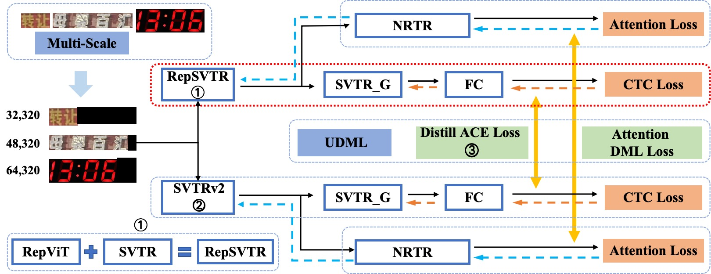
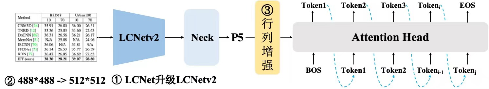
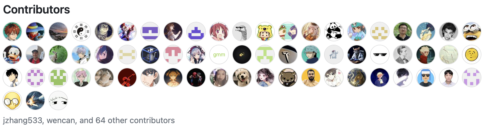
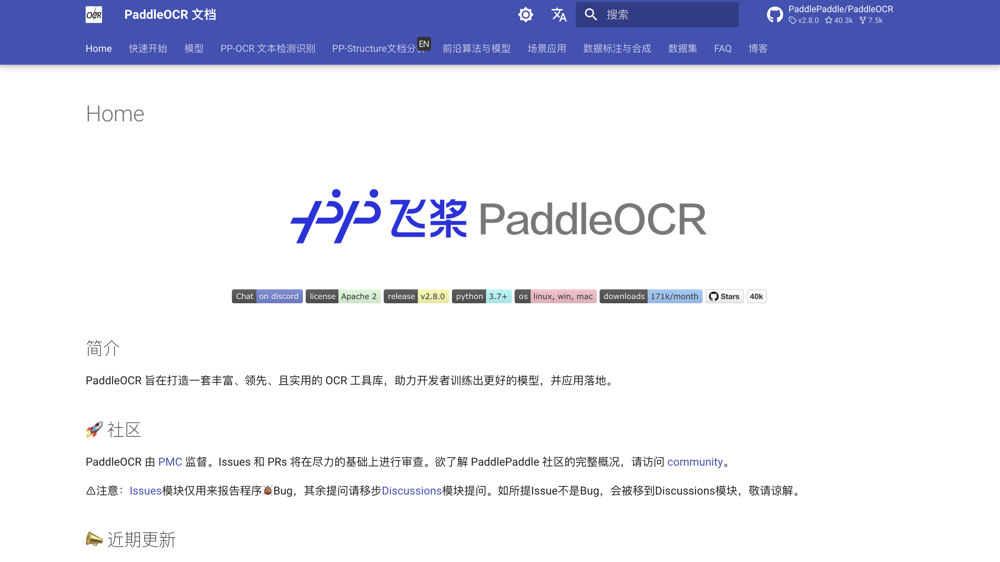

在开源社区的热烈期待与共同努力下，PaddleOCR 迎来了里程碑式的版本更新——v2.8.0！本次更新不仅**引入了前沿的 OCR 技术成果**，还**对项目结构进行了深度优化**，**解决了若干历史疑难问题**，旨在为广大开发者提供更加高效、便捷的 OCR 解决方案。让我们一同探索 PaddleOCR v2.8.0 带来的全新体验与无限可能！

<!-- more -->

## 顶尖模型引入，引领 OCR 技术潮流

PaddleOCR v2.8.0 版本隆重引入了**PaddleOCR 算法模型挑战赛的冠军方案**，为 OCR 领域树立了新的标杆。
其中，赛题一“[OCR 端到端识别任务](https://aistudio.baidu.com/competition/detail/1131/0/introduction)”的冠军方案——**场景文本识别算法 SVTRv2**，以其卓越的识别性能与泛化能力，为用户带来了前所未有的识别体验。

赛题二“[通用表格识别任务](https://aistudio.baidu.com/competition/detail/1138/0/introduction)”的冠军方案——**表格识别算法 SLANet-LCNetV2**，则以其精准高效的表格识别能力，为数据处理与分析提供了强有力的支持。

## 项目结构优化，聚焦 OCR 核心

为了进一步提升 PaddleOCR 项目的专业性与易用性，我们决定将非核心模块 PPOCRLabel 和 StyleText 迁移至新的仓库，使 PaddleOCR 项目更加**专注于 OCR 与版面识别**的核心技术。这一举措不仅简化了项目结构，也为开发者提供了更加清晰的项目导航与资源访问路径。

> 详见：[Notice of PPOCRLabel and StyleText Project Migration](https://github.com/PaddlePaddle/PaddleOCR/discussions/13020)

## 历史疑难问题解决，提升用户体验

半年多来，PaddleOCR 存在若干历史疑难问题，影响了开发者的使用体验。因此，在新版本中，我们重点解决了**更新 Backbone 后无法运行模型、numpy 版本依赖冲突、Mac 系统中运行卡顿**等一系列历史疑难问题。部分疑难问题还在解决过程中，欢迎广大开发者一起参与！

> 详见：【[疑难解决】解决 PaddleOCR 历史存在的疑难 Issue](https://github.com/PaddlePaddle/PaddleOCR/discussions/13057)

## 其它优化改进，持续精进

除了上述重大更新外，PaddleOCR v2.8.0 版本还包含了一系列细微但重要的优化改进。包括但不限于：

1. 解决版面分析中，OCR 结果偶尔丢失的问题
2. 添加 pyproject.toml，使 PaddleOCR 符合 PEP 518 规范
3. 对于大图推理，引入滑动窗口操作

这些改进旨在进一步提升软件的**稳定性、兼容性和性能表现**，确保 PaddleOCR 能够在更广泛的场景中得到应用。

## 开源共建，共创辉煌

需要特别强调的是，PaddleOCR v2.8.0 版本的每一个进步与成就都离不开开源社区的支持与贡献。在 **PMC（Project Management Committee）** 的统一管理下，众多社区开发者携手并进、共同努力，才使得 PaddleOCR 能够不断前行、日益完善。这里要特别感谢 PaddleOCR PMC 成员：[@GreatV](https://github.com/GreatV) (PMC Chair)、[@tink2123](https://github.com/tink2123) (PMC Chair)、[@Topdu](https://github.com/Topdu)、[@SWHL](https://github.com/SWHL)、[@Liyulingyue](https://github.com/Liyulingyue)、[@Sunting78](https://github.com/Sunting78)、[@jzhang533](https://github.com/jzhang533)，也感谢虽然暂未加入 PMC 但是作出了大量贡献的热心开发者。

> 新版本 contributors 列表，贡献者数量创历史新高！

这里预告一下，为了更好地服务广大开发者，**PaddleOCR 文档教程专属站点**正在由 PMC 展开建设。该站点将汇集仓库中原先散落在各处的文档资源，支持**关键词检索**功能，界面优雅舒适，相信大家一定会喜欢。

我们诚挚地邀请更多开发者和开源爱好者加入我们的行列，一起将 PaddleOCR 越做越好！

## 结语

PaddleOCR v2.8.0 版本的发布是我们迈向新征程的重要一步。我们坚信，在未来的日子里，在大家的共同努力下，PaddleOCR 将不断创新、持续进步，为 OCR 领域的发展贡献更多的智慧与力量！
