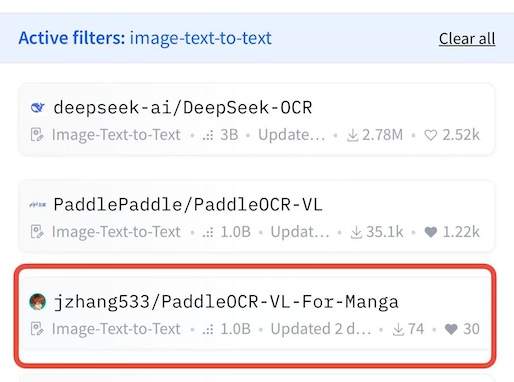
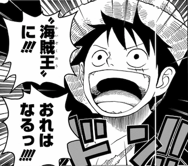

I'm excited to share my journey of fine-tuning PaddleOCR-VL specifically for manga OCR tasks! The resulting model, [PaddleOCR-VL-For-Manga](https://huggingface.co/jzhang533/PaddleOCR-VL-For-Manga), is ranked **#3 on HuggingFace's trending leaderboard in the Image-Text-to-Text category** — demonstrating the effectiveness of proper fine-tuning for language- and domain-specific tasks based on [PaddleOCR-VL](https://huggingface.co/PaddlePaddle/PaddleOCR-VL)! 🎉

<!-- more -->



In this blog post, I'll walk you through the entire process step by step, from data preparation to evaluation, explaining the key techniques that made this fine-tuning successful.

## Before & After: The Impact of Fine-Tuning

Let me show you the dramatic improvement fine-tuning brought to manga OCR performance:



### Before Fine-tuning

```text
海賊王
に
お
なるつは
```

### After Fine-tuning

```text
海賊王、
に！！！
おれは
なるっ！！！
```

**Improvements:**

- **Character Error Rate (CER)**: Reduced from ~89% to ~10%
- **Exact Match Accuracy**: Improved from ~27% to ~70%
- **Better context understanding** for manga-specific text styles
- **Robust vertical text recognition** common in Japanese manga

You can upload your favorite manga images and see the results here : [PaddleOCR-VL-For-Manga Demo](https://huggingface.co/spaces/jzhang533/paddleocr-vl-for-manga-demo), alternatively, you can also download [the model](https://huggingface.co/jzhang533/PaddleOCR-VL-For-Manga) and run the inference code yourself on your laptop.

## Project Overview

- **Model**: [PaddleOCR-VL-For-Manga](https://huggingface.co/jzhang533/PaddleOCR-VL-For-Manga)  
- **Base Model**: [PaddlePaddle/PaddleOCR-VL](https://huggingface.co/PaddlePaddle/PaddleOCR-VL)
- **Dataset Example in This Tutorial**: [manga-synthetic](https://huggingface.co/datasets/jzhang533/manga-synthetic) (58,196 training + 6,467 validation samples)  
- **Training Code**: [GitHub Repository](https://github.com/jzhang533/PaddleOCR-VL-For-Manga) (Open Source!)  
- **Task**: Fine-tune a vision-language model for accurate manga OCR  
- **Best Use Case**: **Manga text crops** (individual text bubbles/regions, not full pages)  
- **Key Achievement**: **#3 on HuggingFace's Trending Leaderboard** (Image-Text-to-Text category)

> **Note:** In this tutorial, I use the synthetic manga-synthetic dataset as an example for demonstration. For full training details and scripts, please refer to the [GitHub repository](https://github.com/jzhang533/PaddleOCR-VL-For-Manga).

## Technical Setup

### Prerequisites

```bash
# Core dependencies
pip install transformers datasets torch pillow evaluate jiwer sentencepiece

# Flash Attention 2 for 2-4x speedup (requires compatible GPU)
pip install flash-attn --no-build-isolation
```

### Hardware Requirements

- **Recommended**: NVIDIA A100 with Flash Attention 2 support
- **Minimum**: Any modern NVIDIA GPU with 16GB+ VRAM

---

## Understanding the Dataset

The [manga-synthetic dataset](https://huggingface.co/datasets/jzhang533/manga-synthetic) has a specific structure:

```python
{
    'images': [<PIL.Image>, ...],  # List of manga text crops (individual bubbles/regions)
    'prompt': [{'role': 'user', 'content': 'OCR:'}],  # User instruction
    'completion': [{'role': 'assistant', 'content': 'recognized text'}]  # Ground truth
}
```

> **💡 Pro Tip**: Spend a few minutes exploring the dataset viewer on HuggingFace to understand the image quality, text complexity, and typical OCR scenarios you'll be training on. This helps you write code to process the dataset, and set realistic expectations for model performance!

---

## Step 1: Data Format Conversion

The first crucial step is converting the dataset format to match the model's chat template requirements. Here's the conversion function:

```python
def convert_to_vlm_format(example):
    # Get images - dataset has a list of images
    images = example["images"]

    messages = []

    # Add user message with image(s) and text prompt
    user_content = []
    user_content.append({"type": "image", "image": images[0]})
    prompt_text = example["prompt"][0]["content"]
    user_content.append({"type": "text", "text": prompt_text})

    messages.append({"role": "user", "content": user_content})

    # Add assistant message with completion text
    completion_text = example["completion"][0]["content"]
    messages.append(
        {
            "role": "assistant",
            "content": [{"type": "text", "text": completion_text}],
        }
    )

    return {"images": images[0], "messages": messages}

```

**💡 Pro Tip**: This conversion happens **on-the-fly** in the collate function, alternatively you could convert this dataset upfront!

## Step 2: Completion-Only Training

One of the most important techniques for instruction-tuning is **completion-only training**. Let me explain why this matters:

### The Problem with Full-Sequence Training

If we train on the entire sequence (prompt + completion), the model might:

- ❌ Change how it understands the "OCR:" instruction (bad!)
- ❌ Dilute learning across both prompt and completion
- ❌ Potentially "forget" how to follow instructions

### The Solution: Mask the Prompt

By setting prompt tokens to `-100`, we ensure:

- ✅ Model only learns from the assistant's response
- ✅ Preserves instruction understanding
- ✅ Focuses 100% of learning on generating correct OCR text

Here's the implementation:

```python
def collate_fn(examples, processor, pad_to_multiple_of=8):
    all_images = []
    all_messages = []

    for ex in examples:
        # Process this example using convert_to_vlm_format
        converted = convert_to_vlm_format(ex)
        all_images.append(converted["images"])
        all_messages.append(converted["messages"])

    images = all_images
    messages = all_messages

    # Apply chat template to convert messages to text format expected by model
    texts = processor.apply_chat_template(messages, tokenize=False)

    batch = processor(
        text=texts,
        images=images,
        padding=True,
        pad_to_multiple_of=pad_to_multiple_of,
        return_tensors="pt",
        add_special_tokens=False,
    )

    # Create labels (copy of input_ids)
    # Labels are what the model should predict - initially same as input
    labels = batch["input_ids"].clone()

    # Mask padding tokens with -100 (ignored in loss computation)
    # We don't want the model to learn from padding tokens
    labels[batch["attention_mask"] == 0] = -100
    
    # Find where "Assistant: " starts in the tokenized sequence
    response_template = "Assistant: "
    response_ids = processor.tokenizer.encode(
        response_template, add_special_tokens=False
    )

    for i in range(len(labels)):
        # Find where "Assistant: " starts
        for j in range(len(batch["input_ids"][i]) - len(response_ids) + 1):
            if all(
                batch["input_ids"][i][j + k] == response_ids[k]
                for k in range(len(response_ids))
            ):
                # Mask everything before and including "Assistant: " with -100
                labels[i, : j + len(response_ids)] = -100
                break
        else:
            # If "Assistant: " not found, mask everything (safety fallback)
            labels[i, :] = -100

    batch["labels"] = labels
    return batch
```

## Step 3: Performance Optimizations

I applied several optimizations to speed up training:

### 1. Flash Attention 2 (2-4x Speedup)

```python
model = AutoModelForCausalLM.from_pretrained(
    "PaddlePaddle/PaddleOCR-VL",
    trust_remote_code=True,
    torch_dtype=torch.bfloat16,
    device_map="cuda",
    attn_implementation="flash_attention_2",  # 🚀 Key optimization!
)
```

### 2. Tensor Core Optimization (10-30% Speedup)

```python
# pad_to_multiple_of=8 aligns tensors for optimal GPU processing
batch = processor(
    text=texts,
    images=images,
    padding=True,
    pad_to_multiple_of=8,  # 🚀 GPU-friendly padding
    return_tensors="pt",
)
```

### 3. Mixed Precision Training

```python
training_args = TrainingArguments(
    bf16=True,  # 🚀 BFloat16 mixed precision
    # ... other args
)
```

## Step 4: Training Configuration

Here's the complete training setup:

```python
from transformers import Trainer, TrainingArguments
from functools import partial

# Load processor and model
processor = AutoProcessor.from_pretrained(
    "PaddlePaddle/PaddleOCR-VL",
    trust_remote_code=True,
)

model = AutoModelForCausalLM.from_pretrained(
    "PaddlePaddle/PaddleOCR-VL",
    trust_remote_code=True,
    torch_dtype=torch.bfloat16,
    device_map="cuda",
    attn_implementation="flash_attention_2",
)

# Load dataset
dataset = load_dataset("jzhang533/manga-synthetic")
train_dataset = dataset["train"]

# Configure training
training_args = TrainingArguments(
    output_dir="./paddleocr-vl-finetuned",
    num_train_epochs=3,
    per_device_train_batch_size=4,
    per_device_eval_batch_size=4,
    gradient_accumulation_steps=4,  # Effective batch size = 16
    learning_rate=2e-5,
    warmup_ratio=0.1,
    bf16=True,
    save_strategy="steps",
    save_steps=500,
    save_total_limit=2,
    logging_steps=10,
    report_to="none",
    remove_unused_columns=False,
    dataloader_num_workers=4,
)

# Initialize trainer
trainer = Trainer(
    model=model,
    args=training_args,
    train_dataset=train_dataset,
    data_collator=partial(collate_fn, processor=processor),
)

# Train!
trainer.train()

# Save model
trainer.save_model(training_args.output_dir)
processor.save_pretrained(training_args.output_dir)
```

## Step 5: Inference

Pick some of your favorite manga images, let's use the finetuned model to perform OCR!

```python
from pathlib import Path
import torch
from PIL import Image
from tqdm import tqdm
from transformers import AutoModelForCausalLM, AutoProcessor

DEVICE = "cuda" if torch.cuda.is_available() else "cpu"

CHOSEN_TASK = "ocr"  # Options: 'ocr' | 'table' | 'chart' | 'formula'
PROMPTS = {
    "ocr": "OCR:",
    "table": "Table Recognition:",
    "chart": "Chart Recognition:",
    "formula": "Formula Recognition:",
}

# model_path = "/home/PaddleOCR-VL"
model_path = "./paddleocr-vl-finetuned"

model = (
    AutoModelForCausalLM.from_pretrained(
        model_path,
        trust_remote_code=True,
        dtype=torch.bfloat16,
        attn_implementation="flash_attention_2",
    )
    .to(DEVICE)
    .eval()
)

processor_path = "./paddleocr-vl-finetuned"
processor = AutoProcessor.from_pretrained(
    processor_path, trust_remote_code=True, use_fast=True
)

folder_path = Path("./data/images")

for item_path in tqdm(sorted(folder_path.iterdir()), desc="Processing images"):
    image = Image.open(item_path).convert("RGB")

    messages = [
        {
            "role": "user",
            "content": [
                {"type": "image", "image": image},
                {"type": "text", "text": PROMPTS[CHOSEN_TASK]},
            ],
        }
    ]

    text = processor.apply_chat_template(
        messages, tokenize=False, add_generation_prompt=True
    )

    inputs = processor(text=[text], images=[image], return_tensors="pt")
    inputs = {
        k: (v.to(DEVICE) if isinstance(v, torch.Tensor) else v)
        for k, v in inputs.items()
    }

    with torch.inference_mode():
        generated = model.generate(
            **inputs,
            max_new_tokens=256,
            do_sample=False,
            use_cache=True,
        )

    input_length = inputs["input_ids"].shape[1]
    generated_tokens = generated[:, input_length:]  # Slice only new tokens
    answer = processor.batch_decode(generated_tokens, skip_special_tokens=True)[0]

    print(item_path)
    print(answer)
```

**Note**: Make sure to create a `./data/images` folder and place your manga text crop images there, or modify the `folder_path` to point to your image directory.

You may have noticed that the inference code using the transformers library is identical to the one used to inference the PaddleOCR-VL model, since they have identical architecture and weights layout.

## Step 6: Evaluation

### Actual Generation

To properly evaluate the model, we need to perform inference on the validation set and collect predictions. Here's the function that loads the validation split and generates predictions:

```python
import numpy as np
from datasets import load_dataset
from tqdm import tqdm

def evaluate_on_validation_split(model_path, dataset_name="jzhang533/manga-synthetic", max_samples=None):    
    DEVICE = "cuda" if torch.cuda.is_available() else "cpu"
    
    # Load model and processor
    print(f"Loading model from {model_path}...")
    model = (
        AutoModelForCausalLM.from_pretrained(
            model_path,
            trust_remote_code=True,
            torch_dtype=torch.bfloat16,
            attn_implementation="flash_attention_2",
        )
        .to(DEVICE)
        .eval()
    )
    
    processor = AutoProcessor.from_pretrained(
        model_path, 
        trust_remote_code=True, 
        use_fast=True
    )
    
    # Load validation dataset
    print(f"Loading dataset {dataset_name}...")
    dataset = load_dataset(dataset_name)
    val_dataset = dataset["validation"]
    
    # Limit samples if specified
    if max_samples:
        val_dataset = val_dataset.select(range(min(max_samples, len(val_dataset))))
    
    print(f"Evaluating on {len(val_dataset)} validation samples...")
    
    predictions = []
    references = []
    
    # Process each sample
    for idx in tqdm(range(len(val_dataset)), desc="Running inference"):
        sample = val_dataset[idx]
        
        # Extract image and ground truth
        image = sample["images"][0]  # Get first image from list
        reference_text = sample["completion"][0]["content"]  # Ground truth
        prompt_text = sample["prompt"][0]["content"]  # Should be "OCR:"
        
        # Prepare messages for inference
        messages = [
            {
                "role": "user",
                "content": [
                    {"type": "image", "image": image},
                    {"type": "text", "text": prompt_text},
                ],
            }
        ]
        
        # Apply chat template
        text = processor.apply_chat_template(
            messages, tokenize=False, add_generation_prompt=True
        )
        
        # Prepare inputs
        inputs = processor(text=[text], images=[image], return_tensors="pt")
        inputs = {
            k: (v.to(DEVICE) if isinstance(v, torch.Tensor) else v)
            for k, v in inputs.items()
        }
        
        # Generate prediction
        with torch.inference_mode():
            generated = model.generate(
                **inputs,
                max_new_tokens=256,
                do_sample=False,
                use_cache=True,
            )
        
        # Decode only the generated tokens (exclude input prompt)
        input_length = inputs["input_ids"].shape[1]
        generated_tokens = generated[:, input_length:]
        prediction = processor.batch_decode(generated_tokens, skip_special_tokens=True)[0]
        
        # Collect results
        predictions.append(prediction)
        references.append(reference_text)
    
    print(f"\nCollected {len(predictions)} predictions and {len(references)} references")
    return predictions, references
```

### Evaluation Metrics

We will use Character Error Rate (CER) and Exact Match Accuracy as our evaluation metrics. Here's the function to compute these metrics:

```python
def compute_metrics(predictions, references):
    """Compute CER and accuracy from generated predictions."""
    import evaluate
    import numpy as np
    
    cer_metric = evaluate.load("cer")

    # Remove whitespace for fair comparison
    predictions_clean = ["".join(text.split()) for text in predictions]
    references_clean = ["".join(text.split()) for text in references]

    # Compute CER
    cer = cer_metric.compute(
        predictions=predictions_clean, 
        references=references_clean
    )

    # Compute exact match accuracy
    predictions_array = np.array(predictions_clean)
    references_array = np.array(references_clean)
    accuracy = (predictions_array == references_array).mean()

    return {
        "cer": cer, 
        "accuracy": accuracy, 
        "num_samples": len(predictions)
    }
```

### Usage Example

```python

predictions, references = evaluate_on_validation_split("./paddleocr-vl-finetuned")
metrics = compute_metrics(predictions, references)
print(metrics)
```

## Results

After 3 epochs of training on the manga-synthetic dataset, you could get a pretty high accuracy, since this is a synthetic dataset. In my run, I could get an exact match accuracy of around 90%. But if you are using real data, like manga109-s, the performance may vary.

### Sample Predictions

```text
Sample 1:
    "reference": "兄弟が癒される\nとき、あなたは\n罪悪感から",
    "prediction": "兄弟が癒される\nとき、あなたは\n罪悪感から",
    "match": true

Sample 2:
    "reference": "呪われた\n峠と言わ\nれるそこは、",
    "prediction": "呪われた\n峙と言わ\nれるそこは、",
    "match": false

Sample 3:
    "reference": "僕たちの学校のトイレには\n鏡がありません、",
    "prediction": "僕たちの学校のトイレには\n鏡がありません、",
    "match": true
```

## 🎯 Key Takeaways

1. **Know your data**: Get familiar with your dataset and convert it to the model's expected format.
2. **Completion-only training** is crucial for instruction-tuning
3. **Flash Attention 2** + **tensor core optimization** = 2-4x speedup
4. **Evaluation** helps understand the performance of the fine-tuning process and guides improvements.
5. **Domain-specific fine-tuning** dramatically improves performance

## 🔗 Resources

- **Model**: [jzhang533/PaddleOCR-VL-For-Manga](https://huggingface.co/jzhang533/PaddleOCR-VL-For-Manga)
- **Training Code**: [GitHub Repository](https://github.com/jzhang533/PaddleOCR-VL-For-Manga) - Full training scripts and evaluation code
- **Dataset**: [jzhang533/manga-synthetic](https://huggingface.co/datasets/jzhang533/manga-synthetic)
- **Base Model**: [PaddlePaddle/PaddleOCR-VL](https://huggingface.co/PaddlePaddle/PaddleOCR-VL)

## 📝 Conclusion

Fine-tuning PaddleOCR-VL for manga OCR was an incredible learning experience. By applying best practices like completion-only training, proper evaluation methods, and performance optimizations, we achieved a model that ranks **#3 on HuggingFace's Trending Leaderboard in the Image-Text-to-Text category** and delivers impressive real-world results.

In this tutorial, I used the synthetic manga-synthetic dataset as an example. For full training and advanced usage, please refer to the [GitHub repository](https://github.com/jzhang533/PaddleOCR-VL-For-Manga).

The key is understanding **why** each technique matters, not just copy-pasting code. I hope this detailed walkthrough helps you on your own fine-tuning journey!

Feel free to try [PaddleOCR-VL-For-Manga](https://huggingface.co/jzhang533/PaddleOCR-VL-For-Manga) and let me know your results! 🚀

---

*Have questions or suggestions? Open an issue on the model repository or reach out on HuggingFace!*
