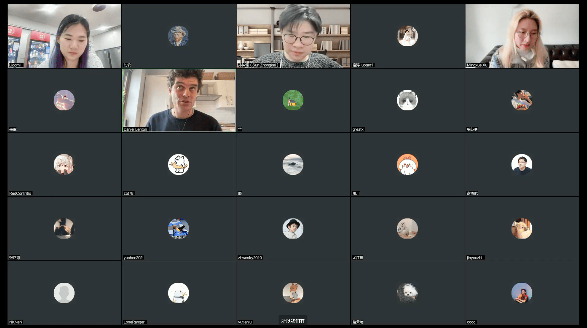

在第 36 次 PFCC 会议上，我们有幸邀请了 Ivy 社区的英国小哥 Daniel（[@djl11](https://github.com/djl11)）和 Paddle 社区开发者莱师傅（[@RedContritio](https://github.com/tink2123)）分别分享了代码转换工具 Ivy、PaConvert。

<!-- more -->

<!-- 导入聊天框功能 -->

<!-- 导入聊天框功能 -->

## 会议议程

1. 如何通过 [Ivy](https://github.com/unifyai/ivy) 将 PyTorch 和 TensorFlow 模型进行转换，并直接在 Paddle 项目中使用。（35 min） [@djl11](https://github.com/djl11)

   - demo：[How To Convert Models from PyTorch to PaddlePaddle](https://unify.ai/docs/ivy/demos/examples_and_demos/dinov2_to_paddle.html)
   - QA 环节

   <!-- Ivy -->
   

       <figure style="width: 100%;">
         
         <figcaption>Ivy 模型转换 demo 讲解（截图）</figcaption>
       </figure>
   

2. [@RedContritio](https://github.com/tink2123) [PaConvert](https://github.com/PaddlePaddle/PaConvert) 代码转换工具介绍 （10 ～ 20min）

   - PaConvert 介绍
   - QA 环节

   <!-- PaConvert -->
   

       <figure style="width: 100%;">
         
         <figcaption>PaConvert 介绍（截图）</figcaption>
       </figure>
   

> 会议材料及回放见百度网盘链接: https://pan.baidu.com/s/16vAVoXpCgdrrRK5e_-w7Ig ，提取码见 PFCC 微信群公告。

## QA 环节

所有 QA 内容均已记录在[「第三十六次 PFCC 会议纪要」](https://github.com/PaddlePaddle/community/blob/master/pfcc/meetings/2024/2024-03-13-meeting-minutes.md)中。

### Part-1： Ivy （部分）

- **问题 1：** 你有测试过多少模型能够转换成功？

    <MessageBox>
    <Message name="Daniel" github="djl11">
    目前测试了 30 个主流模型，均能转换成功。目前我们正在测试更多 hugging face 上的模型，大概 70 ～ 75% 能够转换成功。我们也欢迎和鼓励社区告诉我们哪些模型无法有效转换，我们有信心能够解决这些问题。
    </Message>
    </MessageBox>

- **问题 2：** 对于成功转换的模型，它会影响性能吗？或者可能需要更多的时间来训练嘛？

    <MessageBox>
    <Message name="Daniel" github="djl11">
    这是一个好问题，也是我们目前正在测试的东西。我们现在看到在 Paddle 上会有 30% 到 40% 的性能损失， 这是因为在我们的 Paddle 后端上有一些低效，我们目前正在努力解决这个问题。
     
    性能问题取决于模型，但通常来讲并不会影响训练性能。当我们从 Pytorch 转换到 Tensorflow 时，经常看到训练速度的提高。特别是当我们从一个框架转化到 Jax，经常看到一个大幅度的提升，尤其是在 TPU 上。
     
    所以可能有一些开销，但总的来讲不会有特别大幅度的降低。即使存在个别问题，我们也会很快修复他们。话说回来，这也是一个长期的过程，因为我们正在开发许多不同的框架，并与许多不同的生态伙伴合作。我们把精力集中在用户反馈的真实用例上，而不是试图修复所有东西。所以当你使用过程中确实出问题了，请在 discord 上联系我们，我们会把它添加到高优先级的列表中，并尽快解决。
    </Message>
    </MessageBox>

- **问题 3：** 请问是否有覆盖率相关的工作，类似 PyTorch 那样对后端支持覆盖率有表单或者对应的 CI 流水线

   <MessageBox>
   <Message name="Daniel" github="djl11">
   我们做覆盖的方式是详尽的单元测试，所以答案是有。我们在 Github 上 的 CI 已经达到了最大值，我们一直在运行单元测试，在 CPU 和 GPU 上测试每个框架、每个函数，所以我们确实有扩展函数覆盖范围。
    
   但在每个设备上，支持每个框架、每个版本的每个功能，是一个非常大的、指数爆炸级的工作。基本上有数百万个这样的测试。所以我们真正关注的是什么？这是一个很长的答案，但就像生活中的许多事情一样，我们需要关注重要的事情。我们把更多的注意力放在真正常见的函数上（relu、add、matmul 等）那些真正不常见的、较少使用的函数，我们关注的比较少。在我们看来，我们可能永远不会达到完全覆盖，但只要覆盖到 99% 的模型就是 OK 的，这比支持每个版本每个函数更重要。
   </Message>
   </MessageBox>

- **问题 4：** PyTorch 大概有两千多个 API，包括很多废弃的、不常见的 API，有多少可以通过 Ivy 转换？

   <MessageBox>
   <Message name="Daniel" github="djl11">
   我们只关注当前最新版本的 pytorch，以及其 functional API。 在 ivy/functional/frontends 你可以看到所有这些细节，包括我们在每个框架中都支持什么。
    
   主要的一点是我们支持 functional API，但我们不支持 ATen。我们并不把转换限制在 ATen 或很小的范围内（比如组成所有函数的函数子集），我们可以这么做，但不这样做的原因是我们想更高级别的代码转换。某种程度上，函数的越高层越好，因为当我们从高层 PyTorch 函数转换到高层 ivy 函数、高层 Tensorflow 函数时，把函数拆分成更小单位仍然是有可能的。但如果将底层 OP 重新创建为目标框架中能被优化的高级函数，要困难得多。这就是为什么我们专注于 functional API 和高级函数更重要（但我们也不重新实现的 class）。
    
   这是一个很长的回答，但这是有意义的。不过我们看到了良好的覆盖率，看到绝大多数模型都能正确转换。我们鼓励人们尝试它，如果它不起作用，让我们知道，我们会让它起作用。
   </Message>
   </MessageBox>

   > 编者注：细节戳 ➡️ [ivy/functional/frontends](https://github.com/unifyai/ivy/tree/main/ivy/functional/frontends)

- **问题 5：** 我们刚看到的前端，目前支持了很多。但现在还有很多 API 不能转换，那我该怎么做？怎么处理它们？

   <MessageBox>
   <Message name="Daniel" github="djl11">
   基本上，如果我们看到开发者对某 API 有足够的兴趣，届时我们会支持。对于不那么常见的 API，Ivy 也是可以支持这些的。如果有一个模型不能转换成功，而我们有信心能让他转换成功，那么我们可以添加对那些 API 的支持。
    
   如果用户有自定义的 C++ 代码，那么默认情况下不能转换，但我们提供一个接口，你可以在其中指定 C++ 的 torch 实现，这样就可以转换了。
   </Message>
   </MessageBox>

- **问题 6：** PyTorch API 有很多参数，不同参数可以组成各种组合，如果某些参数不支持，则如何处理？

   <MessageBox>
   <Message name="Daniel" github="djl11">
   基本上我们支持 PyTorch 的所有行为，包括所有额外的参数等。我们通过构建基于 Ivy 的统一的 functional API（如 ivy.matmul、ivy.add、ivy.reshape 等），重新创建 PyTorch 函数，以完美模仿 PyTorch 的任何可能行为。这可能需要一个 Ivy 函数来重新创建，但如果是一个具有多种不同模式的复杂 Python 函数，可能就需要十个。然后，使用 Ivy 重新创建所有这些行为，每个 Ivy 函数都有特定的 Paddle 后端。因此，一个 PyTorch 函数可能需要多个 Ivy 函数，而这些 Ivy 函数又可能需要多个 Paddle 函数来完全重新创建该行为。所有变体、额外的参数和边缘情况都可以通过中间表示和 API 得到支持。在这些情况下，需要将其作为 Paddle 函数的组合重新创建，尽管这可能以运行时间速度为代价，但通常不会看到大的损失。
   </Message>
   </MessageBox>

- **问题 7：** 目前大模型很流行。对于预训练的大模型，有大量的预训练权重，是否有更快的方式进行转换。

   <MessageBox>
   <Message name="Daniel" github="djl11">
   在从 PyTorch 转换模型到 Paddle 后，因为现在 Paddle 模型就是一个加强版的 PyTorch 模型，转换权重可以相对简单，比如将它们转换为 Numpy 数组，然后加载到 Paddle 中。实际上，Ivy 在模型转换过程中，会自动把所有的 PyTorch 权重转换为 Paddle 权重。
    
   目前没有更快的转换方式，通常使用 DLPack（张量数据结构的中间表示标准）作为中间件，但由于不同框架对 DLPack 的支持不一致，最终选择使用 Numpy 作为中介。我们把将权重转移到 CPU，以高精度格式存储并转换为 Numpy 数组，然后转移到新框架中，这种方法在 demo 演示中以及对于大型模型都能很好地工作。
    
   实际上目前的转换是基于 function tracing，如果大型语言模型需要多个 GPU 运行，这可能会有些复杂。不过，我们将很快转向使用纯 symbolic tracing 方法，届时就不需要存储所有权重和中间数组，而是基于符号追踪的代理数组，这将意味着不需要启动大量 GPU 来完成函数追踪。
   </Message>
   </MessageBox>

- **问题 8：** 当引入一个新 API 时，支持新 API 的成本有多大？

   <MessageBox>
   <Message name="Daniel" github="djl11">
   从工程成本的角度来看，支持一个新 API 并不困难，也不是我们特别关注的问题。我们大部分时间都花在了 function tracing 的逻辑、抽象语法树（AST）逻辑以及编译器和追踪器上。
    
   添加一个新的前端功能并不难，做起来相当快速和容易。事实上，所有前端 API 和后端 API 都是完全开源的（Apache 2 许可），任何人都可以为其贡献代码。如果在转换模型时失败，并且报错消息指出模型转换失败是因为缺少来自 Ivy/PyTorch 前端的某个函数，我们还提供了如何提交拉取请求以及如何自行添加该功能的链接。真正困难的部分是处理动态控制流、以可扩展的方式进行函数追踪、获取正确的抽象语法树表示，这些都是与框架无关的工作，我们以一种不特定于任何框架的方式进行这些工作。因此，简短的回答是添加新 API 相对容易，真正困难的是其他部分。
   </Message>
   </MessageBox>

- **问题 9：** Ivy 是有特定的前端 API，还是只转译其他框架？

   <MessageBox>
   <Message name="Daniel" github="djl11">
   Ivy 本身也是一个框架，拥有自己的前端 API（如 TensorFlow、PyTorch、JAX 等）以及自己的一套函数。Ivy 的 function API 有两个用途：第一个用途是作为一个中间表示，用于从一个框架转换到另一个框架，即 Ivy 的 API 充当中间表示；第二个用途是作为其自身的框架，允许直接在 Ivy 中编写新代码，可以在 Ivy 中编写整个模型，并使用 Ivy 类和 Ivy 函数，然后可以切换后端，使用 Paddle、TensorFlow、PyTorch 或 JAX 等。因此，Ivy 既能自身作为框架，也能转译其他框架。但我们认为最有价值并且最直接的是转译器功能，因为这样已有的所有代码都可以直接使用，而无需任何人编写新的 Ivy 代码。
   </Message>
   </MessageBox>

- **问题 10：** 听起来和 keras 很相似？

   <MessageBox>
   <Message name="Daniel" github="djl11">
   是的！如果忽略前端，Ivy 和 Keras 非常相似。
   </Message>
   </MessageBox>

- **问题 11：** 我们是否需要使用更高的内存来转换模型？因为也许转换模型过程中需要保存中间信息，所以可能会占用一些内存。所以我想问问，像转换 llama 这样的大模型是否 ok？

   <MessageBox>
   <Message name="Daniel" github="djl11">
   这是一个很好的问题。目前，鉴于转译器是基于函数追踪（function tracing）的，确实需要调用模型以追踪图（graph），这意味着在转换时需要能够对模型进行推理。现在，转换本身不需要在目标设备上进行，只要你有一台内存足够的机器，就可以在 CPU 上完成转换，并且默认情况下转换是在 CPU 上进行的，因为通常 CPU 有的 RAM 比 GPU 多。
    
   在转译器的一个很旧的版本中，我们曾同时获取所有 PyTorch 权重和所有 Paddle 权重，并让它们同时存在于内存中，这是非常糟糕的做法。现在，权重从 A 转换到 B 是逐步进行的，我们先取第一个权重，将其转换为 Numpy，然后转换为 Paddle，接着转换第二个权重，这样我们就不会重复获取权重。但是，我们避免尽可能多的函数追踪（function tracing），我们现在有自己的 AST（抽象语法树）方法，这个方法工作得很好、非常稳定，我们正在与几家公司合作开发这一点。
    
   最终设计基于 AST，基于符号追踪，我们将实际的函数追踪作为最后的手段，因此内存使用将会非常低。但是，正如你所说，现在确实需要一些 RAM 来转换一个非常大的模型，但希望在几个月内，这将不再是问题。
   </Message>
   </MessageBox>

- **问题 12：** 你如何平衡你的生活和工作，以及保持你对开源的热情呢？

   <MessageBox>
   <Message name="Daniel" github="djl11">
   平衡生活和工作非常困难，但幸运的是，我真的很热爱我正在做的事情，这是保持我动力的原因。我们不仅仅是在做一个开源项目，还在建立一家公司，需要与客户进行沟通。虽然我是唯一的创始人（并非是原本的设计），而且这确实需要付出大量的工作，但我对统一人工智能领域的景象充满热情，总是对看到的碎片化情况感到沮丧，无论是在 AI 框架还是在大型语言模型（LMM）的领域。目前我们正在努力统一这些领域，保持激情和兴奋是我继续前进的动力，如果我不再感到兴奋，可能就不会那么有趣了。幸好，我始终保持着兴奋感，所以工作并不感觉艰难。确实，因为这些并不感觉像是工作，所以更容易保持。
    
   此外，帝国理工学院的学习经历非常紧张，这让我掌握了之前缺少的知识教育和时间管理经验。
    
   但我也要说，我会把周日作为休息日，我认为你也需要休息，否则很快就会感到疲惫不堪。
   </Message>
   </MessageBox>

- **问题 13：** 英国的人工智能环境怎么样？是否会有官方活动之类的？

   <MessageBox>
   <Message name="Daniel" github="djl11">
   英国的人工智能环境还是不错的。虽然我经常到处旅行，在欧洲和美国都呆过相当长的时间，所以并不算是英国本地人，但英国的 AI 环境绝对是值得关注的。比如，DeepMind 就设在英国，谷歌的主要 AI 分支也在伦敦。显然，Meta、亚马逊以及其他几家公司也在伦敦设有 AI 办公室。伦敦还有很多有趣的初创公司，所以我觉得很幸运能住在伦敦，特别是在靠近国王十字的伊斯灵顿区，那里可以说是整个科技圈的中心。我遇到的很多很酷的初创公司以及举办的活动数目都令人惊叹，所以我认为这里的环境非常好。我很高兴能在伦敦，与这么多创造酷炫事物的人在一起。
    
   我认为最大的 AI 人才集中地是旧金山，那里又是另一个水平，但我仍感觉英国很棒，伦敦也很棒，虽然它还没有达到旧金山的水平，但也许将来会有所改变。
   </Message>
   </MessageBox>

### Part-2： PaConvert （部分）

- **问题 1 ：** PaConvert 是否是根据 AST 转换模型的？

   <MessageBox>
   <Message name="RedContritio" github="RedContritio">
   是的，基于解析 python 源码，然后根据 AST 生成 Paddle 模型。
   </Message>
   </MessageBox>

- **问题 2 ：** 是否有中间表示？还是直接将 PyTorch 代码转换成 Paddle ？

   <MessageBox>
   <Message name="RedContritio" github="RedContritio">
   直接转换，没有中间表示。
   </Message>
   </MessageBox>

> 编者注 ✍️：主要是英国小哥在问莱师傅 :P

## 会议剪影

