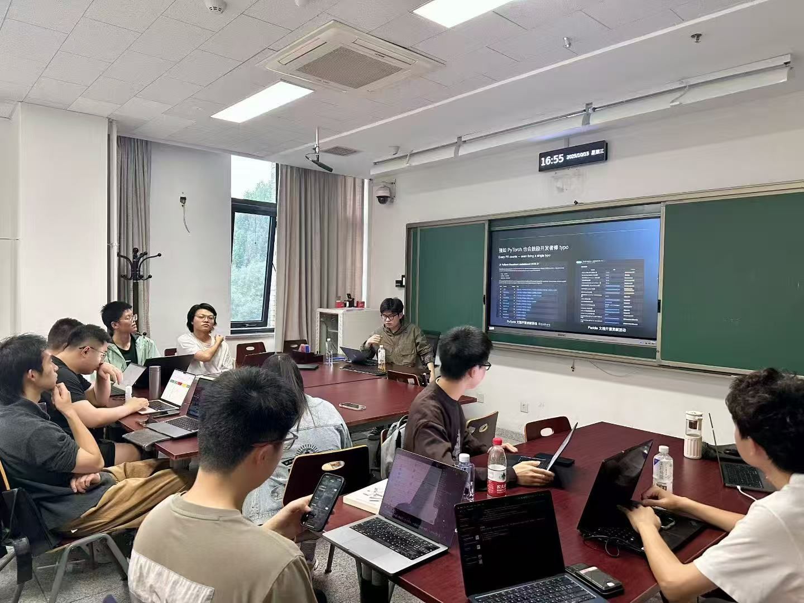

## 飞桨&文心开源社区走进北京大学课堂

10 月 15 日，飞桨开源社区受北京大学计算机学院周明辉副院长邀请，走进周老师的《[开源软件开发](https://github.com/osslab-pku/OSSDevelopment/)》课程，在[第四次课堂](https://github.com/osslab-pku/OSSDevelopment/blob/main/Syllabus.md#第4次课开源项目maintainer分享其维护开发的经验多个项目开拓视野为开源任务选择做准备--1015)上，孙师傅为北大的同学们带来了一场主题分享，介绍了飞桨与文心开源社区的整体生态现状，并讲解了如何快速参与并玩转开源社区。

在讲座中，孙师傅结合实际案例，介绍了飞桨与文心开源社区的发展历程、主要项目及贡献者体系，帮助同学们更直观地了解开源社区的运作方式与参与路径。

## 课程材料在线观看

这次课程分享的 Slides，可以在这里浏览：[飞桨 & 文心开源高校行之北大](https://github.com/PFCCLab/blog/blob/main/src/images/pku-course-2025/飞桨%26文心开源走进北大.pdf)
