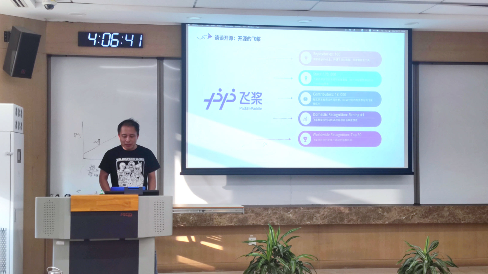
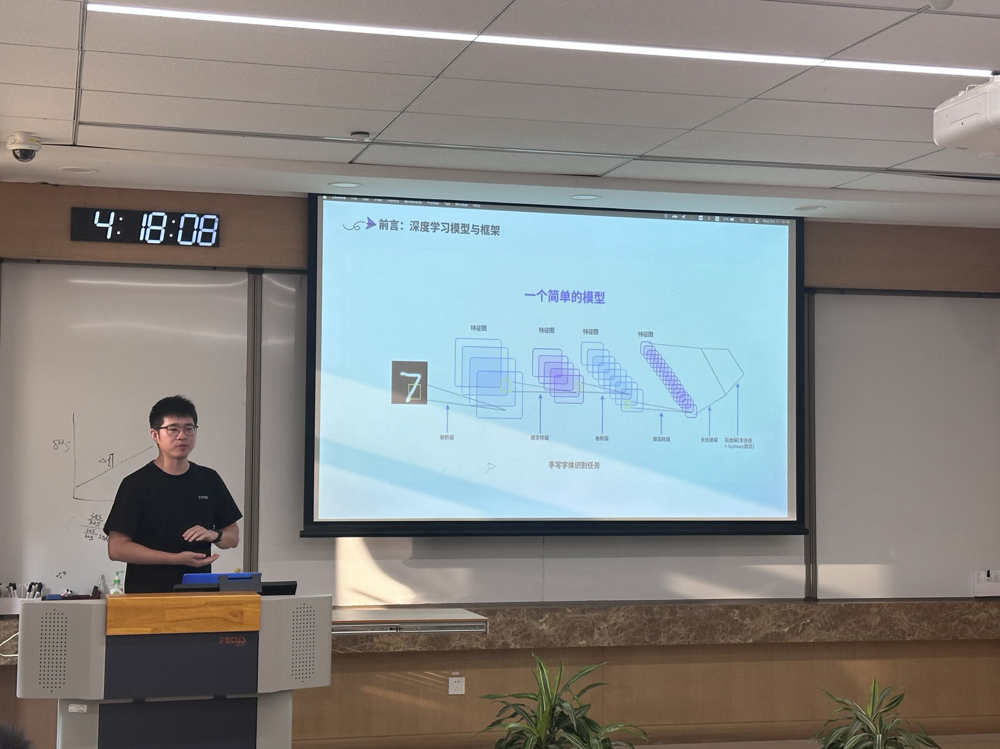
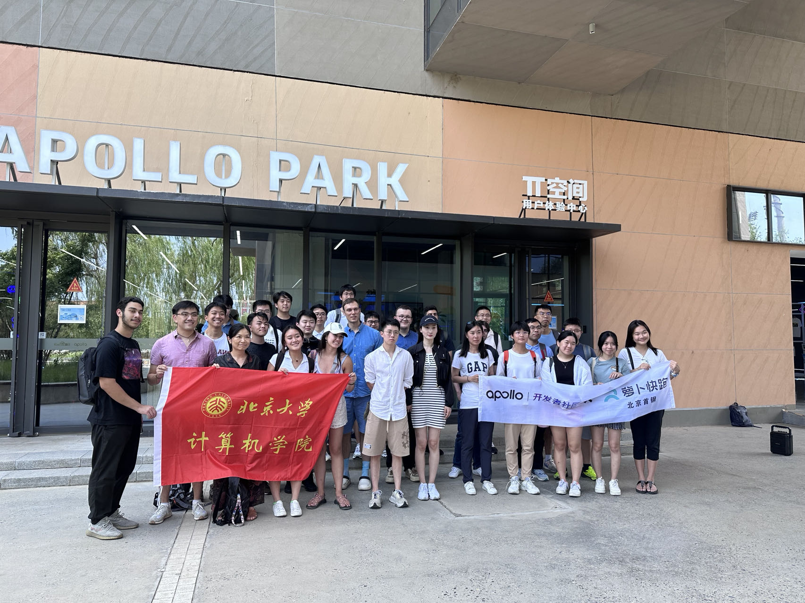
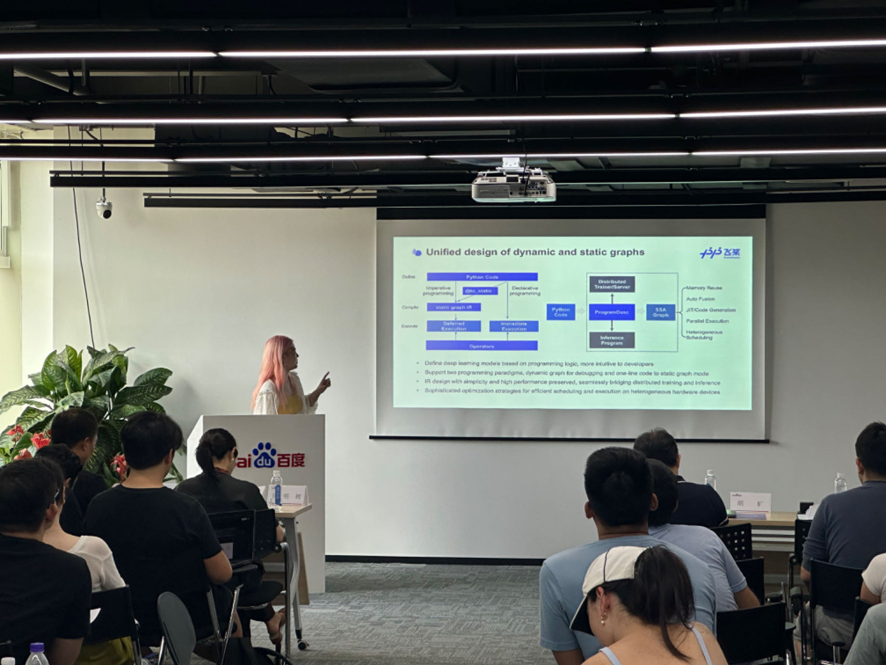

## 飞桨开源社区走进北京大学课堂

10月11日，飞桨开源社区应北京大学计算机学院周明辉副院长邀请，在周老师的[开源软件开发](https://github.com/osslab-pku/OSSDevelopment/)课程的[第四次课](https://github.com/osslab-pku/OSSDevelopment/blob/main/Syllabus.md#%E7%AC%AC4%E6%AC%A1%E8%AF%BE%E5%BC%80%E6%BA%90%E9%A1%B9%E7%9B%AEmaintainer%E5%88%86%E4%BA%AB%E5%85%B6%E7%BB%B4%E6%8A%A4%E5%BC%80%E5%8F%91%E7%9A%84%E7%BB%8F%E9%AA%8C%E5%A4%9A%E4%B8%AA%E9%A1%B9%E7%9B%AE%E5%BC%80%E6%8B%93%E8%A7%86%E9%87%8E%E4%B8%BA%E5%BC%80%E6%BA%90%E4%BB%BB%E5%8A%A1%E9%80%89%E6%8B%A9%E5%81%9A%E5%87%86%E5%A4%87--1011)上，为北大的同学们介绍了飞桨开源社区和飞桨新一代IR设计。

Jun 给同学们介绍了飞桨开源社区的基本情况

杰师傅给同学们深入浅出的介绍了飞桨新一代IR设计。

## 课程材料在线观看

这次课程的Slides，可以在这里在线浏览：[飞桨-北大讲课-2023-10-11](https://www.canva.cn/design/DAFw1Af4GTA/ZA14Jubd__TNFeigpmacEg/view?utm_content=DAFw1Af4GTA&utm_campaign=designshare&utm_medium=link&utm_source=publishsharelink)

## 彩蛋 🎊

飞将社区曾经在Apollo Park接待过北大的国际留学生，梦师傅曾经全英文给参加北京大学夏季夏令营的牛校的神兽们讲解过飞桨。

