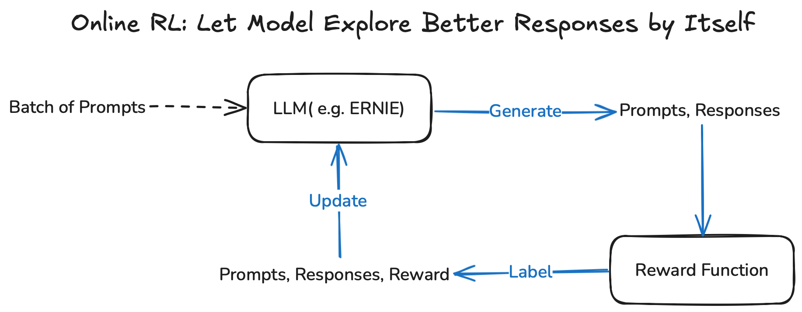

本文概述了大型语言模型（LLM）的后训练（post-training）方法，主要包括监督微调（Supervised Fine-tuning, SFT）、直接偏好优化（Direct Preference Optimization, DPO）和在线强化学习（Online Reinforcement Learning, Online RL）。尽量通过通俗易懂的方式介绍这些技术细节，适合对 LLM 有兴趣但非专业的读者。

<!-- more -->

<!-- 导入聊天框功能 -->

<style>
figure {
   text-align: center;
}
figcaption {
   color: orange;
   border-bottom: 1px solid #d9d9d9;
   display: inline-block;
   color: #999;
   padding: 2px;
}
</style>

---

## 前置知识

### 你需要提前了解什么？

在深入了解大型语言模型 (LLM) 的后训练阶段之前，您最好具备以下基础知识：

- **Tokenizer (分词器)**：了解文本如何被分解成模型可处理的单元。
- **Transformer 架构**：特别是 decode-only 的 Transformer 架构。
- **概率论、线性代数**：一些基础的数学知识。
- **深度学习**：一些基础概念。

<div style="display: flex; justify-content: space-between">
    <figure style="width: 27.7%;">
        
        <figcaption style="text-align: center;">图1：Transformer 架构示意图</figcaption>
    </figure>
    <figure style="width: 71%;">
        
        <figcaption style="text-align: center;">图2：Transformer 翻译任务动画示意图</figcaption>
    </figure>
</div>

### 前置小问题

1. 什么是 decode-only（decoder-only）架构的 LLM？图 1 右半部分是否就是它？

<div style="display: flex; justify-content: space-between">
    <figure style="width: 49.5%;">
        
        <figcaption style="text-align: center;">图3：decode only Transformer 架构示意图</figcaption>
    </figure>
    <figure style="width: 48.5%;">
        
        <figcaption style="text-align: center;">图4：GPT vs LLaMA 架构（decode-only）</figcaption>
    </figure>
</div>

2. 大家常说的 MoE 架构又到底是啥？
<div style="display: flex; justify-content: center">
    <figure style="width: 49.5%;">
        
        <figcaption style="text-align: center;">图5：Transformer vs MoE 架构示意图</figcaption>
    </figure>
</div>

---

## 目录

本文将按照以下章节顺序讲解 LLM 的后训练过程：

1. **引言：一个 LLM 从无到有的全流程**
2. **[监督微调 (SFT)](#二、监督微调-supervised-fine-tuning-sft)**
3. **[直接偏好优化 (DPO)](#三、直接偏好优化-direct-preference-optimization-dpo)**
4. **[在线强化学习 (Online RL)](#四、在线强化学习-online-reinforcement-learning-online-rl)**
5. **[总结](#五、总结)**
6. **[相关前沿工作](#六、相关前沿工作)**

---

## 一、引言：一个 LLM 从无到有的全流程

<div style="display: flex; justify-content: center">
    <figure style="width: 100%;">
        
        <figcaption style="text-align: center;">图6：LLM 全生命周期</figcaption>
    </figure>
</div>

### 1. 预训练阶段 (Pre-training)

<div style="display: flex; justify-content: center">
    <figure style="width: 100%;">
        
        <figcaption style="text-align: center;">图7：预测下一个 token 示例</figcaption>
    </figure>
</div>

大型语言模型（LLM）的生命周期通常从 **预训练阶段** 开始。预训练开始时，模型参数一般是随机初始化的 —— 此时模型还不具备语言理解或生成能力。预训练的核心目标（对于生成式、GPT 类模型）通常是自回归的 **预测句子中的下一个 token** ，即模型根据前面的 token 来预测序列中的下一个位置 token。

例如，给定一段语料 “I like cats”：

- 模型在看到 “I” 的情况下，会尝试预测出 **“like”**。
- 在看到 “I like” 的情况下，会继续预测出 **“cats”**。

在实际预训练中，模型通常以海量的、完整的真实句子（或文档片段）作为输入，按位置依次预测下一个 token。以下表格展示了具体的预测步骤：

| 步骤 | 输入 tokens            | 目标预测 tokens   | token ID (gpt4) | probability |
| :--- | :--------------------- | :---------------- | :-------------- | :---------- |
| 1    | `<bos>`（起始符）      | I                 | 40              | 0.2%        |
| 2    | `<bos>`, I             | like              | 1093            | 0.1%        |
| 3    | `<bos>`, I, like       | cats              | 19987           | 0.15%       |
| 4    | `<bos>`, I, like, cats | `<eos>`（结束符） | 50256           | 0.2%        |

_注：`<bos>` 是起始符，`<eos>` 是结束符（并非所有模型或训练语料都会显式使用 `<bos>` / `<eos>`）；`token ID` 是 tokenizer 为每个 token 所分配的整数索引（不同 tokenizer 会有不同的 ID 映射，该 case 以 GPT4 为例）；`probability` 表示预测 token ID 出现的概率；为便于说明，示例中每个词都作为一个 token，但在实际工作中一个词通常由多个 token 组成。_

从损失函数（loss function）的角度来看，我们希望模型对整个句子的生成概率尽可能高。具体来说，就是最大化其似然：

$P(I) \cdot P(like \mid I) \cdot P(cats \mid I \text{ } like)$

在训练中，为了优化这个目标，我们通常最小化其负对数似然：

$-\log P(I) \cdot P(like \mid I) \cdot P(cats \mid I \text{ } like) = - \log P(I) - \log P(like \mid I) - \log P(cats \mid I \text{ } like)$

这也是预训练阶段的损失函数。损失函数的值越小，说明模型对这句话的预测能力越强，也即越“贴近人类语言”。

预训练阶段完成后，我们会得到一个 **Base Model (基础模型)**。需要注意的是，**基础模型只在预训练中学习到“预测下一个 token”，而没有学习如何与人类进行对话**。

#### 关于 Base Model 的行为

预训练得到的 Base Model 学到的是“在给定前文时预测下一个 token 的分布”。因此面对像 “Who are you?” 这样的 prompt，Base Model 更倾向于续写/延展 prompt（例如把问题本身或相似句子继续写下去），而不一定**直接给出符合人类期待的对话式回答**——这正是为什么需要后训练阶段（例如 supervised fine-tuning 或 RLHF 等）来把模型调教成“会对话、会回答”的形式。

以 ERNIE 4.5 的 0.3B 版本的 Base Model 为例：

```json
{
  "Prompt": "Who are you?",
  "ERNIE4.5-0.3B-Base Response":
    "Who are you?
    (a) Who are you?
    (b) What do you do?
    (c) What do you have?
    (d) What are you going to do?
    (e) What are you going to eat?
    (f) What do you want to do?
    (g) What do you like to do?
    ..."
}
```

### 2. 后训练阶段 (Post-training)

预训练完成后，Base Model 仍然存在一些局限性：

- 如何让模型学会和人类进行对话？
- 如何让模型的回复更加人性化？
- 如何让模型的回复更加安全？

为了解决这些问题，我们需要进行 **后训练 (Post-training)**。后训练主要有以下几种方法：

1. **监督微调 (Supervised Fine-tuning, SFT)**
2. **直接偏好优化 (Direct Preference Optimization, DPO)**
3. **在线强化学习 (Online Reinforcement Learning, Online RL)**

<div style="display: flex; justify-content: center">
    <figure style="width: 100%;">
        
        <figcaption style="text-align: center;">图8：三种后训练方法</figcaption>
    </figure>
</div>

#### （1） SFT 方法概述

SFT 通过构建 **标注好的 prompt-response pair** 来训练模型。

- **Prompt**：给模型的指令或上下文。
- **Response**：期望模型输出的理想回复。

SFT 的目标是让模型**学习、模仿**这些数据中标注的行为。

以一个例子为例：

- **Prompt**：`What do you like?`
- **Response**：`I like cats`

我们希望模型在 SFT 阶段能够：

- 在看到 “What do you like?” 的情况下，预测出回复 **“I”**。
- 在看到 “What do you like?” + 回复 “I” 的情况下，预测出 **“like”**。
- 在看到 “What do you like?” + 回复 “I like” 的情况下，继续预测出 **“cats”**。

以下表格展示了具体的预测步骤：

| 步骤 | 输入 tokens                                                                      | 目标预测 tokens | token ID (gpt4) | probability |
| :--: | :------------------------------------------------------------------------------- | :-------------- | :-------------- | :---------- |
|  1   | `<bos>`, `<\|user\|>` , What, do, you, like, ?, `<\|assistant\|>`                | I               | 40              | 0.3%        |
|  2   | `<bos>`, `<\|user\|>` , What, do, you, like, ?, `<\|assistant\|>`, I             | like            | 1093            | 0.2%        |
|  3   | `<bos>`, `<\|user\|>` , What, do, you, like, ?, `<\|assistant\|>`, I, like       | cats            | 19987           | 0.15%       |
|  4   | `<bos>`, `<\|user\|>` , What, do, you, like, ?, `<\|assistant\|>`, I, like, cats | `<eos>`         | 50256           | 0.2%        |

_注：`<|user|>` 和 `<|assistant|>` 是用于区分用户输入和模型输出的特殊 token。_

在 SFT 训练过程中，我们希望模型能够在给定 Prompt 的前提下，最大化目标 Response 的生成概率。具体来说，就是最大化其似然：

$P(\text{I} \mid Prompt) \cdot P(\text{like} \mid Prompt, \text{I}) \cdot P(\text{cats} \mid Prompt, \text{I like})$

同样的，在训练中，为了优化这个目标，我们通常最小化其负对数似然，也就是最小化：

$-\log P(Response \mid Prompt)$

这也是 SFT 阶段的损失函数。损失函数的值越小，说明模型在指定 Prompt 的条件下，对目标 Response 的预测能力越强。

需要注意的是，SFT 阶段只对 Response 部分计算损失，Prompt 部分通常被 mask 掉，或不计 loss。

#### （2） DPO 方法概述

DPO 通过构建 **选定好的 prompt + GOOD & BAD response** 来训练模型，是一种 **离线强化学习 (Offline RL)** 的方法。

- **Prompt**：给模型的指令或上下文。
- **Good response**：被人类/AI 认为更理想的回复。
- **Bad response**：被人类/AI 认为不理想或低质量的回复。

DPO 的目标是让模型避免生成差回复，并向好回复靠拢，可以理解为对偏好的对比和学习。

以一个例子为例：

- **Prompt**：`What do you like?`
- **Good Response**：`I like cats`
- **Bad Response**：`I hate dogs`

我们希望模型在 DPO 阶段能够：

- 在看到 “What do you like?” 的情况下，尽可能偏向回复 “I like cats”。
- 在看到 “What do you like?” 的情况下，尽可能避免回复 “I hate dogs”。

即**生成好回复的概率越来越大**，**生成差回复的概率越来越小**。因此很自然地，我们希望模型最大化以下情况：

$$
\frac{P(\mathrm{Good\ Response}\mid \mathrm{Prompt})}
{P_{\mathrm{ref}}(\mathrm{Good\ Response}\mid \mathrm{Prompt})}

> \frac{P(\mathrm{Bad\ Response}\mid \mathrm{Prompt})}

          {P_{\mathrm{ref}}(\mathrm{Bad\ Response}\mid \mathrm{Prompt})}
$$

其中：

- $P_{\theta}(Response \mid Prompt)$ 是当前微调后的模型在给定 prompt 下生成回复 response 的概率。
- $P_{\mathrm{ref}}(Response \mid Prompt)$ 是参考模型（即原模型）在同一 prompt 下生成同一回复的概率。

因此，DPO 的损失函数最终设计为：

$$
 -\log \sigma\!\Biggl(\beta\Biggl(
\log\frac{P(\mathrm{Good\ Response}\mid \mathrm{Prompt})}
          {P_{\mathrm{ref}}(\mathrm{Good\ Response}\mid \mathrm{Prompt})}
\;-\;
\log\frac{P(\mathrm{Bad\ Response}\mid \mathrm{Prompt})}
          {P_{\mathrm{ref}}(\mathrm{Bad\ Response}\mid \mathrm{Prompt})}
\Biggr)\Biggr)
$$

其中：

- $\sigma$ 为 Sigmoid 函数，$\sigma(x) = \frac{1}{1 + e^{-x}}$；
- $\beta$ 为温度超参数，用以调节概率差的灵敏度。

损失函数的值越小，说明模型在指定 Prompt 的条件下，生成好回复与坏回复的概率差越来越大，更偏向生成好回复，避免差回复。

以下表格展示了 DPO 训练中涉及的概率计算步骤：

| 步骤 | 数学表达                                                                                     |                                         probability                                          |
| :--: | :------------------------------------------------------------------------------------------- | :------------------------------------------------------------------------------------------: |
|  1   | 计算**微调模型**的好回复概率 $\log P(\text{I like cats.} \mid \text{Prompt})$                |                                             0.5                                              |
|      | 计算**参考模型**的好回复概率 $\log P_{\mathrm{ref}}(\text{I like cats.} \mid \text{Prompt})$ |                                             0.1                                              |
|  2   | 计算**微调模型**的差回复概率 $\log P(\text{I hate dogs.} \mid \text{Prompt})$                |                                             0.1                                              |
|      | 计算**参考模型**的差回复概率 $\log P_{\mathrm{ref}}(\text{I hate dogs.} \mid \text{Prompt})$ |                                             0.2                                              |
|  3   | 计算偏好损失                                                                                 | $-\log \sigma\!\Biggl(\beta\Biggl(\log\frac{0.5}{0.1}\;-\;\log\frac{0.1}{0.2}\Biggr)\Biggr)$ |

_注：这些概率值仅为示例。_

#### （3） Online RL 方法概述

Online RL 通常通过准备 Prompt + reward function 来训练模型。

- **Prompt**：给模型的指令或上下文。
- **Policy**：在给定 Prompt 下，对所有可能生成的 Response 的概率分布，即模型的生成策略。
- **Reward Function**：针对完整的“Prompt + Response”，用 Reward Function （奖励函数）生成一个奖励值，用于衡量该回复的质量，如格式、正确度等。

Online RL 使用奖励信号来更新模型，目标是尽可能的**增加生成高奖励回复的概率**。

以一个例子为例：

- **Prompt**：`What do you like?`
- 针对当前 Prompt，根据模型的回复生成策略，采样生成 2 条候选回复：
   - **Sample 1**: `I like cats`
   - **Sample 2**: `I hate dogs`
- 我们通过提前设计好的 Reward Function 计算每条回复的奖励，并根据该奖励信号和强化学习算法（PPO/GRPO/...）来更新模型参数，使高奖励回复的生成概率提升。

| Prompt              | 采样 Response | Reward | 模型调整方向                  |
| :------------------ | :------------ | :----: | :---------------------------- |
| “What do you like?” | “I like cats” |  0.9   | 提升 “I like cats” 的采样概率 |
| “What do you like?” | “I hate dogs” |  0.1   | 降低 “I hate dogs” 的采样概率 |

_注：奖励值仅为示例。_

---

## 二、监督微调 (Supervised Fine-tuning, SFT)

### 1. SFT 是对示例回复的模仿 (Imitating Example Response)

实际上，SFT 可以被视为用正确的示例 (Prompt, Response) 来教模型在给定 Prompt 的情况下，模仿示例数据中的理想回复，从而学会在相似输入下生成对应的输出。

<div style="display: flex; justify-content: center">
    <figure style="width: 80%;">
        
        <figcaption style="text-align: center;">图9：SFT 简要训练流程</figcaption>
    </figure>
</div>

1. **Base model 的局限性**：基础模型只在预训练中学习到“预测下一个 token”。因此，当用户提问时，它可能更倾向于续写或复述类似 prompt，而非遵循“提问→回答”的互动范式。（如上图中的 1️⃣）
2. **SFT 的校正作用**：为了让模型能够像人类一样进行回答，需要在 Base model 上进行 SFT，把模型从“续写”校正为“指令跟随与回答”。通过提前准备成对的标注数据（用户问题 + 理想的回复）进行 SFT，让模型学会这些回复示例。（如上图中的 2️⃣）
3. **Instruct model 的诞生**：在 Base model 进行 SFT 之后，我们通常会得到一个 Instruct model（微调模型），它能更好地遵循指令并回答用户问题。（如上图中的 3️⃣）

SFT 的学习原理是：对于第 `i` 个 (Prompt, Response) 对，在给定 prompt 的条件下，最小化 response 部分 tokens 的负对数似然：

$\mathcal{L}_{SFT} = - \sum_{i=1}^{N} \log(p_{\theta}(Response^{(i)} \mid Prompt^{(i)}))$

通过这种方式训练模型**最大化给定 Prompt 时生成理想 Response 的可能性**，这就是为什么 SFT 阶段是模型试图模仿这些示例。

### 2. SFT 的最佳应用场景 (Best Use Case for SFT)

SFT 可以让模型快速学习新的行为范式

- 将预训练模型 (Pre-trained models) 转化为**指令模型 (Instruct models)**。
- 将非推理模型 (Non-reasoning models) 转化为**推理模型 (Reasoning models)**。
- 让模型无需在 prompt 中提供工具描述即可使用特定工具。

同时， SFT 能提升特定的模型能力

- 通过在大模型生成的高质量合成数据上训练，把大模型能力**蒸馏给小模型**。

### 3. SFT 数据构建原则 (Principles of SFT Data Curation)

构建高质量 SFT 数据的常见方法包括：

- **蒸馏 (Distillation)**：从更强大、更大的指令模型生成高质量数据。
- **K-最优/拒绝采样 (Best of K / rejection sampling)**：从原始模型生成多个回复，从中选择最好的一个（例如通过奖励函数）。
- **过滤 (Filtering)**：从大规模 SFT 数据集中开始，根据回复的质量和 prompt 的多样性进行筛选。

**质量优先于数量** 是提升能力的关键：

- **1,000 条高质量、多样化的数据 > 1,000,000 条混合质量的数据**。
- 因为 SFT 的本质是模仿训练样本的行为；如果数据中掺杂了低质量或错误的回复，模型也会被动学习并复现这些模式，从而拉低整体表现。因此，SFT 更应强调 **质量优先于数量**。

### 4. 全参数微调 vs. 参数高效微调 (Full Parameter Fine-tuning vs. Parameter Efficient Fine-Tuning)

- **全参数微调 (Full Parameter Fine-Tuning)**：直接更新模型的全部参数。更新参数的矩阵 $\Delta W$ 和模型原始参数矩阵 $W$ 大小完全一致。这种方法常用且有效，但缺点是需要消耗更多的训练资源，训练与存储成本高。
- **参数高效微调 (PEFT)**：以 LoRA 为例，将更新参数的矩阵 $\Delta W$ 分解为两个低秩矩阵 $B \times A$ 相乘，并仅训练低秩矩阵 $B$ 和 $A$。需要更新的参数量远少于全参微调 ($(2 \times d \times r) < (d \times d)$)，显著节省显存并加速训练。但另一方面，LoRA 的特点是“学习得更少，同时遗忘得更少 (Learns Less and Forgets Less)”。

<div style="display: flex; justify-content: center">
    <figure style="width: 80%;">
        
        <figcaption style="text-align: center;">图10：Full Parameter Fine-tuning vs. Parameter Efficient Fine-Tuning</figcaption>
    </figure>
</div>

> LORA: Low-Rank Adaptation of Large Language Models https://arxiv.org/abs/2106.09685

---

## 三、直接偏好优化 (Direct Preference Optimization, DPO)

### 1. DPO 同时利用正样本和负样本进行训练

DPO 可视为一种对比学习方法。

<div style="display: flex; justify-content: center">
    <figure style="width: 80%;">
        
        <figcaption style="text-align: center;">图11：DPO 简要训练流程</figcaption>
    </figure>
</div>

1. **Instruct 模型**：假设模型在 SFT 之后，问大模型 “Who are you?”，模型能够回答 “I’m Llama”。（如上图中的 1️⃣）
2. **偏好数据**：在这种情况下，我们可以通过预先标注的偏好数据来改变模型的身份。通常，对同一 Prompt 至少准备两条 Responses 让 DPO 发挥作用，例如 “I’m Llama” 和 “I’m ERNIE 4.5”，并标注后者为好回答、前者为差回答。通过这种方式，鼓励模型在回答身份相关的问题时，更倾向输出 “I’m ERNIE 4.5” 而非 “I’m Llama”。（如上图中的 2️⃣）
3. **微调后模型**：收集类似的偏好数据集后，在对应的 DPO 损失下训练（相对参考模型提升正样本、压低负样本），即可得到一个从正、负样本中学习的微调后模型，在遇到身份相关问题时会更稳定地回答 “I’m ERNIE 4.5”。（如上图中的 3️⃣）

因此，我们用 DPO 实现了对模型“身份”这一行为维度的小幅定向改动。

### 2. DPO 的核心：最小化对比损失和重参数化奖励模型

DPO 通过最小化一种对比损失，抑制（惩罚）负样本回复、鼓励正样本回复，即在同一 Prompt 下更偏好正样本回复。

<div style="display: flex; justify-content: center">
    <figure style="width: 80%;">
        
        <figcaption style="text-align: center;">图12：DPO 损失函数</figcaption>
    </figure>
</div>

DPO 的 loss 本质上是对一个 "re-parameterized"（重参数）reward model 的奖励差，做交叉熵损失。

**如何理解 DPO 本质是对 reward model 的重参数化？**

经典的 RLHF（人类反馈强化学习）是先用人类偏好训练一个 reward model 来判断好坏，再在 KL 约束下用 PPO 等方法优化策略 $\pi_{\theta}$ 去最大化该奖励。

DPO 证明了存在一个由策略 $\pi_{\theta}$ 本身的对数概率（相对参考策略 $\pi_{ref}$）构成的重参数化奖励，因此无需训练独立的奖励模型。对每个偏好对直接最小化：

$-\log \sigma(\beta(\log \frac{\pi_{\theta}(y_{pos} \mid x)}{\pi_{ref}(y_{pos} \mid x)} - \log \frac{\pi_{\theta}(y_{neg} \mid x)}{\pi_{ref}(y_{neg} \mid x)} ))$

也就是用策略 $\pi_{\theta}$ 的相对对数概率差来“重参数化”奖励，再用对比式交叉熵直接训练策略 $\pi_{\theta}$。这把“学奖励”转化为 **“学策略相对参考策略的对数概率差”** ，实现更简单、训练更稳定。

其中，$\pi_{\theta}(y \mid x)$ 就是模型在给定 prompt $x$ 下对回复 $y$ 的条件概率分布（也称“策略”/policy）。

> _注：以上解释相对不严谨，具体信息参考论文原版 《[Direct Preference Optimization: Your Language Model is Secretly a Reward Model](https://arxiv.org/abs/2305.18290)》。_

### 3. Loss 越低，模型效果会越好吗？

一个常见误解是 DPO 的 loss 越低，模型效果就越好。实际上并非总是如此。

只要同时降低好回复概率 $P(\text{Good Response} \mid \text{Prompt})$ 和坏回复概率 $P(\text{Bad Response} \mid \text{Prompt})$，但后者下降得更多，也能使 loss 变小。但这将导致好回复的绝对概率反而下降。

举个例子：

- $P(\text{Good Response} \mid \text{Prompt})$ 从 0.5 -> **0.25**
- $P(\text{Bad Response} \mid \text{Prompt})$ 从 0.5 -> **0.1**

此时 loss 会下降，但生成好回复的概率反而也下降了。

**如果“好回复”和“差回复”的生成概率都在下降，那么模型更倾向于生成什么呢？**

答案是：那些偏好数据集分布之外的回复。也就是说，模型可能会输出一些不在偏好数据集范畴内的奇怪内容。

例如：

- **数据集**：
   - Prompt: 意大利面应该拌什么？
   - Good Response: 番茄肉酱。
   - Bad Response: 油泼辣子。
- **DPO 优化后**：
   - Prompt: 意大利面应该拌什么？
   - Response: 意大利面应该拌混凝土。

因此，**DPO 对数据集质量要求很高，只有在高质量的偏好数据集上进行 DPO 对齐才能取得好效果**。数据集需要分布足够广，正、负例足够全。

### 4. DPO 的最佳应用场景 (Best Use Case for DPO)

DPO 主要用于小幅调整模型的行为和提升模型能力。

- **小幅调整行为**：
   - 身份 (Identity)
   - 多语言 (Multilingual)
   - 指令遵循 (Instruction following)
   - 安全性 (Safety)
- **提升模型能力**：
   - 由于其对比学习的性质，在提升模型能力方面通常优于 SFT。因为 DPO 能同时学习好样本与坏样本。
   - 在线 DPO (Online DPO) 在提升能力方面优于离线 DPO (Offline DPO)。

### 5. DPO 数据构建原则 (Principles of DPO Data Curation)

构建高质量 DPO 数据的常见方法包括：

- **定向纠正 (Correction)**：用原始模型生成的回复作为负样本，对其进行改进后的版本作为正样本。
   - 示例：`I’m Llama…` (负样本) ➡ `I’m ERNIE…` (正样本)
- **在线采样 (Online / On-policy)**：正负样本都来自当前模型分布。对同一 prompt 从当前模型生成多条 responses，选择最好的作为正样本，最差的作为负样本（可依据 reward functions 或人工评审来选择 best / worst response）。

**避免过拟合 (Avoid overfitting)**：

- DPO 基于奖励信号进行学习，若好样本包含容易被模型抓到的“捷径”，模型就可能过拟合这些表面特征，而不是学到真正的能力。这属于典型的 **Reward Hacking**。
- 例如：如果正样本里总出现某些特定词，而负样本没有，模型可能学会“包含这些词就加分”的投机规则。比如正样本里常以 `“Sure, I can help you with that.”` / `“Certainly!”` 开头，而负样本没有。久而久之，奖励模型学会偏好这类礼貌前缀，即使内容本身较弱。因此，在构造偏好数据时应控制无关变量（长度、模板词、客套前缀等），让差异集中在真正要优化的维度。

---

## 四、在线强化学习 (Online Reinforcement Learning, Online RL)

### 1. Online RL vs. Offline RL

- **Online RL**：模型通过实时生成新的 response 来学习。它迭代地收集新的 response 及其 reward，并更新权重，进而学习过程中探索新的 response。
- **Offline RL**：仅使用预先收集好的 prompt-response(-reward) 进行学习。在学习过程中不会生成新的 response。

> 以打王者荣耀为例🌰
>
> - Online RL：玩家实时调整走位和技能释放策略，当被敌方刺客刺杀后，实时记住对方的进攻路线与时机，并在下一次团战或遭遇时有意识地避免相同失误，完成边打边学。
> - Offline RL：玩家通过观看并分析大量顶级玩家的比赛录像，复盘他们的走位、决策等等，总结出最佳走位思路与团战节奏，并将这些经验内化到自己的操作策略中。即使没有实战中的即时奖励反馈，也能凭借“看录像学打法”获益。

<div style="display: flex; justify-content: space-between">
    <figure style="width: 50.4%;">
        
        <figcaption style="text-align: center;">图13 Online RL：边打边学</figcaption>
    </figure>
    <figure style="width: 47%;">
        
        <figcaption style="text-align: center;">图14 Offline RL：看录像学习</figcaption>
    </figure>
</div>

### 2. Online RL 训练流程

Online RL 通常是让模型在训练过程中主动探索并生成更优的 response。具体流程是：

1. 给语言模型输入一批 prompts，模型实时生成每个 prompt 对应的 responses。
2. 奖励函数 (reward function) 根据每个 `prompt + response` 对打分，得到奖励值 Reward。
3. 形成 `(prompt, response, reward)` 元组，通过强化学习算法（如 PPO、GRPO）更新模型参数。

<div style="display: flex; justify-content: center">
    <figure style="width: 100%;">
        
        <figcaption style="text-align: center;">图15：RL 训练流程</figcaption>
    </figure>
</div>

示例：

- **Prompt**：`What do you like?`
- 针对当前 Prompt，根据模型的回复生成策略，采样生成 2 条候选回复：
   - Sample 1: `I like cats`
   - Sample 2: `I hate dogs`
- 我们通过提前设计好的 Reward Function 计算每条回复的奖励，并根据该奖励信号来更新模型参数，使高奖励回复的生成概率提升。

| Prompt              | 采样 Response | Reward | 模型调整方向                  |
| :------------------ | :------------ | :----: | :---------------------------- |
| “What do you like?” | “I like cats” |  0.9   | 提升 “I like cats” 的采样概率 |
| “What do you like?” | “I hate dogs” |  0.1   | 降低 “I hate dogs” 的采样概率 |

_注：奖励值仅为示例。_

### 3. Reward Function 在 Online RL 中的作用

强化学习的核心在于奖励函数——它定义了模型要追求的目标，提供反馈信号，指引学习方向。在训练 LLM 时，奖励函数决定了什么样的生成是“优秀”的，并据此引导模型优化行为。

奖励函数可以有多种形式，比如：

- **基于人类偏好的奖励模型 (reward model)**：通过收集人类对生成结果的偏好数据进行训练，这也是 RLHF (人类反馈强化学习) 的关键思想。
- **基于明确规则 (rule-based) 的可验证奖励 (verifiable reward)**：借助数学结果验证、单元测试或行为规范，在强调正确性与安全性（数学、代码、行为规范）任务中，将生成结果与预设标准对比，为模型提供可验证且更可靠的奖励信号。

#### 选项 1: 训练奖励模型 (Reward Model)

奖励函数可以是提前训练好一个符合人类偏好的 Reward Model。如图所示：

1. 一个 Prompt 有两个回复 `J`、`K`（已由人工评判好坏）同时输入到 Reward Model，使其预测人类偏好。
2. Reward Model 为每个回复计算奖励分数 $r_j$、$r_k$。
3. 根据奖励分数和人工标签计算损失：$loss = \log(σ(r_j − r_k))$，表示“`J` 比 `K` 更好”。
4. 用该损失更新 Reward Model，使其能更准确地预测人类偏好。

<div style="display: flex; justify-content: center">
    <figure style="width: 70%;">
        
        <figcaption style="text-align: center;">图16：Reward Model 训练流程</figcaption>
    </figure>
</div>

**Reward Model 的特点**：

- 通常从一个**现有的 Instruct 模型**初始化，然后在大规模的人类/机器生成的偏好数据上进行训练。
- 适用于任何**开放式问题**的生成任务。
- 有助于提升**聊天质量和安全性**。
- 在强调正确性的领域（如编程、数学、函数调用等）准确性较低。

#### 选项 2: 可验证奖励 (Verifiable Reward)

另一种奖励形式是基于正确性领域而设计的一些可验证的奖励，例如：

1. **数学领域**：通过检查 Response 是否和正确答案一致。
   - Prompt: `What is 1+1-1+1.1-1?`
   - Response: `The answer is \box{1.1}. ✅`
   - Ground truth: `1.1`
2. **编程领域**：通过单元测试来验证编码结果的正确性。
   - Prompt: `Given a string S, return the longest substring that occurs at least twice.`
   - Response: `import …`
   - Test Input 1: `"ABCDABCDBC"`
   - Test Output 1: `"ABCD"`

**Verifiable Reward 的特点**：

- 往往需要更多前期准备：为数学问题构建标准答案，为代码问题编写单元测试，为多轮智能体准备可控的沙盒环境等等。
- 这些投入通常是值得的：在以上场景里，verifiable reward 比训练出来的 reward model 更可靠，奖励信号更精确、稳定。
- 因而常用于训练推理模型，在编程、数学等任务上表现突出。

### 4. Online RL 中的策略训练 (Policy Training)

获得奖励信号后，需要根据一定的策略算法进行模型更新。Online RL 中常用的策略训练算法包括近端策略优化 (PPO) 和群组相对策略优化 (GRPO) 等。

<div style="display: flex; justify-content: center">
    <figure style="width: 90%;">
        
        <figcaption style="text-align: center;">图17：PPO vs GRPO</figcaption>
    </figure>
</div>

#### (1) PPO, Proximal Policy Optimization

PPO 训练中涉及参数冻结和参数更新：

1. **参数冻结**：
   - **参考模型 (Reference Model)**：作为参考模型（原始模型），用于计算 KL 惩罚，防止 Policy Model 训练偏离原始分布。
   - **奖励模型 (Reward Model)**：预先基于人类偏好训练好的模型，用于针对 Policy Model 生成的结果 `o` 打分。
2. **参数更新**：
   - **策略模型 (Policy Model)**：我们要优化的语言模型，通过 PPO 算法利用优势函数 `A` 进行训练，不断调整生成策略，使其生成更符合人类偏好的输出。
   - **价值模型 (Value Model)**：用于估算每一步状态的期望回报，辅助计算优势函数 `A`，并在训练中与 Policy Model 同时更新。

**PPO 训练流程**：

1. **采样 (Sampling)**：准备一个 batch 的 prompts `q`，将 `q` 喂给 Policy Model，让它生成对应的 responses `o`，这个阶段叫做 rollout。
2. **评估 (Evaluation)**：把 `q + o` 喂给 Value/Reward/Reference 模型，生成奖励 `r` 和状态价值 `v`。
3. **更新 (Update)**：通过 GAE（广义优势估计）计算出优势 `A`，然后根据优势 `A` 及对应算法，更新 Policy/Value Model。

PPO 最大化以下目标：

$\mathcal{J}_{PPO}(\theta) = \mathbb{E}[q \sim P(Q), o \sim \pi_{\theta_{old}}(O \mid q)] \frac{1}{|o|} \sum_{t=1}^{|o|} \min \left[ \frac{\pi_{\theta}(o_t \mid q, o_{<t})}{\pi_{\theta_{old}}(o_t \mid q, o_{<t})} A_t, \text{ clip} \left( \frac{\pi_{\theta}(o_t \mid q, o_{<t})}{\pi_{\theta_{old}}(o_t \mid q, o_{<t})}, 1 - \epsilon, 1 + \epsilon \right) A_t \right]$

#### (2) GRPO, Group Relative Policy Optimization

GRPO 的关键点是组内相对比较：对于同一 prompt `q`，一次生成一个 group 的多条候选回复 $\{o_1,\dots,o_G\}$，以组内的相对表现作为优势信号，取代 PPO 网络中对 Value Model 的依赖。

**GRPO 训练流程**：

1. **采样 (Sampling)**：准备一个 batch 的 prompts `q`，将 `q` 喂给 Policy Model。针对每个 `q`，Policy Model 生成一个 group 的 response $\{o_1, o_2, \dots, o_G\}$。
2. **评估 (Evaluation)**：使用 Reward Model 对每个生成结果 $\{o_1, o_2, \dots, o_G\}$ 进行评分，得到奖励 $\{r_1, r_2, \dots, r_G\}$。
3. **更新 (Update)**：根据每个回复的奖励 $r_i$ 与组内平均奖励 $\bar{r} = \frac{1}{G}\sum_{j=1}^{G}r_j$ 来计算相对优势 $A_i = \frac{r_i - \bar{r}}{\sqrt{\frac{1}{G}\sum_j (r_j-\bar{r})^2 + \epsilon}}$，并根据相对优势 $A_i$ 和对应算法，以及 Reference Model 的 KL 惩罚，更新 Policy Model。

#### GRPO vs. PPO

| 特性         | GRPO                                                                                       | PPO                                                                                    |
| :----------- | :----------------------------------------------------------------------------------------- | :------------------------------------------------------------------------------------- |
| 奖励类型     | 很适合 Binary reward（通常基于正确性，对/错、是否通过单测等）                              | 既适用于 Reward Model（连续奖励）也能用 Binary reward。                                |
| 样本效率     | 需要的样本量更大（因为没有 Value Model，需要用“同一 Prompt 下多采样”的组内比较来估计优势） | 如果有良好的 Value Model，更加节省样本（Value Model 提供低方差优势估计，提高样本效率） |
| GPU 内存消耗 | Requires less GPU memory（因为不训练 Value Model）                                         | Requires more GPU memory（因为要训练 Value Model）                                     |

---

## 五、总结

### 1. 后训练的常见方法对比

| 方法                         | 原理                                 | 优点                                                       | 缺点                                             |
| :--------------------------- | :----------------------------------- | :--------------------------------------------------------- | :----------------------------------------------- |
| **监督微调 (SFT)**           | 最大化示例 response 的概率来模仿示例 | 实现简单，适合快速学习新的行为范式。                       | 对未被训练集覆盖到的任务，可能带来性能下降。     |
| **在线强化学习 (Online RL)** | 最大化 response 所获得的 reward      | 更擅长在不降低未见任务表现的前提下提升模型能力，泛化性好。 | 实现很复杂；需要精心设计 Reward Function。       |
| **直接偏好优化 (DPO)**       | 鼓励好答案、抑制坏答案               | 对比学习，善于修正错误行为、定向提升某些能力。             | 易过拟合；实现复杂度介于 SFT 与 Online RL 之间。 |

### 2. 为什么 RL 相比 SFT 对模型性能降低更少

- **RL** 会从模型自身生成的每个 responses 中获得 reward，并根据 reward 更新模型参数。本质上，更像是**在模型原生分布里做局部调整**。
- **SFT** 中用最大似然去模仿给定示例，但示例的 response 或许和模型想要生成的 response 有极大不同。因此 SFT 有可能会把模型硬拉到陌生区域，增加遗忘/未覆盖任务性能下降的风险。

<div style="display: flex; justify-content: center">
    <figure style="width: 90%;">
        
        <figcaption style="text-align: center;">图19：为什么 RL 相比 SFT 对模型性能降低更少</figcaption>
    </figure>
</div>

### 3. RL 的本质是提高采样效率

RL 并不是万能地“直接提高模型的能力”，是把有限的交互样本用得更“值”——通过策略更新把高奖励输出的采样概率提高，从而在有限的样本下更快得到高质量答案

- 单次回答时，原始 Model 的回答正确率可能低于经过 RL 优化的模型；但如果让**原始 Model 无限次数回答问题，其正确率会超过 RL 优化后的模型**。

<div style="display: flex; justify-content: center">
    <figure style="width: 70%;">
        
        <figcaption style="text-align: center;">图20：RL 前后模型 pass@k 表现</figcaption>
    </figure>
</div>

- RL 训练引导模型倾向于生成高奖励的路径，从而提高采样效率，使模型能够更快地找到期望答案。然而，这种偏向性同时也削弱了模型的探索能力。

<div style="display: flex; justify-content: center">
    <figure style="width: 70%;">
        
        <figcaption style="text-align: center;">图21：RL提高了采样效率，但也降低了探索能力</figcaption>
    </figure>
</div>

> 参考「[Does Reinforcement Learning Really Incentivize Reasoning Capacity in LLMs Beyond the Base Model?](https://arxiv.org/abs/2504.13837)」

---

## 六、相关前沿工作

以下是一些关于 LLM 后训练的先进研究：

1. **《[Cognitive Behaviors that Enable Self-Improving Reasoners, or, Four Habits of Highly Effective STaRs](https://arxiv.org/abs/2503.01307)》 (20250303)**
   - 同样的 RL 训练，一个模型（Qwen-2.5）提升特别明显，另一个（Llama-3.2）基本没变化。这可以推断，一个模型本身有没有认知行为的能力，决定了它能不能从 RL 中学到东西。

2. **《[SFT Memorizes, RL Generalizes: A Comparative Study of Foundation Model Post-training](https://arxiv.org/abs/2501.17161)》 (20250128)**
   - SFT 擅长记忆、RL 擅长推理。RL 的分布外泛化能力强，SFT 分布内记忆能力强。RL 通过奖励机制和迭代验证，能学习到通用规则，进而提升分布外泛化能力。

3. **《[Understanding the Effects of RLHF on LLM Generalisation and Diversity](https://arxiv.org/abs/2310.06452)》 (20231012)**
   - RLHF 相比 SFT 能显著提升模型对分布外数据的泛化能力，但会导致输出的 diversity 下降。

4. **《[RLAIF vs. RLHF: Scaling Reinforcement Learning from Human Feedback with AI Feedback](https://arxiv.org/abs/2309.00267)》 (20230901)**
   - 收集偏好数据这一步骤，不仅可以从人类身上获取，也可以从已有的强大的语言模型获取，因为它们本身已经在一定程度上对齐了人类的偏好。

---
