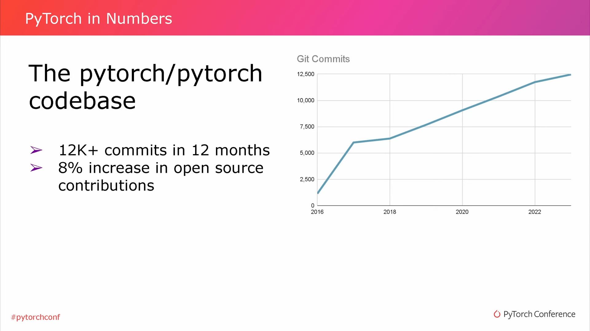
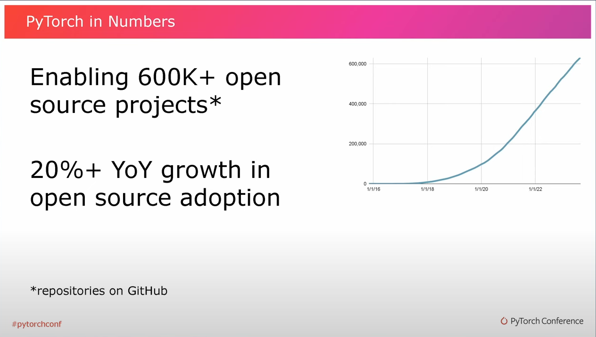
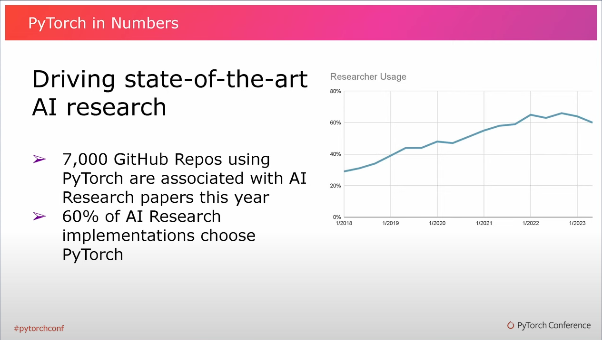
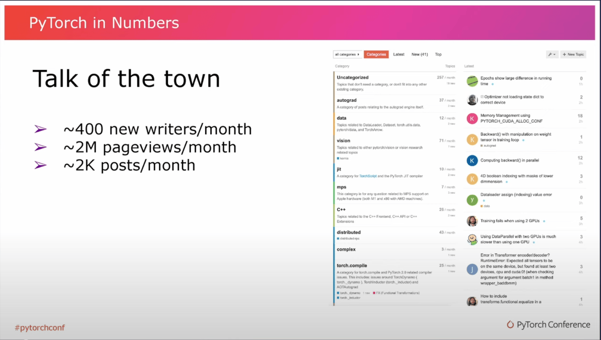
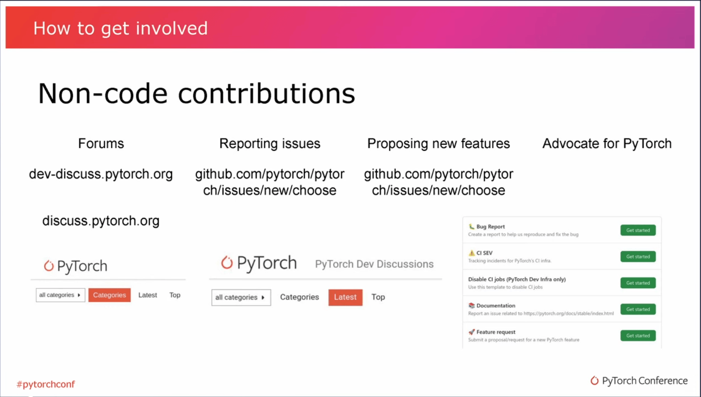
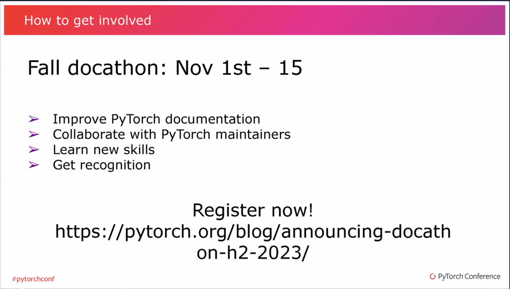

本文是对 PyTorch Conference 2023 中的《[State of PyTorch](https://www.youtube.com/watch?v=dR0lHxt3Tjo&t=83s)》部分进行了精准的中文翻译和详细的文字总结，旨在向读者介绍 **PyTorch 社区的 2023 年动态**。同时也特别参考了[散步](https://github.com/sanbuphy)大佬的《[PyTorch Conference 2023 翻译系列文章](https://www.aispacewalk.cn/docs/ai/framework/pytorch/PytorchConference2023/State_of_PyTorch)》，在此基础上，进行了细致的校对和优化，确保翻译准确无误。对散步大佬之前的辛勤翻译和对开源社区的贡献，表示衷心的感谢和敬意。

<!-- more -->

---

## 写在最前

【睁眼看世界 🌍】专栏旨在打破知识边界，通过将国际上的优秀文章、会议精华以及高质量学习资料翻译成中文，使得这些宝贵的知识资源能够为广大中文读者所共享，而不是局限于国内的小圈子。

对于对此有兴趣、愿意贡献力量的开发者，也可以联系[孙师傅](https://github.com/sunzhongkai588)，一同完善这个栏目，共同促进知识的自由流动和技术的共同进步。

---

## Lightning Talk

我的名字是 Alban，是 META 的一名软件工程师，已经在 PyTorch 工作了很长时间，并且主要在 PyTorch 核心库维护方面做了很多工作。

在今天这个快速闪电演讲中，我要给大家介绍一下 PyTorch 的现状。以前参加过大会的人，也许知道我们每年都在进行着类似的讨论。Joe 去年就在这里做了类似演讲。今天我想谈论的是三个重要的 PyTorch 里程碑，以及今年发生的三个重要活动，还会谈论一些有趣的数字。Joe 之前已经给大家展示过其中的一些，但能亲眼看到这些数据总归是很有趣的。而在最后，我会给大家介绍一下如何参与 PyTorch ，以及如何帮助我们一起建设 PyTorch。

## PyTorch Milestones

### 1. PyTorch 2.0

> - 20M+ downloads
> - Adds:
>    - torch.compile
>    - MPS backend for Apple M1/M2
>    - torch.func
>    - set_default_device
>    - Better transformer

第一个重要的 PyTorch 里程碑是：**今年（2023 年）年初发布了 PyTorch 2.0 版本**。它在所有平台上下载超过 2000 万次，所以对我们来说，这是一个相当重要的发版。并且，下载数量仍在增加。它添加了一系列非常重要的功能：

1. **torch.compile**。我们已经讨论过它很多次，因此在这里不再讨论。
2. **MPS 后端**。一个重要功能是支持 MPS 后端，能够充分利用 Apple M1/M2 芯片的 GPU 部分。现在该功能处于测试阶段，随着覆盖范围和稳定性的提升，会支持更多新功能。
3. **torch.func**。对于了解这的人来说，它又叫 functorch。和 Jax 类似，它新增支持函数式 API，并且融入在 “PyTorch 世界”中，因此能兼容其他所有 PyTorch 功能。
4. **set_default_device**。我不知道大家是否熟悉这个功能。它可以通过改变创建 PyTorch 模型时使用的默认设备，来显著加速初始化（initialization），例如直接在设备上进行初始化。或者如你在一些主题演讲中看到的例子一样，快速的创建模型。通过使用元设备（meta device），即一个没有数据的伪设备（fake device），来跳过模型的初始化过程，直接加载权重。这样就可以避免占用太多内存，进行不必要的初始化等类似事情。
5. **更好的 transformer**。这是由 PyTorch 团队和众多 maintainers 共同努力做出的重大推进，一起改进 PyTorch 中的 transformer 模型。无论是 transofmer 相关的高层 API ，还是底层运算，你都可以拥有目前的最佳实现。

> 编者注 ✍️：这部分演讲内容是对 PyTorch 2.0 简略概括，详细内容可以看 [Blog](https://pytorch.org/blog/pytorch-2.0-release/) 或 [2.0 Release notes](https://github.com/pytorch/pytorch/releases/tag/v2.0.0)。

### 2. Spring Docathon

> - 27 active partipants
> - 5 new tutorials & examples
> - 45+ PRs merged
> - 53+ issues closed

另一个值得一提的重要里程碑是：**今年（2023 年）发起的 Spring Docathon 活动**。该活动共吸引了 27 位开发者参与，成功合入了超过 45 个 PR（Pull Request），解决了 53 个 Issues。非常有效地促进了我们 [tutorials 仓库](https://github.com/pytorch/tutorials)的改进，不仅提高了教程的质量，还增加了新的教程内容，确保我们的教程始终保持最新。

> 编者注 ✍️：其实飞桨也提供了 [Paddle Docathon](https://github.com/PaddlePaddle/docs/issues/6427) ，活动初衷和 PyTorch 是一样的，但整体难度和质量比起 PyTorch Docathon 来说要低一些。第六期黑客松会有一个专门的赛道：优秀稿件征集与传播，大家也可以敬请期待。

### 3. First Year of the Foundation

> - Open to new membership June 2023
> - New premier members (IBM, Intel, Hugging-facing)
> - New general members (Graphcore)

最后，正如 Joe 和 Ibrahim 所提到的，今年（2023）是基金会成立的第一年。并且在今年六月，基金会向新成员敞开了大门。面对当前的发展，我们感到无比兴奋。

在我撰写这篇演讲稿时，我们已经迎来了四名新成员，而现在又新增了两名，增长的速度甚至超过了我制作幻灯片的速度。我对我们吸引到的成员的多样性感到非常激动，既有专注于底层组件和后端技术的企业，如 IBM 和 Intel，也有更注重高层应用、面向终端用户的企业，如 Graphcore 和 Hugging Face。看到我们在各个方面都在取得增长，对基金会和整个生态系统来说，确实是非常令人振奋的。

> 编者注 ✍️：Ibrahim Haddad 是 Linux 基金会副总裁（AI & DATA 方向），也是 [PyTorch Foundation](https://pytorch.org/foundation) 董事会的执行官。

## PyTorch in Numbers

接下来，让我们来看一些数字。

### 1. The pytorch/pytorch codebase

对于那些密切关注代码库的人而言，过去的一年（2022 年），我们总共有 12000 次 commits。并且我们非常高兴看到开源贡献增长了 8%，这里的增长特指来自于**除日常核心维护人员之外**的开源贡献者。

图表展示了每年我们代码库的 commits 数量。如你所见，它正在不断增长，并且未来也会越来越多。

### 2. The pytorch/pytorch top contributors

> - 1128 Contributors this year (+10% more than last year)
> - Top OSS Contributors
>    - [@peterbell10](https://github.com/peterbell10)
>    - [@nkaretnikov](https://github.com/nkaretnikov)
>    - [@XiaobingSuper](https://github.com/XiaobingSuper)
>    - [@cyyever](https://github.com/cyyever)
>    - [@lezcano](https://github.com/lezcano)
>    - [@BowenBao](https://github.com/BowenBao)

所有的开源贡献增长都离不开我们每一位贡献者的共同努力。今年，我们共有 1,128 名贡献者对代码库作出了贡献，相较去年增长了 10%。看到这么多人投身于 PyTorch 的开源工作，实在是让人感到非常振奋。

我在此列出了一些提交量最多的贡献者的 GitHub ID，他们的活跃度非常高。当然，还有许多人虽然只提交了少量代码，但他们对代码的改进和贡献的多样性也极为关键。

这所有的努力共同促成了，GitHub 上使用 PyTorch 的仓库数量超过 600,000 个，比去年增长了 20%。因此，看到越来越多的人不仅使用 PyTorch，还发布基于 PyTorch 实现的代码，这确实非常让人兴奋。

### 3. Driving state-of-the-art AI research

其中，大部分代码来自于**科研领域**，PyTorch 在推动许多前沿 AI 技术的发展方面发挥了重要作用。今年，已有超过 7,000 个 AI 科研论文相关的 GitHub 仓库用到了 PyTorch。事实上，60%的 AI 研究成果是基于 PyTorch 来实现的。因此，见证这样一个开放、繁荣的科研生态，我们感到无比兴奋。

### 4. Powering the AI indusry

> - 65K+ PyTorch professionals(on LinkedIn)
>    - 50%+ YOY increase
> - 3K new jobs requiring PyTorch

如今，PyTorch 在工业界的发展也取得了显著进步，正在迅速弥补之前的落后处境。以 LinkedIn 的统计数据为例，我们观察到将 PyTorch 作为核心技能的求职者每年增长率达到 50%，同时，越来越多的职位也开始要求应聘者掌握 PyTorch。

### 5. Talk of the town

我们的一切成就，都离不开我们庞大社区的支持。接下来，我想分享一些关于社区的有趣数据。Discuss Forum 是 PyTorch 为用户、开发者及其他所有人提供的互动论坛。每月，我们有大约 400 名新成员加入，网站浏览量超过 200 万次。同时，我们的网站也非常活跃，每月约有 2000 篇新帖子发布。我们非常需要活跃的社区，让更多成员帮忙解答用户和开发者的问题。

## Join us

在这里，我想呼吁大家加入我们！PyTorch 不仅是一个开源项目，它也是我们共同奋斗的目标。只有依靠一个庞大而活跃的社区，我们才能不断推动 PyTorch 向前发展。因此，我们做了很多工作来尝试巩固我们的社区生态。

### 1. How to get involved

我们根据社区里很不错的反馈（包括如何帮助新成员融入、如何让他们共同参与到 PyTorch 的建设中来），创建了一个新页面——PyTorch 终极贡献指南。点击下面的链接可以查看，接下来我也会讲一下如何参与其中。

> PyTorch 终极贡献指南：https://github.com/pytorch/pytorch/wiki/The-Ultimate-Guide-to-PyTorch-Contributions

### 2.Non-code contributions

首先我想和大家讲的是，我们是有很多**非代码的贡献**。所以对 PyTorch 的贡献远不止编写代码，还有很多其他方面的工作。

在左边可以看到我之前提到的论坛。同时我们还有一个开发者论坛 [Dev-Discuss](https://dev-discuss.pytorch.org/)，在这里，你可以提问、回答问题或与社区成员讨论各种话题。这些都是非常重要的贡献方式，而且每个人都可以参与其中。另外，因为社区中的所有人都可以建设 PyTorch，所以报告问题、提出新功能建议等也是你可以做出的重要贡献。例如，我们非常欢迎大家对我今天提到的新功能提出反馈，无论是 torch.compile 还是其他功能。请告诉我们什么地方做得不够好，什么工作得很好，以及你还需要什么功能。

### 3. Code contributions

> - Reproduce and investigate issues
> - Bugfix/FeaturePullReguests
> - Review/maintain
> - Documentationch

当然，众所周知，**代码贡献**自然也是非常重要的。这里我认为第一点（Reproduce and investigate issues）特别有趣，这可能不是每个人都会想到的贡献方式，但帮助复现和调查 issues 是非常非常有价值的一件事情，即使这并不是在“编写代码”，并且也比较耗时。多年前，当我开始为 PyTorch 做贡献时，我做的第一件事就是 debugging issues，并在论坛上回答问题。这不仅有趣，也非常有帮助，因为一旦我们明确了问题所在，接下来的修复 bug 和增加新功能的工作就会变得更加简单。在 PyTorch 社区，提交 bug 修复或新功能的 PR 往往是解决问题过程中最迅速的一步。找到问题所在，弄清楚需要做什么，实际上才是最关键的的。

第三点是，我鼓励任何感兴趣的开发者不只是提交代码，也帮助我们审查代码和维护代码库。现在基金会完全开放了，我们有来自世界各地的许多贡献者帮助我们维护 PyTorch 的子仓库，我们鼓励所有感兴趣的人参与进来。

最后，我们也非常重视文档的编写和改进。我相信许多人都知道我们的文档网站和教程网站，我们也在努力的增加更多文档内容，所以任何文档相关的贡献都非常欢迎。对于那些对此感兴趣的人，我们下个月将举办一个 PyTorch Docathon 文档马拉松活动。如果你想参加，学习新技能并获得认可，请关注我们的博客文章了解更多信息。

> 编者注 ✍️：活动已经结束了哦～

## 编者最后的碎碎念

- PyTorch 生态力量非常强大，是目前 Paddle 或者国内任何一个深度学习框架都无法企及的一个高度。
- Paddle 本身的社区治理结构、运作方式，其实是带有一定国内特色的。
- 翻译会议真的很花时间，比单纯的翻译文章累多了，散步能翻译到 30 篇后（总共 60 多篇） 的会议内容真的太强了。目前散步在和 Linux 基金会取得联系，可能会有专门的团队进行翻译，有兴趣加入的也可以联系他。
- 散步做的一个英文转录翻译的工具，可以看看：https://github.com/sanbuphy/WhisperTranslator
