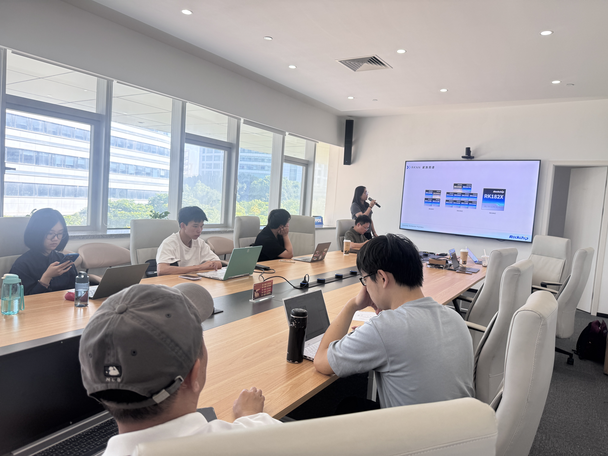

5 月 18 日下午，黑客松第十期「文心合作伙伴赛道」联合瑞芯微、百度飞桨（厦门）人工智能产业赋能中心，在厦门市思明区软件园一期元汇楼举办线下 Meetup。本次活动围绕瑞芯微生态与「PaddleOCR-VL RKNN3 模型转换」打卡任务展开，吸引了来自厦门及周边地区的开发者和高校同学到场参与。

<!-- more -->

---

## 现场直击

活动开场，百度团队介绍了黑客松第十期「文心合作伙伴赛道」的赛程安排、任务体系与参赛方式，帮助到场开发者快速建立对赛事的整体认知。随后，往期参赛选手分享了「我用文心大模型做 AI 自媒体」的实战经验，展示了大模型在内容创作场景中的落地思路。

<figure>

<figcaption>百度团队介绍赛道全貌</figcaption>
</figure>

瑞芯微生态负责人从芯片产品、AIoT、开发者工具、行业应用与生态合作等维度，介绍了瑞芯微在端侧 AI 领域的布局，帮助开发者理解端侧推理从芯片平台到应用落地的关键链路。

<figure>

<figcaption>瑞芯微生态负责人分享端侧 AI 布局</figcaption>
</figure>

技术方向环节聚焦本次打卡任务的核心流程：RKNN3-Toolkit 工具链使用、PaddleOCR-VL 模型获取、模型转换操作、模拟机推理验证与截图提交。瑞芯微技术工程师逐一拆解关键步骤，讲清了从环境搭建到推理跑通的完整路径。

<figure>

<figcaption>瑞芯微技术工程师讲解 RKNN3 转换流程</figcaption>
</figure>

---

## 实操环节：从"看懂"到"跑通"

本次活动最受关注的环节是现场实操。多位开发者在技术同学的指导下，完成了 RKNN3 环境部署、PaddleOCR-VL 模型转换与模拟机推理验证，并成功提交打卡截图。部分开发者是首次接触端侧模型部署，现场排查了环境依赖、模型格式转换等常见问题后，顺利将赛题从"看懂"推进到"跑通"。

> 本阶段打卡任务无需真实开发板，可在工作站、服务器或本地虚拟环境中完成模型转换与推理验证，降低了端侧 AI 实践的入门门槛。

完成指定实操任务的开发者，现场获得电子证书。活动还准备了纪念礼品，为参与者的实践热情加码。

---

## 赛事仍在进行

黑客松第十期「文心合作伙伴赛道」比赛阶段将持续至 6 月 26 日，瑞芯微打卡任务仍有礼品名额。尚未参赛的开发者可通过以下方式参与：

- **报名方式**：在 GitHub Issue #78485 中评论 **【报名】：9**，按任务文档要求完成模型转换与打卡提交
- **打卡任务文档**：<https://github.com/PaddlePaddle/community/blob/master/pfcc/paddle-hardware/%E7%91%9E%E8%8A%AF%E5%BE%AE-PaddleOCR-VL-RKNN3%E8%BD%AC%E6%8D%A2-%E6%89%93%E5%8D%A1%E4%BB%BB%E5%8A%A1.md>
- **提交邮箱**：ext_paddle_oss@baidu.com

5 月 18 日，厦门，开发者们用一下午时间跑通了一个端侧 AI 实战任务。下一个跑通的，也许就是你。
