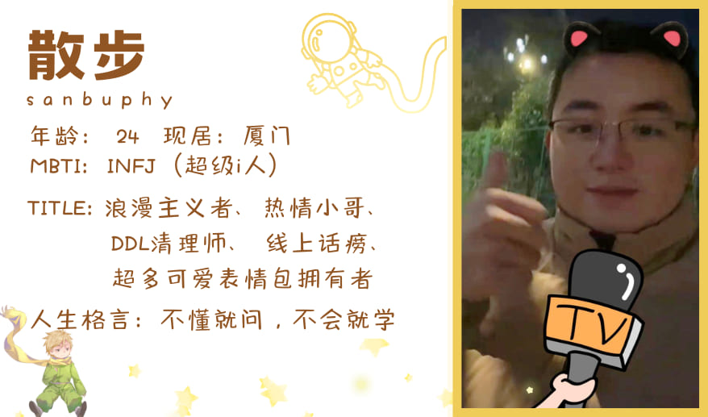
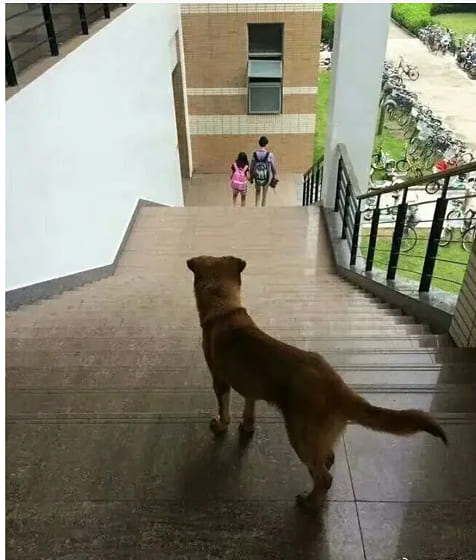
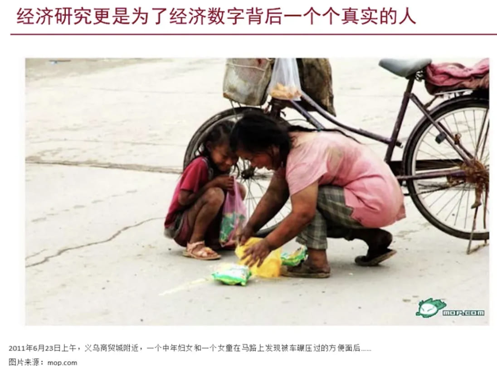
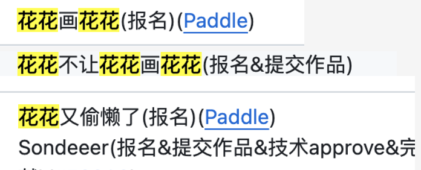
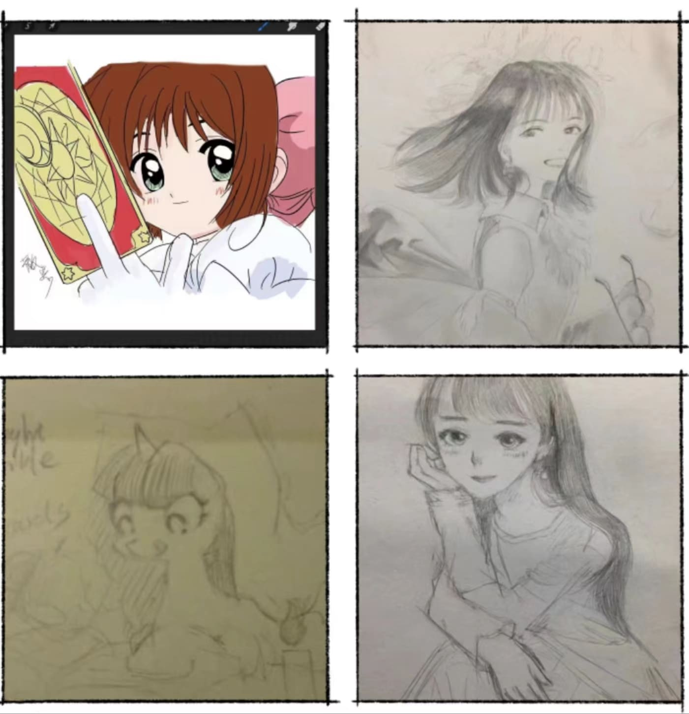
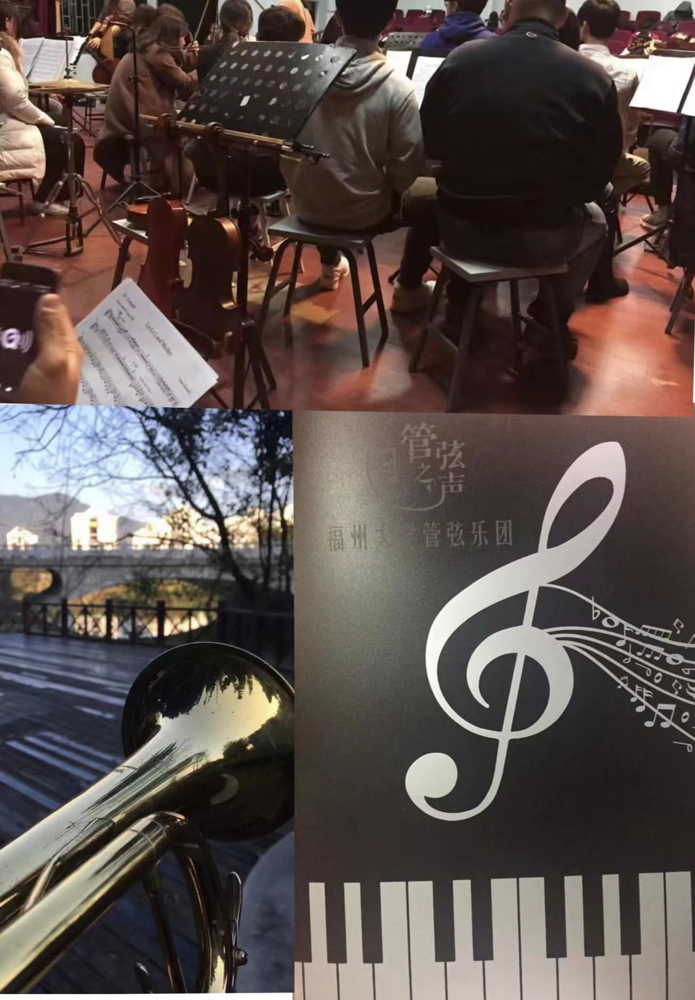
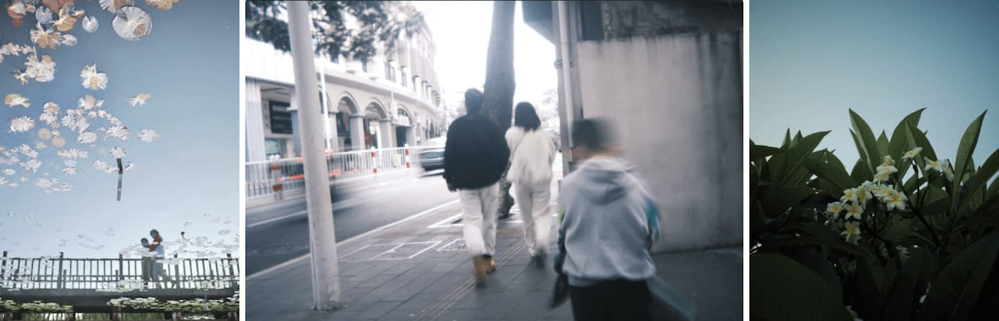
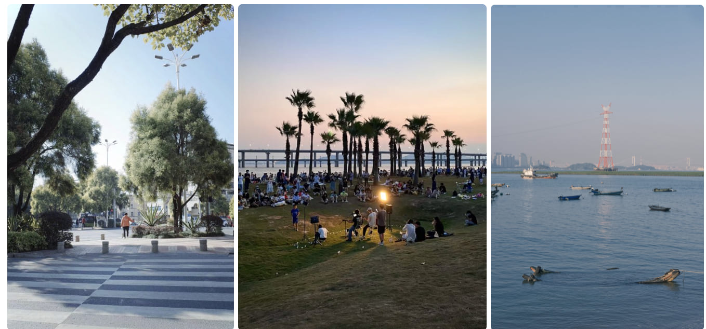
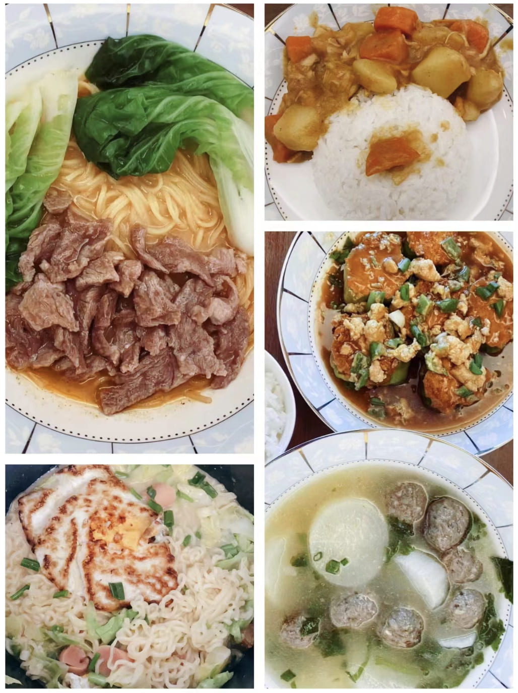
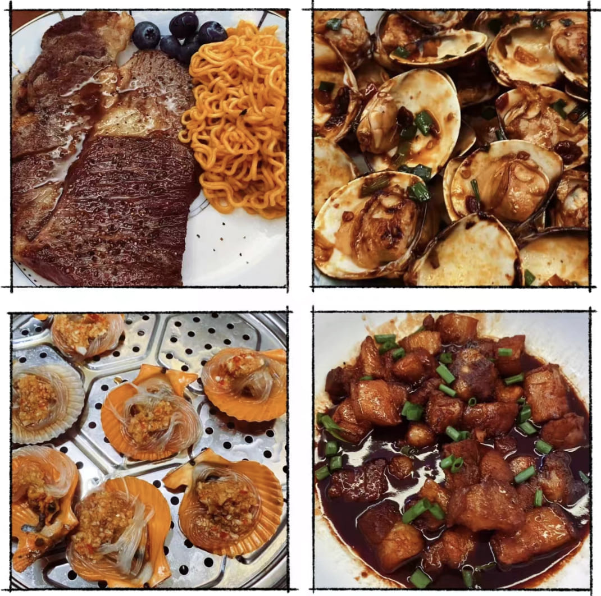

“负暄檐宇下,散步池塘曲”，本期我们邀请到了热情好学的散步🚶‍♀️师傅！你想知道他的人生理想么？你想了解他的学习历程么？你想知道他的日常生活么？你想得到他的真挚祝福么？点击此篇博客，让我们一起走进小散的浪漫人生～

<!-- more -->

<!-- 导入聊天框功能 -->

<!-- 导入聊天框功能 -->

## 一、个人名片

> 编者注✍️：潇某真的有很努力把小散的照片 p 得可爱，想看原图可以私聊😁，反正肯定不会给滴🐶！

# <<<<<<< HEAD

> 小散注✏️：“见善从之，闻义则服；见路不走，实事求是；不懂就问，不会就学”，这是我最喜欢的第一句话。“只是想助人而已”，这是我喜欢的第二句话！

> > > > > > > 0278fa08347acf6ba1ad3b7ca4819c8e18a20077

## 二、采访内容

1. **散师傅，给大家介绍一下自己吧!**

   **小散师傅：** 大家好！我是散步🚶（@[sanbuphy](https://github.com/sanbuphy)），菜但是喜欢学。你们可能会在水群之旅中遇到我。如果觉得我话痨了，请喊我去学习；如果你也喜欢讨论问题，欢迎随时找我一起讨论进步😁😁；如果你觉得我有缺点，很欢迎你直接指出，这是我自省并前进的动力之一；如果你喜欢做开源 & 没事喜欢做一些玩具，那更请你和我一起去快乐开源！！！！

   > “散步” 名字由来（用小散原话）：因为我想人生就这样 不要那么焦虑，也不要浪费；想要在一个茶足饭饱的午后，在阳光的指引下因生命的跳动而缓缓向前。最好的指代应该是散步，想要向前，但不至于拧巴，就这样的走下去了，也就像生活这般的过下去了。

2. **大家对你都比较熟悉，一方面是因为你在社区的贡献量，另一方面是因为你经常水群，能不能给大家讲讲 你是怎么做到同时水 5~10 个群的？**

   **小散师傅：** 其实这个很简单。只要你和我一样宅 & 不打游戏 & 没有女朋友 & 打字飞快，就可以一次性水完全部群了！（群保安，不时保卫一下群里的业主们😂😂）为数不多的好处就是因此可以认识各类大佬。
   <<<<<<< HEAD
   <!-- 配套文字表情包 -->
   

   <figure style="width: 80%;">
   
   <figcaption>小散四件套</figcaption>
   </figure>
   

   =======
   <!-- 配套文字表情包 -->
   

   <figure style="width: 80%;">
   
   <figcaption>小散四件套</figcaption>
   </figure>
   

   > > > > > > > 0278fa08347acf6ba1ad3b7ca4819c8e18a20077

3. **听说不只是 Paddle 的群，你也加了很多别的群，有没有比较有意思的群可以分享？**

   **小散师傅：** 其实我加的大部分群都是技术群。可能也许，我觉得有意思的大家觉得无聊呢。。。
   最近觉得比较好玩的是：dlsys 相关的学习群和我自己的一个每周写博客打卡群（不写就发红包🥹🥹）。但我觉得每一个有大佬愿意和我交流的群都很有趣，能和大佬们在一起学习成长是我的荣幸，也是我的快乐。我可以在聊天中获取对新事物的理解，我沉迷于此。

4. **你本科毕业于福州大学，给大家分享一下福大的吃喝玩乐攻略吧！在学校时，有没有什么好玩的事情发生？**

   **小散师傅：** ● 食堂对面的水果捞，都很好吃😋😋，阿姨会很诚实的说水果🍉酸还是甜
   ● 湖边很好看，草坪很大，适合躺平
   ● 曾经参加学校管弦乐团🎺，那是我最快乐的时光之一
   ● 水煮肉片 yyds，没有之一
   ● 曾经有一张神图火遍全网（一只狗望着楼梯下的情侣），没错，就是咱们教学楼拍的
   ● 食堂基本上可以随便吃，很难踩雷（我最爱吃的就是食堂）

   > 编者注✍️：下面有小散师傅参与管弦乐团的照片哦～

<!-- 狗望情侣照 -->

    <figure style="width: 60%;">
      
      <figcaption>上述谈到的小狗望情侣照片</figcaption>
    </figure>

5. **我了解到：你是物理系出身，当时为什么会选这个专业呢？后来为什么又放弃对物理的学习？**

   **小散师傅：** ● 选物理专业原因：很简单，每个曾经中二的少年🧒都想研究宇宙和量子力学（你想掌握力量吗😈？）
   ● 对于放弃物理的学习：因为发现自己笨而且懒，也许做不出什么有价值的东西了，以及发现自己的本心并不在于物理，而物理应该属于本心就在于它的人，只有这样才配得上一直学下去。光是耍小聪明是不可能被物理之神眷顾的。

6. **后来你开始学经济，然后才转向深度学习。是什么让你开始学经济，后来又是怎么喜欢上深度学习的呢？**

   **小散师傅：** 学经济是因为：看到了徐高老师的《宏观经济二十五讲》。他的讲课中有一张图让我很是触动且惭愧（我每次想偷懒就翻出来看看👀），我觉得让他们（下方图片中的人）过得更好是我想做的事情。但后来，做了一些经济学相关的事（研究金融危机和大衰退/做经济学实证研究）以及听到了老师说的一句话：“写是一回事，采纳又是一回事”，我就发现：只有能有实际用途和影响力的东西才是重要的。还记得《宏观经济学二十五讲：中国视角》中经典的一句话，凯恩斯说：“从长远看，我们都已死去”。所以，人生实属短暂，我们应当在短时间内接触更有为主义的事情，现在就要让他实现。

   喜欢上深度学习：它足够强，可以在短期内对人有帮助，仅此而已。

<<<<<<< HEAD
<!-- 徐高讲课中的图 -->

<figure style="width: 60%;">

<figcaption>徐高讲课中的图</figcaption>
</figure>

=======
plain <!-- 徐高讲课中的图 -->

<figure style="width: 60%;">

<figcaption>徐高讲课中的图</figcaption>
</figure>

> > > > > > > 0278fa08347acf6ba1ad3b7ca4819c8e18a20077

7. **在转向深度学习的过程中，有没有遇到什么困难？又是如何克服的？**

   **小散师傅：** 实际上，与学习物理和数学相比，深度学习稍微没那么抗压，难度大的反而在计算机基础。但总的来说，我一直遵守八个字：“不懂就问、不会就学”。我喜欢向所有比我厉害的人学习，只要朝着目标，随机梯度下降就行了。我没有特别的克服什么困难，那样听起来很痛苦；实际上更多的应该是快乐和珍惜，在🫂拥抱每一次难题中尝试进步。

8. **你觉得进入深度学习领域让你感觉到快乐么? 你觉得这一系列的转变对你的职业生涯和个人发展有何影响？**

   **小散师傅：** 总的来说我认为还是快乐的！因为他拥有无限的创造力，也有很大的可能永远地改变人类的生产力。我觉得这个转变是我人生中的随机扰动因子，人生是一场锚定自身性格特质与价值观的随机游走，我们猜不到之后会发生什么，只能让命运沿着自己向前发展，也许等之后发生了各种各样的事情， 我就能找到一条看似靠谱理由回答今天的疑问了。不过，从价值观来说，也许没有影响，只是在愿景上的不同实现方式罢了。

9. **你提到选择计算机领域的决定源于对提高生产力的渴望，那么在你看来，深度学习和开源社区是如何实现这一目标的？**

   **小散师傅：** 开源社区是深度学习发展的最大加速器之一，而深度学习则是创造力和智力普及化的最大加速器。

10.   **你是怎么与飞桨相遇的呢？你个人对飞桨的印象如何呢？**

      **小散师傅：** 其实我本来是在 openmmlab 社区混的，但是看到 Paddle 社区回复勤一点（没有拉踩！研发大哥确实多一些）以及大佬参与被拉入坑，然后发现了新大陆、接触了很多大佬。非常感谢能和 Paddle 相遇。我对 Paddle 的印象就是：在国内你很难找到一个那么多研发大哥和开源大佬陪你一起卷以及发各种奖励的社区了（甚至有时候周末都会回复你）。很多有趣的方向都可以尝试，和飞桨最好的相处方式就是和它一起变的更强。但很惭愧的是我由于太忙，现在参加的频率变低了，其实很多项目都非常好玩，希望大家有时间的话可以当游戏多多参与。

11.   **在开源社区中，您认识了很多开发者或是社区运营者。他们给你留下了什么印象？能具体举例说说么？**

      **小散师傅：** 有太多人所以我只能简短说明，有没提到的朋友我先道哥歉，因为太多了。

      ● **黄子豪（[@DrRyanHuang](https://github.com/DrRyanHuang)）以及林旭（[@isLinXu](https://github.com/isLinXu)）：** 主要是我的引路人大哥，没有他们我不会学那么多。

      ● **张一乔师傅（[@liyulingyue](https://github.com/liyulingyue)）：** 让我知道了什么是热情！

      ● **zrr 老哥（[@zrr1999](https://github.com/zrr1999)）：** 让我知道了什么是坚持和热情，以及深耕和专注很重要。

      ● **卢畅老哥（[@AndSonder](https://github.com/AndSonder)）：** 一直很认真专注，我很想学会拥有他们的水平，可以洋洋洒洒几百上千行代码多文件代码。

      ● **花花（[@Tulip-hua](https://github.com/Tulip-hua)）：** 社区顶流运营不必说！

      ● **梦师傅（[@Ligoml](https://github.com/Ligoml)）：** 每次看到梦师傅就想问头发颜色变了没。

      ● **001([@SigureMo](https://github.com/SigureMo))：** 热情、专注、可怕的强——集三位一体的每一位 Paddle 开源社区老哥的偶像。

      ● **zbc（[@Zheng-Bicheng](https://github.com/Zheng-Bicheng)）：** 渣男！但是很强。

      ● **涛姐（[@luotao1](https://github.com/luotao1)）：** DDL 战士！

      ● **军哥（[@jzhang533](https://github.com/jzhang533)）：** 深藏功与名的感觉。

      ● **其他师傅：** 其实很多师傅眼熟，都是我很佩服的人，希望大家能一直在开源社区走下去，大家都是我的老师（认真滴）。

12.   **你在 Paddle 社区中经历过最搞笑的事情是什么？**

      **小散师傅：** 某次[黑客松第四期](https://github.com/PaddlePaddle/Paddle/issues/50629)清一色取某人的名字玩梗（咳咳，这里打个谜语）

      > 编者注✍️：黑客松是百度飞桨举办的深度学习领域编程活动，鼓励开发者了解与参与飞桨深度学习开源项目，做出自己的代码贡献。

   <!-- 黑客松花花名字梗 -->
   

         <figure style="width: 60%;">
            
            <figcaption>黑客松花花名字梗</figcaption>
         </figure>
   

13.   **你是否有一些特别喜欢的开源项目或者技术？可以分享一下你喜欢的原因吗？**

      **小散师傅：** 我最喜欢的技术其实没有特别的哪一个，我都很喜欢，都有它独特的美感，能不能都喜欢❤️！
      开源项目的话，那肯定是 Paddle ，当然其他开源项目我也很喜欢（比如 OpenVINO ），只要拥有社区和快速答复的研发大哥，那一定就是我爱的社区。

14.   **散师傅对开源肯定有自己独特的见解，那么你认为什么样的人才能称得上是一位优秀的开源者？**

      **小散师傅：** ● 能一个人召集一些贡献者
      ● 文能随手撕几百几千行代码，武能独立开设新仓库包括完整的体系架构建设
      ● 熟读几个开源项目源码（至少一个大项目）
      ● 熟练 github 操作（独立开设 CI、review PR、审核 issue 等）
      ● 写一个漂亮的 README 而不感到烦躁

15.   **你的周末一般时这么度过的？会和朋友出去玩还是宅家呢？**

      **小散师傅：** 很显然——宅，主要是每天都觉得自己很菜，还是花时间努力变强吧，向一切大佬们学习。而且，由于我的事情太多，每天几乎都要处理到比较晚，周末也是如此。不过我最开心的事情就是偶尔可以去拍拍照，安慰一下我的艺术脑的创作欲。

      > 编者注✍️：下方🈶️散师傅的摄影作品。散师傅尤其喜欢运用光影！

<<<<<<< HEAD 16. **总结一下你最喜欢的一句话！**

plain **小散师傅：** 见善从之，闻义则服；见路不走，实事求是；不懂就问，不会就学。

17.   # **即将跨年了，散师傅给我们小小总结一下你的 2023 年，展望一下 2024 年怎么样？**
18.   **即将跨年了，散师傅给我们小小总结一下你的 2023 年，展望一下 2024 年怎么样？**
      > > > > > > > 0278fa08347acf6ba1ad3b7ca4819c8e18a20077

plain **小散师傅：** 2023 有一些务虚，希望 2024 可以更加务实、专注、静下心，不要偷懒，聚焦于做一些长期主义、有用的事情（比如某个方向能够随手成百上千行），链接更多的有缘人并相互成长。希望自己可以变成更从容的人、能帮助别人的人、更阳光开朗的人、能传递快乐与希望的人。
不过，比起展望自己的 2024，我更希望大家的 2024 都能变得越来越好；人间短暂，希望我们都能走在希望的田野上，无论岁月如何流淌，都能在梦想的道路上互相映照，让生命力在每一处角落绽放。我无比真诚祝愿每一位看过&没看过这篇博客的朋友都能寻找到自己的希翼与幸福。
祝愿每一位人安好。

      > 编者注✍️：这是小散师傅非常非常认真写的祝福，酝酿了很久很久！

## 三、小散的十八般武艺

   <!-- 小散爱好 -->
   

         <figure style="width: 90%;">
            
            <figcaption>小散爱好词云图</figcaption>
         </figure>
   

### **绘画篇🎨**

   <!-- 小散绘画 -->
   

         <figure style="width: 80%;">
            
            <figcaption>小散绘画</figcaption>
         </figure>
   

### **音乐篇🪕**

   <!-- 小散音乐 -->
   

         <figure style="width: 80%;">
            
            <figcaption> 最上图为小散参加学校管弦乐队照片  下左为小散的小号  下右为小散为乐队设计的标志 </figcaption>
         </figure>
   

   > 编者注✍️：小散师傅超级会拉二胡，还会小号🎺呢！！！

### **摄影篇📷**

   <!-- 小散摄影作品1 -->
   

         <figure style="width: 80%;">
            
            <figcaption>小散的摄影作品集1</figcaption>
         </figure>
   

   <!-- 小散摄影作品2 -->
   

         <figure style="width: 80%;">
            
            <figcaption>小散的摄影作品集2</figcaption>
         </figure>
   

### **厨艺篇😋**

   <!-- 小散厨艺展示1 -->
   

         <figure style="width: 80%;">
            
            <figcaption>小散厨艺展示集1</figcaption>
         </figure>
   

   <!-- 小散厨艺展示2 -->
   

         <figure style="width: 80%;">
            
            <figcaption>小散厨艺展示集2</figcaption>
         </figure>
   

## 四、著名大型评论平台——虎扑评论专区

散师傅很活跃，尤其是在开源群里活跃（都是在问问题！好卷～），因此也就结识了很多朋友👬。这次我们邀请到和小散师傅有着密切联系的大佬们来谈谈他们对于小散师傅的印象。大家快来看看吧😄～～

### by zrr1999（[@zrr1999](https://github.com/zrr1999)）

<MessageBox>
   <Message name="zrr师傅" github="zrr1999">
   散师傅作为一个非人工智能相关专业的开发者，对各种新技术都充满热情，大部分时间都是靠业余时间自学新技术，虽然平时休息时间非常少，但是依然愿意花时间参与开源活动，并把自己看到的有趣的、有价值的开源项目分享出来，并留下自己的见解。同时散师傅的知识面也非常广，从半导体技术到计算机软件，再到硬件加速和大模型技术都有所涉猎，属于开发者中的佼佼者。
   </Message>
</MessageBox>

### by 花花（[@Tulip-hua](https://github.com/Tulip-hua)）

<MessageBox>
   <Message name="花花" github="Tulip-hua">
   养成系技术大佬，很有开源热情，厦门见到散师傅感觉散师傅是个很好的人，但是感觉散师傅在互联网上要更E一点哈哈哈哈，线下见面好像话不是特别多。
   </Message>
</MessageBox>

### by 梦柳师傅（[@Ligoml](https://github.com/Ligoml)）

<MessageBox>
   <Message name="梦柳" github="Ligoml">
   散佬一直是我们社区的自学标兵，经常琢磨一些不同领域的技术问题，带着大家一起讨论学习，摇人参加快乐开源，很不错👍
   </Message>
</MessageBox>

### by 卢畅师傅（[@AndSonder](https://github.com/AndSonder)）

<MessageBox>
   <Message name="卢畅" github="AndSonder">
   散师傅是一个对技术非常有热情的大佬，在各大技术群里都很活跃。白天在公司打工，晚上和周末抽空也会研究新东西。他对技术的热情真的很令人钦佩，与他交流让人感受到他在学习新技术时所迸发的喜悦。
   </Message>
</MessageBox>

### by 涛姐（[@luotao1](https://github.com/AndSonder)）

<MessageBox>
   <Message name="涛姐" github="luotao1">
   我是从黑客松TRT推理算子中认识散步师傅的，对散步师傅印象比较深的有几个：
   1.【开源社区对比研究】 以 ci 为例的调研，做的清晰明了；  2.在群里常常和 engineer1109 同学讨论技术问题；3.工作应该是推理方向的，但对性能优化、部署等其他方向也很有兴趣。
   </Message>
</MessageBox>

### by 张一乔师傅（[@liyulingyue](https://github.com/liyulingyue)）

<MessageBox>
   <Message name="张一乔" github="liyulingyue">
   一个神秘的大佬！似乎啥都会🐮！
   </Message>
</MessageBox>

### by 军哥（[@jzhang533](https://github.com/jzhang533)）

<MessageBox>
   <Message name="军哥" github="jzhang533">
   散步师傅很爱学习，也很会学习。你如果翻看他的个人 blog 和 github 主页，会发现他从系统到算法，无所不学。学会后，他就在飞桨社区里做开源，也就是挖坑和填坑，做了很多很出色的工作。当然可能因为学太多了，以致于，还有些坑他挖了，还没填。我记得他做过很精彩的关于 python 虚拟机的分享，研究过很长时间 torchdynamo，期待以后能在社区里，挖个大坑，并一起填上。今天，还意外发现他竟然自学过绿导师的操作系统课，这门课非常棒，在这里，也推荐给看到这段文字的读者。
   </Message>
</MessageBox>

### by 文大潇😁（（[@wenxiaohahaha](https://github.com/wenxiaohahaha)）

<MessageBox>
   <Message name="wendaxiao" github="wenxiaohahaha">
   和小散师傅聊天时，我能感觉到他是一个可爱的人。我从来没有见过那么多可爱的表情包（而我，很多沙雕的表情包，和小散形成鲜明对比）！除了可爱，我觉得小散是一个浪漫主义开源人，他有自己的崇高的理想和抱负（无关权财）。我希望他能坚持下去，实现自己的愿望！当然，他这个每天在群里问问题，清各种 ddl 的卷王，我是相信他的实力的！
   所以，继续闪闪发光吧，小散！
   再提一句：散师傅打字太快了，聊天我根本跟不上节奏！笑死😆
   </Message>
</MessageBox>

## 写在最后 💡

**【开源江湖闲聊录】** 是一项专门为 Paddle 社区的开发者打造的特色访谈栏目 📚。在这里，我们邀请到每一位别具一格且富有热情的开发者，通过文字或语音的方式进行深入采访 🎙️，探索并展现他们背后独一无二的故事，将他们的经历、见解和创意整理成精彩内容，呈现给整个社区。

---
