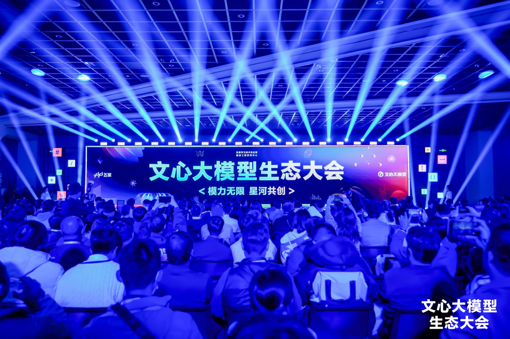
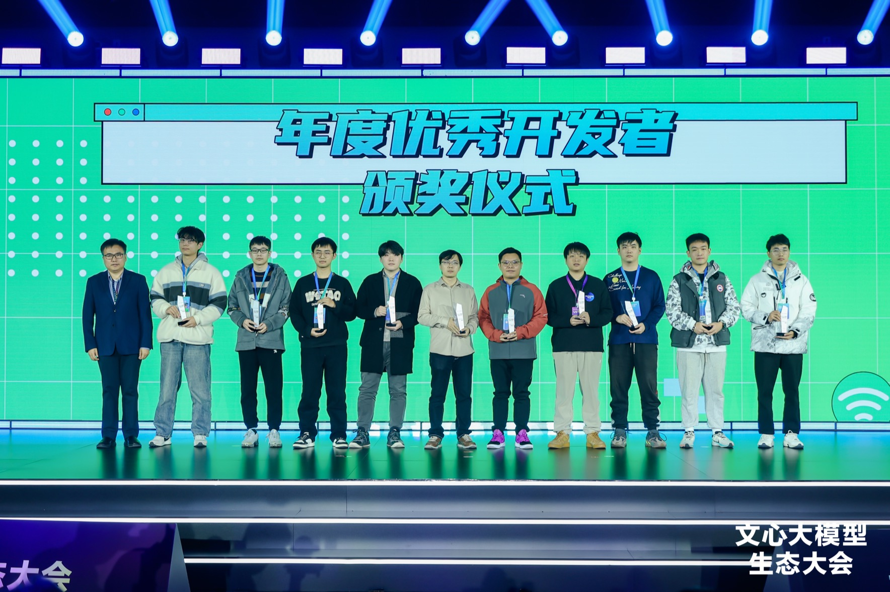
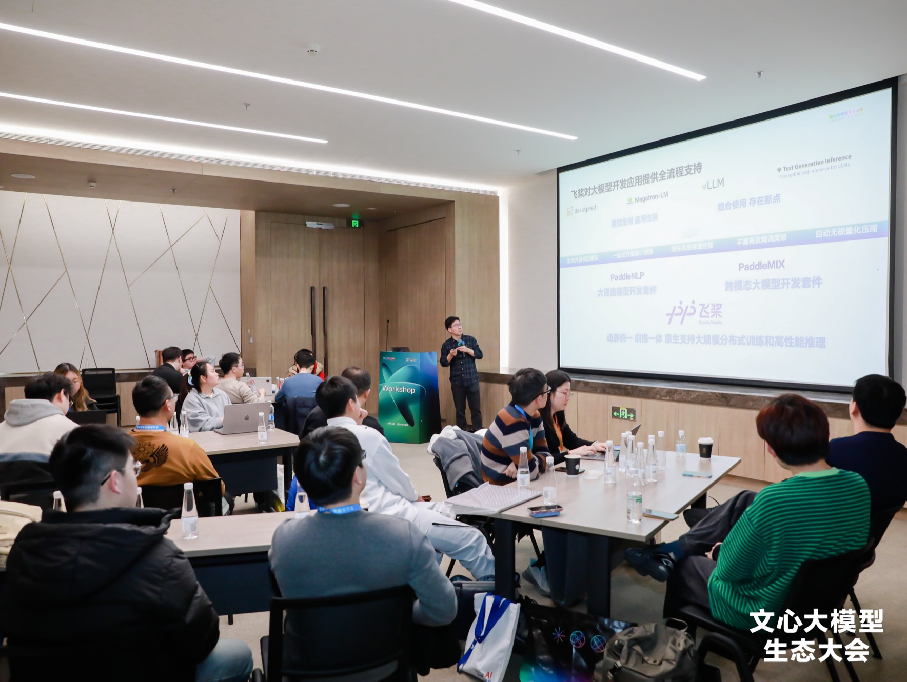
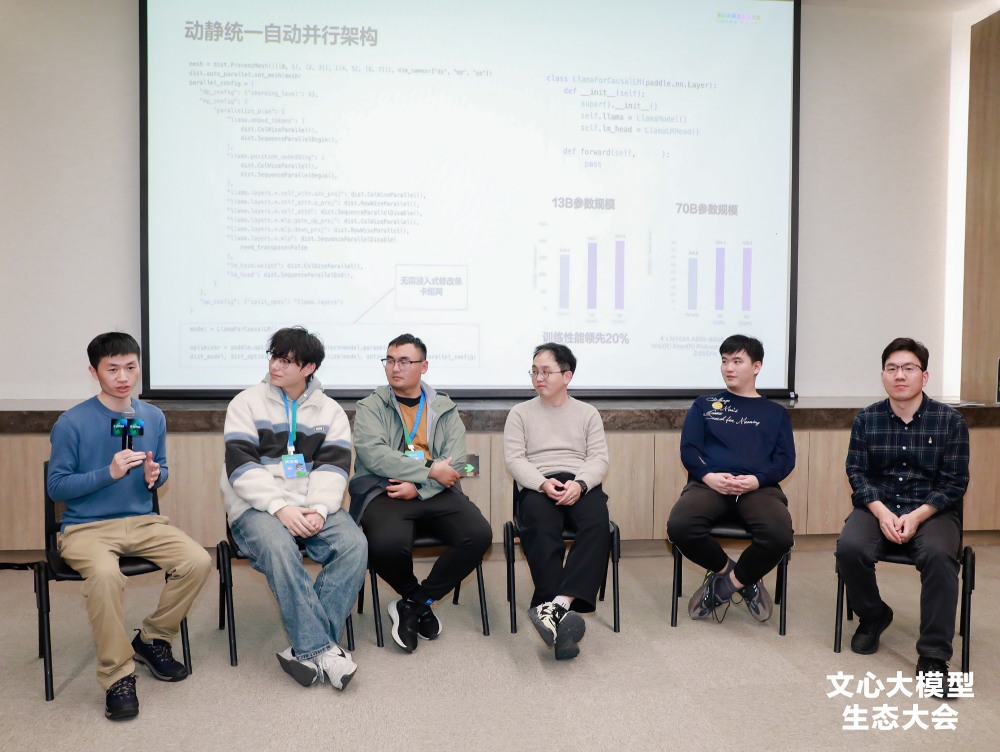
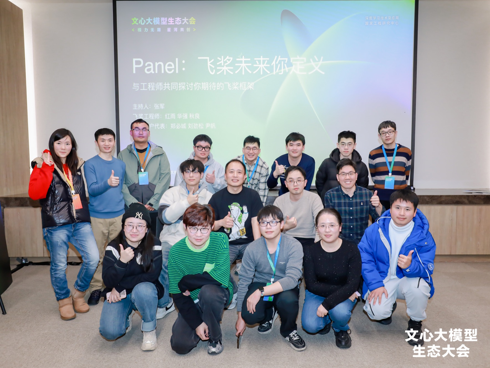
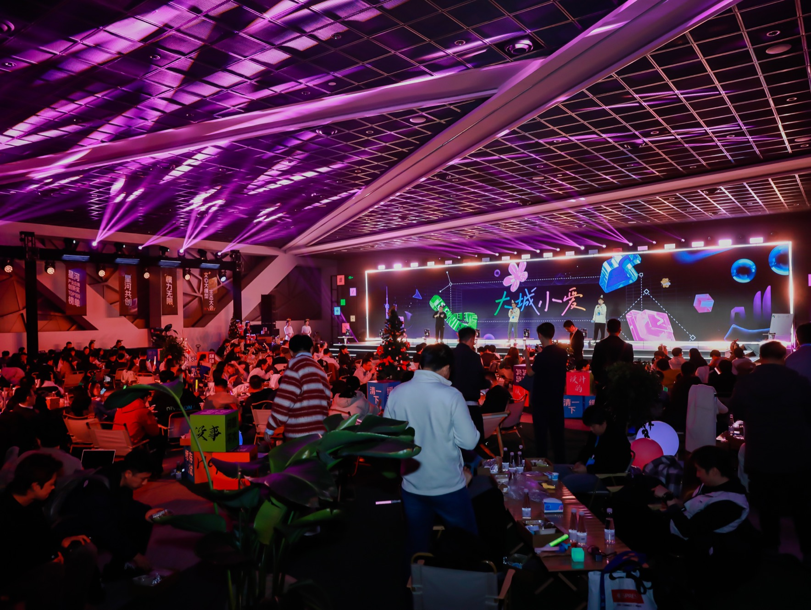

借着 2024 年 12 月 26 日，在上海张江科学会堂举办文心大模型生态大会的机会，非常开心能在上海跟飞桨开源社区的大家线下见面。

<!-- more -->

## 活动简记

### 大会会场内部是这样的

### 年度优秀开发者颁奖仪式

下面照片里能找到三位长期给飞桨做开源贡献的同学，欢迎猜测是哪三位，以及找出他们的 GitHub ID。另：2024 年下半年社区的开源之星评选已经启动，欢迎报名：[2024 下半年飞桨开源之星评选-信息征集 #1043](https://github.com/PaddlePaddle/community/issues/1043)。

### 飞桨的 WorkShop

飞桨的资深工程师在介绍飞桨 3.0 的技术进展，涵盖了新的中间表示、AI 编译器、自动并行技术，等等。读者可以通过线上的文档来了解详情：[飞桨 3.0 全新特性](https://www.paddlepaddle.org.cn/documentation/docs/zh/guides/paddle_v3_features/index_cn.html)。

在接下来的 Panel 上，六位顶级的工程师，一起探讨了深度学习框架的最新技术，以及未来展望。

这个 workshop 的 agenda 在这里：[PaddlePaddle Shanghai Meetup 2024-Winter](https://github.com/jzhang533/events/blob/main/paddle-shanghai-meetup/README.md)。

来一张大合影。

### AI 之夜

文心大模型生态大会安排的 AI 之夜，没能参加，很遗憾。

## 彩蛋 🎊

猜猜，这是哪些人在什么样的精神状态下给谁点赞。

