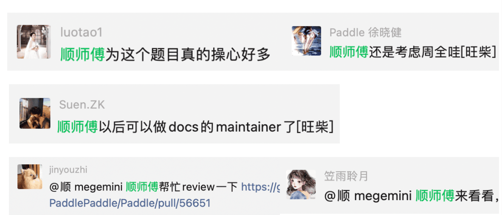
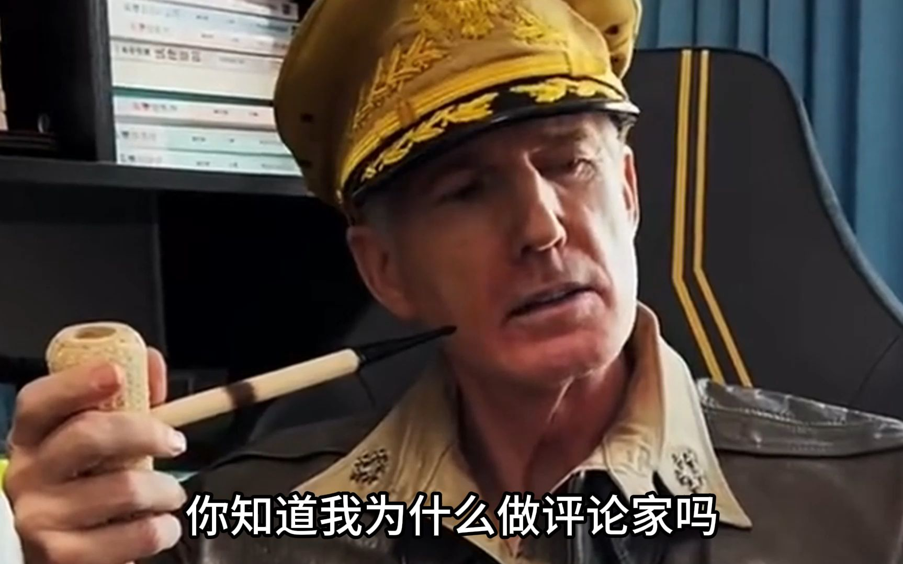

**【开源江湖闲聊录】** 是一项专门为 Paddle 社区的开发者打造的特色访谈栏目📚。在这里，我们邀请到每一位别具一格且富有热情的开发者，通过文字或语音的方式进行深入采访 🎙️，探索并展现他们背后独一无二的故事，将他们的经历、见解和创意整理成精彩内容，呈现给整个社区。

---

## 一、前言

是谁，能让最摸 🐟 的开发者禁不住 PR 的诱惑，疯狂求 review？又是谁，让向来严于待人、宽以律己的 Paddle 开发者忍不住夸夸？接下来，有请我们的大佬——**顺师傅**✨

顺师傅是一名 Paddle 的社区开发者，但在社区里，顺师傅不仅仅是一个称呼，更是一股推动力。他主导的项目 【[将xdoctest引入飞桨工作流](https://github.com/PaddlePaddle/Paddle/issues/54705)】 是 Paddle 社区迄今为止最大的开源活动 🎊。该项目规模极其庞大，涉及超过一千多个 API 示例的整合和数十万行代码的优化，由超过 20 名社区开发者共同完成。顺师傅的领导力不仅显著提升了 API 示例代码的规范性，还极大地促进了整个开源生态的发展和繁荣 🎉。

而顺师傅本身，作为一位经验丰富的资深开发者，也拥有着深厚的技术背景和广泛的知识储备。我们怀着对他的好奇（~~膜拜~~）🤩，通过文字采访的形式来深入了解顺师傅的故事，以下是我们与顺师傅的采访内容 📄。

## 二、采访内容

1. **可以介绍一下自己吗？平时有什么兴趣爱好？**

   **顺师傅:** 我的 AI Studio 和 GitHub 的账号是 megemini，平时喜欢看看书爬爬山跑跑步～

2. **作为一名技术佬，你的一天是如何度过的呢? 可以分享一下你的日常生活么?**

   **顺师傅:** 每天都会做的事情，比如写代码、跑步、看书之外，由于最近需要用到 C++，而上一次用 C++ 都是十多年前的事情了，所以近期看一些 C++ 新特性相关的书和视频教程会比较多 ～

3. **可以简单向大家展示一下你一天的生活作息嘛？**

   **顺师傅:** 家里情况比较特殊，没有什么可参考性～ 不过现在不会熬夜写代码了，晚上一般七八点钟也会出去跑跑～

4. **“上一次用 C++ 都是十多年前的事情了”这句话太有年代感了，是在学生时代用的吗？**

   **顺师傅:** 嗯，工作之后 Java、Python 用的比较多 ～

5. **你是如何成为 Paddle 社区的开发者的？**

   **顺师傅:** 毫不避讳的说，当初是因为 AI Studio 有比较多的免费算力才接触到 Paddle 社区并真正的开始使用 PaddlePaddle 框架，慢慢的后面才接触到黑客松、快乐开源之类的活动 ～

6. **Paddle 社区开发者都称呼你为“顺师傅”，这个称呼是怎么来的？是谁第一个开始这么称呼你的（笑）？**

   **顺师傅:** 微信的昵称就是「顺」，好像是涛姐还是 001 开始这么叫的 ... ... 惭愧 ... ...

7. **外界对开发者的固有印象(社恐，直男)，你周围的开发者形象是怎样的？你对 Paddle 哪位社区开发者印象最深？**

   **顺师傅:** 开发者都比较坦诚，由于平时基本都是跟技术打交道，所以不管是话多也好、话少也罢，交流起来都是比较简单、热心的感觉～001 对于开源的那种热爱对我印象最为深刻～

   > [SigureMo](https://github.com/SigureMo) 是 Paddle 社区的资深开发者，由于是第一位社区 commiter 而被大家称为 001。

8. **为什么 001 会给你带来这样深刻的印象？可以分享一下其中的小故事嘛？**

   **顺师傅:** 记得当时为了修改示例代码写了一个小工具，本来还只是想发出来试一下，结果好像第二天 001 的 PR 就来了～技术能力和执行力都太强了，惭愧 ... ...

9. **你可以谈谈你对开源社区的理解和认识吗？**

   **顺师傅:** 抛开自由、开放不谈，开源项目的参与门槛其实是比较高的，这里主要是针对正规的、规模较大的开源项目、代码类的贡献来说～因此，飞桨能够组织快乐开源、黑客松之类的活动，并且是由中文社区主导，个人感觉是非常有意义的一件事情～

10.   **“将 xdoctest 引入飞桨工作流”这个项目是如何诞生的？你可以谈谈这个项目的初衷和目标吗？**

      **顺师傅:** 这个项目是第六届中国软件开源创新大赛 Paddle 挑战赛的一个赛题，主要目标是使用 xdoctest 替换掉 CI 流水线中的不怎么好用的示例代码检查工具～

11.   **你是如何组织和号召其他社区开发者参与这个项目的？在这个过程中遇到了哪些挑战，又是如何克服的？**

      **顺师傅:** 嗯 ... ... 这里应该主要感谢涛姐帮忙摇人吧～～～我所做的只是把事情讲清楚，仅此而已 ～

12.   **这个项目涉及到一千多个 API 示例、数十万行代码的修改，你是如何管理和协调这么大规模的项目的？**

      **顺师傅:** 飞桨开源社区的参与者能力都很强，所以，只要把事情讲清楚，做什么、怎么做，大家自然会把事情做好～期间，001、涛姐、孙师傅、军哥等等很多人，都帮助一起分析如何把这个事情讲清楚，大家目标一致，水到渠成吧～

13.   **这个项目的完成对 Paddle 社区的开源生态有何影响？你认为它在推动开源生态繁荣方面的作用体现在哪里？**

      **顺师傅:** 提升代码质量、对齐主流 Python 解决方案～能够引导更多 “新人” 参与到开源项目中来～

14.   **在你看来，这个项目的最大贡献是什么？为什么？**

      **顺师傅:** 丢掉历史包袱，以后大家都是在统一的 Python 标准下参与贡献，未来的技术选择灵活性都大很多～

15.   **回顾这个项目，有哪些时刻让你印象深刻？为什么？**

      **顺师傅:** 印象最深刻的是当时 RFC 讨论的时候～参与之前本来是抱着试一试、捡漏的心态来的，结果 RFC 一番讨论下来，有种骑虎难下的感觉 ... ... 另外，在发起示例代码修改这个快乐开源活动之后，看到能有这么多开发者参与进来，并且最终把这个项目做了下来，飞桨开源社区号召力之大，属实给了我一次小小的震撼～

16.   **对于未来，你对 Paddle 社区有哪些期待和建议？**

      **顺师傅:** 希望能够引导更多中文社区的开发者参与进来，能够有更多在校的学生参与进来～另外，提一点小小的建议，虽然已经参与飞桨开源社区快一年了，但是，仍然对 Paddle 本身的框架技术路线、技术规划以及一些细节考量非常模糊，希望能有这方面较为系统的文档、视频教程吧～

17.   **作为一名经验丰富的老开发，对于想要参与开源社区，特别是 Paddle 社区的年轻人，你有什么建议或者寄语？**

      **顺师傅:** 只有让更多年轻的开发者不断接过手中的桨，才能将开源社区一直行驶下去，直至星辰大海～

## 三、“五星评论家麦克阿瑟”专区

我们也邀请了一些和顺师傅很熟悉的、有过合作经历的朋友们，贡献一下和顺师傅相关的故事，或者他们对顺师傅的评价～以下均为真心话，请放心看！

### 001（[SigureMo](https://github.com/SigureMo)）

> 就 Xdoctest 这个任务而言，最开始其实我自己都是没有多少信心的，毕竟是整个框架级别的，光是任务量想想就头疼，而且历史遗留问题特别多，怎么想都做不来吧？当初想着在 RFC 阶段就尽可能抛出我已知的各种坑，让开发者知难而退，这样我也能省心些，要是啥也不懂的我也带不动。
>
> 但是顺师傅的出现打破了我的摸鱼计划，顺师傅上千行的 RFC 调研地比我了解的还清楚，对于我提出的各种「劝退」问题也逐一回复了合理的解决方案，这时候我突然觉得，也许真的能成？
>
> RFC 合入后顺师傅有条不紊地推进着整个任务，每一次遇到疑难问题时，顺师傅总能选出合适的解决方案。比如 Paddle Tensor 打印时候 Place 不对齐的问题、输出精度问题、运行环境隔离问题等等，这些都是 Xdoctest 本身存在的诸多问题，经过顺师傅的调整和优化，Xdoctest 已经基本能够完美适配我们 Paddle 了。
>
> 此外大家可能比较熟悉顺师傅发放的两个开源任务，也是整个任务耗时最久的部分，顺师傅在开源任务中从开发者转变为了 reviewer，帮助我们 review 了很大一部分的 PR，并且 review 地十分细致且专业。
>
> 然后就如大家所见到的，真的成了。
>
> 顺师傅太强了～期待下次合作～

### 涛姐（[luotao1](https://github.com/luotao1)）

> 本任务难点在于工程量大、历史包袱重，感谢顺师傅带着所有队员（24位）用强大的耐心、细心完成了这一旷日持久的推进，你们的工匠精神值得全体同学学习！众人拾柴火焰高，感谢项目的所有参与的同学！

> 编者注✍️： 涛姐的话太官方了，所以我挑了句重点，希望涛姐能原谅我 🤪

### 敏师傅（[enkilee](https://github.com/enkilee)）

> 有幸通过软件开源创新大赛，结识了顺师傅，他的大赛课题是将 xdoctest 引入到飞桨框架工作流中，为了提升效率，减少错误，还不辞辛苦做了一个简单的转换工具convert_doctest，极大的节省了修改的工作量，减少了出错成本。
>
> 此任务工作量巨大，而且很多API历史遗留问题繁杂，顺师傅在工作中展现出的极高的职业素养和敬业精神令我们为之侧目。他对待每一个细节都非常用心，力求做到尽善尽美。在面对复杂的问题时，他总是能够迅速找到解决办法，充分体现了他的专业能力和经验。
>
> 此外，顺师傅还具有很强的团队协作能力，他乐于与大家分享经验和技巧，共同提高整个团队的工作效率。在工作中，他总是能够主动承担责任，为团队的发展贡献自己的力量。

### 川川（[gouzil](https://github.com/gouzil)）

> 顺师傅好强，带带弟弟
> 
> 顺师傅的分析能力和组织能力都超强
> 

### 孙师傅（[sunzhongkai588](https://github.com/sunzhongkai588)）

> 在参与顺师傅的项目过程中，我甚至感觉顺师傅像我的 mentor，因为从他身上切切实实学到了很多东西，比如问题的拆解、项目的组织、技术的交流等...
>
> 尤其是看到顺师傅逻辑非常清晰的 RFC 文档后，仅从文档写作方面都让我受益匪浅（因为文档的编写需要非常多的逻辑推理和思考，而像顺师傅一样把事情讲清楚的研发，真的不多，大家感兴趣也可以去看看）功利地说，顺师傅对我的职业发展有非常大的提升，希望顺师傅能够继续加油，影响更多人！

## 四、结尾

在探索顺师傅的旅程中，我们不仅发现了一个技术上的资深开发者，也见证了一个开源社区领路人的成长和影响力。他的故事和成就展示了开源社区不仅是技术的聚集地，更是所有开发者开源热情的熔炉 🔥。

期待顺师傅在未来的旅程中继续发光发热，为 Paddle 或是其他开源社区带来更多的创新和启示 💡。

最后，应顺师傅要求，就不附照片了，以一棵柳树作为结尾 🌲

## 彩蛋 🥚

往期 blog 有顺师傅真容哦～大家可以去探索一下！
