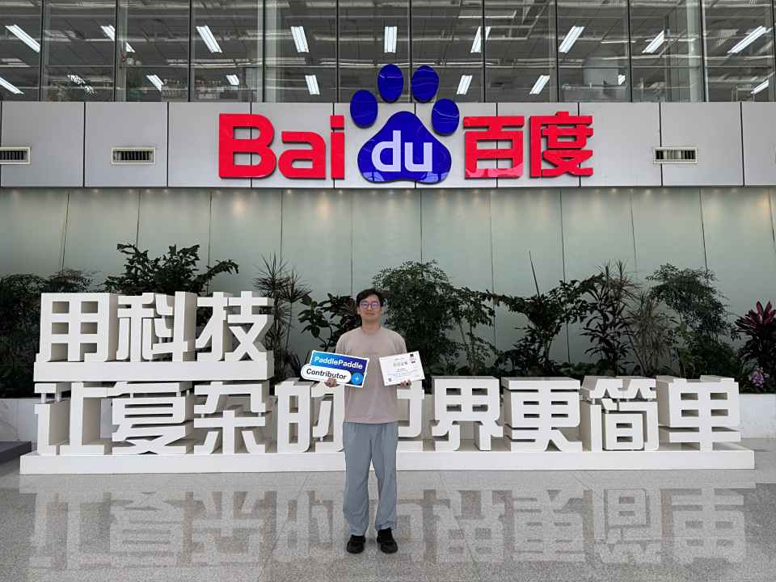
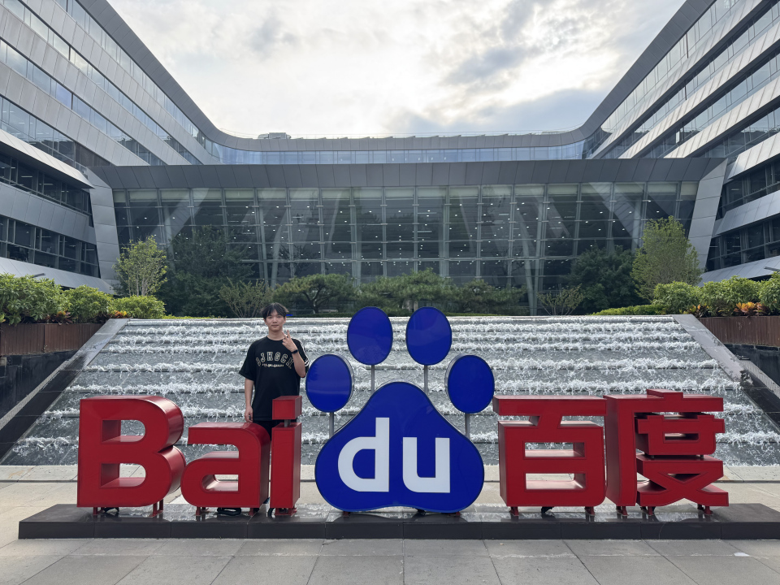
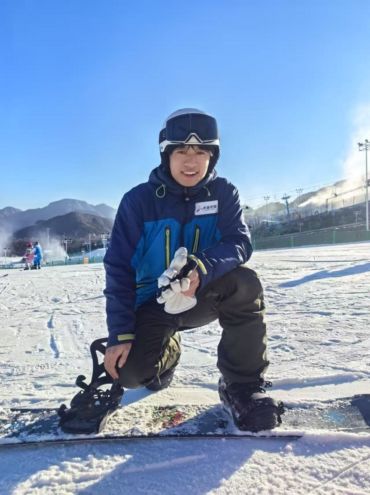
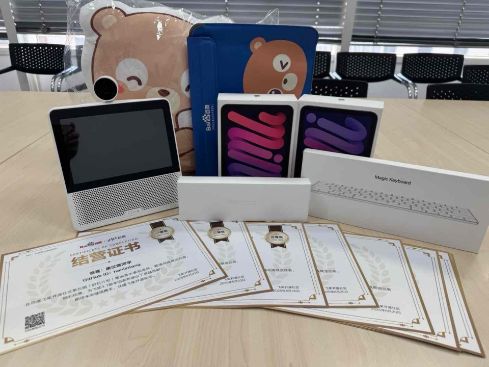
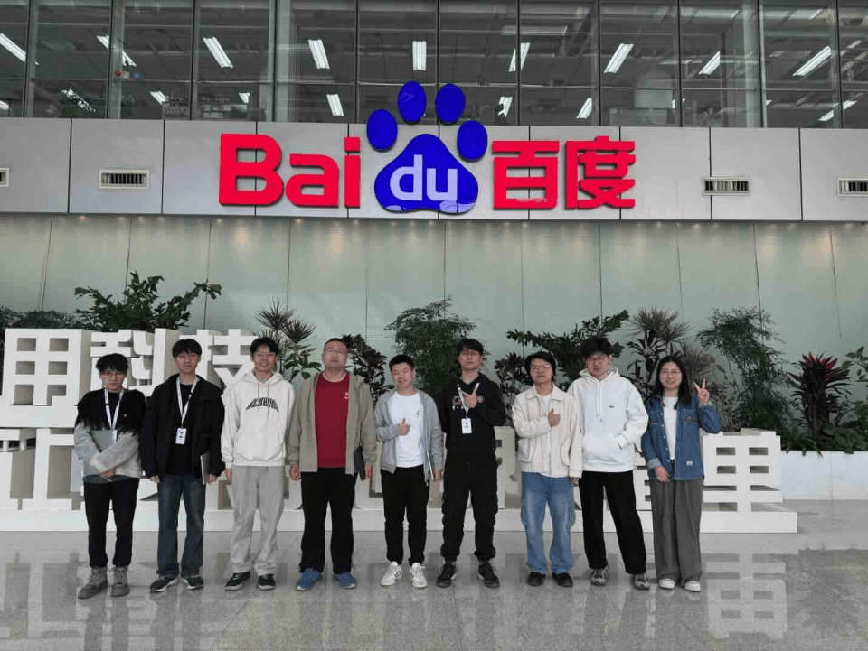
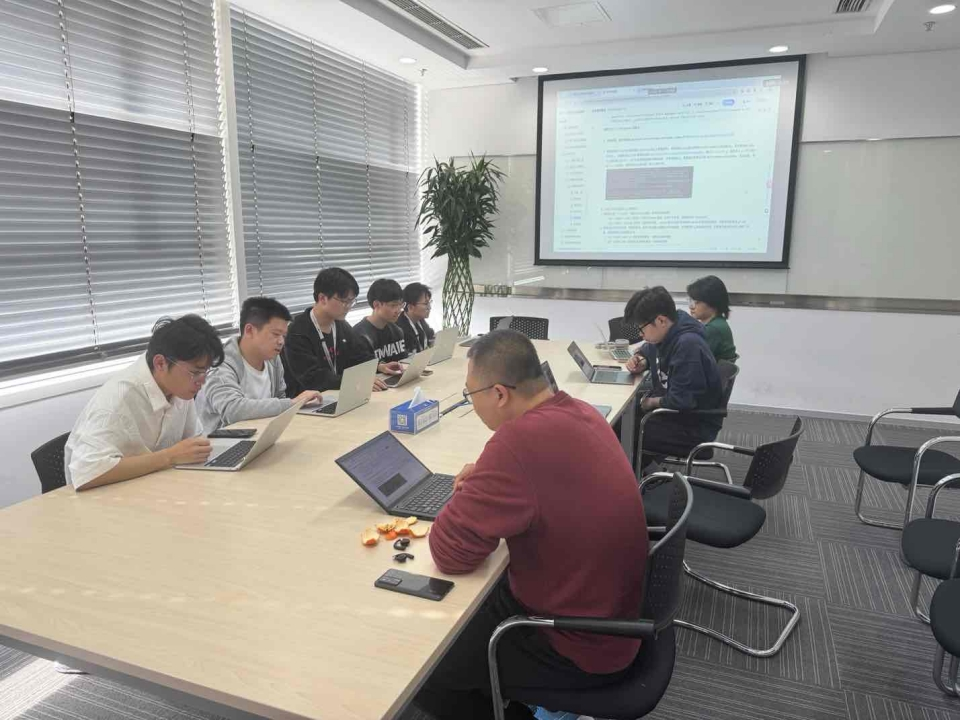

<!-- 导入聊天框功能 -->

<!-- 导入聊天框功能 -->

从文档深耕到模型适配，2 个月集训见证 29 位新 contributor 蜕变

<!-- more -->

在 2025 年 3 月 7 日，飞桨开源社区开启了第五期**启航计划集训营**~~（居然都开了五期了）~~。经过为期两个月紧张而充实的集训后，启航计划集训营于 5 月 30 日 正式圆满完成所有集训计划。在集训期间，大家出色地完成了三项热身打卡任务，并且有 **29** 位营员合入了 **110** 个 PR。衷心感谢各位营员的积极参与和卓越贡献！ 🎉

此外，在集训营结尾阶段，我们开放了一、二、三等奖的申请，于 5 月 28 日完成答辩工作，经过 4 名评委的细致评估后，产生了最终获奖名单：

- 一等奖：唐汉霖 @[hanlintang](https://github.com/hanlintang)
- 二等奖：聂宇旋 @[Echo-Nie](https://github.com/Echo-Nie)
- 三等奖：朱萌萌 @[594233](https://github.com/594233)

💐目前已经公示，详情见：https://github.com/PFCCLab/Starter/issues/670

祝贺以上获奖同学 🥳，感谢大家对飞桨开源社区做出的突出贡献～

## 听听获奖同学的结营感言

本次启航计划期间，大家都对活动本身以及开源任务等有着自己的感悟和体验，下面我们邀请了一、二、三等奖获奖同学与我们分享他们的参与感受：

**唐汉霖 北京理工大学 计算机学院 计算机科学与技术专业博士生**

<MessageBox>
   <Message name="唐汉霖" github="hanlintang">
   我在启航计划中主要负责PaddleNLP相关的任务，包括BERT、ERNIE等模型在PaddlePaddle 3.0框架下的新版推理实现，以及部分SLM模型的PIR适配，PaddleNLP大模型套件预训练、微调、对齐和量化的新手文档撰写和示例项目开发。除此之外，还完成了一些文档任务，参与了飞桨0-size Tensor支持以及一些bug修复工作。 
   这是一次非常宝贵的实践经历，在这个过程里我逐步熟悉了企业中项目开发的版本控制、代码与文档的开发规范、PR提交与审核及CI流程，并在mentor的指导下完成了相应任务。非常感谢飞桨提供的宝贵机会，让我在与老师同学们的交流中对开源和开源社区有了更深入的理解，在开发实践中切实解决了用户的实际问题。未来我将持续精进，为开源社区贡献更多力量。
   
   
   </Message>
</MessageBox>

**聂宇旋 云南大学软件学院人工智能学院 22 级 软件工程专业 本科生**

<MessageBox>
   <Message name="聂宇旋" github="Echo-Nie">
   在集训期间，我学习了百度飞桨的基础知识与工作流程，并积极参与多个开源任务，包括文档修复、主框架功能补充、Paddle Speech 脚本完善以及 Paddle NLP 文档扩充等。我还处理了多个 Issue 并提交了相应的修复 PR。公司的开发流程更加系统和严谨，特别是在 PR 提交与代码评审方面，是我此前在学校项目中未曾接触过的。这段经历不仅让我熟悉了开源项目的协作机制，也显著提升了我在代码阅读、文档查阅和问题定位方面的能力。 
   通过实习，我深入了解了 PaddlePaddle 框架的 API 使用规范、脚本编写标准及文档格式要求。从最初对流程较为生疏，到后来能够独立完成任务，我在实践中逐步养成了规范提交 PR 的习惯，并学会了如何高效地与团队成员沟通协作。这段经历让我深刻认识到敢于提问、主动沟通和保持开源热情的重要性，同时也被社区开发者们的高效执行力所激励。此外，担任助教的经历也让我在帮助他人的过程中实现了自我成长，更加理解开源贡献需要深入思考与持续投入，而非仅仅为了完成任务。
   
   
   </Message>
</MessageBox>

**朱萌萌 北京理工大学 化学与化工学院 纳米化学硕士研究生**

<MessageBox>
   <Message name="朱萌萌" github="594233">
   启航计划是我参与的第一个开源活动，让注册许久的Github账号终于有了用武之地。在本次集训中，我成功在本地部署了前沿的多模态模型，并将其迁移到PaddlePaddle框架上，完成模型的推理对齐。过程中，百度团队的AIStudio在线编程环境帮了大忙，它让没有团队支持的我，也能有机会学习先进的人工智能知识。这次宝贵的开源经历不仅让我对大模型有了更深入的认识，也极大地提升了我的技术信心——只要热爱，肯钻研，不断寻找解决方法，就能完成任务！ 
   这里有热心伙伴并肩完成开源任务，有礼物奖励顺利结营的参与者，更有活泼又专业的导师在线指导。别担心自己行不行，迈出第一步就知道了！同学们，大胆冲吧！
   
   
   </Message>
</MessageBox>

## 周密的活动安排

本次启航计划集训营为期 2 个月，以双周报提交形式进行阶段性汇报总结。整体的安排节奏如下表，没有参与过启航计划的同学可以留步围观哦~

| **时间**                   | **日程**                               |
| :------------------------- | :------------------------------------- |
| **2025.3.7**               | 正式启动报名                           |
| **2025.3.7 ~ 2025.3.24**   | 持续公开接收简历，确定营员名单         |
| **2025.3.25 19:00**        | 开营仪式，集训正式启动                 |
| **2025.3.25 ～ 2025.5.23** | 参与集训项目（8 weeks）                |
| **2025.5.24 ～ 2025.5.28** | 申请并完成一、二、三等奖答辩（1 week） |
| **2025.5.30 23:59**        | 集训营结营，公布考核结果               |

为帮助大家更好地入门开发，我们还专门安排了各个方向的快乐开源课题讲解👩🏻‍🏫

| **时间**      | **日程**                                                                                                   |
| ------------- | ---------------------------------------------------------------------------------------------------------- |
| **2025.3.27** | PaddleMIX 快乐开源任务讲解 PaddleX 快乐开源任务讲解                                                        |
| **2025.4.10** | PaddleNLP 快乐开源任务讲解发布 Paddle 社区[《新人手册》](https://pfcclab.github.io/posts/newcomers-manual) |
| **2025.5.12** | 框架方向 3 个新快乐开源任务讲解                                                                            |

在此期间，我们通过双周周报的形式跟进学员的开发进度。大家可以在每一次周报总结中，及时查缺补漏！当然了，没有按时提交周报的学员，很遗憾地被视为自动退出集训营。（希望本期没有完成任务的同学，下一期再来挑战）

此外，助教聂师傅 [@Echo-Nie](https://github.com/PFCCLab/Starter/commits?author=Echo-Nie) 也会在每个双周周期内收集营员提出的问题，并由助教团队联合飞桨研发团队统一答疑，帮助大家更好地推进项目。

|   **时间**    |                                                                               **日程**                                                                                |
| :-----------: | :-------------------------------------------------------------------------------------------------------------------------------------------------------------------: |
| **2025.4.04** | [第一期周报](https://github.com/PFCCLab/Starter/issues/537)  [第一期周报 QA](https://github.com/PFCCLab/Starter/blob/main/Reports/season%205/03.25~04.04周报QA.md) |
| **2025.4.18** | [第二期周报](https://github.com/PFCCLab/Starter/issues/585)  [第二期周报 QA](https://github.com/PFCCLab/Starter/blob/main/Reports/season%205/04.07~04.18周报QA.md) |
| **2025.5.04** |                                                      [第三期周报](https://github.com/PFCCLab/Starter/issues/619)                                                      |
| **2025.5.16** |                                                      [第四期周报](https://github.com/PFCCLab/Starter/issues/647)                                                      |

同时，聂师傅也在启航计划的“如流群”中积极回应大家的问题，为同学们提供了及时有效的支持，感谢聂师傅的辛勤付出！

在集训接近尾声之际，我们组织了一、二、三等奖的评选答辩。共有四位营员主动申请参与报名，并于 5 月 28 日由答辩委员会完成了正式答辩。

> 答辩详情见：[答辩安排链接](https://github.com/PFCCLab/Starter/issues/662)

   

      <figure>
         
         <figcaption>结营证书及给力的奖品</figcaption>
      </figure>
   

## 一些成果

本次启航计划线上集训营吸引了大量来自五湖四海不同背景的新人加入，同时飞桨开源社区与北京理工大学联动，在北理校园内进行了广泛宣传，许多富有激情的北理同学也通过这个契机成为了飞桨开源社区的开发者。

**数字上的成果**

1. 共有 **29** 位营员合入了 **110** 个快乐开源 PR，涵盖 PaddleSpeech、PaddleNLP、PaddleMIX 等多个开源仓库。
2. 其中 **28** 名营员首次在飞桨开源仓库中合入 PR，成为飞桨新 contributor。
3. **12** 名营员满足结营要求，成功通过考核顺利结营，**3** 名优秀营员通过答辩获得一、二、三等奖。

## 线下集训营瞬间

本期启航计划集训营还联合北京理工大学开展了线下集训营，期间共有五位来自北理工的同学 @[cszdrg](https://github.com/cszdrg)、@[cangtianhuang](https://github.com/cangtianhuang)、@[mzj104](https://github.com/mzj104)、@[Cutelemon6](https://github.com/Cutelemon6)、@[yuwu46](https://github.com/yuwu46) 为飞桨 PaddlePaddle 提交了大量高质量的 PR，做出了突出的贡献。

## 最后

🎉恭喜以下所有顺利通过结营考核的营员！你们用实际行动完成了挑战，也为本期启航计划画上了圆满句号：[@rich04lin](https://github.com/rich04lin) [@cuiyu-ai](https://github.com/cuiyu-ai) [@HangFu7](https://github.com/HangFu7) [@Echo-Nie](https://github.com/Echo-Nie) [@Ismoothly](https://github.com/Ismoothly) [@superdonkey007](https://github.com/superdonkey007) [@hanlintang](https://github.com/hanlintang) [@mayiru1021](https://github.com/mayiru1021) [@zhaop-l](https://github.com/zhaop-l)[@crashbussy](https://github.com/crashbussy) [@lygitgit](https://github.com/lygitgit) [@594233](https://github.com/594233)

尽管部分营员由于各种原因未能通过考核，但为我们由衷感谢你们的积极参与，期待你们在飞桨以及其他开源社区中继续取得更进一步的成就。之后可以关注 https://github.com/orgs/PaddlePaddle/projects/7 ，会不定期更新新的开源任务，参与即能锻炼技能，还有机会赢取开源小礼品～ 🏆

所以，下一期的启航计划，你心动了吗？💓
