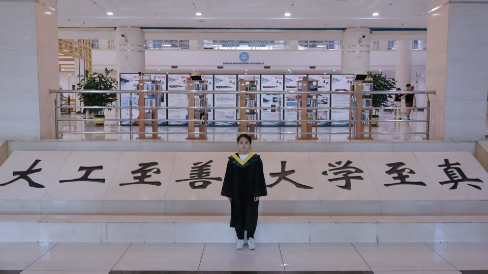
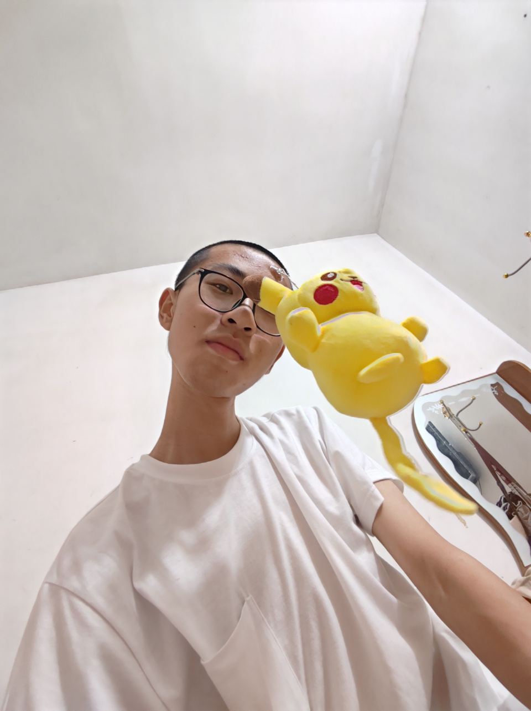
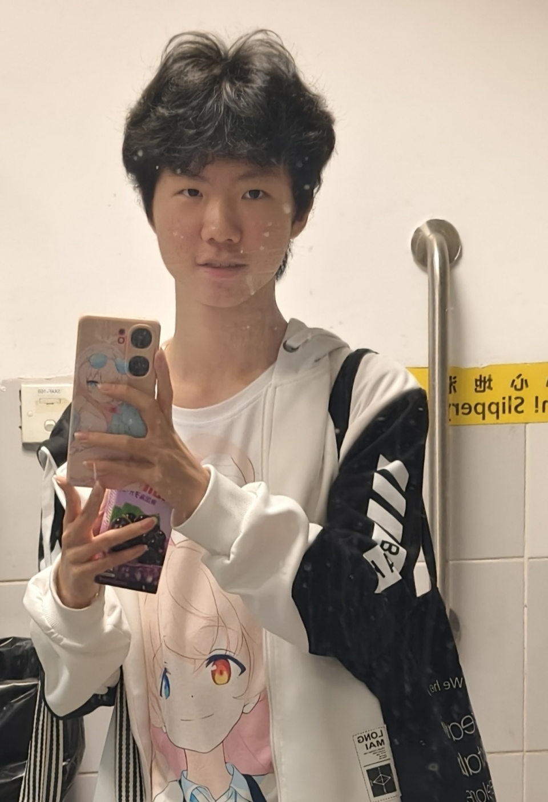

<!-- 导入聊天框功能 -->

<!-- 导入聊天框功能 -->

在 **2025 年 9 月 12 日**，飞桨开源社区正式启动了 **第六期启航计划集训营**。经过近三个月的学习、实践与协作，集训营已于 **12 月 10 日** 顺利完成全部计划，正式圆满结营 🎉。

<!-- more -->

在本期集训过程中，大部分营员均完成了 **三项热身打卡任务**，并逐步熟悉了飞桨开源社区的协作方式与贡献流程。同时，共有 **17 位营员**在热身打卡任务之外，**成功向飞桨开源仓库合入了 PR**，完成了从“学习者”到“贡献者”的关键一步，达到结营要求并顺利结营。在此，**衷心感谢每一位营员在启航计划中的投入与坚持**。你们的每一个 Issue，每一次 PR 修改，都是飞桨开源生态持续演进的重要组成部分。

在集训营的收官阶段，我们面向结营营员开放了**一、二、三等奖的申请**。所有候选人均于 **12 月 10 日**完成答辩展示，并由评委组从**贡献质量、开源参与度、技术深度**等多个维度进行了综合评估，最终产生以下获奖名单：

- 一等奖 廖雨菲（[@LiaoYFBH](https://github.com/LiaoYFBH)）
- 二等奖 谢润明（[@youge325](https://github.com/youge325)）
- 三等奖 杨晓春（[@Le-soleile](https://github.com/Le-soleile)）

**值得一提的是**，在本期启航计划中有一位年轻营员表现出色，同时也是 PFCC 例会最年轻的主席，展现出超前的技术潜力与开源精神。为此，我们特别增设 **「开源未来奖」** 授予杨阳（[@aztice](https://github.com/aztice)）。

> 答辩详情见：[第六期答辩安排](https://github.com/PFCCLab/Starter/issues/792)

> 目前所有结营名单已经公示，详情见：[「启航计划」第六期 结营考核公示](https://github.com/PFCCLab/Starter/issues/805)

再次祝贺以上获奖同学，以及所有顺利结营的营员 🥳感谢大家在启航计划中为飞桨开源社区做出的真诚投入与积极贡献！同时，也特别感谢助教**聂师傅**（[@Echo-Nie](https://github.com/PFCCLab/Starter/commits?author=Echo-Nie)）在整个集训周期中的全力支持与耐心陪伴。

## 听听获奖同学的结营感言

在本次启航计划期间，营员们围绕开源协作与技术实践，都积累了各自独特的体验与思考。

我们特别邀请了一等奖、二等奖、三等奖获得者，以及特殊奖项 **「开源未来奖」** 的获得者，一起分享他们在启航计划中的收获与感悟。

**廖雨菲 哈尔滨工程大学-控制科学与工程专业-研一**

<MessageBox>
   <Message name="廖雨菲" github="LiaoYFBH">
    我在本次飞桨启航计划中，主要的开发工作包括：部分 CUDA 算子单测修复与代码规范化；部分 Paddle、Torch 的 API 兼容对齐以及对齐后的功能验证；部分 Paddle 技术文档的规范化；以及利用 PP-StructureV3 对非结构化文档进行解析，并以此为知识库基座，结合 ERNIE 大模型构建了多文档智能分析与问答系统，并发布了相关的技术博客和星河社区应用。 
    对我来说，本次飞桨启航计划不仅是一次开源贡献的实践，更是一次从底层算子到上层应用的全栈技术穿透之旅。在这个过程中，我学习和理解了 Paddle 的一些底层算子，增强了对不同库的生态兼容性理解，熟悉了 RAG 系统的组成部分和搭建流程，并学会了站在用户的角度思考问题。经历了完整的代码评审流程，深刻感受到了代码规范性的重要。此外，我还体会到了团队协作的重要性，从代码评审到产品测试，离不开团队成员之间的细致配合。感谢飞桨启航计划为我提供的学习与锻炼机会，未来我会继续钻研技术，持续为社区开源贡献力量。

</Message>
</MessageBox>

**谢润明 四川大学-软件工程专业** **大三**

<MessageBox>
   <Message name="谢润明" github="youge325">
    在启航计划期间，我深入了解了 Paddle 框架的设计理念和开发流程，并积极参与多个开源任务，包括文档修复、PHI 算子库 CUDA Kernel 规范化、GPU 单测修复以及 API 兼容性增强等。此外，通过研发导师们的指导，我还完成了 Paddle 在 VS2022 上的编译适配，进一步增强了 Paddle 框架的易用性。 
    通过这次开源活动，我感受到了众多开发者的热情，并学会了如何高效地与团队成员沟通协作。从最初磕磕绊绊的 pre-commit，到后来从容不迫的 `/re-run all-failed`，每一次修复代码错误，都让我在实践中不断地提高自己。未来我将持续精进，为开源社区贡献更多力量。

</Message>
</MessageBox>

**杨晓春 哈尔滨工程大学-电气工程及其自动化-大三**

<MessageBox>
   <Message name="杨晓春" github="Le-soleile">
    上大学之后了解和使用过一些飞桨的工具和平台，对 AI Infra 方向很感兴趣，今年在学长推荐下了解了飞桨的启航计划开源活动。在本次启航计划中，我主要参与了 PaddlePaddle 框架的底层与生态建设工作。包括 CUDA 算子库的规范化治理，提升了算子代码的可维护性与标准化水平，完成了 PaddleMaterials 的数据适配工作，优化了数据加载与处理流程。接下来我会继续参与护航计划，进行 API 接口适配工作，致力于提升框架的兼容性与易用性。 
    这是我第一次参与开源项目，总体感觉就是导师们很包容、很热心、很厉害，同时也能增强自己的能力，学习到一些简单的开发必要流程和知识，希望有更多同学参与到飞桨的AI基建中。

</Message>
</MessageBox>

**Yeung 香港东华三院甲寅年总理中学-中四学生**

<MessageBox>
   <Message name="Yeung" github="aztice">
    启航计划期间，研究了不少有关 AI Infra 相关的知识，以及一套标准的 PR 流程，以前在 GitHub 时还未曾试过，例如 PR 的 Workflow、Review 等概念。通过这次计划也深入了解了 PaddlePaddle 库的不同 API，成功做出了 GitHub 生涯中的第一次 merged 的 PR，然后还有更多 PR……这些 PR 对我来说都非常重要，启航计划为我的开源生涯提供了一个非常完美的起点。

</Message>
</MessageBox>

## 周密的活动安排

本次启航计划线上集训营为期 **2 个月**，整体节奏安排如下，未参与过启航计划的同学也欢迎参考了解：

| **时间**                     | **日程**                               |
| ---------------------------- | -------------------------------------- |
| **2025.9.12**                | 正式启动报名                           |
| **2025.9.12 ~ 2025.9.26**    | 持续公开接收简历，确定营员名单         |
| **2025.9.28 19:00**          | 开营仪式，集训正式启动                 |
| **2025.9.28 ～ 2025.12.12**  | 参与集训项目（8 weeks）                |
| **2025.12.15 ～ 2025.12.19** | 申请并完成一、二、三等奖答辩（1 week） |
| **2025.12.22 23:59**         | 集训营结营，公布考核结果               |

在集训期间，我们通过**双周周报**持续跟进营员的开发进度，帮助大家在阶段性总结中及时查缺补漏。未按时提交周报的营员，将被视为自动退出集训营。

此外，助教聂师傅 [@Echo-Nie](https://github.com/PFCCLab/Starter/commits?author=Echo-Nie) 也会在每个双周周期内收集营员提出的问题，并由助教团队联合飞桨研发团队统一答疑，协助大家更好地推进项目。

| **时间**       | **日程**                                                    |
| -------------- | ----------------------------------------------------------- |
| **2025.10.10** | [第一期周报](https://github.com/PFCCLab/Starter/issues/672) |
| **2025.10.24** | [第二期周报](https://github.com/PFCCLab/Starter/issues/710) |
| **2025.11.07** | [第三期周报](https://github.com/PFCCLab/Starter/issues/743) |
| **2025.11.21** | [第四期周报](https://github.com/PFCCLab/Starter/issues/767) |

## 一些成果

本次启航计划线上集训营吸引了来自不同学校、不同背景的开发者参与，为飞桨开源项目的持续迭代注入了新鲜而稳定的贡献力量。

数字上的成果：

- **32 位营员** 共合入 **250 个「快乐开源」PR**，覆盖 Paddle、PaddleCustomDevice、docs 等多个核心仓库，以及 Agent 应用开发等多个方向。
- 其中 **30 位营员** 首次在飞桨开源仓库中合入 PR，正式成为飞桨新 contributor。
- **17 位营员** 满足结营要求并顺利通过考核，其中 **3 位优秀营员** 通过答辩，获得一、二、三等奖。

---

## 启航计划（社团版）

「**[启航计划（社团版）](https://github.com/PaddlePaddle/Paddle/issues/76500)**」是我们在本期启航计划中的一次全新尝试。

在以往的校园开源宣讲中，我们发现一个非常典型的场景：宣讲结束后，很多同学都会问——**“如果我现在就想开始做开源，有没有可以适合我立刻参与的方式？”**

为了不让这份热情停留在活动当天，我们希望给同学们一个 **“从现场直接走进真实开源实践”** 的通道。

因此，在 **11 月 21 日、24 日** 于 **西安电子科技大学** 与 **西安交通大学** 举办校园开源宣讲后，我们分别面向两所学校 **同步开启「启航计划（社团版）」**，让现场产生兴趣的同学可以不等待、不跳转，直接加入一个现成的开源训练营，迈出开源贡献的第一步。

> 西电&西交校园开源宣讲详情请看：[Open Source in Paddle:飞桨&西电&西交 “不设限” 交流活动](https://pfcclab.github.io/posts/xdu-xjtu-os)

### 社团版与常规启航计划的区别

相比常规的「启航计划」，**社团版更加轻量、节奏更快、反馈更直接**，更贴合校园场景与学生时间安排：

- **报名窗口仅 3 天，开发周期 1 个月**——节奏更快，体验更集中，反馈更及时
- **不设置一、二、三等奖答辩流程**，聚焦开源任务与真实贡献本身，而非竞赛形式

### 活动日程安排

以下是本期「启航计划（社团版）」的完整日程安排

| **时间**                     | **日程**                       |
| ---------------------------- | ------------------------------ |
| **202511.21**                | 正式启动报名                   |
| **2025.11.21 ~ 2025.11.24**  | 持续公开接收简历，确定营员名单 |
| **2025.11.25 19:00**         | 集训项目启动                   |
| **2025.11.25 ～ 2025.12.22** | 参与集训项目（4 weeks）        |
| **2025.12.22 23:59**         | 集训营结营，公布考核结果       |

### 一次“小而有效”的开源实践

虽然周期更短、规模更小，但本次社团版启航计划依然取得了**非常清晰的转化效果**。许多来自两所学校、充满热情的同学，正是通过这个契机，第一次成为飞桨开源社区的贡献者。

- **6 位营员**首次在飞桨开源仓库中成功合入 PR，正式成为飞桨新 contributor。
- **4 位营员**满足结营要求，顺利通过考核完成结营，并且其中相当一部分营员，在结营后仍继续参与更深入的开源开发任务。

> 目前所有结营名单已经公示，详情见：[「启航计划」社团版 结营考核公示](https://github.com/PFCCLab/Starter/issues/811)

## 最后

🎉恭喜以下所有顺利通过结营考核的营员！你们用实际行动完成了挑战，也为本期启航计划画上了圆满句号：[@Le-soleile](https://github.com/Le-soleile)、[@WanRui37](https://github.com/WanRui37)、[@scyyh11](https://github.com/scyyh11)、[@wanglezz](https://github.com/wanglezz)、[@LiaoYFBH](https://github.com/LiaoYFBH)、[@tjujingzong](https://github.com/tjujingzong)、[@youge325](https://github.com/youge325)、[@aztice](https://github.com/aztice)、[@algorithm1832](https://github.com/algorithm1832)、[@fsylmxx](https://github.com/fsylmxx)、[@xxiu1](https://github.com/xxiu1)、[@dakelong](https://github.com/dakelong)、[@SZTULDH](https://github.com/SZTULDH)、[@shiyuasuka](https://github.com/shiyuasuka)、[@123wjr](https://github.com/123wjr)、[@L-CXQD](https://github.com/L-CXQD)、[@wwaawwaaee](https://github.com/wwaawwaaee)、[@SidusAntares](https://github.com/SidusAntares)（社团版）、[@ADchampion3](https://github.com/ADchampion3)（社团版）、[@WHoutstanding](https://github.com/WHoutstanding)（社团版）、[@Forest-Lee](https://github.com/Forest-Lee)（社团版）

同时，也感谢所有报名并参与其中的同学。即使有部分营员因时间或其他原因未能通过本次考核，我们依然由衷感谢你们的投入与尝试，期待未来在飞桨或其他开源社区中再次见到你们的身影。之后可以关注 https://github.com/orgs/PaddlePaddle/projects/7 ，会不定期更新新的开源任务，参与即能锻炼技能，还有机会赢取开源小礼品～ 🏆

所以，下一期的启航计划，你心动了吗？💓
