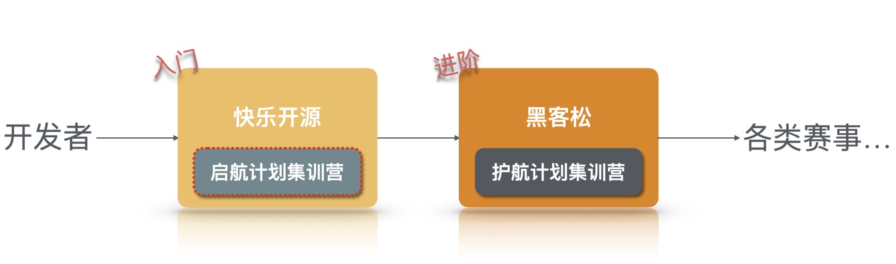
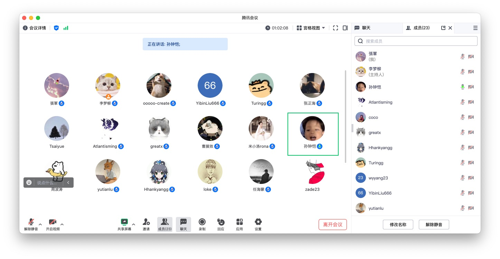
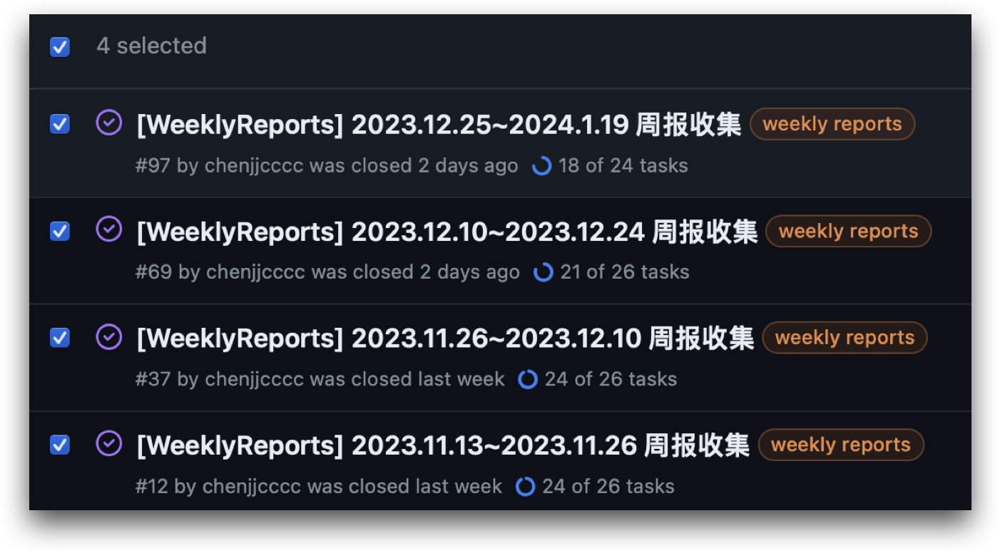
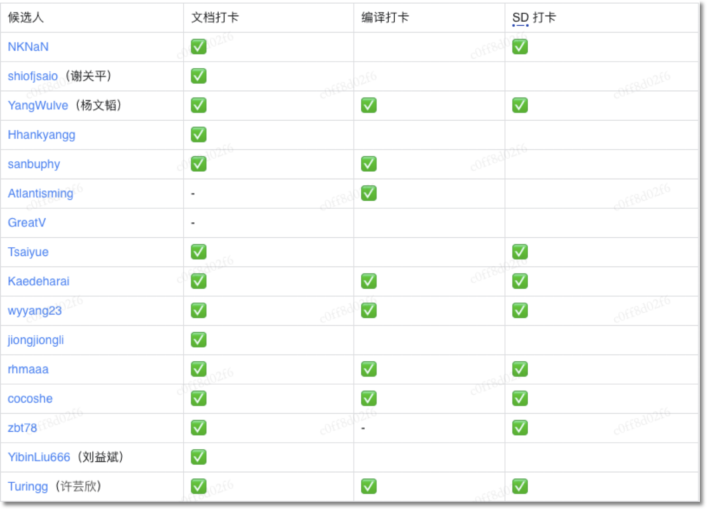
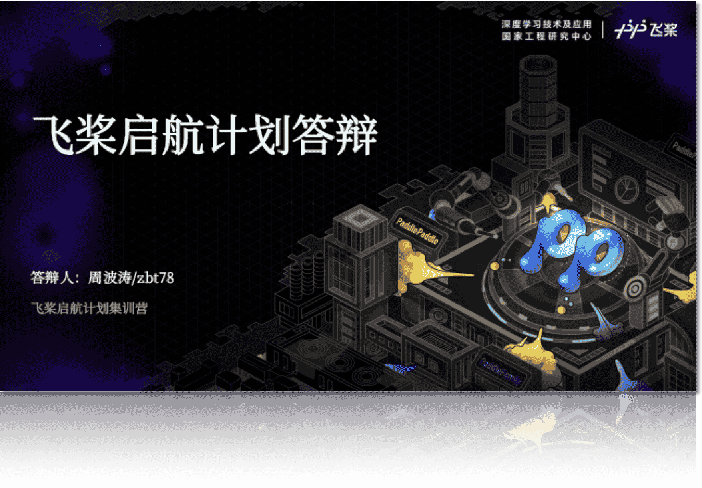
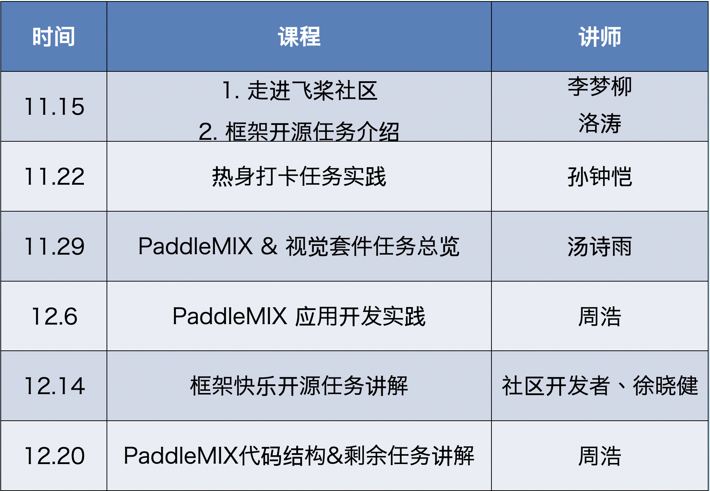
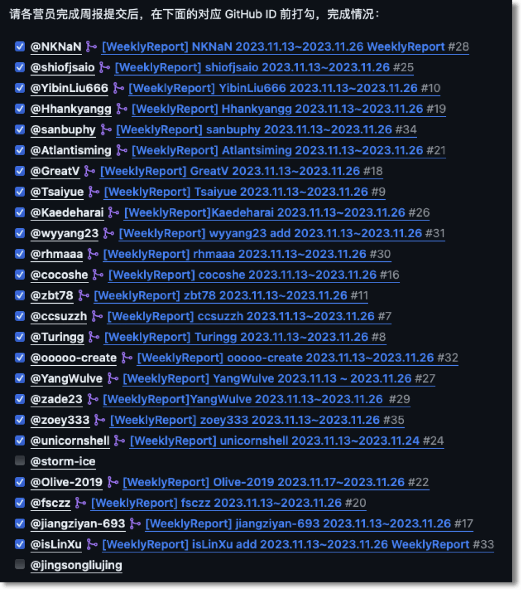
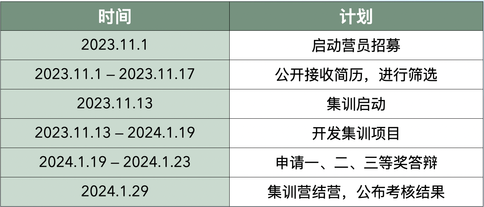
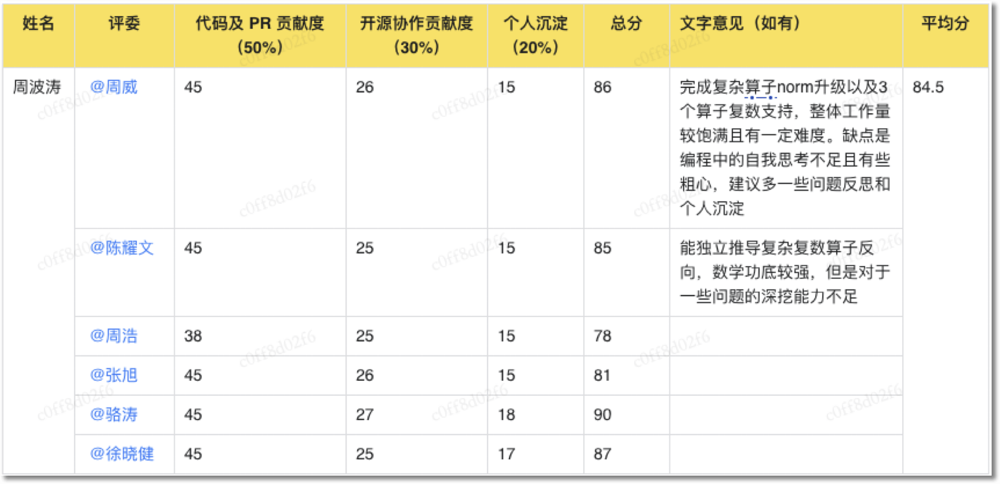
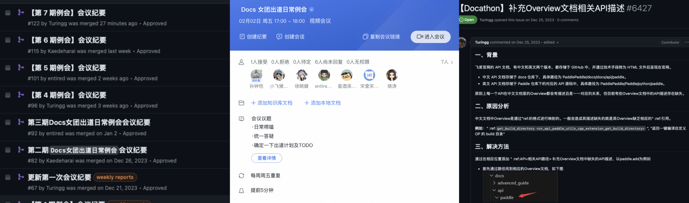

在 2023 年的 11 月 14 日，飞桨开源社区开启了一个新项目（~~新坑~~）—— **启航计划集训营**。经过为期两个月紧张而充实的集训后，启航计划集训营于 1 月 30 日 正式圆满完成所有集训计划。在集训期间，大家出色地完成了三项热身打卡任务，并且有 **19** 位营员合入了超过 **110** 个 PR。衷心感谢各位营员的积极参与和卓越贡献！在这里，也向开源社区的各位 **“汇报”** 一下活动情况～

<!-- more -->

## 01 - 启航计划是什么？

「启航计划」 是飞桨社区发起的**远程代码集训项目**，也是「[护航计划](https://github.com/PaddlePaddle/Paddle/issues/61006)」的前置活动。我们以开展为期 2 个月集训营的形式，鼓励开发者积极参与开发 2 个方向的**快乐开源任务**，以此提升自己的代码实践能力，与社区共同成长 💪。

-  [基础方向](https://github.com/PaddlePaddle/Paddle/issues/56689)：Paddle 核心框架 + Paddle CV 套件的快乐开源任务，将有机会参与社区里最轻松愉快的开源开发活动。
-  [大模型方向](https://github.com/PaddlePaddle/PaddleMIX/issues/272)：参与 PaddleMIX 跨模态大模型套件的快乐开源任务，将有机会接触社区里最前沿的大模型应用开发与工具建设。

> 活动详情见 Issue： [#58497](https://github.com/PaddlePaddle/Paddle/issues/58497)

### 与护航计划的区别？

-  不限定开发者背景，企业和学生开发者均可参与。
-  不进行面试，直接进行**简历筛选**。
-  集训内容为完成 **【快乐开源任务】**，合入 1 个 PR 即满足结营条件，相对轻松。
-  提供**高质量集训课程**，并以 PR review 交流的形式进行沟通，而非导师一对一带教的形式。
-  时间周期更短（2个月），门槛相对更低。

### 参与者需要做什么？

#### 1. 自选任务，并投递简历报名，通过筛选后即可入营。集训营持续2个月，上限 30 人。

-  共有 36 名候选人参与报名并投递简历。内部筛选后，最终通过 29 位学员。
-  入选学员中，22 名学生（电子科大、西交、杭电、浙大、清华…）、7 名企业开发者。
-  入选学员中，13 名 PFCC 成员，16 名新人。

> 入选营员：[@NKNaN](https://github.com/NKNaN)、[@shiofjsaio](https://github.com/shiofjsaio)、[@YangWulve](https://github.com/YangWulve)、[@Hhankyangg](https://github.com/Hhankyangg)、[@sanbuphy](https://github.com/sanbuphy)、[@Atlantisming](https://github.com/Atlantisming)、[@GreatV](https://github.com/GreatV)、[@Tsaiyue](https://github.com/Tsaiyue)、[@Kaedeharai](https://github.com/Kaedeharai)、[@wyyang23](https://github.com/wyyang23)、[@jiongjiongli](https://github.com/jiongjiongli)、[@rhmaaa](https://github.com/rhmaaa)、[@cocoshe](https://github.com/cocoshe)、[@zbt78](https://github.com/zbt78)、[@YibinLiu666](https://github.com/YibinLiu666)、[@Turingg](https://github.com/Turingg)、[@ooooo-create](https://github.com/ooooo-create)、[@ccsuzzh](https://github.com/ccsuzzh)、[@zade23](https://github.com/zade23)、[@challengewly](https://github.com/challengewly)、[@zoey333](https://github.com/zoey333)、[@unicornshell](https://github.com/unicornshell)、[@storm-ice](https://github.com/storm-ice)、[@YinKeYu](https://github.com/YinKeYu)、[@Olive-2019](https://github.com/Olive-2019)、[@fsczz](https://github.com/fsczz)、[@jiangziyan-693](https://github.com/jiangziyan-693)、[@isLinXu](https://github.com/isLinXu)、[@jingsongliujing](https://github.com/jingsongliujing)

#### 2. 按兴趣参与集训课程（一周一次）并按时提交双周周报。

-  以实际开发为导向，每周开展一次课程，总计安排 6 次课程。
-  营员每双周提交一次周报，追踪集训进展和计划，总计提交 4 期双周报。

    <figure style="width: 50%">
        
        <figcaption>课程以腾讯会议形式开展</figcaption>
    </figure>
    <figure style="width: 46%">
        
        <figcaption>周报截图</figcaption>
    </figure>

#### 3. 完成 3 个打卡任务，并至少合入 1 个快乐开源 PR。

-  打卡任务一：修改飞桨文档。25 人完成
-  打卡任务二：Paddle 本地编译。13 人完成
-  打卡任务三：跑通 SD 训练推理。15 人完成

    <figure style="width: 70%">
        
        <figcaption>热身任务打卡情况（部分）</figcaption>
    </figure>

#### 4. 结营期间，可自愿申请一、二、三等奖，并参加答辩。

-  共有 3 位营员申请（[@zbt78](https://github.com/zbt78)、[@Tsaiyue](https://github.com/Tsaiyue)、[@ooooo-create](https://github.com/ooooo-create)），并均顺利通过一、二、三等奖答辩。
-  一、二等奖获得者（[@zbt78](https://github.com/zbt78)、[@Tsaiyue](https://github.com/Tsaiyue)）当场**入选护航计划集训营**。

> 结营考核详情见 Issue：[#123](https://github.com/PFCCLab/Starter/issues/123)

    <figure style="width: 70%">
        
        <figcaption>答辩现场</figcaption>
    </figure>

### 飞桨官方提供什么？

#### 1. 开发导向的每周课程

-  由飞桨研发和 PM 根据营员的诉求和实际开发情况，来提供每周的课程。

    <figure style="width: 60%">
        
        <figcaption>课程安排</figcaption>
    </figure>

#### 2. 周报管理

-  助教负责对每双周的周报进行管理，确保提交周报的数量和质量。

    <figure style="width: 60%">
        
        <figcaption>其中一期周报提及截图</figcaption>
    </figure>

#### 3. 技术答疑

-  在微信群以及课程中，飞桨研发会针对营员的疑惑进行一一解答。
-  同时，会有热心、能力强的营员解答别人的问题。

#### 4. 活动运营支持

-  PM 和助教会对活动的各个环节提供支持，保障整体活动的顺利进行。

    <figure style="width: 60%">
        
        <figcaption>整体活动节奏</figcaption>
    </figure>

#### 5. 成绩评估

-  PM 和助教会根据结营要求，在结营期间对每位学员进行评估，判断是否满足结营条件。
-  针对一、二、三等奖的答辩，会邀请相应方向的研发导师进行评估。同时，这也是进入**护航计划的绝佳机会**，因为研发导师会有充足的时间来了解你～

    <figure style="width: 60%">
        
        <figcaption>研发导师评分表（部分）</figcaption>
    </figure>

## 02 - 活动成果

### 数字上的成果

1. 共有 **19** 位营员合入了超过 **110** 个快乐开源 PR。
2. 社区新加入 **11** 名 contributor。
3. **15** 名营员成功通过考核、顺利结营，**2** 名优秀营员入选护航计划。
4. [@cocoshe](https://github.com/cocoshe) 在开发过程中沉淀 1 篇《 PHI算子库kernel注册全流程源码阅读》。

### 数字背后的情况

> 1. 共有 **19** 位营员合入了超过 **110** 个快乐开源 PR。

完成 80+ 文档、15+ 新 IR 适配、15+ 静态图推全、 5+ cmake治理、 5+ 复数算子等等题目，文档相关任务约占总体完成任务的一半左右.

> 2. 社区新加入 **11** 名 contributor。

其中 7 名 contributor 只合入了一个文档相关 PR，活动后续缺少延续性。

> 3. **15** 名营员成功通过考核、顺利结营，**2** 名优秀营员入选护航计划。

考核通过的营员中，有 10 名是原 PFCC 成员，纯新人通过率不高（31%），猜测是启航计划的活动缺乏引导。

## 03 - 新的尝试——Docs偶像女团（精品小团）

### 是什么？

自愿参与文档开发、维护的社区化小团体，氛围活跃，开发意愿很积极。

### 由谁组成？

1. 3 名大二女生（2 名启航计划学员 [@Turingg](https://github.com/Turingg) [@Kaedeharai](https://github.com/Kaedeharai)，1 名社区开发者[@entired](https://github.com/entired)），主要负责开发和维护。
2. 1 名热心社区开发者（[O师傅](https://github.com/ooooo-create)，大三），负责日常手把手指导 3 名女生。
3. 2 名飞桨内部同学，负责维持团体运转、答疑解惑。

### 为什么组成这个团体？

集训期间，2位女生开发意愿比较强烈，但对具体做什么事情感到迷茫，因此孙师傅就把她们拉入（~~骗进~~）了docs小组。

### 运转机制？

-  **每周一次例会**，由 3 名女生轮流主持，主要通过每周开发进度、布置新任务，所有人必须参会。
-  **每周一次会议纪要**，由会议主持负责写会议内容和 Todo。
-  **如流群日常沟通交流**。

