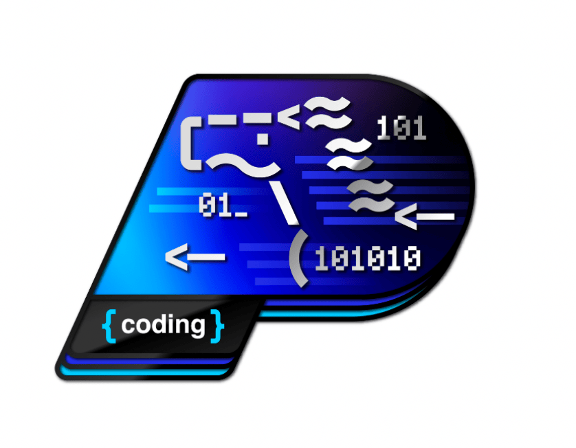

在 **2026 年 1 月 26 日**，飞桨开源社区正式启动了 **「启航计划」马年新春版** —— 一场为寒假与春节假期特别推出的限时开源集训。经过为期 **1 个月**快节奏的线上集训，活动已于 **3 月 9 日** 顺利完成全部计划，正式圆满结营 🎉。

<!-- more -->

本期启航计划是一次围绕 **新春假期** 量身打造的特别版集训，横跨春节假期，节奏更快、体验更集中。我们希望在年初相对集中的空闲时间里，为对开源感兴趣的开发者提供一个 **低门槛、可实践** 的参与机会——让大家在新的一年，迈出属于自己的 **第一步开源实践**。

在集训过程中，大部分营员均完成了 **三项热身打卡任务**（文档修复、Paddle 本地编译、FastDeploy 本地编译），并逐步熟悉了飞桨开源社区的协作方式与贡献流程。最终，共有 **17 位营员** 在热身打卡任务之外，成功向飞桨开源仓库合入了 PR，完成了从"学习者"到"贡献者"的关键一步，达到结营要求并顺利结营。**衷心感谢每一位营员在启航计划中的投入与坚持**，你们的每一次 PR 修改、每一次 issue 讨论，都是飞桨开源生态持续演进的重要组成部分。

> 目前所有结营名单已经公示，详情见：[「启航计划」马年新春版 结营考核公示](https://github.com/PFCCLab/Starter/issues/867)

## 优秀营员

与正常「启航计划」不同，马年新春版**不设一、二、三等奖答辩流程**，专注任务完成与成果产出。我们从贡献质量、开源参与度、技术深度等多个维度进行综合评估，最终评选出 **6 位优秀营员**：

| 优秀营员                                       | 亮点                                                                                                                                                                                          |
| :--------------------------------------------- | :-------------------------------------------------------------------------------------------------------------------------------------------------------------------------------------------- |
| [@Aidenwu0209](https://github.com/Aidenwu0209) | 合入 12 个非热身 PR；首创 PaddleOCR 官方 Claude Code Skill（文本识别 + 文档解析），从 0 到 1 开发全新任务形态；API 兼容性任务覆盖 10+ 子项，跨 Paddle / docs / PaConvert / PaddleOCR 4 个仓库 |
| [@tjujingzong](https://github.com/tjujingzong) | 合入 13 个非热身 PR（全营最多）；攻克高难度 XPU 0-size tensor 系列 PR，需深入理解 XPU kernel 与 GPU 行为差异；任务覆盖 CUDA Kernel、XPU、单测修复、API 兼容性等多个方向                       |
| [@Khoray](https://github.com/Khoray)           | 合入 3 个 API 兼容性 PR（全栈完成）；独立设计并开发了一套多媒体 OCR 搜索工具（FastAPI + PaddleOCR + Milvus 向量检索，端到端完成）                                                             |
| [@gravel-01](https://github.com/gravel-01)     | 深耕 PaddleOCR error_correction 项目核心开发（图像预处理模块，合入 4 个 PR）；撰写并发布图像预处理最佳实践 Blog；使用 OmniDocBench 数据集训练图像分类器                                       |
| [@HZ1ovo](https://github.com/HZ1ovo)           | 发起文档链接修复任务 [issue #7735](https://github.com/PaddlePaddle/docs/issues/7735)，拆分为 126 个子任务供全营参与；积极参与 issue 管理与 PR review，协助其他营员解决问题                    |
| [@MerlinSMQWQ](https://github.com/MerlinSMQWQ) | 合入 3 个 API 兼容性 PR；沉淀编译排错文档帮助其他营员；与 [@OctoberPrayRain](https://github.com/OctoberPrayRain) 协作开发 RainyOCR 屏幕文字 OCR 项目                                          |

优秀营员将进入 **「护航计划」候选池**，并获得 **马年飞桨开源社区特别徽章**。

    <figure style="width: 50%">
        
        <figcaption>马年飞桨开源社区特别徽章设计图</figcaption>
    </figure>

## 周密的活动安排

本期启航计划线上集训营为期 **1 个月**（横跨春节期间），以双周周报的形式进行阶段性汇报总结。整体安排如下，未参与过启航计划的同学也欢迎参考了解：

| **时间**                 | **日程**                       |
| :----------------------- | :----------------------------- |
| **2026.1.26**            | 正式启动报名                   |
| **2026.1.26 ~ 2026.2.5** | 持续公开接收简历，确定营员名单 |
| **2026.2.6 19:00**       | 集训项目启动                   |
| **2026.2.6 ～ 2026.3.9** | 参与集训项目（4 weeks）        |
| **2026.3.9 23:59**       | 集训营结营，公布考核结果       |

在集训期间，我们通过**双周周报**持续跟进营员的开发进度，帮助大家在阶段性总结中及时查缺补漏。未按时提交周报的营员，将被视为自动退出集训营。

| **时间**      | **日程**                                                        | **提交情况**                           |
| :------------ | :-------------------------------------------------------------- | :------------------------------------- |
| **2026.2.22** | [第一次周报收集](https://github.com/PFCCLab/Starter/issues/812) | **24 / 31** 人提交（提交率 **77.4%**） |
| **2026.3.9**  | [第二次周报收集](https://github.com/PFCCLab/Starter/issues/841) | **21 / 24** 人提交（提交率 **87.5%**） |

本期集训的任务方向涵盖多个技术领域：

| **开源贡献 repo**         | **任务方向**                             | **导师**                                           |
| :------------------------ | :--------------------------------------- | :------------------------------------------------- |
| PaddleMaterials           | 数据集适配                               | [@leeleolay](https://github.com/leeleolay)         |
| GraphNet                  | 计算图收集                               | [@JewelRoam](https://github.com/JewelRoam)         |
| Paddle / PaConvert / docs | API 兼容性增强                           | [@zhwesky2010](https://github.com/zhwesky2010)     |
| PaddleOCR                 | PaddleOCR + ERNIE 高价值开源项目案例征集 | [@openvino-book](https://github.com/openvino-book) |

## 一些成果

本期马年新春版启航计划吸引了来自不同学校、不同背景的 **31 位开发者** 报名参与，虽然开发周期仅有短短一个月，但大家用实际行动交出了一份令人欣喜的答卷。

**数字上的成果：**

- **31 位营员** 报名参与 → **24 位** 提交首次周报 → **21 位** 坚持到第二次周报 → **17 位** 满足结营要求并顺利通过考核，其中 **6 位** 被评为优秀营员
- 全体结营营员累计向飞桨相关开源仓库合入 **86 个** PR，贡献覆盖 **Paddle、docs、PaConvert、PaddleOCR、GraphNet、FastDeploy** 等多个核心仓库
- 贡献最活跃的营员 [@Aidenwu0209](https://github.com/Aidenwu0209) 合入了 **22 个** PR，[@tjujingzong](https://github.com/tjujingzong) 合入了 **18 个** PR
- [@HZ1ovo](https://github.com/HZ1ovo) 发起的文档链接修复 [issue #7735](https://github.com/PaddlePaddle/docs/issues/7735) 拆分为 **126 个子任务**，带动多位营员共同参与

## 最后

🎉恭喜以下所有顺利通过结营考核的营员！你们用实际行动完成了挑战，在这个新春假期为飞桨开源社区写下了浓墨重彩的一笔：[@Aidenwu0209](https://github.com/Aidenwu0209)、[@tjujingzong](https://github.com/tjujingzong)、[@Khoray](https://github.com/Khoray)、[@MerlinSMQWQ](https://github.com/MerlinSMQWQ)、[@SidusAntares](https://github.com/SidusAntares)、[@HZ1ovo](https://github.com/HZ1ovo)、[@BayesianAura](https://github.com/BayesianAura)、[@Carousel126](https://github.com/Carousel126)、[@chengchen512](https://github.com/chengchen512)、[@darkerkiller](https://github.com/darkerkiller)、[@lywlyw2004](https://github.com/lywlyw2004)、[@cvbret](https://github.com/cvbret)、[@gravel-01](https://github.com/gravel-01)、[@aotenjou](https://github.com/aotenjou)、[@Chloris-001](https://github.com/Chloris-001)、[@inaniloquentee](https://github.com/inaniloquentee)、[@OctoberPrayRain](https://github.com/OctoberPrayRain)

同时，也感谢所有报名并参与其中的同学。即使有部分营员因时间或其他原因未能通过本次考核，我们依然由衷感谢你们的投入与尝试，期待未来在飞桨或其他开源社区中再次见到你们的身影。之后可以关注 https://github.com/orgs/PaddlePaddle/projects/7 ，会不定期更新新的开源任务，参与即能锻炼技能，还有机会赢取开源小礼品～ 🏆

所以，下一期的启航计划，你心动了吗？💓
