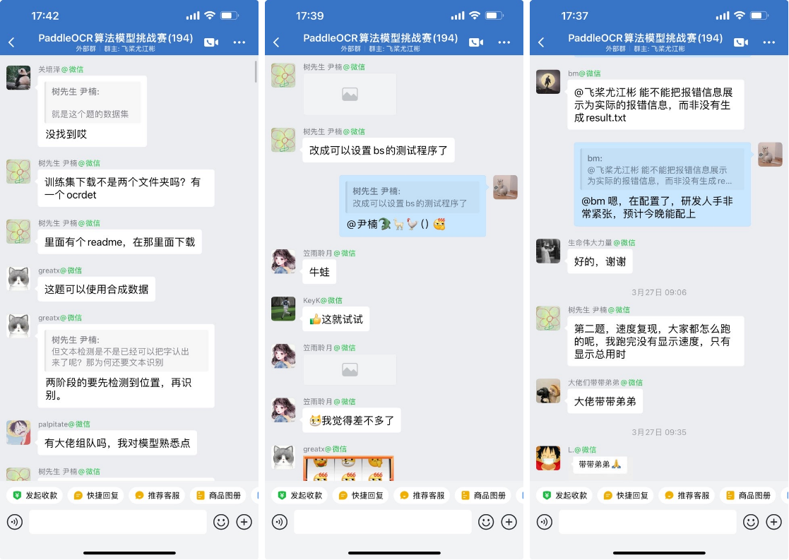
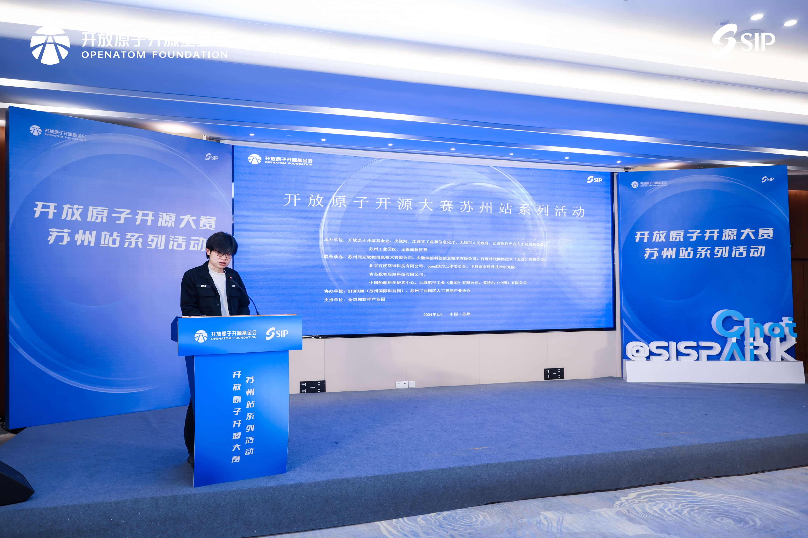
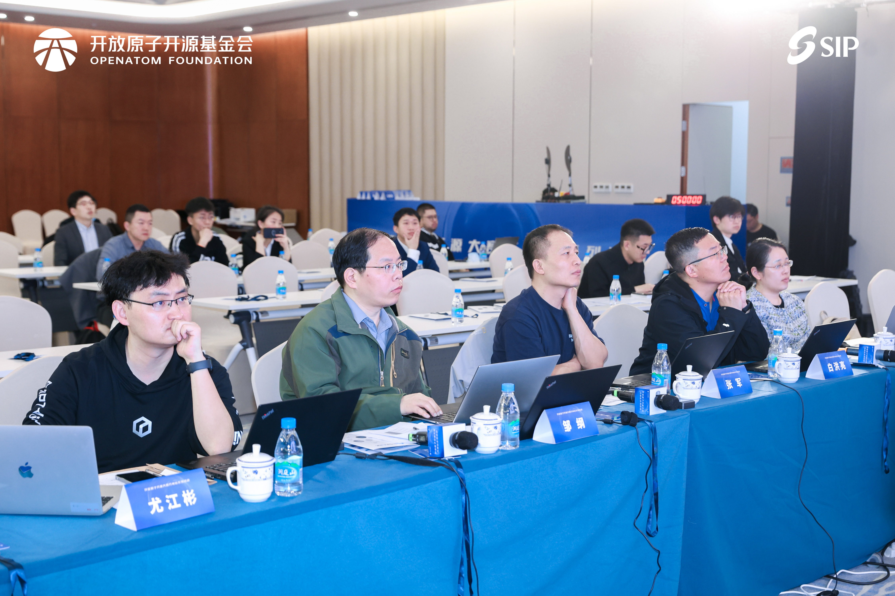
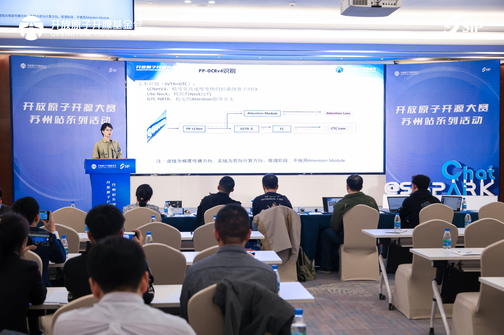
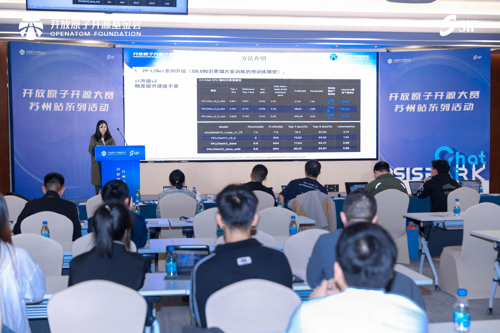
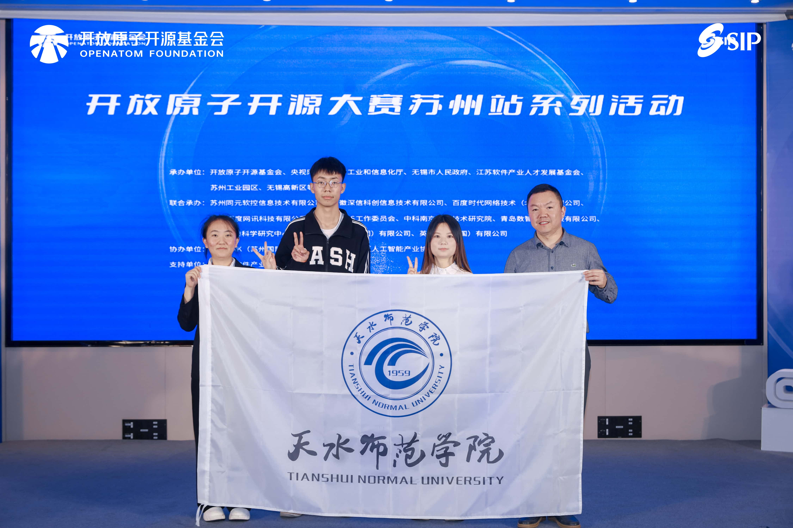
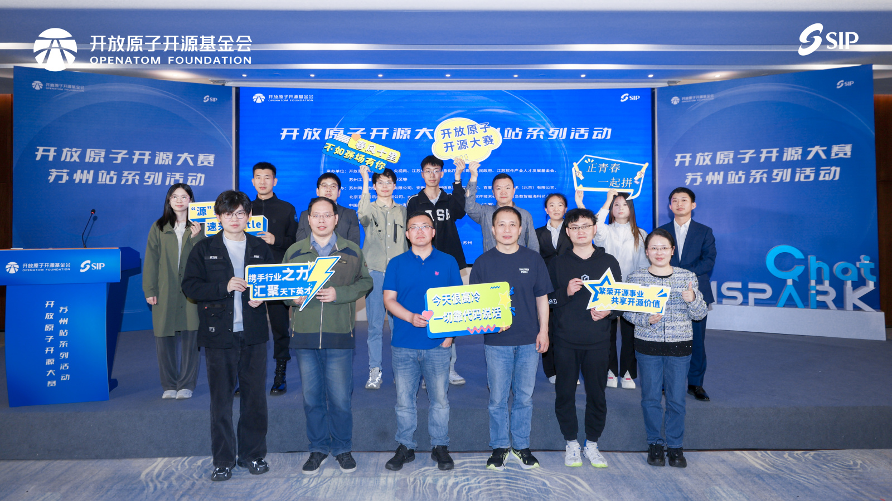

2024 年 4 月 12 日，[开放原子开源大赛 PaddleOCR 算法模型挑战赛](https://competition.atomgit.com/competitionInfo?id=d25e62a0d7f27876a8c4219bfc0be90e) 决赛路演在苏州工业园区人工智能产业园 G1 栋 3 楼会议中心顺利举行，并取得圆满成功！🎉价值 15 万元的大奖花落谁家？选手们的技术方案有多硬核？快来看看吧~

<!-- more -->

## 大赛背景

[开放原子开源基金会](https://www.openatom.org/about) 是致力于推动**全球开源事业**发展的非营利机构。其目标是搭建面向全球开源领域的前沿技术竞争、优秀人才选拔创新成果展示、商业转化引导和对接交流合作平台，广泛传播开源文化、普及开源知识、推广开源项目、提升开源技能，为推进**全球开源生态繁荣**和**可持续发展**提供动力。

百度飞桨开源社区与开放原子开源基金会的目标和愿景有高度的重合，因此自然而然地达成了合作办赛的意向。继 2023 年百度飞桨联合开放原子共建了「飞桨 PaddlePaddle 开源贡献挑战赛」后（大赛回顾请看 [这里](https://pfcc.blog/posts/wuxi-kaifangyuanzi)），这次飞桨团队再度受邀，发布了「PaddleOCR 算法模型挑战赛」。PaddleOCR 算法模型挑战赛包括两道赛题，分别是 OCR 端到端识别任务与通用表格识别任务，要求选手在 PaddleOCR 的基线模型之上，尽可能提升模型精度，同时保证模型的推理速度与基线模型相当（降速不超过 10%）。

赛题有一定难度，但同时奖金也颇为丰厚🤩：

- 赛题一：OCR 端到端识别任务
  - 一等奖：1 支队伍，每支队伍奖金 15 万元
  - 二等奖：1 支队伍，每支队伍奖金 4 万元
  - 三等奖：1 支队伍，每支队伍奖金 1 万元
  - 开源贡献奖：7 支队伍，荣誉证书
- 赛题二：通用表格识别任务
  - 一等奖：1 支队伍，每支队伍奖金 7 万元
  - 二等奖：1 支队伍，每支队伍奖金 2 万元
  - 三等奖：1 支队伍，每支队伍奖金 1 万元
  - 开源贡献奖：7 支队伍，荣誉证书

## 赛程回顾

大赛从 1 月 15 日上线，启动报名。经过两个半月的紧张打榜后，于 3 月 31 日正式封榜。经过代码审查与线上初审后，最终在 4 月 12 日在美丽的苏州工业园区举行了决赛路演。

在打榜过程中，选手们在官方交流群中积极讨论，互帮互助，还不忘给官方提需求😅。

热心选手树先生，无私贡献了针对赛题二快速测试模型精度的脚本，得到了群友们的一致好评！开源精神拉满了！😉

赛题一 B 榜阶段，选手反馈能不能把报错信息展示为实际的报错信息，而不是简单的"没有生成 result.txt"，这样才好定位并解决问题。飞桨运营同学快速评估并作出反应，认为这是一个很合理的需求，必须安排！奈何研发人手实在是紧张，直到午夜 1 点多，才完成改动并上线，保证了选手们顺利通关 B 榜。飞桨的研发小姐姐很拼有木有！✊

最终，**大赛共报名 211 支团队，总人数达到空前的 671 人。** 不过由于赛题本身还是有一定难度，**最后 10 支队伍提交了作品，8 支队伍通过了代码审查，5 支队伍入围了决赛答辩。**

> 飞桨官方的模型已经很强了，要在此基础上继续提分，还得保证推理速度不下降，真的**很难**。👿 ———— 某个不愿透露姓名的选手

## 路演现场

孙师傅被我抓去现场当主持人，那叫一个专业！😄

我则有幸抱住军哥和涛姐的大腿，当了一回评审。😎

选手们的答辩也十分精彩！复旦大学的杜永坤和北京交通大学的赵苗苗，分别针对赛题一和赛题二的模型架构进行了多方面的优化，可以说相当硬核。两位也分别摘得两个赛题的一等奖桂冠，实至名归！

令人印象深刻的是，赛题二的「识别先锋」队，是天水师范大学的吴衡老师带领三个本科生来参赛，还都是 AI Studio 的忠实用户🤗。尽管他们的显卡资源并不充裕（据说只有几张消费级显卡），但依然阻止不了他们的参赛热情。在他们的脸上，有一丝羞怯，也洋溢着激动和开心。我从他们身上看到了开源的魅力。

路演结束，大合照来一张。

## 获奖情况

经过紧张的路演和现场打分，最终决出了我们两个赛题的获奖队伍，如下表所示。

| 赛题   | 奖项       | 团队名称（括号内为 AI Studio 团队名）    | 仓库地址                                                     |
| ------ | ---------- | -------------------------------------- | ------------------------------------------------------------ |
| 赛题一 | 一等奖     | openocr                                | https://atomgit.com/paddleocr_competition/openocr            |
| 赛题一 | 二等奖     | zjj421                                 | https://atomgit.com/paddleocr_competition/zjj421             |
| 赛题二 | 一等奖     | ocr 识别队（珍珠小田田的团队）          | https://atomgit.com/paddleocr_competition/ocr_recognition    |
| 赛题二 | 二等奖     | 识别先锋（dudekenny 的团队）            | https://atomgit.com/paddleocr_competition/RecognitionPioneer |
| 赛题二 | 三等奖     | 豆没有皮吖                             | https://atomgit.com/paddleocr_competition/doumeiyoupiya      |
| 赛题二 | 开源贡献奖 | 树先生                                 | https://atomgit.com/paddleocr_competition/Mr.Tree            |
| 赛题二 | 开源贡献奖 | 几支孤鸭嘎嘎嘎（两只孤鸭嘎嘎嘎的团队） | https://atomgit.com/paddleocr_competition/duckgaga           |
| 赛题二 | 开源贡献奖 | 长城信息（飞行的的团队）               | https://atomgit.com/paddleocr_competition/GreatWallInfo_task2 |

恭喜所有的获奖队伍！🎉🎉🎉你们都是开源创新之路上的佼佼者！🚀🚀🚀

## PaddleOCR 开源共建研讨会

路演结束之后，距离午饭还有一段时间。我们便借着这个机会，邀请了参赛选手们举行了一场主题为「PaddleOCR 开源共建」的研讨会。

军哥表达了希望能够以 PaddleOCR 作为试点项目，启动飞桨开源项目社区化治理的想法。纵观国际上优秀的开源项目，都是由社区驱动的，而国内的很多开源项目，却往往只由某一家公司主导，这样其实不利于开源项目的可持续发展。大家纷纷表示了认同，但也提出了国内**拿来主义盛行、开发者生存压力大、做开源只能用爱发电**等现实的问题。

虽然在国内开源项目的纯社区化治理道阻且艰，但飞桨团队还是要积极推动尝试。如果做成了，将是非常有意义的一件事。👊

> 大家讨论的太入神，都忘记拍照留念了 😭
