本篇博客旨在讲解论文 **《DeepSeek-R1: Incentivizing Reasoning Capability in LLMs via Reinforcement Learning》** ，如有错误，欢迎指正。

<!-- more -->

## 1. 引入

近年来，大型语言模型（LLMs）正在经历快速迭代和演进，逐渐缩小了通往通用人工智能（AGI）的差距。OpenAI 的 o1 系列发布是一个里程碑事件，o1 系列强大的推理能力让人们看到了预训练（Pre-Training）和微调（Supervised Fine-Tuning）以外的模型优化方式。先前很多工作探索了强化学习以及蒙特卡洛树搜索和束搜索等搜索算法等，但是都没有达到 OpenAI 的 o1 系列模型相当的一般推理性能。

> OpenAI 的 o1 系列的技术要点主要包括**策略初始化、奖赏设计、搜索和学习**，具体可以查阅参考资料[1]

《DeepSeek-R1》成功探索出用纯强化学习（RL）提高语言模型推理能力的路径。具体而言，《DeepSeek-R1》研究的重点是在没有任何监督数据的情况下发展推理能力的潜力，重点关注它们通过纯 RL 过程的<u>自我演化</u>。

由此《DeepSeek-R1》使用 **DeepSeek-V3-Base** 作为基础模型，并采用 GRPO 作为强化学习框架，以提高模型在推理方面的性能，通过这单阶段的强化学习过程得到了 **DeepSeek-R1-Zero** 模型，DeepSeek-R1-Zero 在训练过程中涌现了"Aha moment"现象，并有强大的推理能力，但是存在着可读性差和语言混合等挑战。为了解决这些问题并进一步提高推理性能，《DeepSeek-R1》使用了少量冷启动数据和多阶段训练阶段，得到最终性能和 OpenAI-o1-1217 相当的 **DeepSeek-R1** 模型。同时《DeepSeek-R1》探索了提升小模型推理能力的方式，发现在小模型上使用 **蒸馏(Distillation)** 效果优于直接使用强化学习。

> 为了更好地理解自我演化（self-evolution），可以参考 InstructGPT[2] 中提出的 RLHF（Reinforcement Learning from Human Feedback）。RLHF 通过利用人类反馈进行强化学习训练，帮助模型不断优化和提升推理能力。

下面是《DeepSeek-R1》的贡献&工作总结表：

|         模型         | 贡献重点                                              | 区别与优势                                     |
| :------------------: | :---------------------------------------------------- | :--------------------------------------------- |
| **DeepSeek-R1-Zero** | 直接应用强化学习（RL）于基础模型，无需监督微调（SFT） | 展示自我验证、反思和长链式思维（CoT）能力      |
|   **DeepSeek-R1**    | 包含两个强化学习阶段和两个监督微调阶段                | 改进推理模式并与人类偏好保持一致               |
| **Distilled Model**  | 大型模型的推理模式成功蒸馏至小型模型                  | 发现在小模型上使用蒸馏效果优于直接使用强化学习 |

## 2. 研究方法

在接下来的部分中，将介绍：**2.1** DeepSeek-R1-Zero，它直接将强化学习应用于基础模型，而没有任何 SFT 数据；**2.2** DeepSeek-R1，它从一个经过数千个长链思维（Long CoT）示例微调的 checkpoint 开始应用强化学习；**2.3** 从 DeepSeek-R1 中蒸馏推理能力到小型密集模型

### 2.1 DeepSeek-R1-Zero

DeepSeek-R1-Zero 探索了大型语言模型在没有任何监督数据的情况下发展推理能力的潜力，重点关注通过纯粹的强化学习过程进行自我演化。如图 1，在训练流程上，DeepSeek-R1-Zero 很简单，使用基于规则的 Reasoning Data 进行纯强化学习，这里面涉及到三个重点：**强化学习范式**、**Reasoning Data 构造**和**有趣的实验发现**。

    <figure style="width: 100%;">
        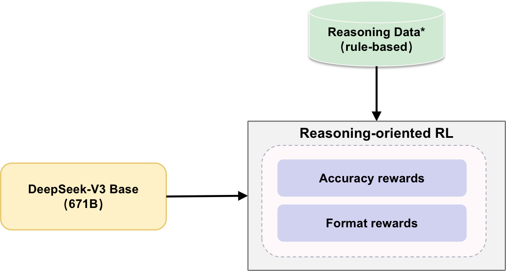
        <figcaption style="text-align: center;">图1：DeepSeek-R1-Zero的训练流程, 基础模型直接通过强化学习进行训练</figcaption>
    </figure>

#### 2.1.1 强化学习范式

**从 PPO 到 GRPO**

    <figure style="width: 100%;">
        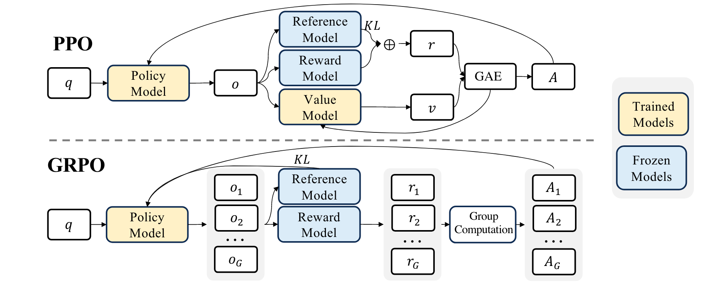
        <figcaption style="text-align: center;">图2：PPO和GRPO对比图[4]</figcaption>
    </figure>

PPO（Proximal Policy Optimization）是一种常用的强化学习算法，能够在策略优化中保持稳定性和效率。特别地，在大语言模型场景下，它通过最大化以下目标来优化LLMs：

    <figure style="width: 100%;">
        
    </figure>

不要看公式复杂，这里是想让优势 $A$ 越大越好的同时约束新的参数 $\theta$ 和旧的参数 $\theta_{\text{old}}$ 不要相差太远。其中 $\text{clip} = \max(\min(\frac{\pi_{\theta}}{\pi_{\theta_{\text{old}}}}, 1+\epsilon), 1-\epsilon)$，即把 $\frac{\pi_{\theta}}{\pi_{\theta_{\text{old}}}}$ 的值限制在 $1-\epsilon$ 和 $1+\epsilon$ 之间。如果 $A$ 为正，那么说明当前动作价值高于平均，最大化式子会增大 $\frac{\pi_{\theta}}{\pi_{\theta_{\text{old}}}}$，但是不会超过 $1+\epsilon$，如果 $A$ 为负，说明当前动作价值低于平均，最大化式子会减小 $\frac{\pi_{\theta}}{\pi_{\theta_{\text{old}}}}$，但是不会超过 $1-\epsilon$。下面是李宏毅老师[3]的讲解视频中的截图，可以参考：

    <figure style="width: 100%;">
        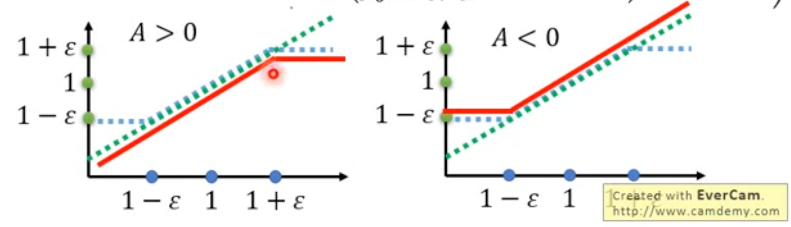
        <figcaption style="text-align: center;">图3：PPO clip值范围示意图[3]</figcaption>
    </figure>

PPO 在大语言模型中的整体流程包括以下几个关键组件：

1. **策略模型（Policy Model）**：负责生成动作的模型，基于当前状态选择最优动作。PPO 通过优化策略模型的参数来提高策略的表现。对应公式中的 $\pi_{\theta}$。

2. **参考模型（Reference Model）**：用于对比和评估策略模型的表现，确保新策略不会偏离旧策略太多，从而维持训练的稳定性。对应公式中的 $\pi_{\theta_{\text{old}}}$。

3. **奖励模型（Reward Model）**：用于评估每个动作的好坏，提供反馈信号以指导策略模型的优化。奖励信号通常基于任务的具体目标进行设计。对应公式中的 $r$。

4. **值模型（Value Model）**：用于估计给定状态的价值，帮助策略模型更好地评估未来的奖励。值模型通过最小化预测误差进行更新。对应公式中的 $v$。

5. **广义优势估计（GAE, Generalized Advantage Estimation）**：用于计算每个状态-动作对的优势函数，结合了即时奖励$r$和未来奖励$v$的折现和估计，提供更稳定的优势信号。最终能得到优势 $A$。

其中 Value Model 通常适合 Policy Model 差不多参数量的模型，这对显存和计算带来了额外的开销，同时在大语言模型场景下，通常只是最后一个 token 计算 reward，这可能会加大考虑所有 token 的 Value Model 的训练难度。

因此在 **GRPO（Group Relative Policy Optimization）** 中直接去除了 Value Model，这对应的带来了另一个问题：如何评估未来的奖励？GRPO 的做法是利用多次采样取平均 reward 的方式实现这个效果。GRPO 从旧策略 $\pi_{\theta_{\text{old}}}$ 中采样一组输出 $\{o_1, o_2, \ldots, o_G\}$，然后通过最大化以下目标来优化策略模型 $\pi_{\theta}$。

    <figure style="width: 100%;">
        
    </figure>

其中 $\epsilon$ 和 $\beta$ 是超参数，$A_i$ 是优势，使用一组奖励 $\{r_1, r_2, \ldots, r_G\}$ 计算得出，这些奖励对应于每组内的输出：

    <figure style="width: 100%;">
        
    </figure>

$A_i$随着 Value Model 的消失，计算方式也变得更为简单，就是简单的均值方差计算。

**奖励函数**

在强化学习中奖励的设计至关重要，**DeepSeek-R1-Zero**中设计了基于规则（rule-based）的奖励系统，该系统主要包含一下两种奖励的类型：

- **准确性奖励（Accuracy rewards）**：准确性奖励模型评估响应是否正确。例如，在具有确定性结果的数学问题中，模型需要以指定格式（例如，在方框内）提供最终答案，从而实现基于规则的可靠正确性验证。类似地，对于 LeetCode 问题，可以使用编译器根据预定义的测试用例生成反馈。
- **格式奖励（Format rewards）**：除了准确性奖励模型之外，还使用了一个格式奖励模型，该模型强制模型将思考过程放在"`<think>`"和"`</think>`"标签之间。

《DeepSeek-R1》没有在开发 DeepSeek-R1-Zero 中应用结果或过程神经奖励模型（outcome or process neural reward model），因为《DeepSeek-R1》通过实验发现神经奖励模型在大型强化学习过程中可能会遭受奖励黑客攻击，而重新训练奖励模型需要额外的训练资源，并且会使整个训练流程变得复杂。

> 结果或过程神经奖励模型（outcome or process neural reward model）是 LLM 强化学习中常用的奖励设计，可以通过下面的图发现和 rule-based 奖励的区别在于：神经奖励模型通过最终的结果来提供反馈（二元值，0 错 1 对），而规则型奖励则基于预定义的固定规则进行评估（可以是百分比）。

    <figure style="width: 100%;">
        
        <figcaption style="text-align: center;">图 4：ORM 和 PRM 示意图[1]</figcaption>
    </figure>

#### 2.1.2 Reasoning Data 构造

数据构造的重点是数据的形式和构造方式，《DeepSeek-R1》使用了下面的训练模板（Training Template）作为 prompt 构造数据，不过具体用的哪个模型生成没有说。在 DeepSeek-R1-Zero 阶段，用来生成 Long CoT 的都是有明确答案的 reasoning data。

    <figure style="width: 100%;">
        
        <figcaption style="text-align: center;">图 5：训练模板</figcaption>
    </figure>

#### 2.1.3 有趣的实验现象

**Aha Moment**

在 DeepSeek-R1-Zero 训练过程中观察到一个有趣的现象：**"Aha Moment"**。模型能够在推理过程中能发现自己的错误，并继续思考纠正这个错误，这是以往 SFT 没有出现的能力。

> 按照论文，训练过程中并没有使用包含自我纠错格式的数据，因此"Aha Moment"的出现属于数据分布外的现象，证明了强化学习能够带来意想不到的推理能力提升。

    <figure style="width: 100%;">
        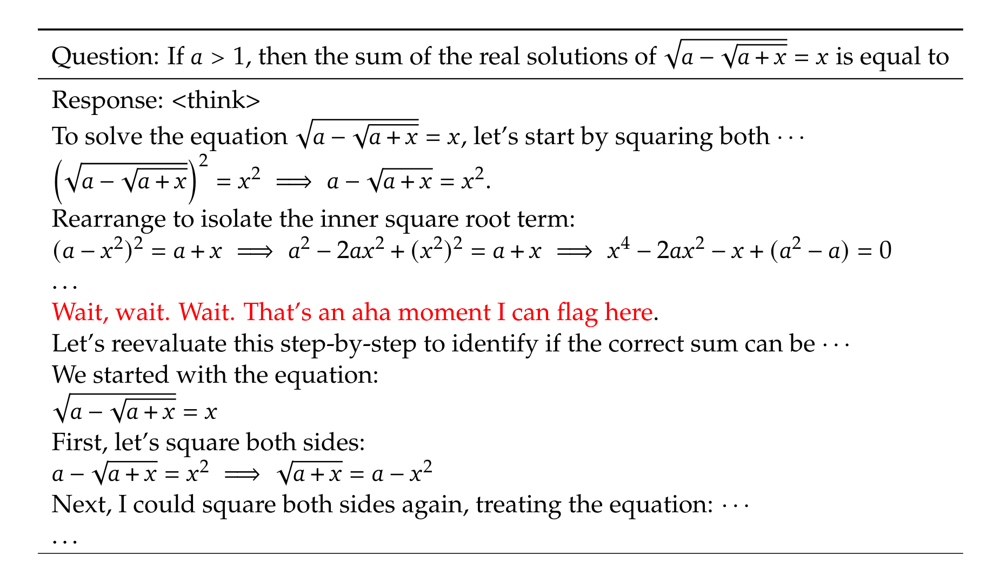
        <figcaption style="text-align: center;">图6：Aha Moment</figcaption>
    </figure>

**自进化过程**

随着训练的深入，模型的思考时间逐渐增加。这一进步并非源于外部调整，而是模型自我发展的结果。DeepSeek-R1-Zero 通过延长测试时间，自然地提升了解决复杂推理任务的能力。自我进化的一个显著特征是，随着测试时间和计算量的增加，**复杂行为自然涌现**。例如，模型会自发反思，重新审视和评估先前的步骤，并探索解决问题的替代方法。这些行为并非通过显式编程实现，而是模型与强化学习环境交互的结果。

    <figure style="width: 100%;">
        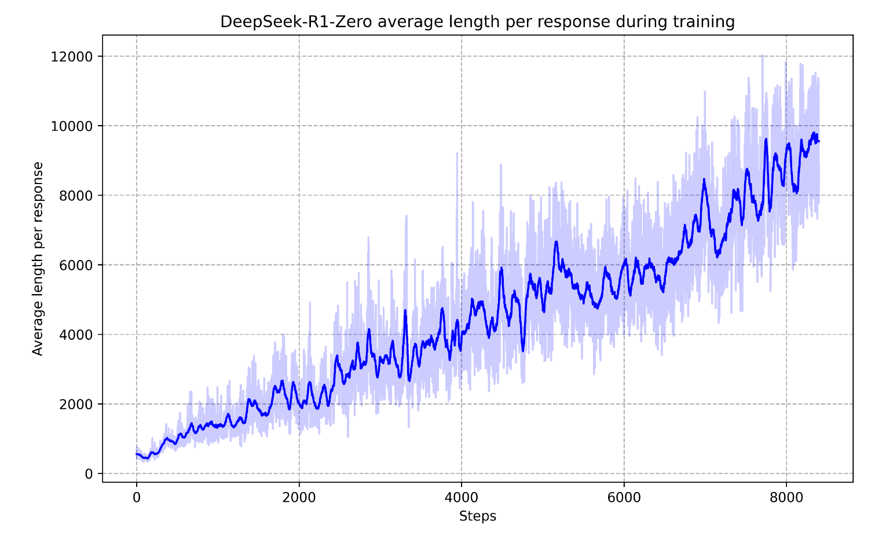
        <figcaption style="text-align: center;">图7：在RL过程中，DeepSeek-R1-Zero在训练集上的平均响应长度。DeepSeek-R1-Zero自然地学会了用更多的思考时间来解决推理任务。</figcaption>
    </figure>

**优越的推理性能**

下图展示了 DeepSeek-R1-Zero 在数学和代码 benchmark 上的优异性能，整体 reasoning 能力超越了 OpenAI-o1-0912。

    <figure style="width: 100%;">
        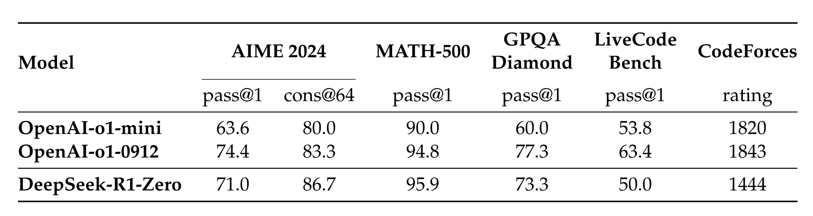
        <figcaption style="text-align: center;">图8：DeepSeek-R1-Zero和OpenAI o1模型在推理相关基准上的比较</figcaption>
    </figure>

下图展示了随着训练的进行，在 AIME benchmark 的准确度在不断提升，表明持续训练带来的有效性。

    <figure style="width: 100%;">
        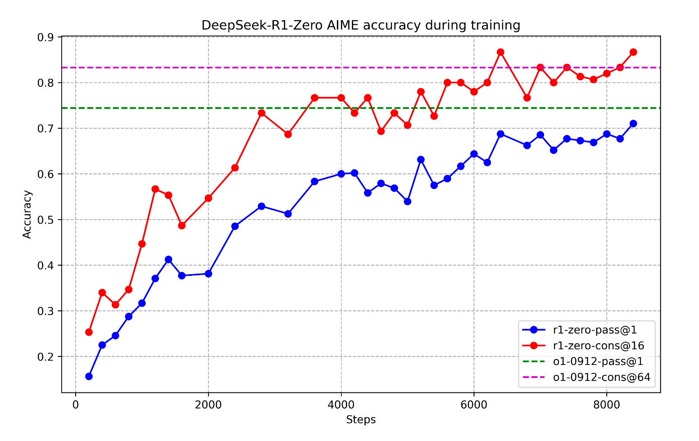
        <figcaption style="text-align: center;"> 图9：训练过程中DeepSeek-R1-Zero在AIME上的准确率。对于每个问题，抽样了16个答案，并计算了总体平均准确率，以确保评估的稳定性。</figcaption>
    </figure>

### 2.2 DeepSeek-R1

尽管 DeepSeek-R1-Zero 展现了强大的推理能力，并自主发展出意想不到且强大的推理行为，但它面临着几个问题。例如，DeepSeek-R1-Zero 在可读性差和语言混合等挑战上表现不佳。为了解决上述问题，DeepSeek-R1 应运而生。

DeepSeek-R1 主要探索了两个问题：

- 通过纳入少量高质量数据作为冷启动，能否进一步提高推理性能或加速收敛？
- 如何训练一个用户友好的模型，它不仅能产生清晰连贯的思维链（CoT），而且具有很强的通用能力？

#### 2.2.1 整体概述

如图 10，为了解决这些问题，作者设计了一个训练 DeepSeek-R1 的 pipeline。该 pipeline 由四个阶段组成， **Stage1:** 冷启动微调（Cold Start SFT）-> **Stage2:** 面向推理的强化学习（Reasoning-oriented Reinforcement Learning）-> **Stage3:** 拒绝采样和微调（Rejection Sampling and Supervised Fine-Tuning） -> **Stage4:** 全场景强化学习（Reinforcement Learning for all Scenarios）。

其实这可以分成两部分来看，**DeepSeek-V3 Base**经过 Stage1 和 Stage2 得到中间模型，这个模型是为了生成更多高质量的 Reasoning Data；接着**DeepSeek-V3 Base**经过 Stage3+Stage4 得到最终的**DeepSeek-R1**。Step1 和 Step3 都是 SFT 阶段，其实都是 **Policy Initialization** 阶段，都是为了让模型在进行强化学习前有更好的基础能力（指令跟随、 推理能力）。由于这部分内容理论性较少，更侧重于工程实践，下面将以列点的形式进行讲解。

    <figure style="width: 100%;">
        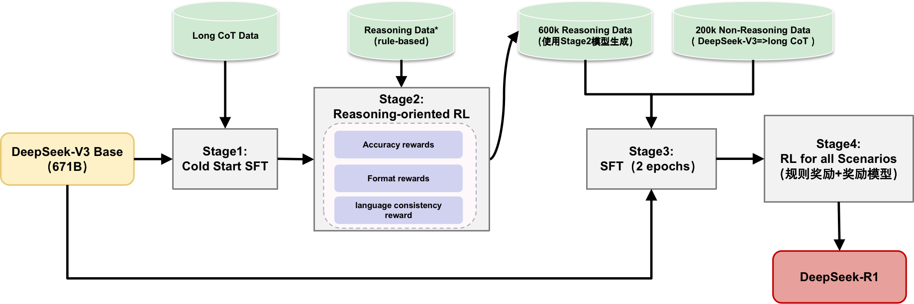
        <figcaption style="text-align: center;">图10：DeepSeek-R1训练pipeline</figcaption>
    </figure>

#### 2.2.2 Stage1: 冷启动微调

- **基础模型：** DeepSeek-V3-Base
- **数据构建：** 构建并收集少量的长链式思维（CoT）数据，以用于微调模型增强作为强化学习 Agent 的能力，通过下面三种方式构造数据
   - 使用少样本提示（few-shot prompting），以长链式思维（long CoT）作为示例
   - 直接提示模型生成包含反思与验证的详细答案
   - 以可读格式收集 DeepSeek-R1-Zero 的输出，并通过人工标注进行后处理优化
- **冷启动数据的优势**
   - **可读性：** |special_token|`<reasoning_process>`|special_token|`
`
   - **潜力：** 通过精心设计具有人类先验的冷启动数据的模式，观察到比 DeepSeek-R1-Zero 更好的性能。

#### 2.2.3 Stage2: 面向推理的强化学习

- 该阶段在 Stage1 之后，侧重于增强模型的推理能力，特别是在推理密集型任务中，如编码、数学、科学和逻辑推理，这些任务涉及定义良好的问题，并有明确的解决方案，这部分实际和 DeepSeek-R1-zero 的训练是一致的。
- 实验观察到，CoT 经常表现出语言混合，特别是当 RL 提示涉及多种语言时。为此在 RL 训练过程中的语言一致性奖励（language consistency reward）

#### 2.2.4 Stage3: 拒绝采样和微调

- **基础模型：** DeepSeek-V3-Base，在基础模型上进行 Stage3，微调 2 个 epoch
- **数据生成**
   - **推理数据(600k)**
      - DeepSeek-V3 作为判断标准：将真实值和模型预测输入 DeepSeek-V3，筛选数据
      - 过滤掉混合语言、长段落和代码块的思维链
   - **非推理数据(200k)**
      - 使用 DeepSeek-V3 pipeline 并且使用部分 DeepSeek-V3 SFT 数据
      - 利用 DeepSeek-V3 生成长链式思维（long CoT）数据

#### 2.2.5 Stage4: 全场景强化学习

- 针对不同类型数据采用差异化训练策略：
   - **推理数据（Reasoning data）：**
      - 沿用 DeepSeek-R1-Zero 的训练方法，通过规则化奖励（rule-based rewards）引导模型优化推理能力
   - **通用数据（General data）：** 引入多维度评估机制
      - **有用性（Helpfulness）：** 重点评估模型最终总结的实用价值和问题解决能力
      - **安全性（Harmlessness）：** 全面评估模型的完整响应（包括推理过程和总结），识别并减轻潜在风险、偏见或有害内容
      - **模型奖励（Model reward）：** 通过整合多元奖励信号和多样化数据分布，培养出一个推理能力卓越且兼顾实用性和安全性的模型

### 2.3 蒸馏（Distillation）

    <figure style="width: 100%;">
        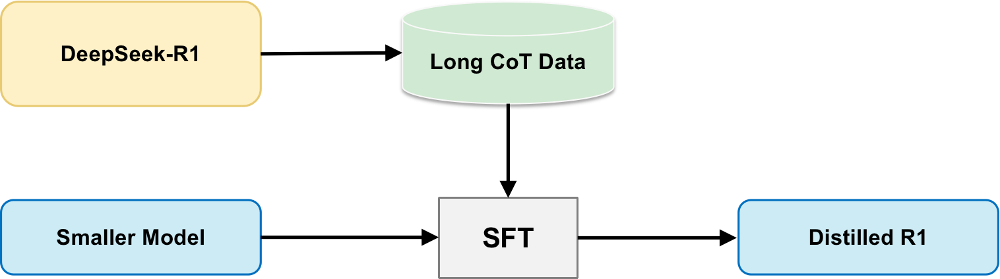
        <figcaption style="text-align: center;">图11：蒸馏流程</figcaption>
    </figure>

本文的另一个重要发现是关于模型蒸馏的效果：将更强大的模型蒸馏成更小的模型能产生出色的结果。相比之下，直接对小模型进行大规模强化学习训练不仅需要巨大的计算资源，而且性能可能无法达到蒸馏方法的水平。

具体而言，这里采用的是 **数据蒸馏（data distillation）** 方法：

1. 首先使用更强大的模型生成高质量的长链式思维（Long CoT）数据
2. 然后利用这些数据在小模型上进行监督微调（SFT）

这种方法既节省计算资源，又能有效地将大模型的推理能力迁移到小模型中。

## 3. 实验总结

### 3.1 实验设置

**Benchmark：** 基准测试包括 MMLU、MMLU-Redux、MMLU-Pro、C-Eval 等多个标准数据集，以及使用 LLM 作为评判的开放式生成任务评估。对于蒸馏模型，在 AIME 2024、MATH-500 等关键数据集上报告结果。

> 小细节：使用 LLM 作为 Judegement 时，只将`<answer>`内的内容送给 LLM。

**评估设置：** 遵循 DeepSeek-V3，最大生成长度为**32,768**个 token。为避免贪婪解码导致的重复率问题，采用**pass@k**评估方法，使用 0.6 的采样温度和 0.95 的 top-p 值。

### 3.2 DeepSeek-R1 结果

    <figure style="width: 100%;">
        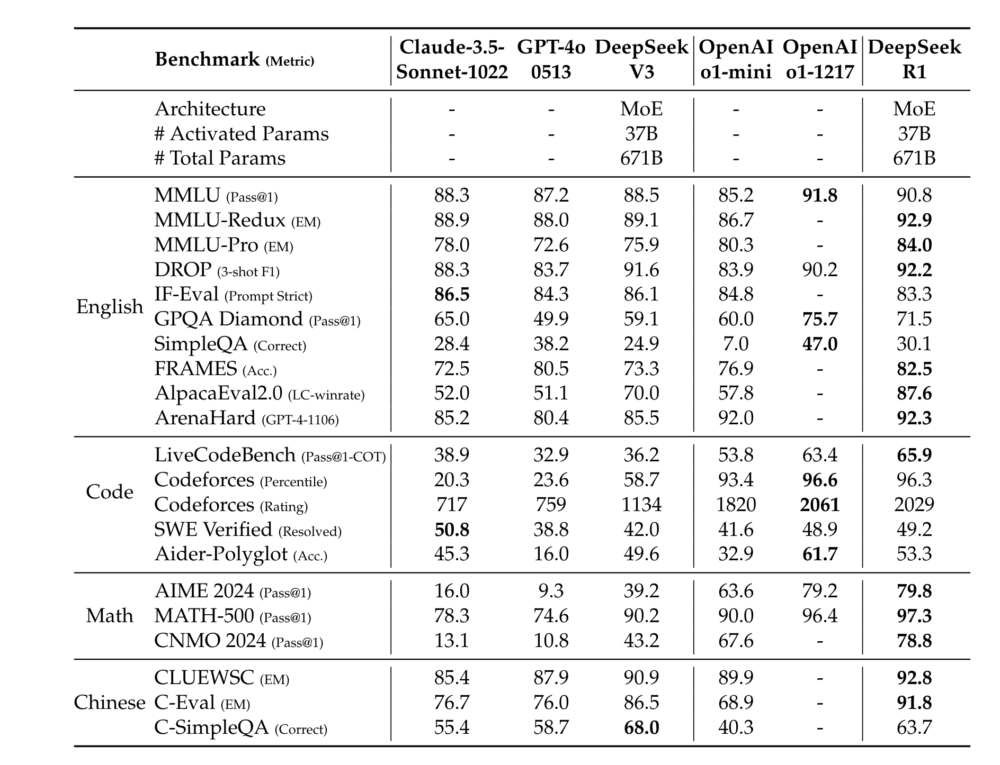
        <figcaption style="text-align: center;">图12：DeepSeek-R1实验结果</figcaption>
    </figure>

- 在教育知识基准(MMLU、GPQA Diamond 等)上，DeepSeek-R1 优于 DeepSeek-V3，特别是在 STEM 相关问题上。模型在 FRAMES 等长上下文任务和 SimpleQA 等事实基准上表现出色，但在中文 SimpleQA 上因**安全强化学习后**倾向**拒绝某些查询**而表现不如 DeepSeek-V3。

- DeepSeek-R1 在 IF-Eval **(格式指令遵循能力)** 和 AlpacaEval2.0、ArenaHard **(写作任务和开放域问答)** 上表现优异，生成的摘要简洁有效，避免了长度偏差。

- 在**数学任务**上，DeepSeek-R1 与 OpenAI-o1-1217 相当，显著超过其他模型。在**编码算法任务**(LiveCodeBench、Codeforces)上也表现突出，但在工程导向编码任务上与 OpenAI-o1-1217 相比各有优势，未来版本有望进一步提升工程性能。

### 3.3 蒸馏模型结果

    <figure style="width: 100%;">
        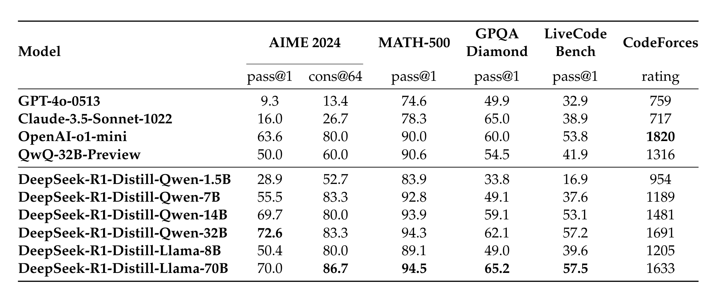
        <figcaption style="text-align: center;">图13：蒸馏模型实验结果</figcaption>
    </figure>

蒸馏模型实验结果显示：

- DeepSeek-R1-7B（DeepSeek-R1-Distill-Qwen-7B）通过蒸馏**在所有方面优于**非推理模型（如 GPT-4o-0513）。
- DeepSeek-R1-14B 在所有评估指标上超过 QwQ-32BPreview；DeepSeek-R1-32B 和 DeepSeek-R1-70B 在大多数基准测试中显著超过 o1-mini。
- 蒸馏方法展现出巨大潜力，对蒸馏模型应用强化学习可带来显著进一步收益。这里的实验仅展示简单 SFT 蒸馏模型结果，值得进一步探索。

## 4. 讨论&总结

### 4.1 蒸馏 vs 强化学习

    <figure style="width: 100%;">
        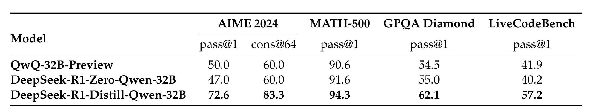
        <figcaption style="text-align: center;">图14：蒸馏 vs 强化学习 实验结果</figcaption>
    </figure>

实验证明，对于小型模型，<u> **蒸馏方法比直接应用强化学习更有效** </u>。

在 Qwen-32B-Base 上进行了大规模 RL 训练（超过 10K 步），得到的 DeepSeek-R1-Zero-Qwen-32B 性能仅与 QwQ-32B-Preview 相当。而通过蒸馏 DeepSeek-R1 得到的 DeepSeek-R1-Distill-Qwen-32B 在所有基准测试中都显著优于直接 RL 训练的模型。

因此可以得到两个结论：

1. 将更强大的模型蒸馏成更小的模型会产生出色的结果，而依赖于本文提到的大规模 RL 的更小的模型需要巨大的计算能力，甚至可能无法达到蒸馏的性能。
2. 虽然蒸馏策略既经济又有效，但超越智能边界的推进可能仍需要更强大的基础模型和更大规模的强化学习。

### 4.2 不成功的尝试

- **过程奖励模型（PRM）的局限性**
   - PRM 是引导模型改进推理任务解决方法的合理方法
   - 实践中存在三个主要限制：
      - 在一般推理中难以明确定义细粒度步骤
      - 难以确定中间步骤的正确性（自动标注效果不佳，人工标注难以扩展）
      - 基于模型的 PRM 容易导致奖励黑客行为，重新训练奖励模型需要额外资源
   - 虽然 PRM 在重新排序或辅助搜索方面表现良好，但相比大规模强化学习的计算开销，优势有限

> 奖励黑客(Reward Hacking)行为指模型学会了欺骗奖励系统而非真正提高能力，例如通过特定格式或关键词获取高奖励而不实际解决问题，这种行为会随着训练进行而加剧。此外，为防止这种现象，需要定期重新训练奖励模型，这不仅需要额外的计算资源，还会使整个训练流程变得更加复杂。

- **蒙特卡洛树搜索（MCTS）的探索与挑战**
   - 受 AlphaGo 和 AlphaZero 启发，尝试使用 MCTS 增强测试时计算可扩展性
   - 实现方式：将答案分解成小部分，系统化探索解空间，使用标签对应特定推理步骤
   - 训练过程中遇到的挑战：
      - 令牌生成的搜索空间远大于棋类游戏，设置最大扩展限制导致局部最优
      - 价值模型直接影响生成质量，但训练细粒度价值模型本身困难
      - 由于令牌生成的复杂性，难以复制 AlphaGo 的成功经验

---

以上就是主体内容了，本文对 DeepSeek-R1 论文进行了详细解读，重点分析了其在强化学习方面的创新应用，以及在推理能力提升方面的突破性成果。通过 DeepSeek-R1-Zero 和 DeepSeek-R1 两个阶段的模型训练，展示了纯强化学习和混合训练方法在提升大语言模型推理能力方面的潜力。同时，文章也探讨了蒸馏技术在小型模型上的应用效果，为未来大语言模型的发展提供了新的思路。

希望本文能帮助朋友们更好地理解 DeepSeek-R1 的技术原理和实现方法，以及强化学习在大语言模型训练中的应用价值。如有任何问题或建议，欢迎交流讨论。

版本时间线

- 2025.03.16 第一版

## 参考资料

[1] Zeng Z, Cheng Q, Yin Z, et al. Scaling of search and learning: A roadmap to reproduce o1 from reinforcement learning perspective[J]. arXiv preprint arXiv:2412.14135, 2024.

[2] Ouyang L, Wu J, Jiang X, et al. Training language models to follow instructions with human feedback[J]. Advances in neural information processing systems, 2022, 35: 27730-27744.

[3] 【李宏毅 PPO】：https://www.youtube.com/watch?v=OAKAZhFmYoI

[4] Shao Z, Wang P, Zhu Q, et al. Deepseekmath: Pushing the limits of mathematical reasoning in open language models[J]. arXiv preprint arXiv:2402.03300, 2024.
