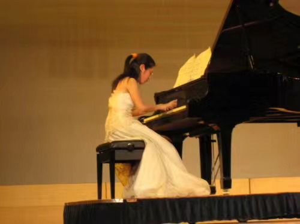

嘿，你知道飞桨社区里的 DDL 战士是谁么？嘿，你知道大家心中的 Paddle 社区妈妈是谁么？那你又知道谁是（~~仓库管理员~~）飞桨仓库的实际控制人？谁是飞桨仓库的守护者？谁是飞桨从闭源到开源的见证者？是的，本期要采访的就是我们 Paddle 的资深研发女神——涛姐！

<!-- more -->

<!-- 导入聊天框功能 -->

<!-- 导入聊天框功能 -->

## 一、采访内容

1. **涛姐，给大家介绍一下自己吧!**

   **涛姐：** 大家好，我是骆涛😊（[@luotao1](https://github.com/luotao1)）！现在是百度飞桨的资深研发工程师～同时，也是长期的开源贡献者！我博士毕业于中国科学技术大学高性能计算方向，师从陈国良院士，在深度学习领域有 20 多项专利。我参与训练/推理/高性能/工程效率等多个方向，目前致力于活跃飞桨框架开源社区。💗💗💗

2. **涛姐是什么时候入职 Paddle 的？是以哪种方式呢？你觉得当时获得这份工作最大的竞争力是什么？**

   **涛姐：** 😲大概八年前，我入职了百度。当时我是校招进的 Paddle 团队，但我投的不是校招岗位，而是社招岗位。因为之前我给阿里投了校招，阿里也给我发了录取的邮件。但后来他们告诉我说是外包员工把邮件发错了，我也很无语。等我后面知道这个事情的时候，校招已经快结束了，那剩下的就只有社招这一个选择了。

   当时 Paddle 还在百度深度学习研究院（IDL）下，我觉得肯定是进不了的。但因为没有找到合适的工作，也管不了这么多就投了，结果第二天就收到 offer。

   我觉得最大的竞争力可能是在英特尔做过 Caffe 上的一些优化，所以能力还是比较匹配的。当时，我是带着我的 PPT 去面试（在英特尔有一个比较好的习惯，就是会整理之前所做的工作，因为外企都非常注重工作内容的呈现，所以当时这些 PPT 都是英特尔期间整理的已有素材）。但对面试官来说，拿着 PPT 去讲这些内容来面试，还是比较新颖的。

   还有一个 tip 是：我的简历上没有提及性别，也没有附上照片，所以面试官可能一开始以为我是男生，否则我觉得可能一面就进不了。然后面试的时候，运气比较好，代码题目都是之前复习过的，整体的表现也比较好。此外，还有一点，是我听说面试官在前面的面试里要求比较高，面了好多人都没有满意的。面了 30 多个后，再不招一个，那 Head Count 可能就没了，而我当时确实也投的比较晚。所以在各种机缘巧合下就录取了。

   总的来说，最大的竞争力我觉得第一是博士的身份；第二是已经在英特尔实习，有一些经验；第三是自己的工作有一个比较好的展现，呈现的形式还是很有吸引力的。

3. **可以给我们谈谈 Paddle 的发展史么？听说 Paddle 最初是是闭源的，为什么后来选择开源？**

   **涛姐：** 最初，Paddle确实是闭源的。但是由于 IDL 研究院非常前沿，当时也请了吴恩达过来，而且还有很多研究员都是在美国。本身国外开源的氛围又很浓厚，就有了开源的想法💡。当时主流的开源深度学习框架有 Caffe、TensorFlow，至于 Pytorch 都还没有发展起来。如果 Paddle 不开源，实际上是没办法和国外主流的深度学习框架竞争。

   此外，当时公司内部还有很多同类产品，比如 Lego（乐高）、 Anakin 等等。这些产品当时都服务于公司内部的业务线，而 Paddle 在当时是一个比较新的东西，实际在公司内业务线上的使用非常有限。后来还制定了 1 到 2 年的计划，就是要把公司内所有产品线都用 Paddle 跑起来。如果 Paddle 不开源，其实在公司内是死路一条。正是因为 Paddle 选择了开源这一路线，之后吞并了 Lego 和 Anakin，逐渐壮大，我认为这是开源最大的一个魅力。同时开源也是一个战略性的决策，如果 Paddle 不开源，在公司内都无法生存，更别提在国际上立足。

   > 编者注✍️： 军哥曾经是 Lego 的初创研发成员之一哦～

   

      <figure style="width: 26%">
         
         <figcaption>18 年 Paddle 团建</figcaption>
      </figure>
      <figure style="width: 46%">
         
         <figcaption>18 年 10 月发布 1.0 版本</figcaption>
      </figure>
      <figure style="width: 26%">
         
         <figcaption>18 年 Paddle 团建 </figcaption>
      </figure>
   

4. **给我们讲讲你的求学之路吧！**

   **涛姐：** 我本科、硕士和博士都是在中科大，博二时去了中科院北京软件所学习，可以说是一个联合培养计划吧！之后又去了英特尔实习，这些大致就是我的学习经历～一路走来，真的太不容易了，特别是读博期间非常受挫，心理压力巨大！读完博士的时候感觉整个人脱胎换骨了。
   

      <figure style="width: 49%">
         
         <figcaption>涛姐大一中科大西洋乐团新年音乐会</figcaption>
      </figure>
      <figure style="width: 49%">
         
         <figcaption>涛姐大一冬天</figcaption>
      </figure>
   

5. **你刚刚谈到读博于你而言简直脱胎换骨，当时为什么选择读博？读博对于你来说获得了什么？**

   **涛姐：** 当时选择读博，是因为本科毕业的时候没有考虑过就业。而且虽然当时成绩比较好，但觉得自己除了成绩好，其他什么都不会，就想还是得深造（~~是真实的情况，不是凡尔赛~~）。此外，我们学校当时并没有提供保研这个选项，只能考研或者保送直博升学，所以我最后选择了直博。

   当时我是可以自己选择直博校外还是本校，可能班主任也比较喜欢我，他就强力推荐我留在学校读博。其实我当时也想去国防科大呀、复旦呀，但是都被班主任无情拒绝了。他给我分析了一些利弊，后面给我找的导师也非常好，是一位院士。这也为我后面能去软件所或者英特尔这些大的平台提供了一个非常有力的保障。所以，我在这里也非常感谢我的班主任，他真的是一个非常好的老师！

   读博给我带来了很多收获！对于我的职业生涯来说，如果我没有读博士，我肯定进不了百度或者英特尔，这一点毫无疑问。对学业方面来说，读博极大锻炼了我自己，也包括提高了心理承受能力、抗压能力。还有一点就是读博扩大了我的学术圈子，如果我没有继续深造，我将无法接触到如此多优秀的同学和高 level 的大佬。此外，博士身份在之后的许多场景中都还是非常有用的！

   > 编者注✍️：Family who konws🐮！涛姐说自己大学不是特别用功，没有搞绩点，但是成绩就是 top 10！是谁羡慕了我不说～
   > ​<!-- 涛姐15年博士毕业照片 -->

      

         <figure style="width: 60%;">
            
            <figcaption>涛姐15年博士毕业</figcaption>
         </figure>
      

6. **读博有遇到什么困难吗？博二时去到了北京软件所进一步学习培养，当时为什么去争取这个机会？**

   **涛姐：** 刚开始读博的时候**非常迷茫**。因为本科的时候就没有进实验室，当时年纪小还没有这个意识，也没有现在这样环境氛围。而且本科期间成绩也还行，所以那时除了读书就是看韩剧、台剧、综艺、小说。像之前说的那样，本科毕业的时候就处于“除了成绩好，其他什么都不会”的状态。但会考试，不代表在计算机方面的能力强，因为考一个好成绩很容易，我这样说有点凡尔赛，但确实就是这样的。

   > 编者注✍️：涛姐特别喜欢在学校图书馆看小说，像是沧月、新武侠、古典武侠、卫斯理系列·····

   但当读博进了实验室之后，就会发现差距很大。因为读博需要做研究发论文，这和本科期间单纯的学习考试是存在很大的 gap。而且导师又是放养型的（因为老板是院士，他觉得招进这么好一个学生，应该能够自己解决自己的问题），我完全不知道要做什么，代码也调不出来，就一下子陷入一个很迷茫的状态，和之前上课的阶段完全不一样。所以那个阶段其实是蛮难熬的，包括学校里很多老师也不会带你做实验，不会像咱们[护航计划](https://github.com/PaddlePaddle/Paddle/issues/61006)的研发同学那样手把手带。代码都要由自己调试，而遇到问题时也不知道该向谁求助，这种情况让人会感到非常痛苦。

   所以当时就争取了去北京的联合培养计划。去了北京之后，可能因为实验室风格和之前不一样，发现确实还是要有年轻老师或项目带着会好一点～

7. **去英特尔实习是在什么时候呢？你在那段时间收获了什么？你觉得它与百度有什么不一样？**

   **涛姐：** 嗯～我在英特尔实习是在博士的最后两年（博士第一年在学校念书，接下来的两年中科院软件所联合培养，第四年和第五年在英特尔实习），这两年的经历对我的个人成长产生了巨大的影响。

   收获的是真实的研究院实习经历（当时比较好的研究院就是 MSRA 和英特尔中国研究院这两个）。能明显感觉到企业和学校的风格是完全不一样的，接触的东西也很前沿，组里氛围也很好。而且研究院的指导和学校相比，整体的科研 sense 会拔高很多。比如当时在英特尔期间，我接触了第一代深度学习框架 Caffe，并在其中进行了一些工作。尽管我没有做很多东西，但当时写的论文（博士学位论文）因为抓住到 Caffe 这个热点，而且英特尔做的也比较好，因此论文引用量到现在已经超过 7000 次，相比起来其他很多人的论文都没人看。

   而且这段研究院经历，也帮助我获得了百度深度学习研究院（IDL）的 offer。这个 offer 在当时是挺难拿的，竞争很激烈，我自己也没想到能拿到。这也让我意识到平台的重要性。

   还有一点是在英特尔实习也开拓了我的眼界。像隔壁组是在给 Spark repo 做贡献，当时负责带队的老师后来成了英特尔研究院的院长，不过我的指导老师后来也成了院长，他们都是非常厉害的人。此外，英特尔老师在就业指导上面，会看的比较远（相对于学校老师）。当时我有两个 offer：一个是 IBM 的，一个是百度。IBM 给的还比百度多，但英特尔的老师就建议我去百度锻炼和提升一下自己。

   英特尔和百度不一样的地方就和网上说的一样：英特尔比较轻松，准时六点就能下班。一周实习工作其实我两到三天就能完成，然后剩下一半的时间都是在写我的论文。但对百度来说，即使是百度深度学习研究院（IDL），工作也会更偏向工程和产品落地，所以很忙。

   哦！再补充一下：就是，英特尔里面的女性研究员真的非常多。和百度不同，百度这边男性工程师会占大半部分！

   > 涛姐注✍️：在英特尔实习那两年是我最开心的时候。在外面租着房子，自己又有钱下班又早。虽然都是月光，但真的很开心😄！一下班，就可以自己追韩剧，然后做做瑜伽，自己美美容，买买衣服，逛逛淘宝～

8. **涛姐有没有一直在坚持的兴趣爱好？大学时的爱好有哪些呢？**

   **涛姐：** 以前的空闲时间我喜欢练瑜伽，但现在所有的空闲时间都在带娃！瑜伽是在大学时期就开始坚持的，当时是有参加一些社团，但并没有特别深入。后来在英特尔实习有钱了，就开始外面报班，参加了一些瑜伽课。感觉练瑜伽相对容易，而且让人心情平和！

   但现在我已经没有坚持了，主要原因是我几乎没有自己的闲暇时间。不加班的时候，下班后我得等娃睡觉了之后才能刷手机。而有时候还需要开会，更没有自己的时间。因为互联网工作不是传统的上下班制度，而是根据绩效和产出来衡量的。现在每天的生活节奏通常是：起床、上班、下班、带娃、睡觉，这样一个不断循环的过程。

   > 编者注✍️：涛姐也有和老公一起练双人瑜伽哦，大家可以去涛姐朋友圈看👀照片，哈哈哈～

   ​<!-- 涛姐瑜伽照片 -->
      

         <figure style="width: 60%;">
            
            <figcaption>涛姐练瑜伽</figcaption>
         </figure>
      

9. **学生时代你有参加过开源吗？向哪些项目/组织提交过 PR 呢？**

   **涛姐：** 学生时代只向 Caffe 提交过 PR。那个时候是在英特尔实习，然后实习的题目也和我的论文比较相关：需要做一个 CPU 多线程加速的优化。所以就给 Caffe 提了一个 PR。但那个 PR 没有被合入，因为有一些工程上的问题会影响 Caffe 的整体。提 PR 和发论文不太一样，发论文只要性能数据达标了就可以，但是 PR 合入到主干中还要考虑到很多其他的问题。

10.   **作为过来人，涛姐在职场上有什么建议给大家？**

      **涛姐：** 在学生时代，你就要有自己的职业生涯规划。从学生到职场会有一个心理转变的过程。特别像职场，有时候会比较复杂。经常会出现：人家晋升你没有晋升或者人家年终奖比你高（反正公司内是不允许大家讨论薪酬的）。但是谁晋升谁没晋升这些大家都知道，所以这时候你就要有：“他强任他强，清风拂山岗”的心态，你一定不要纠结于经理保谁没保谁。当你做到大家公认比较好的时候，你肯定能升职。

      然后职场里还有一个很重要的点就是：你要坚持！大家有时候 2 到 3 年会想跳槽或者每 5 年想跳槽，这个时候得看你自己的想法。我自己在百度呆了八年，没有跳槽，很大一个原因是我现在做的事情，像是开源这一类的是我比较喜欢的，我对这类事比较有热情，现在对自己的工作状态也比较满意。还有我们家那位就是跳来跳去的，之后他就劝我：还是别跳！

      > 编者注✍️：涛姐是校园恋爱哦～老公是以前一个实验室的！🤭

      ​<!-- 涛姐职场照片 -->
         

            <figure style="width: 80%;">
               
               <figcaption>涛姐参加活动时照片</figcaption>
            </figure>
         

11.   **在恋爱上有什么建议给大家？**

      **涛姐：** 学校里还是相对比较单纯一点，所以如果可以，最好在学校解决恋爱问题。工作之后，你也没有心情去解决个人问题。事情很多（你进入职场之后，你马上面临的是买房子、经济压力、赡养老人等等事情，你要变成一个成年人负担起一个家庭的责任。所以大家趁年轻多多拼搏一下，你要是有一些经济基础的话，那相对会好一点！），职场的压力是远比学校的压力更大。而且你一年一年拖下去之后，优秀的师兄师姐们的数量是会减少的！所以要稍稍早一点！然后一定要找长得好看的，这样生出来的娃才好看！我当时的要求就是：学历要跟我同等，长得帅，然后还得是党员。其他我没有要求，再挑就挑不出来了。找对象，只能挑几个最重要的点，你要搞清楚自己最想要的是什么？你不能啥都要，那是不可能的！

      > 编者注✍️：涛姐人送外号「百度红娘」～

​<!-- 涛姐参加活动 -->

   

      <figure style="width: 50%;">
         
         <figcaption>涛姐 7 个月的孕妇照</figcaption>
      </figure>
   

   
13.   **作为女性研发，你在工作上有没有遇到什么难题？与男性研发相比，你觉得有什么区别？**

      **涛姐：**   我觉得和男生没什么区别。现在 Paddle 里的一些女性研发都非常厉害的，比如和我同一期加入 Paddle 的青青（[@qingqing01](https://github.com/qingqing01)）、益群（[@Xreki](https://github.com/Xreki)）一起工作已经八年了，以及时间更久的志华姐、渝娟姐（虽然离职了），包括新进来的雅美（[@liym27](https://github.com/liym27)）、张婷（[@zhangting2020](https://github.com/zhangting2020)），她们都是非常出色！你能看到的、存活到现在的 Paddle 研发都非常厉害！（~~因为不厉害的早就被淘汰了~~）而且包括我们的两个副总裁也都是女生，能坐到这么高的位置，很大程度能说明能力很强！

      所以，女孩子们一定要有自信，并且多努力学习！不要觉得是男生才能主导，要相信自己也能做成！同时，内心强大一点，知道自己的定位，要明白自己擅长什么，在工作中去充分的扬长避短！

      可能会有一个比较大的区别就是生娃。生育是女性需要面临的一个无法避免的问题，会对事业产生不同程度的影响，所以女性可能要在生娃之前多多奋斗几年。不过这个问题对于还是学生的女生来说，考虑的还有点早啦～

      另外，女生学计算机的话，热爱还是很重要的。只有热爱它，才能坚持下来～在我们的开源社区中，像孙师傅带的三个「[Docs 偶像女团](https://github.com/PFCCLab/Starter/tree/main/community/docs_group)」的女生，我觉得是能从她们那儿看到我以前的影子！虽然她们做的事情并不难，但展现出的热爱，是非常可贵的。每次这个精品小团开会，我看她们跟孙师傅交流的时候，都是闪闪发光的。

      > 编者注✍️：精品小团体是飞桨启航计划的一次尝试，是招募有意愿的营员参与到某⼀具体⽅向的⼩团体。未来会推广该模式，所以大家多多参与哦！

​<!-- 涛姐职场照片 -->

   

      <figure style="width: 60%;">
         
         <figcaption>15 年 Team buiding</figcaption>
      </figure>
   

## 二、涛姐有话说

### by 涛姐（[@luotao1](https://github.com/luotao1)）

<MessageBox>
   <Message name="涛姐" github="luotao1">
Paddle 这个平台其实很不错。说实话，在国内 Paddle 已经站在了顶尖的位置。在我的学生时代，国内是没有这样丰富的开源机会，当时开源活动只有像 Caffe 和 Intel 在办，但这些都是国外的。你要考虑很多：如何参加活动？活动符不符合你的能力？改的代码在不在点上？提了 PR 之后，别人会不会像我们 Paddle 现在这样，每个 PR 给你快速的安排研发 review？而且我们还会催大家，也给大家发礼品。这些在国外的开源开源社区几乎都是没有的。

在当时，想要合入一个 PR 可难了。如果没有认识的人，PR 合进去的难度非常高，因为代码改不到他们的点上，而且也不了解他们的活动和进展，也没有类似于我们现在的 **[PFCC](https://github.com/PaddlePaddle/community/tree/master/pfcc)** 例会和社区做分享。

我现在觉得，当时能靠着没合进去的 PR 进入了百度，现在大家也能做的更好。所以鼓励大家多多参加开源活动～不仅获得好的实习项目，还可以拓宽眼界！

此外，如果一些同学没有什么项目，又想找到好的实习机会，其实现在可以在参与一些开源社区的任务。因为找到第一份工作其实是最难的，你只有找到第一份工作，后面慢慢的才会越来越顺利。但这确实很难！因为名额很珍贵，所以面试考核就是一种很公式、很官方的流程。

如果靠着自己在学校期间做的项目，面试阶段是讲不清楚的。即使讲清楚，面试官也会一带而过。因为这些都是网上查不到的，所以面试最终只能考代码。但像提 PR 或者发论文，面试官都能一眼看明白你做的工作，并且在网上都能查到。所以如果像参加**护航计划**，那可能就是立马拿到工作机会，我们有三个做过护航计划的同学都是立刻得到工作机会，面试流程只是走一下。

最后送大家一句话：世界会更加广阔，前途更加无限。
</Message>
</MessageBox>

> 编者注✍️：涛姐在上面提到没合入的 PR 是关于在 Caffe 上做 CPU 多线程优化～

## 三、快乐晒娃时刻

<!-- 涛姐晒family -->
   

      <figure style="width: 49%">
         
         <figcaption>涛姐童年照</figcaption>
      </figure>
      <figure style="width: 50%">
         
         <figcaption>涛姐两岁半的可爱小宝贝</figcaption>
      </figure>
   

​<!-- 涛姐全家福照片 -->

   

      <figure style="width: 70%;">
         
         <figcaption>涛姐全家福照片</figcaption>
      </figure>
   

最后再来一张宝贝的可爱九宫格😊～
​<!-- 涛姐宝贝九宫格 -->

   

      <figure style="width: 70%;">
         
         <figcaption>涛姐宝贝九宫格</figcaption>
      </figure>
   

---

> 编者注✍️：感谢郑必城（[@Zheng-Bicheng](https://github.com/Zheng-Bicheng)）、散步（[@sanbuphy](https://github.com/sanbuphy)）、张一乔（[@liyulingyue](https://github.com/liyulingyue)）、川川（[@gouzil](https://github.com/gouzil)）四位师傅在引言为涛姐想的 title～顺序对应哦！

## 写在最后 💡

**【开源江湖闲聊录】** 是一项专门为 Paddle 社区的开发者打造的特色访谈栏目 📚。在这里，我们邀请到每一位别具一格且富有热情的开发者，通过文字或语音的方式进行深入采访 🎙️，探索并展现他们背后独一无二的故事，将他们的经历、见解和创意整理成精彩内容，呈现给整个社区。

---
