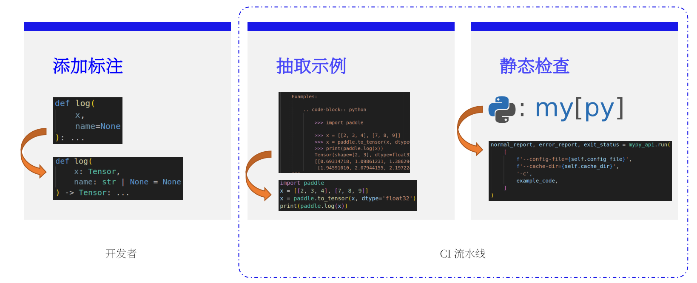

---
title: 项目收官 | 为 Paddle 框架 API 添加类型提示（Type Hints）
date: 2024-09-01
author:
   name: 孙师傅
   github: sunzhongkai588
co_authors:
   - name: 顺师傅
     github: megemini
---

【为 Paddle 框架 API 添加类型提示（Type Hints）】的项目总结。

<!-- more -->

<!-- 导入聊天框功能 -->
<script setup>
import Message from '../.vitepress/components/Message.vue'
import MessageBox from '../.vitepress/components/MessageBox.vue'
</script>

<style>
figure {
   text-align: center;
}
figcaption {
   color: orange;
   border-bottom: 1px solid #d9d9d9;
   display: inline-block;
   color: #999;
   padding: 2px;
}
</style>

34 位开发者参与，16 项主任务，337 个子任务，2191 个 API，340+ 个 PR，自 2024 年 4 月起，至 8 月 30 日主体项目完结，近 5 个月 SAN 值归零的夜晚，Type Hints 总归算是有始有终、小有成果，这里就简单回顾与总结一下。

## 项目介绍

此次项目是第六期飞桨黑客松引入 Fundable Projects 中的一个：[为 Paddle 框架 API 添加类型提示（Type Hints）](https://github.com/PaddlePaddle/community/blob/master/hackathon/hackathon_6th/%E3%80%90Hackathon%206th%E3%80%91FundableProject%E4%BB%BB%E5%8A%A1%E5%90%88%E9%9B%86.md#%E4%B8%80%E4%B8%BA-paddle-%E6%A1%86%E6%9E%B6-api-%E6%B7%BB%E5%8A%A0%E7%B1%BB%E5%9E%8B%E6%8F%90%E7%A4%BAtype-hints)。

> Fundable Projects 本身定位具有一定的挑战性，有兴趣的同学可以移步 [【Hackathon 6th】Fundable Projects](https://github.com/PaddlePaddle/Paddle/issues/62908)

Python 在 3.5 版本通过 [PEP 484 – Type Hints](https://peps.python.org/pep-0484/) 正式规范了 `类型提示` 功能。之后随着相关规范和工具的逐渐完善，类型提示逐渐成为 Python 代码中的标准实践，如今较新的主流库也基本都提供了类型提示。由于 Python 本身类型高度动态化，类型提示的存在可以帮助开发者更快地了解代码的类型信息，提高代码的可读性和可维护性，结合工具还可以提供静态类型检查，在开发阶段就能发现一些潜在的类型错误。Paddle 框架由于历史原因尚未提供类型提示，本项目希望引入尽可能多的对 Paddle 有利的类型提示。

以一段简单的 Python 代码为例：

``` python
def greeting(name):
    return 'Hello' + name
```

添加上类型提示之后：

``` python
def greeting(name: str) -> str:
    return 'Hello' + name
```

正如前文所讲，类型提示功能有诸多好处，如：

- 帮助开发者了解代码类型信息
- 提高代码的可读性和可维护性
- 结合工具在开发阶段发现错误

而最直观的反映就是，我们在诸如 VSCode 等 IDE 中，能够获取到接口的类型提示，并进行连续推导了：

<!-- typing_ide.png -->
<div style="display: flex; justify-content: center">
    <figure style="width: 80%;">
        
        <figcaption>typing_ide.png</figcaption>
    </figure>
</div>

项目的 RFC [【Hackathon 6th】为 Paddle 框架 API 添加类型提示（Type Hints）](https://github.com/PaddlePaddle/community/pull/858) 经过大家讨论之后，将此次项目的目标最终标定为：

- **正确完成 Paddle 公开 API 的类型标注，但不声明 Paddle 类型标注的完备性。**

这里需要单独说明一下 `标注的完备性` 。类型标注是个循序渐进的过程，Paddle 是个相对较大且复杂的项目，除了公开 API 之外，还存在较多非公开 API 与 C++ 接口，此次项目无法保证完成以上所有接口的类型标注，故此，不做 Paddle 类型标注的完备性说明。或者，换个说法，如果熟悉 Python 的类型标注和相关工具的使用，那么，此次项目不保证完成 Paddle 这个项目本身通过类型工具的检查，但是，需要保证外部项目使用 Paddle 时，能够正确识别、提示与检查 Paddle 所提供的公开 API 。

项目中的任务，以任务模块的角度，分解为：

- `_typing` 模块的引入
- CI 流水线的建设
- 文档建设
- 公开 API 的类型标注

具体的执行过程，通过 [Tracking Issue](https://github.com/PaddlePaddle/Paddle/issues/63597) 跟踪项目进展，分解为：

- 第一阶段的前置任务
- 第二阶段的代码标注主体任务
- 第三阶段的补充测试
- 第四阶段的收尾与总结

## 项目实施

### 方案总揽

Python 官方提出了三种支持类型提示的 [包分发方式](https://typing.readthedocs.io/en/latest/spec/distributing.html#packaging-typed-libraries)：

- `inline` ，行内
- `stubs` ，文件
- `third party` ，第三方

结合 Paddle 项目本身的结构，这里采用:

- **Inline type annotation + Stub files in package**

的方案实施类型提示，具体为：

- Python 接口，使用 `inline` 方式标注
- 非 Python 接口，提供 `stub` 标注文件，并打包在 Paddle 中

所谓 `inline` ，是将类型直接标注在源文件的接口定义中，如：

``` python
def log(x, name=None):
    ...
```

直接修改接口代码为：

``` python
def log(x: Tensor, name: str | None = None) -> Tensor:
    ...
```

而有些接口，Paddle 是通过 pybind 或 patch 的方式提供，则需要增加对应的 `stub` 文件。最基本的，如 `Tensor` 类，需要提供 `tensor.pyi` 文件：

<!-- tensor_pyi.png -->
<div style="display: flex; justify-content: center">
    <figure style="width: 80%;">
        
        <figcaption>tensor_pyi.png</figcaption>
    </figure>
</div>

`stub` 文件的写法与 Python 代码的写法相同，只是不需要写具体的实现部分。

另外，由于 Python 的类型标注特性一直在不断完善的过程之中，初期的一些特性很难支撑 Paddle 如此体量的项目，因此，我们提出项目实施过程中的一项基本原则：

- **在不违背 Paddle 最低支持版本 3.8 语法的基础上，尽可能使用新版本 typing 特性**

所谓 `不违背 Paddle 最低支持版本 3.8 语法`，一个典型的例子是，Python 3.8 版本不能使用 `|` 进行类型别名的创建，如：

``` python
from typing_extensions import TypeAlias
from typing import Union
t: TypeAlias = Union[str, int]
```

在 Python 3.8 的语法中无法转写为：

``` python
from typing_extensions import TypeAlias
t: TypeAlias = str | int
```

但，我们希望 `尽可能使用新版本 typing 特性`，因此，通过 [PEP 563 – Postponed Evaluation of Annotations](https://peps.python.org/pep-0563/) ，我们可以在函数签名中使用 Python 3.10 的语法特性，如：

``` python
from __future__ import annotations
def foo(bar: str | int) -> None:
    ...
```

以上，为本项目实施的总体方案与基本原则，接下来，按照前文所讲的 `以任务模块的角度` ，简单拆分讲解一下。

### _typing 模块的引入

Paddle 中会用到很多公用的标注类型，比如数据布局 `NCHW`、`NHWC` 等。`_typing` 模块的引入，一方面可以统一规范开发者的标注行为，减少维护成本，另一方面，也可以减少各类书写错误。可以将 `_typing` 模块的地位与 Python 中的 `int`、`str` 等基础类型等同，由此，整个 Paddle 项目的标注体系可以分为：

- 基础类型
- 基础类
- 接口

三个部分。

<!-- hierarchy.png -->
<div style="display: flex; justify-content: center">
    <figure style="width: 80%;">
        
        <figcaption>hierarchy.png</figcaption>
    </figure>
</div>

具体到 `_typing` 模块，其本身作为 Paddle 的一个私有模块放置于 `python/paddle` 目录下：

<!-- typing_module.png -->
<div style="display: flex; justify-content: center">
    <figure style="width: 80%;">
        
        <figcaption>typing_module.pyi</figcaption>
    </figure>
</div>

其内部包括基础公共类型（`basic.py`）、数据布局（`layout.py`）等。

回顾项目整体实施过程中 `_typing` 模块的建设与使用，最大的收益是规范了一些公共类型的标注行为。比如，`NCHW`、`NHWC` 等这类数据布局，很容易出现书写错误，也确实发现过 Paddle 源码中错误的类型标注问题。再如，Paddle 中的设备类型 `CPUPlace`、`CUDAPlace` 等，与 `Place` ，实际上没有继承关系，这就需要在众多使用 `Place` 的地方引入 `PlaceLike` 类型。

但是，`_typing` 建设的过程中，也逐渐暴露出一些问题，最主要的有两个：

- 粒度控制
- 测试

所谓 `粒度控制` 是指，很难用统一的标注来划分哪些类型需要归类入 `_typing` ，哪些则直接使用 Python 的基础类型进行组合。比如，`_typing` 中的 `IntSequence = Sequence[int]`，很多地方都会用到，但，具体到每个接口，也许直接标注 `Sequence[int]` 会更简单。

对于 `_typing` 模块缺少单元测试也是一个比较大的遗憾。这就不得不说明一下我们是如何保证项目类型标注的正确性这个问题了。

最理想的方式当然是对每个接口做类型检测的单元测试，但是，由于项目本身的人力与时间投入不允许我们这么做，我们选择通过对接口中的 `示例代码` 做类型检查。

``` python
def log(x: Tensor, name: str | None = None) -> Tensor:
    r"""
    Calculates the natural log of the given input Tensor, element-wise.

    .. math::

        Out = \ln(x)

    Args:
        x (Tensor): Input Tensor. Must be one of the following types: int32, int64, float16, bfloat16, float32, float64, complex64, complex128.
        name (str|None): The default value is None. Normally there is no need for user to set this property. For more information, please refer to :ref:`api_guide_Name`

    Returns:
        Tensor: The natural log of the input Tensor computed element-wise.

    Examples:

        .. code-block:: python

            >>> import paddle

            >>> x = [[2, 3, 4], [7, 8, 9]]
            >>> x = paddle.to_tensor(x, dtype='float32')
            >>> print(paddle.log(x))
            Tensor(shape=[2, 3], dtype=float32, place=Place(cpu), stop_gradient=True,
            [[0.69314718, 1.09861231, 1.38629436],
             [1.94591010, 2.07944155, 2.19722462]])
    """
```

也就是上面这段代码中的 `Examples` 部分。

由于 Paddle 之前对接口的建设都要求书写 `示例代码` ，其中包括了接口基本的使用方式，那么，我们就可以通过对其进行类型检查，从而保证 Paddle 整体接口的基础类型检查的正确性了。

不过，这样会牵扯出另一个问题：接口依赖。

如果仔细观察上述的示例代码，会发现，其中同时应用到了 `paddle.to_tensor` 与 `paddle.log` 两个接口。那么，如果需要保证 `paddle.log` 这段示例代码检查正确，就需要先把 `paddle.to_tensor` 这个接口标注正确。类似的依赖问题层出不穷，由于我们使用的工具 `mypy` 会将没有标注的接口统一识别为 `Any` ，这就导致，如果 review 不仔细就会放过一些实际上错误的标注问题。为了解决这个问题，我们单独创建了一个 PR 用于对所有接口做全量检查的监测，也就是说，即使有上述所谓的漏网之鱼，一旦依赖的接口进行了类型标注，不再是 `Any` ，那么问题则可以在这个 PR 中及时被发现并修正过来。

以上，便是 `_typing` 模块的引入以及一系列需要在项目主体标注前需要完成的任务。

### CI 流水线的建设

前面提到，我们使用 `mypy` 来保证类型标注的准确性，这就涉及到 CI 流水线的建设问题。

<!-- typing_ci.png -->
<div style="display: flex; justify-content: center">
    <figure style="width: 80%;">
        
        <figcaption>typing_ci.pyi</figcaption>
    </figure>
</div>

上图简单描述了 CI 流水线的整体流程：

- 添加标注
- 抽取示例代码
- 静态检查

这里不再详述赘述 CI 流水线的建设过程，主要有两处考量与大家分享：

- 性能问题
- 流程问题

所谓 `性能问题` ，如果使用过 `mypy` 的同学可能深有体会，这东西太慢了。我们在项目中同样遇到了性能问题，Paddle 中 2000+ 个接口，检查一遍需要 2 个多小时。因此，我们使用进程池的方式对接口做并行检查，也将整体检查时间缩减到 10 分钟左右（虽然有同学反馈，内存占用可能有几十个 GB ，whatever，反正是在 CI 上做检查，而且也没有崩，就当是啥都没发生吧 ... ...）。

<!-- ci_con.png -->
<div style="display: flex; justify-content: center">
    <figure style="width: 80%;">
        
        <figcaption>ci_con.png</figcaption>
    </figure>
</div>

另外 `流程问题` 也是需要重点关注的。正如前文所讲，我们需要对接口做全量检查，但是，具体到每个接口的修改，则只能针对当前接口进行检查，否则问题无法收敛。因此，在整体类型标注完成之前，CI 的行为：

- 默认：不检查类型
- `[Typing]` 的 PR 做增量检查；也就是只检查 PR 中修改的接口
- `[Typing all]` 的 PR 做全量检查；也就是检查所有接口

由此，可以在容忍一定错误的状态下，逐步推进整体项目的进展。

截止到本文发表为止，CI 已经切换到常规行为：

- 默认：PR 做增量检查；也就是只检查 PR 中修改的接口
- `[Typing]` 的 PR 做全量检查；也就是检查所有接口

这里还需要单独说明一下，实际上，我们更推荐项目做 `全量检查` 作为默认行为，但是，由于全量检查对于资源的消耗实在太大，这里才退而求其次使用增量检查。

<!-- ci_shift.png -->
<div style="display: flex; justify-content: center">
    <figure style="width: 80%;">
        
        <figcaption>ci_shift.png</figcaption>
    </figure>
</div>

### 文档建设

文档建设是另一个需要单独关注的问题。Python 的类型标注虽然仍然是 Python 语言的一部分，但是，对于大部分没有接触过的同学来说，这东西就像是 Python 和 C++ 或者 Rust 的结合体。而且，类型标注本身不仅仅需要对标注熟悉，还需要明确各个接口的实际运行过程才能完成一个正确的标注过程。代码的运行流程需要同学在标注的过程中层层分析，而文档建设需要做的，相当于一个引子，引导大家进入到 Paddle 类型标注的最佳实践中来。

这里涉及到几个问题：

- `What`：Paddle 的类型标注关注什么
- `How`：Paddle 的类型标注怎么做

首先 `What` ，也就是明确任务的具体范围，如，公开 API ，函数的 signature，文档等。其次 `How` ，也就是 Paddle 做类型标注的最佳实践。比如 `使用 PEP 563，延迟类型注解计算` 。（这里有更详细的文档 [《Python 类型提示标注规范》](https://www.paddlepaddle.org.cn/documentation/docs/zh/develop/dev_guides/style_guide_and_references/type_annotations_specification_cn.html)）

文档的建设也不是一蹴而就的，由于类型标注这个主题本身就非常庞大，我们的做法是，先在 `Tracking Issue` 中添加一个 `Q&A` 章节，让大家有个基础的入手指南，后续再逐步完善，并最终完成文档，形成 Paddle 项目本身的最佳实践。

<!-- typing_doc.png -->
<div style="display: flex; justify-content: center">
    <figure style="width: 80%;">
        
        <figcaption>typing_doc.png</figcaption>
    </figure>
</div>

### 公开 API 的类型标注

这个任务是整个项目的主体任务，可以根据参与者的范围不同划分为：

- 内部，实现辅助的 `stub` 文件
- 开放，实现其他公开接口的类型标注，也就是 `Inline type annotation`；占主要工作部分。

我们在开展主要的类型标注任务之前，首先在内部完成了必要的 `stub` 文件的生成与编写任务。

如前文所述，Paddle 很多接口是通过 pybind 或 patch 的方式对外开放的，这里最基础，也是最主要的是 `Tensor` 的实现。我们没有借鉴 `PyTorch` 等框架的做法使用 `静态解析` 的方式生成 `tensor.pyi` 文件，而是 `动态解析`：

<!-- tensor_pyi_stub.png -->
<div style="display: flex; justify-content: center">
    <figure style="width: 80%;">
        
        <figcaption>tensor_pyi_stub.png</figcaption>
    </figure>
</div>

如上图所示，`静态解析` 是指，通过解析 `yaml` 的配置项，结合模板与硬编码的方式生成 `stub` 文件。这样做的好处是，不会产生运行时依赖，也就是说，可以在项目编译的任意阶段导入。但是，这样的做法极其繁琐，非常容易出错，而且后续维护也会异常困难。由此，我们采用 `动态解析` 的方式，即，在项目编译的完成阶段，直接 `import paddle` ，再把相应的接口填入模板中一并打包进行分发。Python 目前最常采用，也是 Paddle 主要的分发方式是 `wheel` ，也就是将编译与打包分离，这也为 `动态解析` 提供了可行性。

`_typing` 模块导入、CI 流水线建设、文档建设、`stub` 文件的生成，以上诸多任务的目的，便是推动 `公开接口的类型标注` 这个主体任务的进行。

借助飞桨的完善的开源社区建设，6 月初，我们开放了 [[Type Hints] 为公开 API 标注类型提示信息](https://github.com/PaddlePaddle/Paddle/issues/65008) 这个主体标注任务。任务划分为三批，共 337 个子任务，前后有 30 多位开发者参与，完成了 Paddle 的 2000 多个 API 的类型标注，PR 数量有 300 多个。

> 说明：这里 API 的数量以函数或方法为计数单位，如，一个类有两个公开接口，则计数为 2 。

项目的整体工程量，不应该只以数量的多少进行计算，因为，这个任务不仅仅是数量多，难度也不是修改一两个字符这么简单。

这里就不得不再提一下，很多人认为 Python 太简单没什么技术难度这个认知偏见。Python 从编程语言的学习曲线上来说，确实适合新手入门，但是，写代码或者编程，实际上是个工程问题，而不是简单的代码堆砌。在整个类型标注的任务过程中，我们发现太多的，不仅仅是编码习惯上的问题，更是工程问题，从基础上影响了 Paddle 这个项目的构建。比如上面提到的 `Place` 与 `CPUPlace` 的继承关系问题；再如，项目中用到了诸多的枚举方式，而没有使用 `enum` ；各个接口所使用的参数类型、范围不一致问题更是比比皆是。

说回项目的难度问题，由于 Python 语言的动态性，标注的过程中虽然有文档可以参考，但仍然需要人工逐个进行代码的跟踪，才能对具体的类型较为有把握。一旦接口的调用涉及到私有 API ，跟踪起来则尤为困难。这也是为何到目前为止，仍然没有一款工具，可以很好的辅助人工进行类型标注这个问题的根本原因。就算是目前大火的大模型也无法取代人工的标注工作，修改大模型的错误，与人工直接标注的工作量基本相当。

我们这里以 `10` 分钟一个接口（修改 + review）的工作量进行计算：

`10 min/task * 2191 task / 60 min / 8 hour ≈ 46 day`

也就是大约两个月的工作量，可以大体上估算所需投入的成本。

开源社区的介入，一方面缓解了项目的人力问题，使项目的完成成为可能；另一方面，也让更多的开发者接触到了类型标注这个特性。未来，Paddle 应该会将类型标注作为标准的编码行为，早点入坑也不至于开发的时候再抓辖。

<!-- typing_participants.png -->
<div style="display: flex; justify-content: center">
    <figure style="width: 80%;">
        
        <figcaption>typing_participants.png</figcaption>
    </figure>
</div>

## 项目结语

将近 5 个月的时间，痛苦、喜悦、烦恼或者豁然开朗都已成过去，有始有终，项目总算有个交代，正如《黑神话：悟空》，完成比完美更重要。

如果说未来有什么计划，完善私有接口的标注、完善测试用例、完善文档与最佳实践，等等 ... ...

要做的可以有很多，而对于还没有接触过类型标注的同学，或者还在犹豫是否使用类型标注这个特性，今天突然想到一个不是很雅的比如：

上完厕所，走出十丈远，突然意识到自己没有擦屁股 ... ... 你要如何做呢？

最后，感谢飞桨各位大佬的支持，感谢开源社区的贡献！！！

导师：

- @SigureMo

开发者：

- @zrr1999
- @gouzil
- @Asthestarsfalll
- @SigureMo
- @ooooo-create
- @megemini
- @liyongchao911
- @DrRyanHuang
- @enkilee
- @gsq7474741
- @sunzhongkai588
- @Liyulingyue
- @86kkd
- @NKNaN
- @tlxd
- @Luohongzhige
- @Fripping
- @crazyxiaoxi
- @Caogration
- @BHmingyang
- @Lans1ot
- @Whsjrczr
- @uanu2002
- @MikhayEeer
- @Jeff114514
- @haoyu2022
- @Betelgeu
- @Turingg
- @inaomIIsfarell
- @Wizard-ZP
- @Sekiro-x
- @successfulbarrier
- @MufanColin
- @luotao1

## 参考链接

- [【Hackathon 6th】为 Paddle 框架 API 添加类型提示（Type Hints） RFC community#858](https://github.com/PaddlePaddle/community/pull/858)
- [为 Paddle 框架 API 添加类型提示（Type Hints）Tracking Issue](https://github.com/PaddlePaddle/Paddle/issues/63597)
- [[Type Hints] 为公开 API 标注类型提示信息](https://github.com/PaddlePaddle/Paddle/issues/65008)
