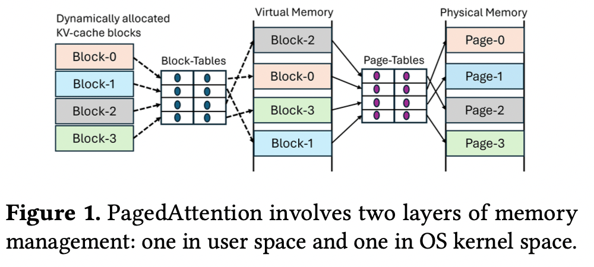
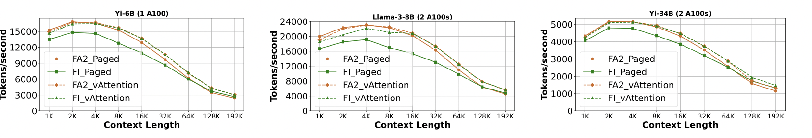

- 论文链接：[vAttention: Dynamic Memory Management for Serving LLMs without PagedAttention | Proceedings of the 30th ACM International Conference on Architectural Support for Programming Languages and Operating Systems, Volume 1](https://dl.acm.org/doi/10.1145/3669940.3707256)
- 关键词：KV cache, CUDA

<!-- more -->

---

## 背景

### KV cache

推理过程分为两部分：prefill 阶段，处理所有的输入，生成一个 token；decode 阶段，输入上次迭代生成的 token，输出一个新 token，不断重复这个过程，直到生成结束符

K, V 是所有 token 的，q 是本次迭代的输入。KV 随着迭代次数的增加逐渐累积，旧 token 生成的 KV 是可复用，不需要每次重新计算，是一个存储换计算的策略

KV 的大小：

$$
2*N*(B*L*H*D*P)
$$

上面的字母分别对应层数、batch size、context length、head num、dim、sizeof(dtype)

### KV 管理的演进

#### 连续预分配

Orca 和 FasterTransformer 为所有的请求分配 maximum context length 大小的 KV（Yi-34B model supports context length of up to 200K）。这有两个问题：

1. 实际上并没有使用这么多的空间，浪费了显存

2. 一次性分配所有显存，但 token 的生成是逐步的，可能导致一些请求显存不足，一些请求的显存空闲，显存闲置

这两个因素限制了 batch size，进而限制了吞吐。

#### 不连续按需分配

PagedAttention 按需分配显存，成为目前推理系统的事实标准。

PagedAttention 按需分配显存，导致 KV cache 的虚拟地址不连续，不连续的原因在于 cudaMalloc 是同时分配虚拟空间和物理空间，虚拟空间和物理空间的映射是固定的，物理空间的不连续导致虚拟空间的不连续

不连续导致一些问题：

1. 编程困难：PagedAtten 的 KV 是分块的，不同块的虚拟地址往往是不连续的，需要修改 Attention kernel 的实现，可移植性较低

2. 内存管理模块：推理系统需要维护 KV cache 和显存块之间的映射关系

3. kernel 开销：基于 PagedAttention 实现的 Attention 版本比 FasterTransformer 原生版本慢 20 − 26%，比 FlashAttention-2 慢 37%，比 FlashInfer 慢 42%。原因：指令数量增加 7 − 13%（主要来自查找映射表和一些新增的分支），寄存器溢出

4. cpu 开销：需要将映射表传给 Attention kernel，占 decode 阶段 10%的时间

---

## vAttention

### 设计

vAttention 在按需分配显存的同时，保障了虚拟地址的连续性，达到 PagedAttention 的目的，去掉了缺点。做法和操作系统是一样的。

1. 一开始就连续分配足够大的虚拟空间
   - $2*N*(B*L*H*D*P)$
   - 层数、maximum batch size、maximum context length、head num、dim、sizeof(dtype)
   - 括号里的代表一个虚拟 tensor 的大小，是虚拟空间的分配单元，即内部是连续的

2. 显存按需分配：CUDA virtual memory management APIs 允许单独分配虚拟空间和物理空间，物理空间分配单位是 page-group(数个物理页)

3. 扩展 PyTorch caching allocator，给 KV 对应 tensor 分配虚拟 tensor(没有物理空间)

4. 初始化的时候就分配了虚拟空间和物理空间，只在推理前建立映射

### 性能上的优化

#### 时延

在运行时进行 map 延迟比较高，每次迭代每个请求都可能需要增加物理空间

cuMemMap+cuMemSetAccess 要花费 40us。如果模型有 60 层，一个请求要花费 4.8ms

总时间:$40*B*N*2$

decode：decode 阶段每次只会生成一个 token，所以可以判断下个迭代是否需要申请显存，提前 map。开一个线程提前 map 和计算重叠，一次迭代计算花费几十毫秒到几百毫秒

prefill：采用延迟 unmap，可以把推理结束的 tensor 给新请求复用。为虚拟 tensor 中的一个空闲请求预分配一定的物理空间

#### 显存碎片

原生 API 显存分配粒度比较大（2MB），导致碎片较多

修改了开源 CUDA 驱动，支持 64KB, 128KB and 256KB 分配粒度

## 实验

推理框架：vLLM v0.2.7

kernel：FlashAttention-2 v2.5.9, FlashInfer v0.4.0

prefill 吞吐量：每秒处理的输入 token 数量

decode 吞吐量：每秒生成的 token 数量

系统吞吐量：每分钟完成的请求数量

### prefill 吞吐量

当 context length==192K 时，FA2_vAttention 吞吐量是 FA2_Paged 的 1.24×, 1.26×, 1.24× 倍

### decode 吞吐量

对 Yi-6B，当 batch size==12 时，FA2_vAttention 吞吐量是 FI_Paged 的 1.23× 倍。相比 FA2_Paged，提升较小。因为 decode 阶段是 memory bound，PagedAttention 额外的计算开销被 memory stalls 隐藏

### offline

FA2_vAttention 吞吐量是 FA2_Paged 的 1.18×, 1.15× and 1.13×倍，是 FI_Paged 的 1.19×, 1.23×, and 1.14×倍

### online

FA2_vAttention 请求时延的中位数比 FA2_Paged 减少 42%(QPS 0.25)

### 可移植性

FA3 还未支持 PagedAttention，vAttention 不需要修改就可使用

### 缺点

只有特定版本的 CUDA 驱动开源，如果设置不了物理显存分配粒度，2MB 造成较多显存碎片，限制了 batch size

2MB 粒度可以支持 187，203，56 大小的 batch，64KB 只能支持 240，258，68

