无论是工作还是生活，他都认真对待！无论是开源世界还是家庭亲情他都怀抱深沉热爱！从一开始提修改文档 PR 的边缘者到如今横扫各大开源任务的 Paddle 扫地僧！汪师傅一直在开源界默默努力💪深耕～今天，就让我们一起揭开这位神秘大佬的面纱，探寻他的故事吧！✨✨✨

<!-- more -->

<!-- 导入聊天框功能 -->

<!-- 导入聊天框功能 -->

## 一、汪师傅幸福瞬间

   <!-- 汪师傅幸福瞬间 1 -->
   

       <figure style="width: 80%;">
         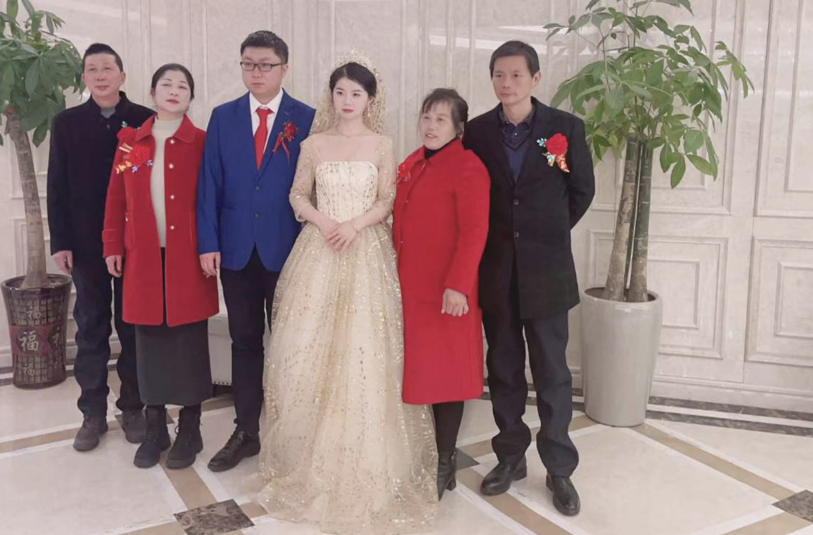
         <figcaption>汪师傅幸福瞬间 1</figcaption>
       </figure>
   

   <!-- 汪师傅幸福瞬间 2-->
   

       <figure style="width: 80%;">
         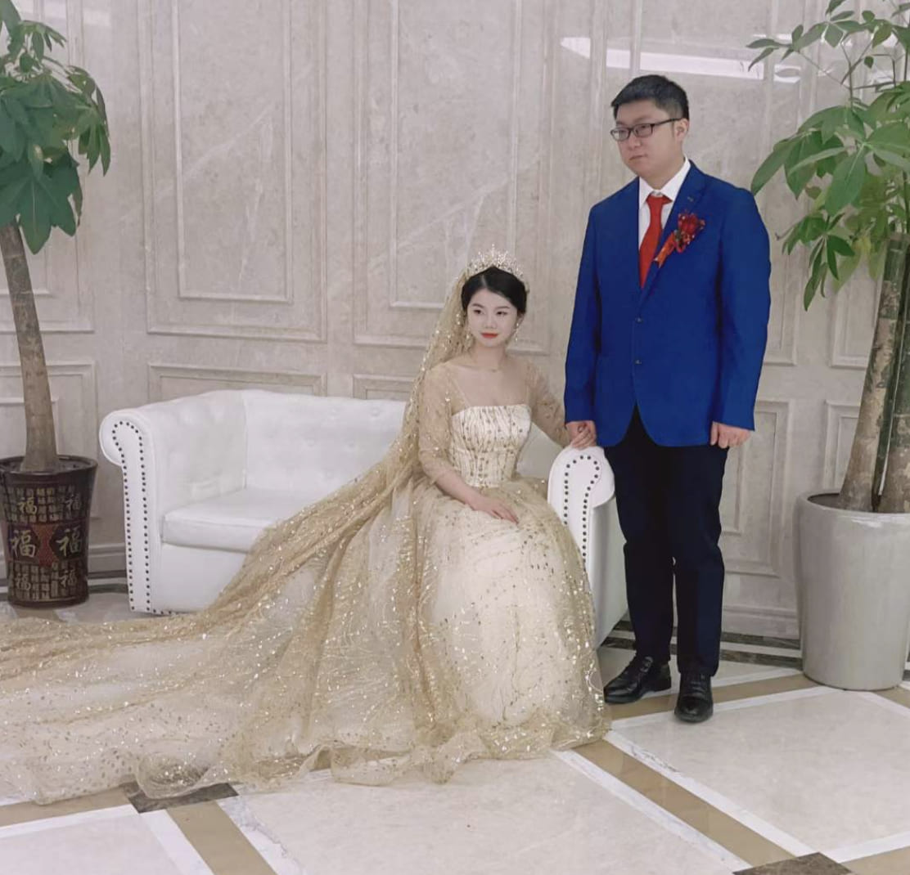
         <figcaption>汪师傅幸福瞬间 2</figcaption>
       </figure>
   

## 二、采访内容

1. **汪师傅给我们介绍一下自己吧！**

   **汪师傅：** 我硕士毕业于兰州理工大学，通信与信息系统专业。老家在安徽安庆，目前在宁波工作，工作 4 年多了。兴趣爱好就是写代码、吃美食、喝酒。

2. **你在兰州理工大学攻读硕士期间，最难忘的经历是什么？**

   **汪师傅：** 在兰州最难忘的就是各种各样的美食。吃得最多的是兰州牛肉面（兰州市以外地区常见的“兰州拉面”与兰州牛肉面并非同一种食物，多为青海化隆拉面）。记得学校里有一个食堂专门做牛肉面，本地人喜欢说去吃一碗牛大。牛肉面讲究一清、二白、三红、四绿、五黄，即汤清、萝卜片白、辣椒油红、香菜和蒜苗绿，以及面条黄亮。面形又分为毛细、细、二细、三细、二柱子、韭叶、薄宽、宽、大宽等等，让人选择不过来。我一般选二细加鸡蛋加一碟牛肉。放哈（“放哈”在兰州方言中意思是"发酵”）的甜胚子奶茶是另一种难忘的美食，点一杯奶茶和三五好友坐在一起聊聊天也是一种享受。
   <!-- 汪师傅拍的兰州牛肉面 -->
   

       <figure style="width: 60%;">
         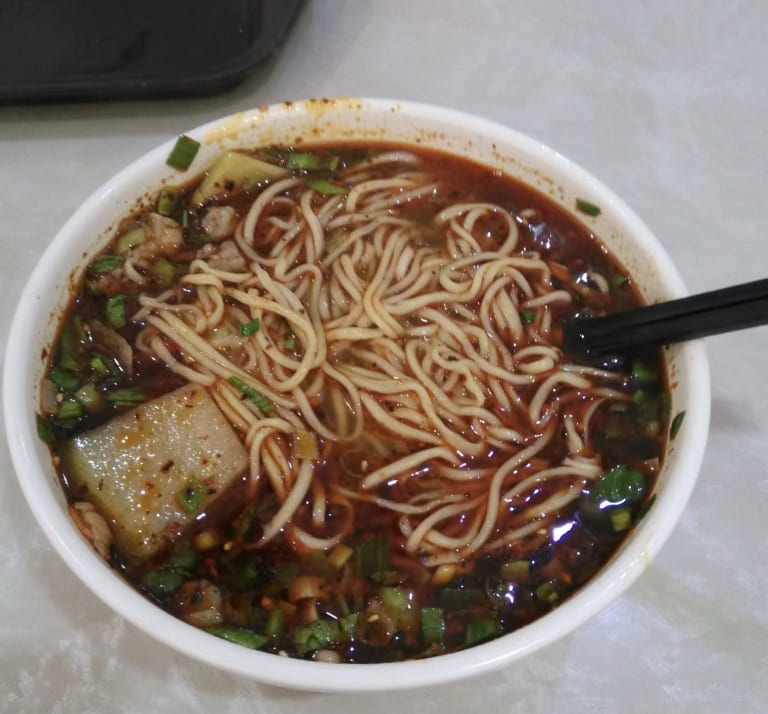
         <figcaption>汪师傅拍的兰州牛肉面</figcaption>
       </figure>
   

3. **你本科在安徽又在兰州读硕士，为什么选择在宁波工作？可以简单讲讲现在工作在做什么呢？**

   **汪师傅：** 找工作的时候，一个亲戚正好拍了一张招聘广告，并且发给我了。招聘的公司在宁波，我就顺手投了一份简历，后面被录用了，就去宁波了。工作主要是做生化、免疫、血脂、血球、尿液分析仪里面涉及算法的部分。

   > 笔者注：汪师傅本科毕业于安徽的淮北师范大学！

4. **汪师傅工作四年多了，觉得工作后自己最大的变化是什么呢？**

   **汪师傅：** 从萌新变成了老油条。

5. **听你说平时喜欢吃美食，可以给我们推荐一下宁波/安徽/兰州分别有啥好吃的东西吗？**

   **汪师傅：** 宁波烤菜年糕、鳗鲞、红膏呛蟹和泥螺都还不错。安徽的话推荐臭鳜鱼和山粉圆子。兰州必须来一碗牛肉面和一杯甜胚子奶茶😁。

6. **通信这类专业好像和深度学习关联不大，你怎么想到去接触深度学习？**

   **汪师傅：** 读研的时候做的是传感器网络和优化算法，对深度学习有些了解。工作的时候开始做信号处理算法和图像处理算法，后面做项目发现用深度学习的方法效果更好，就开始学深度学习了。

7. **你在 Paddle 社区中做了很多贡献，当时为什么想着加入 Paddle 开源社区？后来又为什么一直坚持给 Paddle 做贡献？你觉得这些贡献有什么意义？**

   **汪师傅：** 我是从学习 OCR 接触到 Paddle 社区的。当时在 AI Studio 上有一门课叫「动手学 OCR·十讲」，学习的过程中开始看 PaddleOCR 的代码和文档。在阅读文档的时候会发现错误，就慢慢开始提一些 typo fix 的 PR。而给 Paddle 框架做贡献则是从 Paddle 黑客松和快乐开源任务开始的。我做的第一个 Paddle 框架的贡献是 [[CodeStyle](https://github.com/PaddlePaddle/Paddle/issues/47143)] Compiler Warning tracking issue 相关的。这些开源贡献的意义大概是加深了对开源框架的理解、提升了自己写代码的能力，对代码质量有了更高的追求。
   <!-- 汪师傅部分开源任务展示 1 -->
   

       <figure style="width: 80%;">
         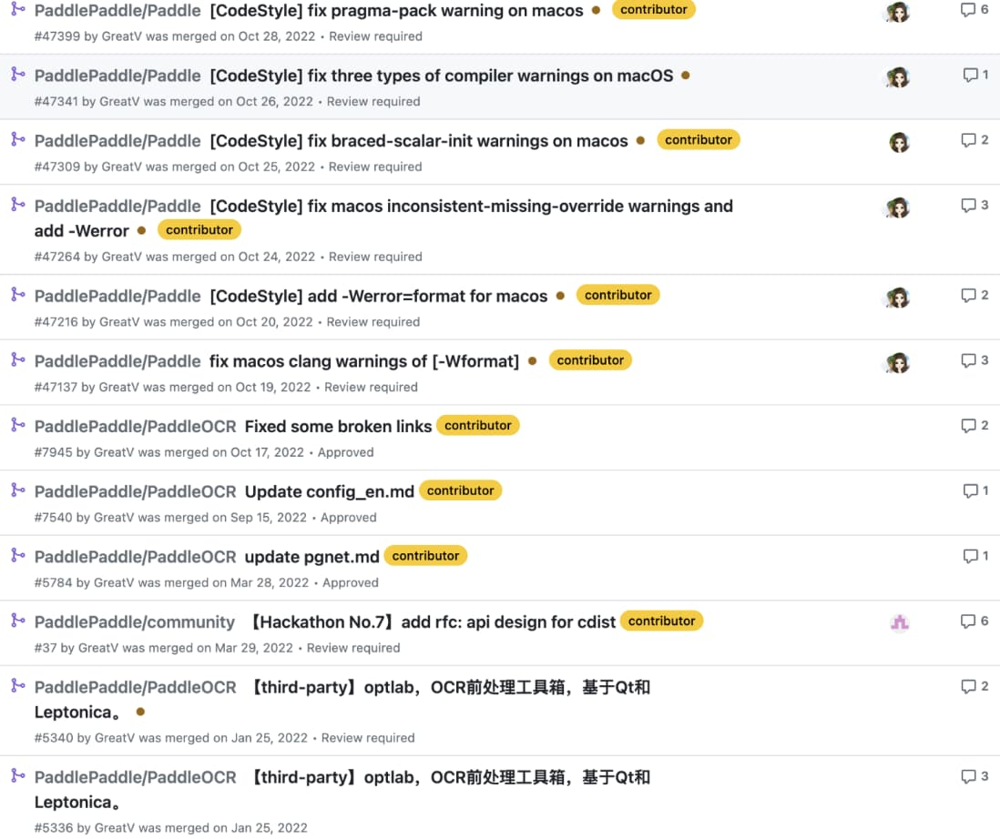
         <figcaption>汪师傅部分开源任务展示 1</figcaption>
       </figure>
   

   <!-- 汪师傅部分开源任务展示 2-->
   

       <figure style="width: 80%;">
         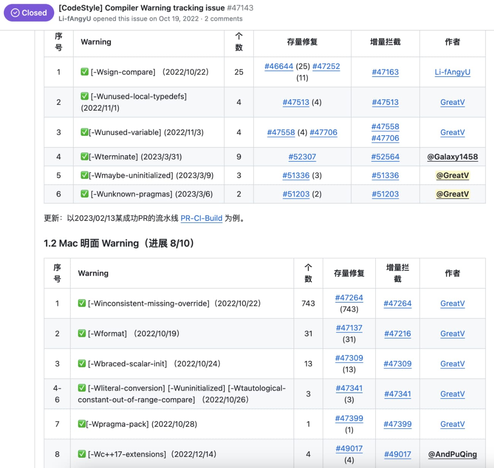
         <figcaption>汪师傅部分开源任务展示 2</figcaption>
       </figure>
   

8. **听说你加入了[飞桨社区开源发展工作组](https://github.com/PaddlePaddle/community/tree/master/pposdwg)🙌🏻，对于该工作组你有什么看法呢？**

   **汪师傅：** 加入 PPOSDWG 后评选新一期开源之星、为社区未来的建设和发展提了一些建议，Paddle2ONNX PMC 也是在工作组讨论中诞生的。PPOSDWG 确实起到了部分社区治理的作用。

9. **听说你也加入了[Paddle2ONNX PMC](https://github.com/PaddlePaddle/Paddle2ONNX/issues/1185)，对于自己加入这个组织你又有什么看法？加入这个组织你想达成一些什么成就呢？**

   **汪师傅：** 我是以 Paddle2ONNX 的用户角色加入的。郑师傅（[@Zheng-Bicheng](https://github.com/Zheng-Bicheng)）是 PMC Chair，已经提了很多 PR，是主要力量。后面我可能就是多解答一些 issue。

   > 为了 Paddle2ONNX 项目的可持续健康发展和加强社区治理， 飞桨社区开源发展工作组决定设立 Paddle2ONNX PMC(Project Management Committee) 来负责 Paddle2ONNX 项目的技术决策和维护。

10.   **据我所知，汪师傅在一家生物公司工作。为什么在生物公司你还是坚持 AI 开源，而且还是 AI 框架开源？**

      **汪师傅：** 生物公司也有很多项目要用到 AI，例如血细胞分类、识别尿液官型、识别液面高度等等。坚持开源主要是下班时间比较早，而我又不喜欢出门玩，只能在家写写代码消磨一下时间。

11.   **看你的 GitHub 热力图是全绿的，是怎么做到的呀？真的在 7*24 小时搞开源吗？**

      **汪师傅：** 下班时候比较早，每天都能写写代码。例如做一做快乐开源任务、做一做黑客松题目，写一写自己的开源项目等等。
      <!-- 汪师傅热力图 -->
      

          <figure style="width: 85%;">
            
            <figcaption>汪师傅的 GitHub 热力图</figcaption>
          </figure>
      

12.   **你觉得参与开源社区对你的事业会有帮助吗？**

      **汪师傅：** 参与开源社区认识了很多有趣的小伙伴，同时也能提升写代码的能力，这些都会对事业有一定的帮助。

13.   **汪师傅有在参与其他社区的开源项目么？有没有什么有趣的开源项目可以分享一下？**

      **汪师傅：** 其他开源项目大部分都是阅读文档时，看到文档有错误，顺手提的 typos fix。如 [scipy DOC: fix typo in cluster/\_hierarchy.pyx](https://github.com/scipy/scipy/pull/12551)、[yolov5 Ignore \*\_paddle_model/ dir](https://github.com/ultralytics/yolov5/pull/10745) 和 [labelme Remove a duplicate statement](https://github.com/labelmeai/labelme/pull/1402)。

14.   **八卦一下，汪师傅和你的妻子是怎么认识的呀？**

          **汪师傅：** 通过我奶奶介绍认识的，她家当时正好在我奶奶家隔壁开店。然后加上了微信，聊聊天，见见面，这样子就认识了。

      <!-- 汪师傅老婆照片集 1-->
       

           <figure style="width: 80%;">
             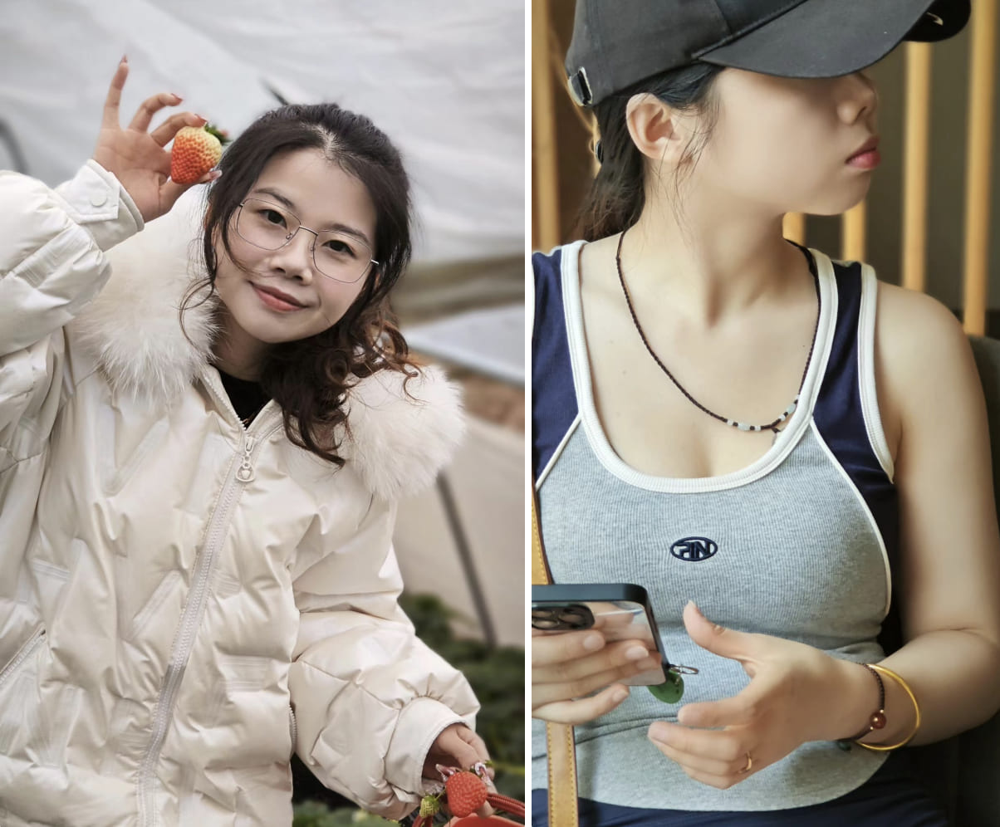
             <figcaption>汪师傅老婆照片集 1</figcaption>
           </figure>
       

       <!-- 汪师傅老婆照片集 2-->
       

           <figure style="width: 80%;">
             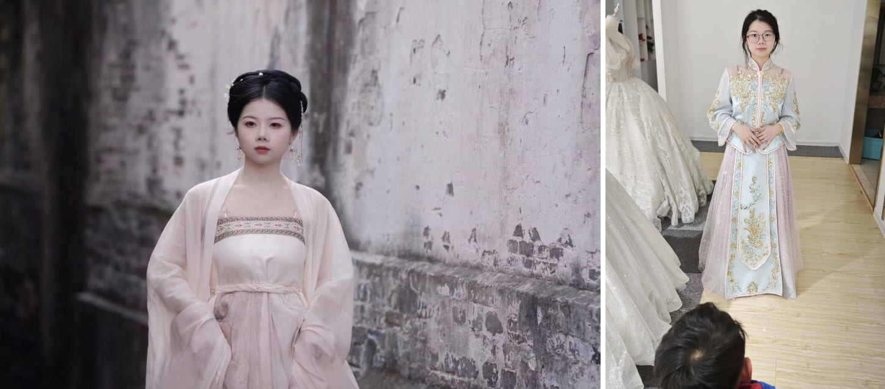
             <figcaption>汪师傅老婆照片集 2</figcaption>
           </figure>
       

       <!-- 汪师傅与老婆合照 -->
       

           <figure style="width: 80%;">
             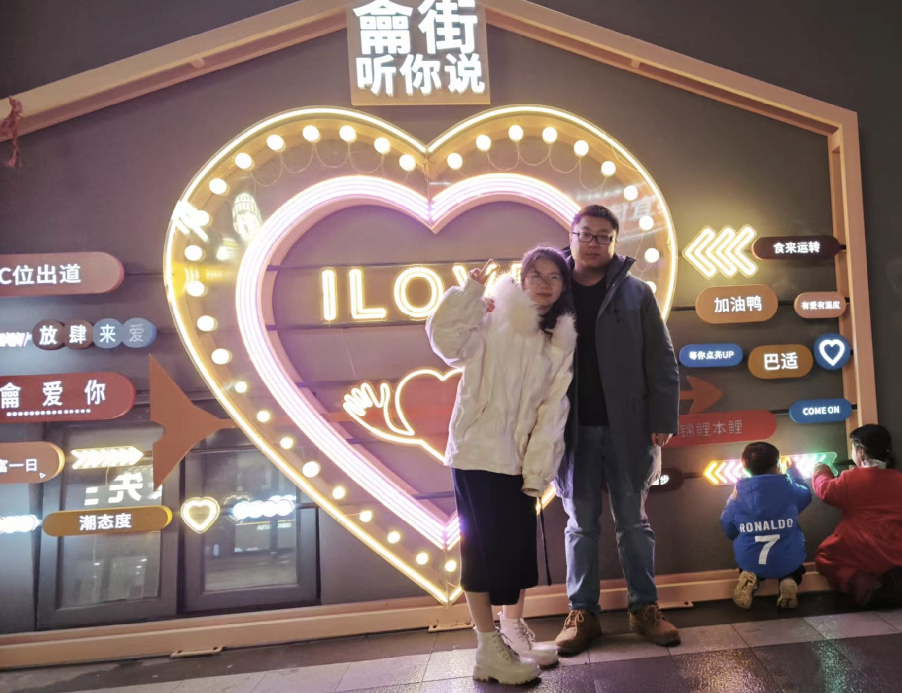
             <figcaption>汪师傅与老婆合照</figcaption>
           </figure>
       

          <!-- 汪师傅与家人合照 -->
       

           <figure style="width: 80%;">
             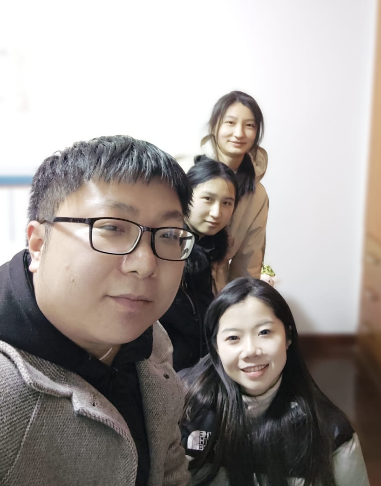
             <figcaption>汪师傅与家人合照</figcaption>
           </figure>
       

15.   **你有什么想对社区小伙伴说的么？**

          **汪师傅：** 热爱生活，热爱开源。

          > 汪师傅也有博客哦！大家可以去看看👉 https://vlight.me/ ❤️ 一起交流技术，共同进步！

      <!-- 汪师傅喝酒照 1-->
       

           <figure style="width: 80%;">
             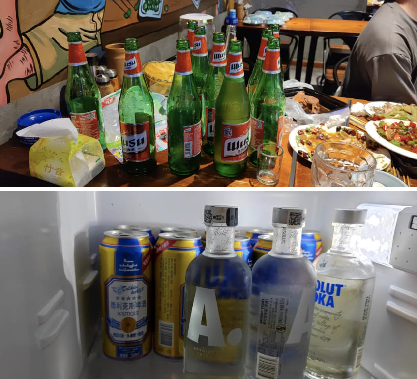
             <figcaption>汪师傅喝酒照 1</figcaption>
           </figure>
       

       <!-- 汪师傅喝酒照 2-->
       

           <figure style="width: 80%;">
             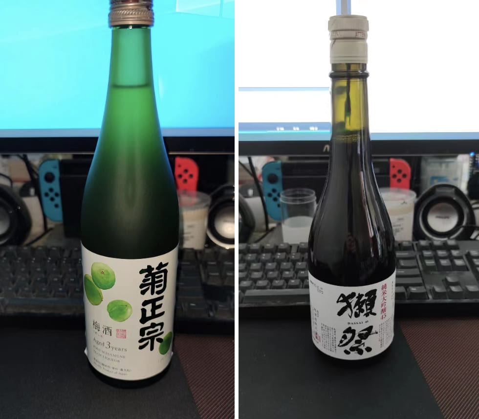
             <figcaption>汪师傅喝酒照 2</figcaption>
           </figure>
       

## 三、神秘汪佬的评论区

### by 涛姐（[luotao1](https://github.com/luotao1)）

<MessageBox>
   <Message name="骆涛" github="luotao1">
   汪师傅在我印象中全能，啥类型的 Paddle 题目都能做，非常 NB。而且是上班的业余时间用来 Paddle 开源，真的太感动了，对  Paddle 是真爱了。
   </Message>
</MessageBox>

### by 张一乔师傅（[liyulingyue](https://github.com/liyulingyue)）

<MessageBox>
   <Message name="张一乔" github="liyulingyue">
   汪师傅！人如其头像！一直感觉是一个什么都会的大佬！
   </Message>
</MessageBox>

### by 李敏师傅（[enkilee](https://github.com/enkilee)）

<MessageBox>
   <Message name="李敏" github="enkilee">
   神秘而强大的 G 佬，和 002 并称飞桨巨头之一的 greatx (但比 002 多了个核心条件😂)，clang-tidy 的领头者，有硬件，有时间，有技术，有想法，多边形战士。
   </Message>
</MessageBox>

### by 散步师傅（[sanbuphy](https://github.com/sanbuphy)）

<MessageBox>
   <Message name="散步" github="sanbuphy">
   感觉汪师傅是 Paddle 扫地僧之一，是很低调很有才华的大神，人狠话不多！😄
   </Message>
</MessageBox>

### by 梦柳师傅（[Ligoml](https://github.com/Ligoml)）

<MessageBox>
   <Message name="梦柳" github="Ligoml">
   去年在上海办 meetup，对汪佬的初印象就是很 i，在一群 i 人中都非常明显哈哈哈，但是很有自己的想法和行动力，提出了很多对开源社区有益的想法，也在积极带领新伙伴融入飞桨快乐开源的氛围，有各位可爱的开发者是飞桨的福气~
   </Message>
</MessageBox>

---

## 写在最后 💡

**【开源江湖闲聊录】** 是一项专门为 Paddle 社区的开发者打造的特色访谈栏目 📚。在这里，我们邀请到每一位别具一格且富有热情的开发者，通过文字或语音的方式进行深入采访 🎙️，探索并展现他们背后独一无二的故事，将他们的经历、见解和创意整理成精彩内容，呈现给整个社区。

---
