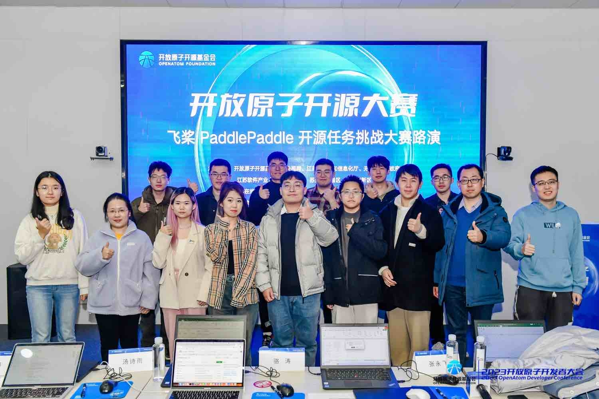
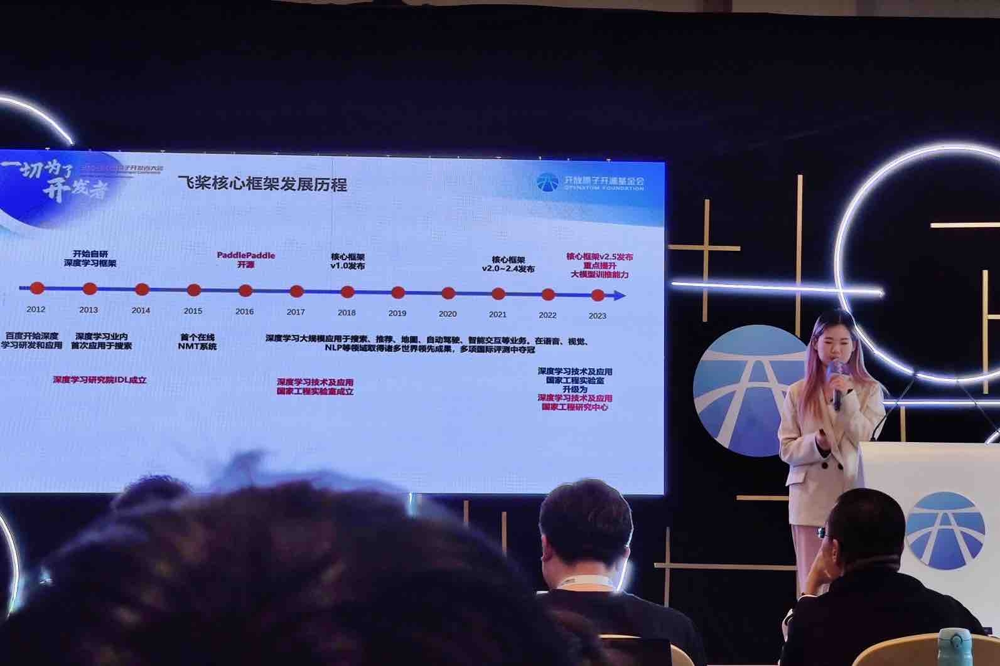
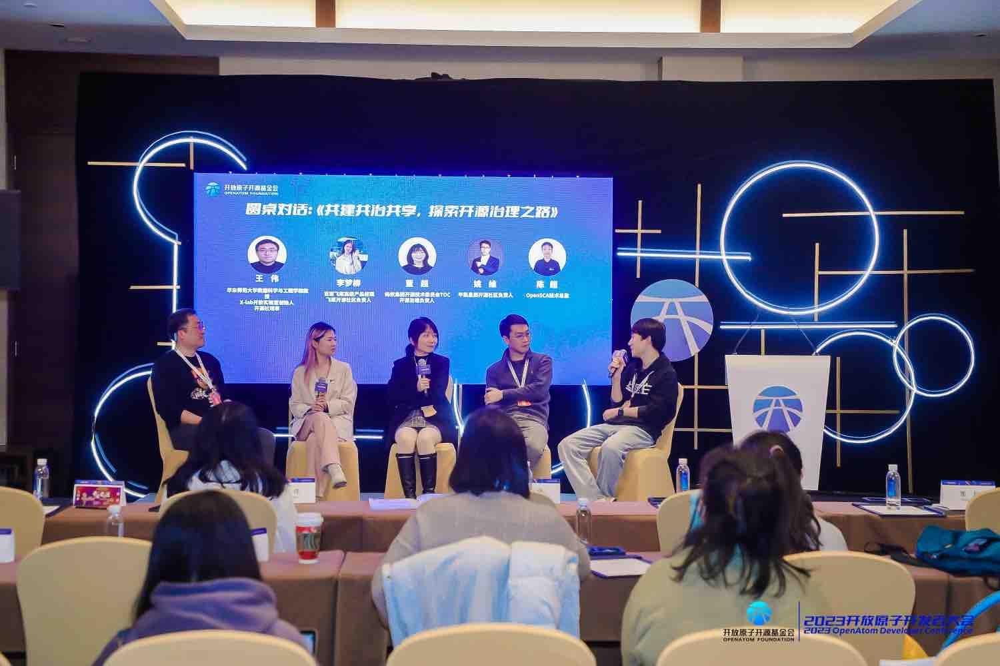
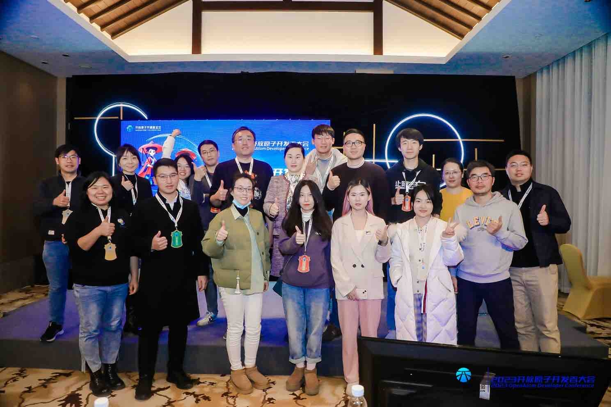
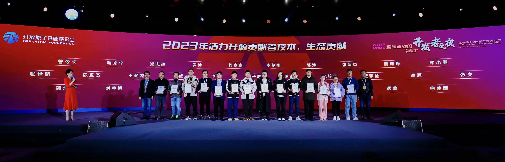
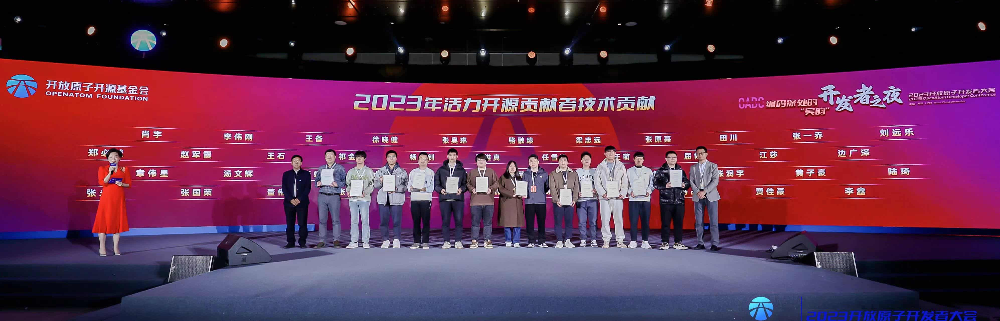
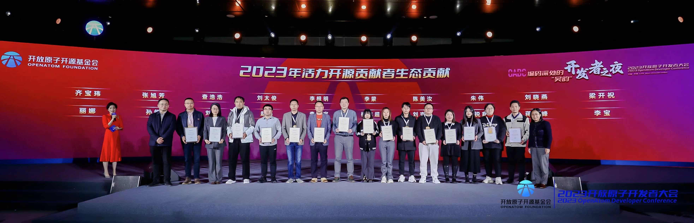
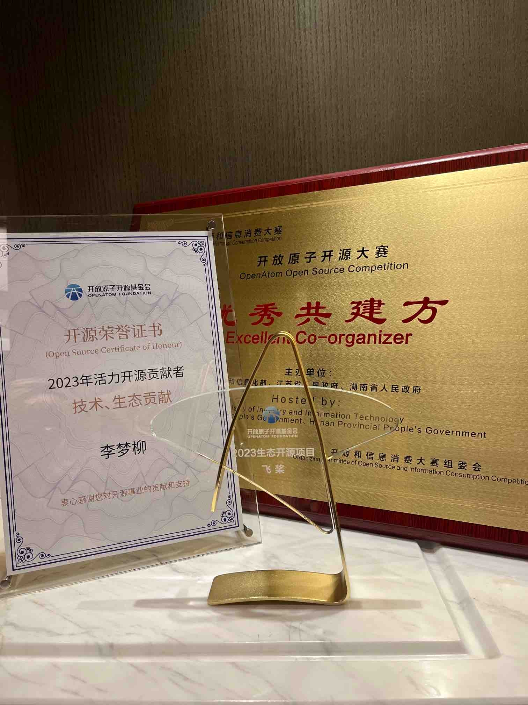

2023 年 12 月 15 日顺利完成[「第一届开放原子开源大赛 - 飞桨 PaddlePaddle 开源贡献挑战赛」](https://competition.atomgit.com/competitionInfo?id=85216ad0ef0811ed99d49fc42bfa011c)决赛路演，产生 2 支一等奖队伍，16 日参加开放原子开源基金会举办的[「2023开放原子开发者大会」](https://openatomcon.openatom.cn/)，与各开源组织与机构同行沟通交流，收获满满~

<!-- more -->

## 开放原子开源大赛 - 飞桨 PaddlePaddle 开源任务挑战大赛 🏁

[开放原子开源基金会](https://www.openatom.org/about)是致力于推动全球开源事业发展的非营利机构。这次飞桨团队受邀参与了「第一届开放原子开源大赛」的共建，发布飞桨 PaddlePaddle 开源贡献挑战赛，**本期共计发布 6 道赛题，报名 39 支团队，收到有效提交作品 8 个，经初步筛选有 5 个作品入围决赛答辩，经 6 位评委线下评审，选出一等奖 2 名、二等奖 2 名、三等奖 1 名。飞桨获「优秀共建方」荣誉 🥳。**

> 还有无锡市公证处的工作人员做现场公示，可正规呢~

| 赛题                                         | 贡献 repo     | 参赛团队            | 团队背景         | 获奖情况 | 提交情况                                                                                                                                                                                            |
| -------------------------------------------- | ------------- | ------------------- | ---------------- | -------- | --------------------------------------------------------------------------------------------------------------------------------------------------------------------------------------------------- |
| 赛题三：SSLD 蒸馏 Teacher 离线化             | PaddleClas    | SOTAFinder 团队     | 上海交通大学     | 二等奖   | 代码开源地址：https://atomgit.com/oliverck/PaddleClas  PR 链接：https://atomgit.com/paddlepaddle/PaddleClas/change/1                                                                            |
| 赛题五：复现图像编辑论文 Null-text Inversion | PaddleMIX     | 你想叫啥就叫啥 团队 | IDEA 研究院      | 一等奖   | 代码开源地址：https://atomgit.com/lalala/PaddleMix  RFC 链接：https://atomgit.com/paddlepaddle/community/change/1  PR 链接：https://atomgit.com/paddlepaddle/PaddleMix/change/1             |
| 赛题六：基于 PINN 的 CFD 离散网格优化        | PaddleScience | FAIR Mesh 团队      | 浙江大学         | 一等奖   | 代码开源地址：https://atomgit.com/bianx/FAIR_PaddleScience  RFC 链接：https://atomgit.com/paddlepaddle/community/change/5  PR 链接：https://atomgit.com/paddlepaddle/PaddleScience/change/2 |
| 赛题六：基于 PINN 的 CFD 离散网格优化        | PaddleScience | 杭电飞碟 团队       | 杭州电子科技大学 | 二等奖   | 代码开源地址：https://atomgit.com/guagua/paddle_hangdian  PR 链接：https://atomgit.com/paddlepaddle/PaddleScience/change/13                                                                     |
| 赛题六：基于 PINN 的 CFD 离散网格优化        | PaddleScience | BUAAC503 团队       | 北京航空航天大学 | 三等奖   | 代码开源地址：https://atomgit.com/generic/sensitivity-PaddleScience  PR 链接：https://atomgit.com/paddlepaddle/PaddleScience/change/1                                                           |

-  活动详情页：https://competition.atomgit.com/competitionInfo?id=85216ad0ef0811ed99d49fc42bfa011c
-  新闻稿件：https://gongyi.cctv.com/2023/12/16/ARTImsV56UJOMQm80Fe9mQik231216.shtml?spm=C74732.Pj8CR3j1HiY5.EYvPQRqpeJWP.2 （上央视啦）

> 梦师傅注✍️：很有精神！

## 开放原子开发者大会 - 开源治理与开发者运营分论坛 💬

这次大会规格很高，百度搜索「2023 开放原子开发者大会」可以看到很多新闻。飞桨受邀参加的是「开源治理与开发者运营分论坛」，梦师傅有一个关于飞桨开源社区的分享，同时也是分论坛的主持人和圆桌嘉宾，被现场导演戏称为「全场最忙的人」🤣。

-  新闻稿件：https://mp.weixin.qq.com/s/tNo1iAJGuB4Er0nReKyzBw

## 开放原子开发者大会 - 开发者之夜 🌠

还没完！晚上的开发者之夜，有央视的主持人姐姐和无锡当地的 Rap 天团，各路整活层出不穷。现场颁发了「2023 年活力开源贡献者」和「2023 年生态项目」奖，咱们飞桨社区有 17 名开发者入选 🤩，同时拿到了生态项目奖哦 🥰，给各位优秀的贡献者和飞桨点赞 👍 ~

「2023 活力开源贡献者-技术、生态贡献」奖：陈锐彪（[From00](https://github.com/From00)）、李梦柳（[Ligoml](https://github.com/Ligoml)）、骆涛（[luotao1](https://github.com/luotao1)）、张留杰（[Aurelius84](https://github.com/Aurelius84)）、刘宇博[RedContritio](https://github.com/RedContritio)、何森森（[HydrogenSulfate](https://github.com/HydrogenSulfate)）

「2023 活力开源贡献者-技术贡献」奖：黄子豪（[DrRyanHuang](https://github.com/DrRyanHuang)）、田川（[gouzil](https://github.com/gouzil)）、张一乔（[Liyulingyue](https://github.com/Liyulingyue)）、刘远乐（[yuanlehome](https://github.com/yuanlehome)）、卢雨畋（[sanbuphy](https://github.com/sanbuphy)）、陆琦（[MarioLulab](https://github.com/MarioLulab)）、徐晓健（[SigureMo](https://github.com/SigureMo)）、詹荣瑞（[zrr1999](https://github.com/zrr1999)）、郑必城（[Zheng-Bicheng](https://github.com/Zheng-Bicheng)）、崔子航（[Asthestarsfalll](https://github.com/Asthestarsfalll)）

「2023 活力开源贡献者-生态贡献」奖：李志宇（[heavyrain-lzy](https://github.com/heavyrain-lzy)）

最后展示一个大合照 🏆 ~ 2023 收获满满，2024 一定会更好！提前给大家拜个早年 🧧🧨

