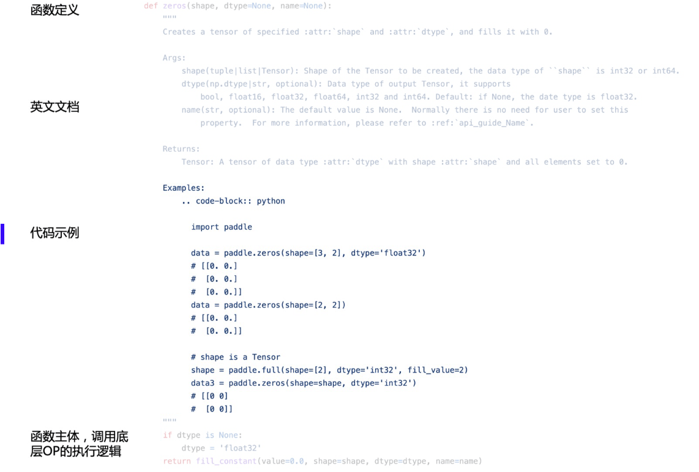
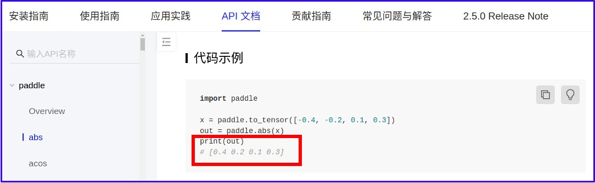
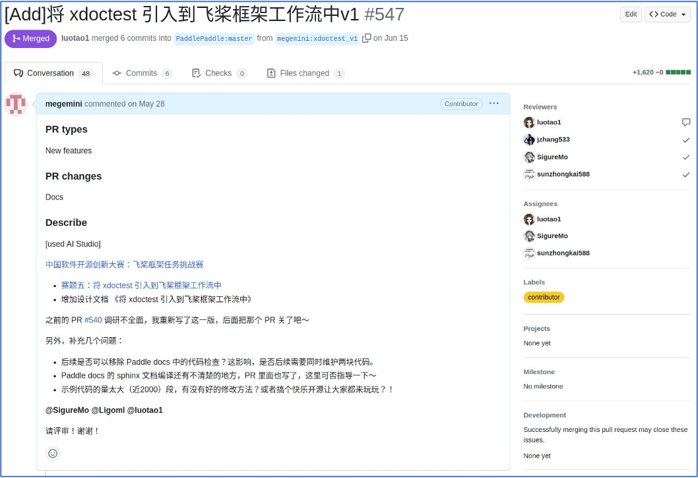
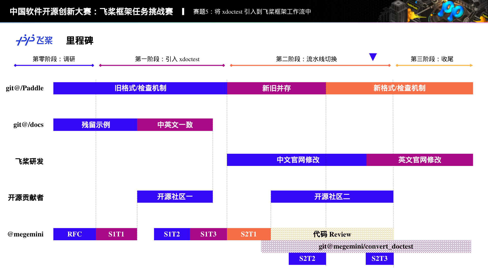
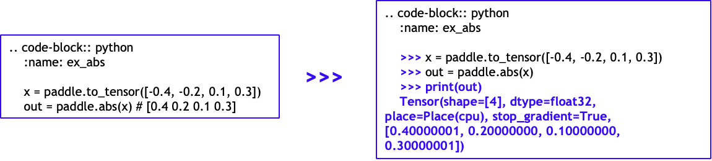
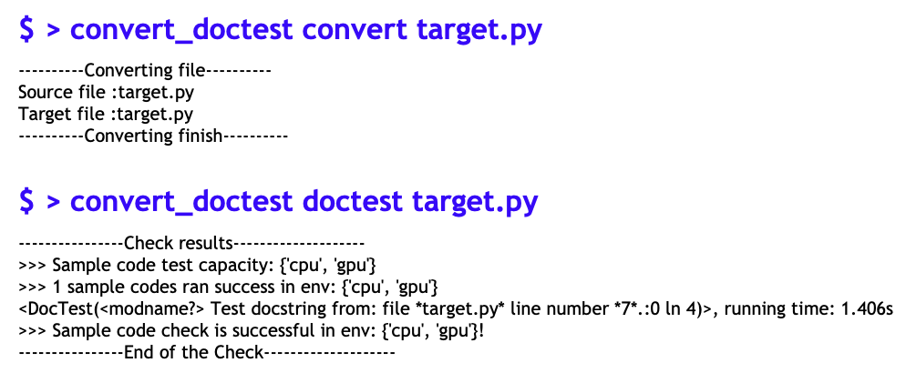

【将 xdoctest 引入飞桨工作流】的项目总结。

<!-- more -->

<!-- 导入聊天框功能 -->

【[将 xdoctest 引入飞桨工作流](https://github.com/PaddlePaddle/Paddle/issues/54705)】 是第六届“中国软件开源创新大赛”开源任务挑战赛赛道——[飞桨框架任务挑战赛](https://github.com/PaddlePaddle/Paddle/issues/53172)的赛题之一（赛题五），由社区开发者**顺师傅**（[@megemini](https://github.com/megemini)）主导，是 Paddle 社区迄今为止影响范围最大的开源活动 🎊。该项目规模极其庞大，涉及一千多个 API 示例的整合和数十万行代码的优化，由超过 20 名社区开发者共同参与完成。

- 想知道顺师傅的故事 👉 [【开源江湖闲聊录】社区掌舵人：顺师傅的 Paddle 之旅](./shun-story.md)
- 想了解“中国软件开源创新大赛” 👉 [活动详情](https://aistudio.baidu.com/competition/detail/911/0/introduction)、[活动剪影](./xian-event.md)

本篇博客主要依据顺师傅的赛题答辩内容进行编写，从**过去**、**现在**、**未来**三个角度，对项目进行分析、总结和展望。

## >>> print(past) 过去

### 01 - 关于任务

文档是用户了解项目最主要的方式，而 API 文档更是承担了用户了解每个 API 使用方式的重要入口。Paddle 为上千个公开 API 提供了详尽的 API 文档，每个 API 都有对应的示例代码，以便用户能够最直观的了解 API 的使用方式。

但由于历史原因，Paddle 的 API 文档中的示例代码是直接使用 Python 代码块形式编写的，这使得我们无法对示例代码的输出进行自动化检查，从而无法保证展示给用户的示例代码的有效性，导致经常出现用户发现文档中的输出与实际运行结果不一致的情况。

<!-- 示例代码 -->

    <figure style="width: 80%;">
        
        <figcaption>过去 API 文档示例代码格式</figcaption>
    </figure>

而本任务，则是要求将 xdoctest 工具引入到 Paddle CI 检查流水线中，利用 xdoctest 能够自动执行示例代码，并对示例代码的输出进行检查的特性，对 Paddle API 文档中的示例代码进行检查，确保示例代码的输出结果与实际运行结果一致，从而提高 Paddle API 文档的质量。

#### >>> print(why_do_it) 为什么做这个事情？

文档是开发者接触 Paddle 的第一手学习资料，需要保证用户能够 **快速、正确** 地上手 Paddle 框架，代码示例的重要程度也就不言而喻。

#### >>> print(do_it_fast) 何为快速？

能够引导用户学习飞桨官方文档，并直接获得使用相应 API 接口的能力。

#### >>> print(do_it_right) 何为正确？

提供给用户正确运行、结果符合预期的示例代码。

### 02 - 现有方案

过去 Paddle 的 API 文档示例代码，对于普通 Python 语句没有提示符要求，对于输出则使用 `#` 进行注释。

#### >>> print(problem) 过去这样做有什么问题？

- 需要用户自己区分普通注释与代码输出
- 不符合 Python 开源项目里对可交互示例的实践和习惯
- 代码检查不严格，只保证运行，**不保证正确**

#### >>> print(solutions) 都有哪些现成的解决方案？

Python 标准库中内置了 [doctest](https://docs.python.org/3/library/doctest.html) 可用于示例代码的自动执行和检查。但 doctest 是使用正则表达式来解析示例代码部分的，这使得示例代码的编写必须遵循严格的格式要求。

[xdoctest](https://xdoctest.readthedocs.io/en/latest/) 是一个基于 AST 的 Python 示例代码自动执行和检查工具，相比 doctest，xdoctest 的示例代码格式要求更加宽松，xdoctest 作者在博客 [Extending Python Doctests – xdoctest](https://erotemic.wordpress.com/2018/06/12/extending-python-doctests-xdoctest/) 详细阐述了这一点。

显然后者是更适合 Paddle 的需求的，因此我们选择将 xdoctest 作为引入 Paddle CI 检查流水线的基础工具。这里为什么说是基础工具呢？是因为在后期迭代开发过程中发现 xdoctest 本身也有很多不足，因此我们在 xdoctest 的基础上进行了大量的二次开发，以满足 Paddle 的需求。

### 03 - 挑战

#### >>> 可以预见的挑战

- 有 800 万开发者每天都在学习、使用 Paddle 框架，xdoctest 的引入**需要无缝切换**
- Paddle 框架包含 1400+ API，还涉及到版本更迭、API 迭代，**框架庞大复杂**
- 由于深度学习特殊性，同一示例代码在不同设备环境（CPU、GPU）会有差异性，**需要区别验证**

#### >>> 项目的三个大坑

- 历史包袱重
- 项目管理难
- 工程量巨大

## >>> print(now) 现在

### 01 - 项目分解

一切源于一场对[设计文档（RFC）](https://github.com/PaddlePaddle/community/pull/547)的讨论。

<!-- RFC讨论 -->

    <figure style="width: 80%;">
        
        <figcaption>RFC 设计文档</figcaption>
    </figure>

#### >>> print(discussion) 都讨论了些什么？

在顺师傅和我们的交流中，共同抛出了相当多的问题进行讨论。这个阶段也遇到了项目的第一个大坑——**历史包袱重**。

##### 设计文档（抛开可以预见的那些挑战不说）

- Paddle 代码和 docs 都有代码检查逻辑
- 代码检查逻辑还不尽相同
- Paddle 与 PyTorch 很多实现方式不一样
- PyTorch 的检查方式并不完整

##### 后知后觉

- 文档中的示例代码未及时随着框架的演进和接口的的变化更新
- 接口变动、逻辑变动
- 与单元测试关注点不同，测试方案不同

#### >>> print(rfc_for_project) 完成设计文档

经过细致的讨论和顺师傅对上述问题的梳理，逐渐理清了项目设计思路，并最终完成设计文档，正式启动项目。

- 各方参与几十轮的讨论
- **11470** 字
- **36** 页
- **2** 个大版本，**3** 个小版本

#### >>> print(milestones) 里程碑

在顺师傅完成项目拆解后，开始着手开发。此时遇到第二个大坑——**项目管理难**。

<!-- milestones -->

    <figure style="width: 60%;">
        
        <figcaption>项目 milestones</figcaption>
    </figure>

#### >>> print(just_use_it) 直接用 xdoctest 不行吗？

xdoctest 并不适用如 Paddle 此类庞大复杂的框架。

- **【接口遍历不全】** 对于全局命名等情况无能为力
- **【检查环境混用】** 不能隔离多个示例检查的逻辑
- **【无数据类型检查】** 不能比对浮点数、复数等情况
- **【无法进行全局控制】** 如 timeout，错误语句等

#### >>> print(technique_solutions) 主要的技术解决方案

- **针对【接口遍历不全】** 此次任务沿用飞桨原有的接口遍历逻辑，将原有的 xdoctest 的检查逻辑进行拆分
- **针对【检查环境混用】** 此次任务利用多进程技术对执行环境进行隔离，进而防止环境污染等情况
- **针对【无数据类型检查】** 此次任务对 xdoctest 的检查逻辑进行 patch，从而可以比对整数、浮点数、复数等情况
- **针对【无法进行全局控制】** 引入全局指令、全局语句检查机制

#### >>> print(technique_solutions.\_\_more\_\_)

进行重构，优化迁移环境

- 全局指令转换
- 抽象示例检查类
- 解耦示例检查流程与检查类
- 解耦示例检查结果
- 日志级别分离

#### >>> print(workload) 工作量有多大？

由于 Paddle 的公开 API 数量众多，且需要全量的优化对应文档的示例代码，所以在该阶段遇到第三个大坑——**工程量巨大**。

因此，我们选择**相信开源的力量**，号召 Paddle 社区的伙伴一起参与进来！

- 代码到文档全流程
- 上千个 API
- 数百个源文件
- 数十万行代码
- 已有 24 位开发者近 3 个月的贡献

### 02 - 里程碑

### 03 - 开源社区

#### >>> print(happy_open_source) 社区快乐开源活动

飞桨快乐开源活动旨在鼓励更多的开发者参与到飞桨社区的开源建设中，帮助社区修复 bug 或贡献 feature，加入开源、共建飞桨。

在本赛题中，顺师傅发起了 2 个衍生的快乐开源任务，借助社区的力量来一起全量优化 Paddle 文档的示例代码。

#### >>> print(missions_0) 开源任务一 ： 修改中英文示例一致

修改目前 Paddle docs 中仍使用 code-block 的示例代码为 COPY-FROM [docs#5957](https://github.com/PaddlePaddle/docs/issues/5957)

<!-- COPY-FROM -->

    <figure style="width: 80%;">
        
        <figcaption>中文文档示例代码全部以 COPY-FROM 的形式和英文保持一致</figcaption>
    </figure>

#### >>> print(missions_1) 开源任务二 ： 修改旧的示例代码

\[xdoctest\] 分批次修改已有代码的示例 [#55629](https://github.com/PaddlePaddle/Paddle/issues/55629)

<!-- xdoctest -->

    <figure style="width: 80%;">
        
        <figcaption>修改已有示例以符合 Google Style样式</figcaption>
    </figure>

在开源任务二中，由于需要把控示例代码的修改效果，顺师傅也从开发者的身份逐渐转变成 **Reviewer**。

##### >>> print(reviewer)

- 更关注用户的体验
- 更关注代码的质量
- 更清楚开发者的诉求

##### >>> print(reviewer.\_\_task\_\_)

- 熟悉 review 工作流
- 任务拆解
   - 第一批：简单，开发者熟悉环境与流程
   - 第二批：复杂，涉及 CPU/GPU 环境等情况
   - 第三批：困难，涉及 C++、并行、静态图等
- 阶段总结，问题反馈
- 开发、打磨工具 `convert_doctest`

##### >>> print(convert_doctest.\_\_doc\_\_) 辅助工具

为了方便社区开发者完成示例代码的修改，顺师傅开发了 [convert_doctest](https://github.com/megemini/convert_doctest) 辅助工具，能够实现：

- **对示例代码进行初步转换** ：自动修改示例格式，节省大量人工修改的时间。
- **对修改后的示例代码进行本地检查** ：不用等待 CI 的运行结果，本地即可验证与修改。

极大提升了社区开发者完成任务的效率。

<!-- convert_doctest -->

    <figure style="width: 80%;">
        
        <figcaption>convert_doctest 效果</figcaption>
    </figure>

#### >>> print(missions_bravo) 整体开源贡献

- 共有 **24 位** 开源开发者参与。
- 涉及约 **450 个** 文件。
- 涉及 **数十万行** 代码。
- 已有约 **150 个** PR 被合入。

#### >>> 回顾三个大坑

在项目的开发过程中，前文提到的三个大坑，也被顺师傅逐一击破。

## >>> print(future) 未来

### 01 - 任务总结

#### >>> 整体贡献

**主线** 代码检查特性的迁移 >>> 主要由**个人独立**完成。  
**支线** 新旧示例代码的修改 >>> 主要由**开源社区**完成。

- RFC《将 xdoctest 引入到飞桨框架工作流中》。
- 完成飞桨框架使用 xdoctest 进行示例代码检查的切换。
- 退场飞桨文档原有的示例代码检查。
- 完成飞桨框架全部示例代码对新格式的切换。
- 完成飞桨文档遗留 COPY-FROM 的切换。
- 完成飞桨文档《开发 API Python 端》与《API 文档书写规范》的更新。
- 完成飞桨文档官网对于新格式示例代码的兼容。
- 开源社区任务一：修改目前 Paddle docs 中仍使用 code-block 的示例代码为 COPY-FROM：
   - 涉及 PR：**23 个**；
   - 涉及文件：**82 个**；
   - 开源贡献者：**7 人**。
- 开源社区任务二：xdoctest 分批次修改已有代码的示例：
   - 涉及 PR：**123 个**；
   - 涉及文件：**364 个**；
   - 开源贡献者：**19 人**。

#### >>> 个人贡献

- 调研分析、任务拆解、项目开发、代码 review。
- RFC《将 xdoctest 引入到飞桨框架工作流中》
- 完成飞桨框架使用 xdoctest 进行示例代码检查的切换
- 退场飞桨文档原有的示例代码检查
- 完成飞桨文档《开发 API Python 端》与《API 文档书写规范》的更新
- 提交 PR：**20 个**
- 开源社区 Review PR：**59 个**
- 开发辅助工具 **convert_doctest**

#### >>> 个人收获

- 开源协作，开发者 与 Reviewer 身份的转换
- 学习飞桨，更全面、更深入的学习；学习的越多，需要学习的更多
- 编程能力，更直接的需求反馈与实现
- 开拓视野，开源参与者之广，人外有人

### 02 - 未来规划

#### >>> CONVERT_DOCTEST

- 合入 Paddle、发布到 PyPI，回馈开源社区
- 思考是否有工具可以取代 xdoctest？是否单独开发 doctest 工具？

### 03 - 开源贡献

感谢以下参与开源任务的开发者们～

#### >>> 开源任务一：修改中英文示例一致

[@Ainavo](https://github.com/Ainavo)、
[@Li-fAngyU](https://github.com/Li-fAngyU)、
[@Liyulingyue](https://github.com/Liyulingyue)、
[@RedContritio](https://github.com/RedContritio)、
[@enkilee](https://github.com/enkilee)、
[@gouzil](https://github.com/gouzil)、
[@jjyaoao](https://github.com/jjyaoao)。

#### >>> 开源任务二：修改旧的示例代码

[@AndSonder](https://github.com/AndSonder)、
[@Candy2Tang](https://github.com/Candy2Tang)、
[@Difers](https://github.com/Difers)、
[@DrRyanHuang](https://github.com/DrRyanHuang)、
[@Kaedeharai](https://github.com/Kaedeharai)、
[@KongAKun](https://github.com/KongAKun)、
[@Liyulingyue](https://github.com/Liyulingyue)、
[@PommesPeter](https://github.com/PommesPeter)、
[@SigureMo](https://github.com/SigureMo)、
[@enkilee](https://github.com/enkilee)、
[@gouzil](https://github.com/gouzil)、
[@jinyouzhi](https://github.com/jinyouzhi)、
[@liyongchao911](https://github.com/liyongchao911)、
[@longranger2](https://github.com/longranger2)、
[@ooooo-create](https://github.com/ooooo-create)、
[@sunzhongkai588](https://github.com/sunzhongkai588)、
[@whisky-12](https://github.com/whisky-12)、
[@yoyoIcy](https://github.com/yoyoIcy)、
[@yuchen202](https://github.com/yuchen202)。

#### >>> 飞桨工作人员

[@SigureMo](https://github.com/SigureMo)、
[@sunzhongkai588](https://github.com/sunzhongkai588)、
[@luotao1](https://github.com/luotao1)、
[@jzhang533](https://github.com/jzhang533)。
