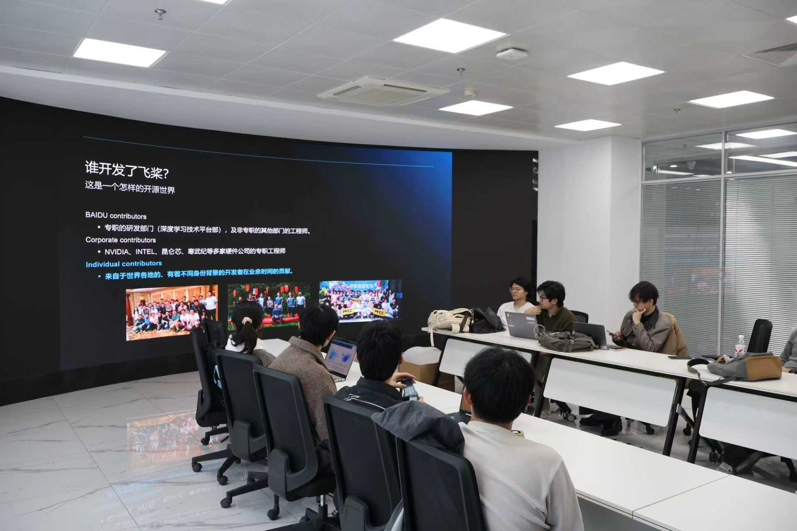
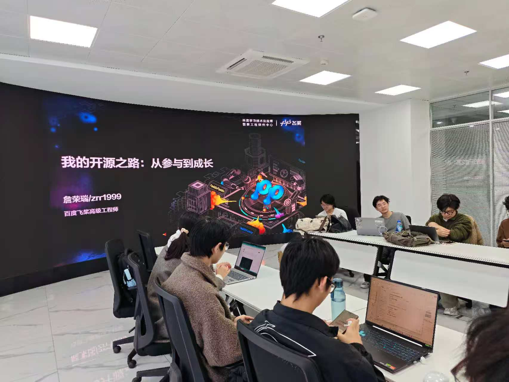
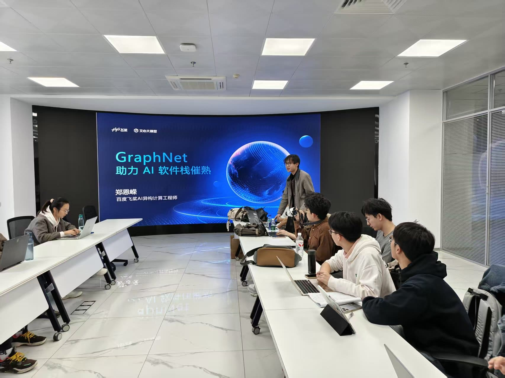
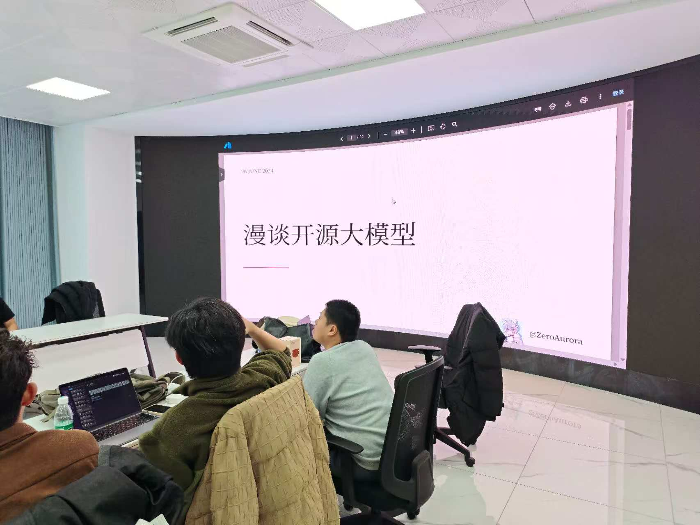
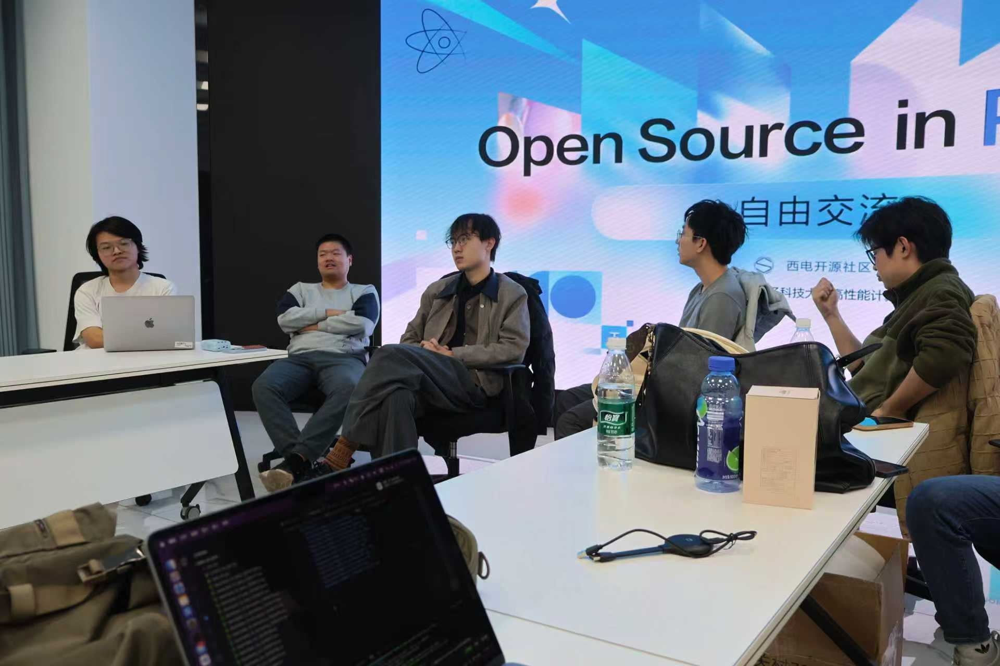
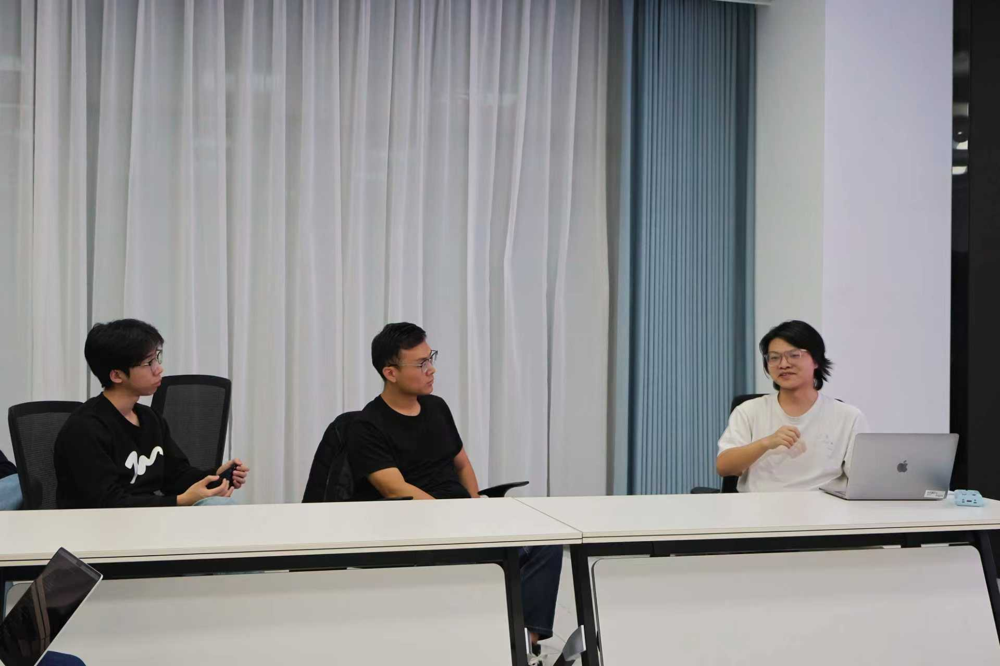
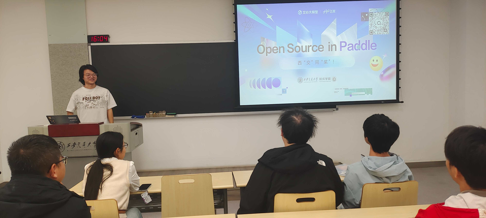
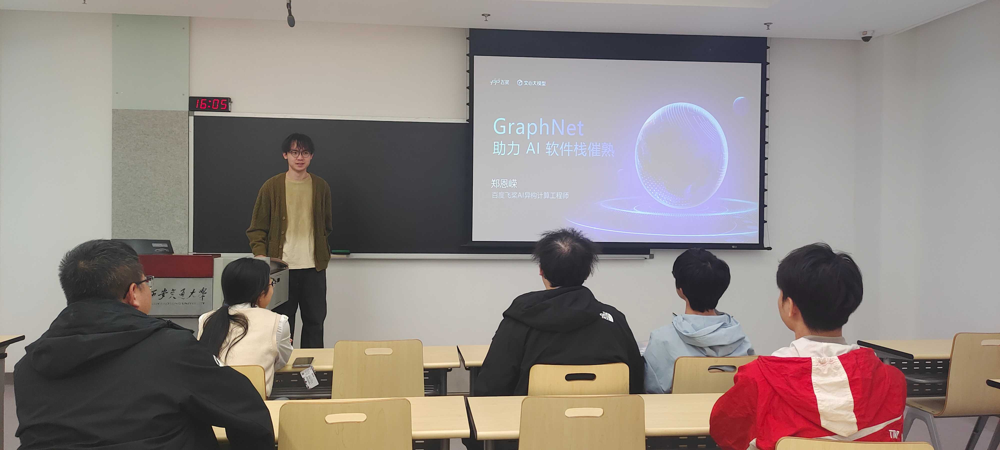
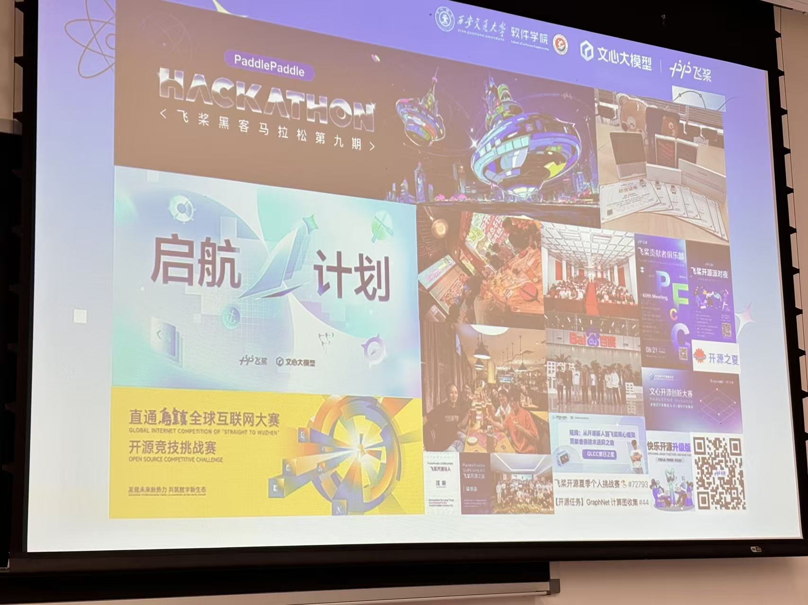
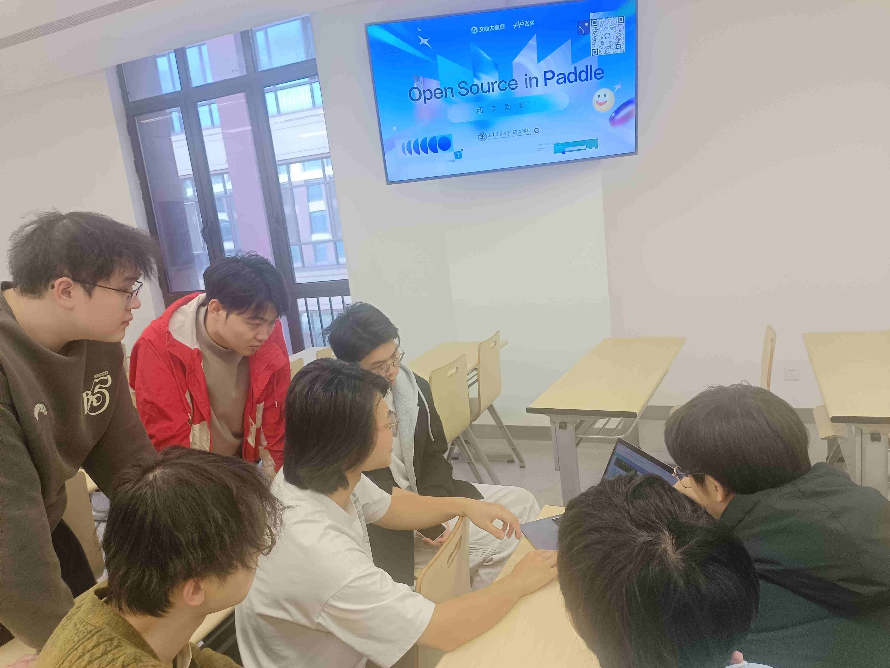

当“开源”不再是任务，而是聊天，我们（PaddlePaddle 飞桨开源社区）与西电开源社区和西安交通大学软件学院的同学们来了一场“不设限”的联合交流会。这两场活动的目的只有一个：拉近距离，分享热爱，不带任何压力。

<!-- more -->

---

## 精彩议程回顾

👋 缘起：当“开源”不再是任务，而是聊天

说实话，我们（PaddlePaddle 飞桨开源社区）一直觉得，最棒的开源交流，不是坐在下面听 PPT，而是像老朋友一样，边问着问题边聊聊开源和最近“折腾”的 AI 小项目。

就在前段时间，大约在公元 2025 年 11 月底，我们把这个想法付诸实践，分别与西电开源社区和西安交通大学软件学院的同学们来了一场“不设限”的联合交流会。这两场活动的目的只有一个：拉近距离，分享热爱，不带任何压力。

结果呢？现场的热情完全超出了预期！同学们的问题一个接一个，从飞桨开源生态到 AI 编译器，从大模型高效推理工具到开源社区玩法，从职业发展到大模型应用，大家聊得非常开心，完全不像是一场“正式”的交流。

## 西电现场

### 1. 分享飞桨开源社区和西电开源社区在做的事情

飞桨开源社区孙钟恺分享了飞桨和文心开源之旅，介绍了飞桨开源社区的生态建设和文心大模型的开源实践。

飞桨开源社区詹荣瑞分享了“我的开源之路：从参与到成长”，讲述了他在飞桨开源社区的成长经历和开源对职业发展的影响。

飞桨开源社区郑恩嵘分享了“GraphNet & ai4c —— 下一代 AI Infra 机床计划”，介绍了 GraphNet 数据集和 AI 编译器的最新进展。

西电开源社区 ZeroAurora分 享了漫谈开源大模型，介绍了大模型开源的现状和未来趋势。

西电开源社区钱锦一分享了包管理与构建系统：从混沌到秩序，讲述了包管理和构建系统的发展历程和挑战。

### 2. 西电圆桌开源热情，Open Source in Paddle: Hello，异世界的开发者！

在西电高性能计算中心支持的场地上，我们感受到了最直接、最热烈的开源氛围。

活动议程虽然设计得“松散”，但同学们的互动欲望却非常强。当分享完飞桨社区的日常活动、AI Infra 机床计划（GraphNet & ai4c）等议题后，活动很快进入了高潮——圆桌与自由交流环节。

飞桨开源社区与西电开源社区的同学们围坐在一起，畅谈开源那些事儿。大家从第一次接触开源说起，聊到怎么选择开源项目，再到如何参与开源社区，最后聊到开源对职业发展的影响。大家聊得非常开心，完全不像是一场“正式”的交流。

大家在交流的过程中提到了参与开源的契机，关于“契机”这个话题，大家有很多共鸣。有人是因为课程项目，有人是因为兴趣爱好，还有人是因为朋友推荐。无论是哪种方式，大家都觉得参与开源是一个非常好的机会，可以学习新技术，结识新朋友，提升自己的能力。

编者注✍️：值得一提的是，飞桨开源社区为西电和西交的同学单独定制了启航计划社团版，西电东同学们很积极地报名参加了，期待他们在飞桨开源社区的精彩表现！可能这场活动就是很多人参与飞桨开源的“契机”吧～

不管是飞桨的开发者还是西电的开源人，都毫不保留地分享了自己的故事。这种零距离的提问与解答，让大家找到了在代码世界中并肩作战的共鸣。这证明了我们最初的理念：有“人味”的交流，比任何精美的 PPT 都更有力量。

## 西交侧记：教室里的深度私聊

与西电的圆桌热烈氛围略有不同，我们在西安交通大学软件学院的交流则显得更注重深度与链接。

虽然会议的议题也很丰富（如刘卓鑫的《Open Source in Paddle: 西”交“同”桨“！》、星河社区的分享等），但最打动人心的，是活动结束后那段宝贵的私聊时间。在西交的教室里，飞桨开源社区与西交的同学们进行了深入的私聊。大家围坐在一起，分享各自的开源经历和对未来的期待。这样的交流让大家更加了解彼此，也让开源的精神在这个小小的教室里得到了传承。

### 1. 活动现场

西交的同学们同样展现出了极大的热情，积极参与讨论，提出了许多有深度的问题。飞桨团队也耐心地解答了大家的疑问，分享了许多实用的经验和技巧，让大家受益匪浅。

### 2. 深度私聊

活动结束后，飞桨开源社区与西交的同学们进行了深入的私聊。大家围坐在一起，分享各自的开源经历和对未来的期待。这样的交流让大家更加了解彼此，也让开源的精神在这个小小的教室里得到了传承。

### 3. 论西交创新港是不是西安及西交的鸽子

西交的鸽子不怕人，而且异常肥。看来平日的伙食不错，同学们都很喜欢在附近散步，顺便赶一赶这些“走地鸽”。

说个引战的言论：论西交创新港是不是西安，编者在活动结束后打车回酒店，发现打车的软件显示只能在西安使用，说创新港是咸阳市，真是悲报。编者最后坐地铁坐了几站到达西安属地，才打车回的酒店。

## 结语

👋 开源的世界很大，但我们一起走，会更温暖
🤝 总结：开源的世界，因为你我而温暖

无论是西电圆桌上的热烈抢答，还是西交私聊时的深度链接，这两场活动都清晰地传递了一个信号：高校里的开源热情正在熊熊燃烧。

我们希望通过这样的活动，让大家意识到：开源不是一项任务，它是一种生活方式，是朋友间的闲聊，是共同成长的温暖旅程。

就像我们所说：开源的世界很大，但我们一起走，会更温暖。

感谢西电开源社区和西安交通大学软件学院同学们的热情参与！我们已经建立了联合微信群，后续将继续分享资源，并期待下一次更具挑战的联合！

你对飞桨或开源 AI 有任何新的想法吗？欢迎发邮件给我们 📮 ext_paddle_oss@baidu.com !
