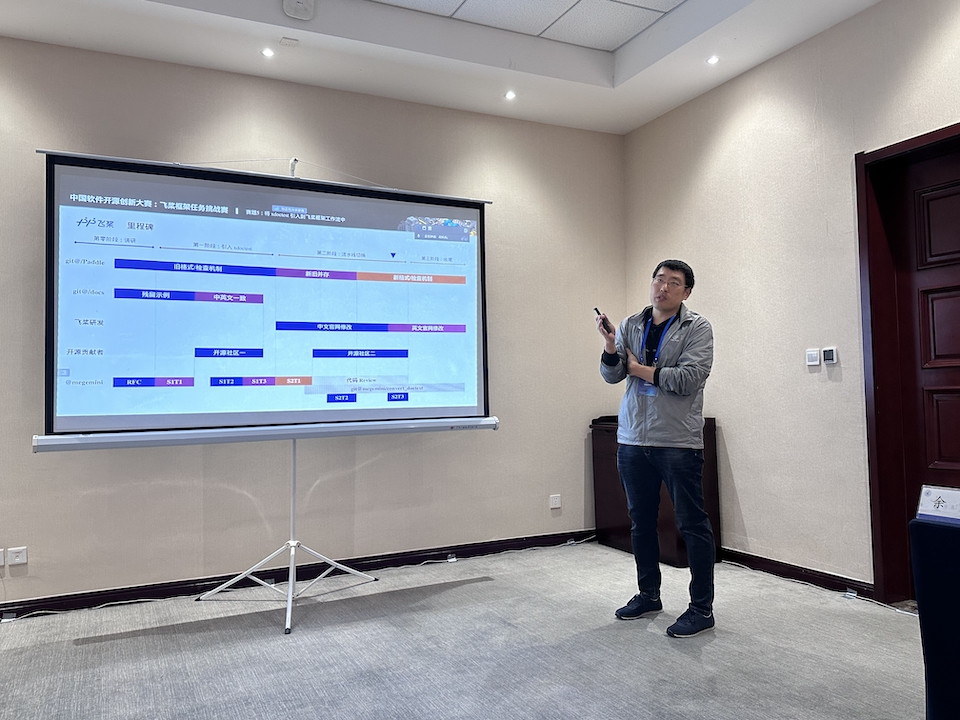
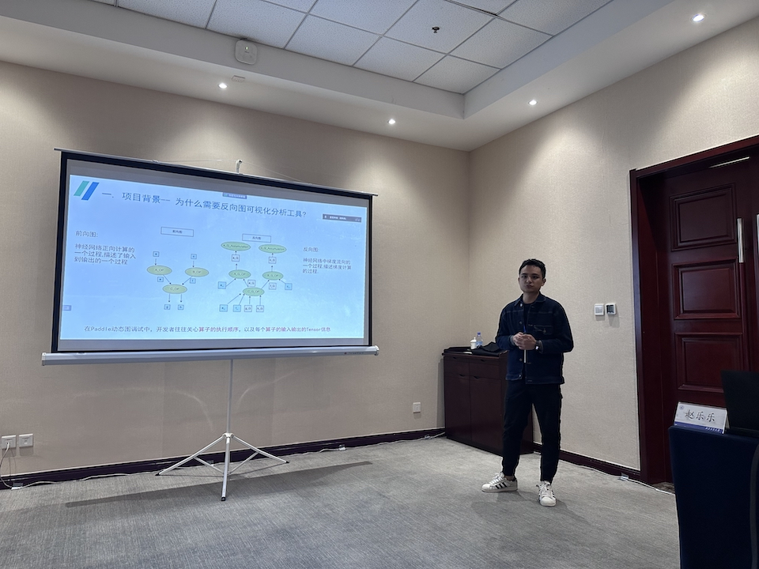
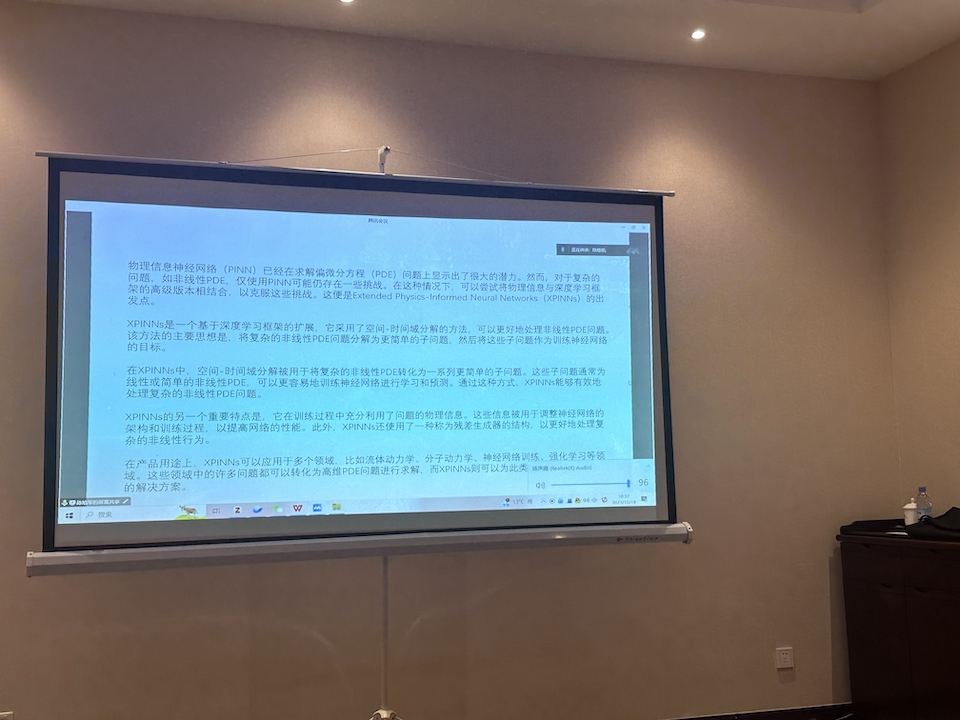
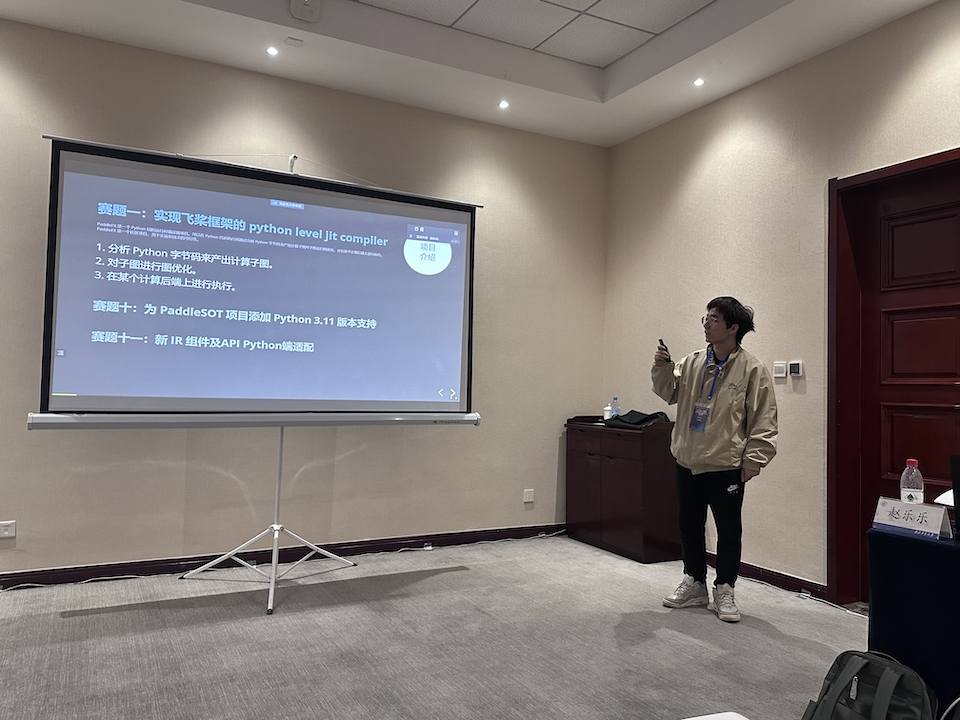
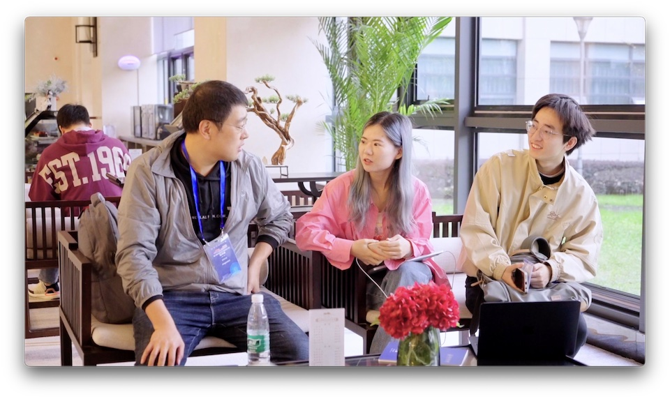

在中国计算机学会组织的中国软件开源创新大赛上，飞桨开源社区的全部比赛已经完成。恭喜以下获奖的同学：

-  一等奖：[@megemini](https://github.com/megemini)
-  二等奖： [@qiuwenbogdut](https://github.com/qiuwenbogdut)、 [@co63oc](https://github.com/co63oc)、 [@zrr1999](https://github.com/zrr1999)。
-  三等奖：[@Liyulingyue](https://github.com/Liyulingyue)、 [@AndSonder](https://github.com/AndSonder)、 [@gouzil](https://github.com/gouzil)、 [@Difers](https://github.com/Difers)、 [@Tomoko-hjf](https://github.com/Tomoko-hjf)、 [@yangguohao](https://github.com/yangguohao)、 [@enkilee](https://github.com/enkilee)、 [@GreatV](https://github.com/GreatV)、 [@BeingGod](https://github.com/BeingGod)、 [@jinyouzhi](https://github.com/jinyouzhi)、 [@huangjiyi](https://github.com/huangjiyi)、 [@ccsuzzh](https://github.com/ccsuzzh)、 [@zerorains](https://github.com/zerorains)。

飞桨开源社区有四名同学参加了中国计算机学会组织的中国软件开源创新大赛决赛，这里记录一下在西安参加活动时候的一些照片。大赛的决赛的结果在这里：[第六届CCF开源创新大赛决赛结果通知](https://mp.weixin.qq.com/s/0GWqGLvCzB8_2B0rJKn6WQ)。

活动签到处

[@megemini](https://github.com/megemini) 在做《将 xdoctest 引入到飞桨框架工作流中》的项目答辩。

[@qiuwenbogdut](https://github.com/qiuwenbogdut)在做《实现飞桨框架动态图反向图的可视化》的项目答辩。

[@co63oc](https://github.com/co63oc)在做《PaddleScience 领域前沿论文复现》的项目答辩（远程接入，遗憾没见到真人）。

[@zrr1999](https://github.com/zrr1999)在做《实现飞桨框架的 python level jit compiler》的项目答辩。

梦师傅在跟顺师傅和詹师傅交流。

