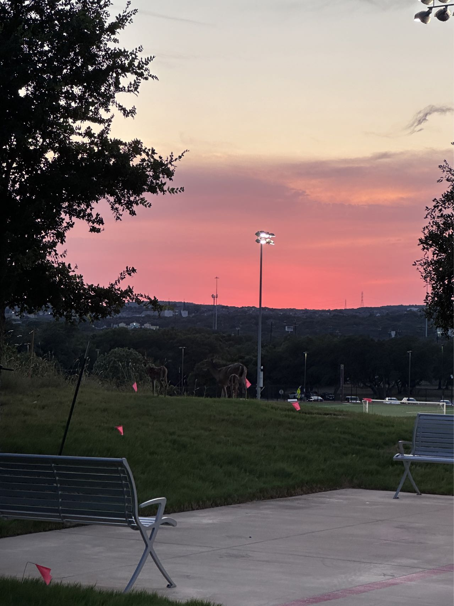

“圣安东尼奥这个地方太无聊了，我更想去纽约那样的大城市看看。”一位与杨国浩同堂上课的本科生说道。而此时，刚刚跨越半个地球来到 University of Texas 攻读 PhD 的杨国浩，却在这片陌生的土地上，开启了他新的探索旅程。

<!-- more -->

<!-- 导入聊天框功能 -->

<!-- 导入聊天框功能 -->

## 一、前言

杨国浩，一位早期加入飞桨 PaddlePaddle 社区的资深开发者，他的故事充满了探索和突破。笔者与国浩结缘，始于一次社区任务 [[Call for Contribution] Tutorials for PaddlePaddle](https://github.com/PaddlePaddle/community/blob/master/pfcc/call-for-contributions/docs/Call_For_Tutorials.md) ，旨在推动更多基于飞桨的应用实践案例的建设。当时，国浩以微信昵称“水獭Lutra”活跃于社区中，写了很多 CV 套件的案例，笔者因此亲切地称他为“水獭哥”。

初识水獭哥，只觉得他是技术过硬、颇具实力的一名开发者，而随着交流的深入，才逐渐揭开他丰富多彩的背景。水獭哥的求学与职业历程横跨多个领域，从化学到力学，再到生成式人工智能，他以深厚的学术功底和敏锐的洞察力，不断突破自我。从东北的寒冬到深圳的繁华，再到德州的广袤，他一路走来的脚步，不仅记录着技术探索的轨迹，也散发着对生活的热忱与追求。

这次采访，恰好让我们走近了Paddle社区一位开发者的独特人生。通过他的故事，让我们感受到了探索的乐趣和坚持的力量，也希望这样的经历能够激励更多开发者勇敢踏上属于自己的追梦之旅。

## 二、采访内容

1. **介绍一下自己吧，水獭兄！**

   **杨国浩：** 本人男，27，现在在德州圣安东尼奥读博。兴趣爱好是样样通，样样松：学过书法，钢琴，电子琴，游泳，足球，拳击，健身（上过课，报过班，有经过半年及以上的系统训练），喜欢听歌，电子游戏，羽毛球，台球，脱口秀（曾经很喜欢或者花了很多时间在这上面事情）。还有好多的东西我都曾在某一段时间非常喜欢，后面又因为各样的原因没在做了，属于一分钟热度了。

2. **看到你本科学化学，到研究生学力学，再最终到读博选择生成式AI方向，可以讲讲这其中的心路历程吗？是什么让你做出了这样的选择？（还是说万物皆可转码😏）**

   **杨国浩：** 一开始高考报志愿的时候我本来打算学物联网的，我父亲告诉我有个堂哥在读化学博士他觉得读化学也挺好的，就把这个志愿填在最后。当初我觉得应该不会录上，没想到最后被录取了。本科的四年也一直处于不想读了和干一行爱一行之间纠结内耗。最后想读研的时候换方向，跨考个研究生担心自己考不上，想走一个折中的路子，找了个计算化学的方向。

   > 笔者注✍️：担心考不上，于是选择了考北大，这就是大佬的自信嘛

   考上了以后发现做的第一性原理的计算。那时候其实已经有 AI4Science 类似的论文了，各种原因我没能做成这个方向。工作的时候又选择做 AI + 量子计算挺好的，而且量子计算中的很多理论其实是和第一性原理计算是相通的，可是量子计算的前景短期内不是那么明朗。博士的时候我就决定做纯AI就好了。自己的想法状态总是随着自己，随着周围的事情，随着大环境时刻摇摆，时刻变化，所以回头看自己做了很多奇奇怪怪自己都没有办法理解的选择是一两句话说不清楚的。

3. **从化学到深度学习这样跨学科的学习过程中，有没有什么建议或者经验可以分享给社区的？**

   **杨国浩：** 这几年的ACM Gordan Bell prize我查了下都是颁给在化学、量子计算、材料领域。今年的诺贝尔生物和化学颁给的是 AI。AI和其他学科的交叉融合是一定的趋势，如果在化学领域的同学们可以两手抓。

4. **研究生毕业之后，你在深圳的某科技子公司（公司名需要打码嘛）短暂工作了一年，可以简单讲讲吗？之后为什么又选择去了美国读博呀？**

   **杨国浩：** 那时候就已经有出国读书的打算，想着随便找份工作干就好了。在公司还碰到了一个也在百度量子计算研究所实习过的同学。如果不考虑其他的，工作那段时间做的事情我认为也挺有成就感。后面公司因为资金问题裁员，我也一直想去读书，刚好就迈出这一步，恰好在我和现在这个导师面试的同一天通知我。

5. **你夫人也跟你一起在美国吗？**

   **杨国浩：** 是的，也一起在美国。不想异地，找学校的时候也有这个考虑，想着要来就一起来，如果有一个人不能来就不去了。

      <!-- 大学 -->
      

         <figure style="width: 34%">
            
            <figcaption>大学附近的小路</figcaption>
         </figure>
         <figure style="width: 28.5%">
            
            <figcaption>学校里不怕人的头铁🦌</figcaption>
         </figure>
         <figure style="width: 34%">
            
            <figcaption>学校操场</figcaption>
         </figure>
      

   > 笔者注✍️：水獭哥学校附近似乎很原生态，路两边经常会有松鼠、小浣熊...被撞死的尸体

6. **现在在美国的日常生活是怎样的？在生活or文化or科研上，又发生过一些让你感觉印象比较深的事吗？或者说和国内反差感比较大的事？**

   **杨国浩：** 城市：第一次下飞机看到的圣安东尼奥和国内的三线城市相比，城市规划和建设都差的好多，但是又很符合我对美国中西部城市的那种刻板印象，看久了也习惯了。其他城市可能不一样（例如博伊西，去了以后发现给人的感受不太一样）。

   交通：日常生活要开车，公共交通基本等于无，全美第七大城市没有地铁，公交站像摆设一样。市中心的流浪汉不少。夏天的德州特别热，他们聚集在加油站和公交总站的阴凉处乘凉。曾经我开车去加油看到这一幕我不敢下车加油，直接拐出去了。

   物价：德州的物价油价比其他州便宜，在大超市买东西量特别大，平均算下来物价我感觉跟国内的深圳上海差不多甚至更便宜。

   其他的：这里的人做事很有“松弛感”，以前老说国内办事慢，踢皮球，来了这里发现2024了办事慢，手续杂，不方便，出差错也是让我们有点抓狂，可能是对于外国人是如此，现在也都习惯了。还有一点是我个人主观的感受，很难融入有归属感，语言和文化上没有共鸣。在工作和学习正式场合之外，还是黑人和黑人玩，华人和华人玩，印度人和印度人玩。

   科研：华人导师的工作风格和在国内差不多，让我有一种在国内读书的感觉。

    <!-- 城市 -->
    

      <figure style="width: 54.5%">
         
         <figcaption>圣安东尼奥市中心景点（river walk）的节日庆典</figcaption>
      </figure>
      <figure style="width: 42%">
         
         <figcaption>市中心的老爷车展（为什么会有☠️）</figcaption>
      </figure>
    

   > 笔者注✍️：水獭哥说德州有种印象里典型的西部片的感觉，很糙哈哈哈

7. **德州民风强悍么[旺柴]？有没有去看过马刺队比赛？**

   **杨国浩：** 生活中平是都还好，有两点：一是这里的人很喜欢大皮卡，开车的时候很猛。二是看过人穿的像个牛仔，腰间带把枪在餐厅吃烤肉。打算 11 月去看马刺和湖人的比赛。

8. **在东北、北京、广东和德州等多地求学、工作，你有没有特别喜欢的城市？有没有一些令人难忘的事情（比如广东大蟑螂）？**

   **杨国浩：** 还是喜欢深圳，除了房价，其他我都挺满意的。我也碰到过会飞的广东大蟑螂，洗澡的时候飞进来，我没带眼镜听到蟑螂翅膀煽动的声音我以为是热水器的噪音。杀死以后包着纸扔马桶居然冲不下去，蟑螂又浮上来了。

9. **聊聊开源吧～水獭哥你参加了很多飞桨开源活动，当初是什么机缘接触到飞桨的呀？**

   **杨国浩：** 第一次接触飞桨好像是2020年7月的暑假毕然老师的零基础实践深度学习的课程，然后就是黑客松第一届的比赛。

10.   **可以分享一下哪些你印象比较深的飞桨开源项目？这些项目对你的个人成长/职业生涯带来了哪些影响？飞桨以外的开源项目也可以讲（狗头）**

      **杨国浩：** 基本上参与过飞桨的开源项目我都印象深刻，算子开发、Python 前端的 jit、还有 PIR 的项目。除此之外贡献过一个 [autoray](https://github.com/jcmgray/autoray) 的项目，这个 Python libraries 也是被 Pennylane 使用的（有做过量子计算的应该知道 Pennylane）。我一直都有这样的想法，当别人用到这个东西的时候，不论有多少人用，我能告诉别人我做了其中的一部分，哪怕是再小的一点工作都让我有成就感。

11.   **对飞桨开源社区的哪些人印象比较深刻？（听说涛姐好像还给你写过推荐信）**

      **杨国浩：** 一众大佬，每次各种各样的活动经常都能看到几个熟悉的 Github ID。平时还是和孙哥和涛姐沟通的比较多。

      <!-- 城市 -->
      

         <figure style="width: 100%">
            
            <figcaption>在博伊西作为 Paddle 志愿者参加 CIKM 会议（右一）</figcaption>
         </figure>
      

12.   **未来有什么个人规划吗？除了科研和工作，有没有什么想去体验的事或计划？**

      **杨国浩：** 短期就是毕业工作，如果能留就尽量留在这儿。有个旅游 up主蕾儿乔什，我希望工作后再攒点钱去旅游，多走一些地方。

13.   **在这一路上，身边的亲人朋友有没有给你特别的支持**

      **杨国浩：** 我最感恩的是爱人家人都没有给我什么特别大压力，让我能够到处折腾。即便最后我可能又瞎折腾了，他们都无条件支持我。

14.   **最后给我们社区的开发者说几句话吧～**

      **杨国浩：** 希望大家都能在自己的道路上多折腾，无论是开源，工作，学习，生活。

## 三、两分钟快问快答

<MessageBox>
   <Message name="孙师傅" github="sunzhongkai588">
      你的 mbti 是？
   </Message>
</MessageBox>
<MessageBox>
   <Message type="right" name="水獭哥" github="yangguohao">
      INFP
   </Message>
</MessageBox>

<MessageBox>
   <Message name="孙师傅" github="sunzhongkai588">
      此时此刻此分钟此秒最喜欢的兴趣爱好是哪个？
   </Message>
</MessageBox>
<MessageBox>
   <Message type="right" name="水獭哥" github="yangguohao">
      打游戏
   </Message>
</MessageBox>

<MessageBox>
   <Message name="孙师傅" github="sunzhongkai588">
      想去健身房还是宅家打游戏？
   </Message>
</MessageBox>
<MessageBox>
   <Message type="right" name="水獭哥" github="yangguohao">
      宅家打游戏
   </Message>
</MessageBox>

<MessageBox>
   <Message name="孙师傅" github="sunzhongkai588">
      喜欢猫还是狗？
   </Message>
</MessageBox>
<MessageBox>
   <Message type="right" name="水獭哥" github="yangguohao">
      狗
   </Message>
</MessageBox>

<MessageBox>
   <Message name="孙师傅" github="sunzhongkai588">
      早起还是夜猫子？
   </Message>
</MessageBox>
<MessageBox>
   <Message type="right" name="水獭哥" github="yangguohao">
      夜猫子
   </Message>
</MessageBox>

<MessageBox>
   <Message name="孙师傅" github="sunzhongkai588">
      最常去的美国超市是哪家？
   </Message>
</MessageBox>
<MessageBox>
   <Message type="right" name="水獭哥" github="yangguohao">
      HEB
   </Message>
</MessageBox>

<MessageBox>
   <Message name="孙师傅" github="sunzhongkai588">
      博士生活中最离不开的工具是什么？
   </Message>
</MessageBox>
<MessageBox>
   <Message type="right" name="水獭哥" github="yangguohao">
      ChatGPT
   </Message>
</MessageBox>

<MessageBox>
   <Message name="孙师傅" github="sunzhongkai588">
      更喜欢圣安东尼奥的夏天还是深圳的冬天？
   </Message>
</MessageBox>
<MessageBox>
   <Message type="right" name="水獭哥" github="yangguohao">
      喜欢圣安的夏天
   </Message>
</MessageBox>

<MessageBox>
   <Message name="孙师傅" github="sunzhongkai588">
      中餐还是西餐？
   </Message>
</MessageBox>
<MessageBox>
   <Message type="right" name="水獭哥" github="yangguohao">
      中餐
   </Message>
</MessageBox>

<MessageBox>
   <Message name="孙师傅" github="sunzhongkai588">
      写码时更喜欢安静还是听音乐？
   </Message>
</MessageBox>
<MessageBox>
   <Message type="right" name="水獭哥" github="yangguohao">
      安静
   </Message>
</MessageBox>

<MessageBox>
   <Message name="孙师傅" github="sunzhongkai588">
      出门最常带的三样东西是？
   </Message>
</MessageBox>
<MessageBox>
   <Message type="right" name="水獭哥" github="yangguohao">
      车钥匙、家钥匙和钱包
   </Message>
</MessageBox>

<MessageBox>
   <Message name="孙师傅" github="sunzhongkai588">
      如果不做程序员/科研，最想尝试的职业是？
   </Message>
</MessageBox>
<MessageBox>
   <Message type="right" name="水獭哥" github="yangguohao">
      在美国想去开大卡车或者任何开车送货送东西的工作
   </Message>
</MessageBox>

> 笔者注✍️：必须给水獭哥推荐一款游戏——《欧洲卡车模拟》

## 写在最后 💡

**【开源江湖闲聊录】** 是一项专门为 Paddle 社区的开发者打造的特色访谈栏目 📚。在这里，我们邀请到每一位别具一格且富有热情的开发者，通过文字或语音的方式进行深入采访 🎙️，探索并展现他们背后独一无二的故事，将他们的经历、见解和创意整理成精彩内容，呈现给整个社区。

如果你有兴趣对社区的开发者进行采访，可以联系孙师傅，**急缺助手！**

---
