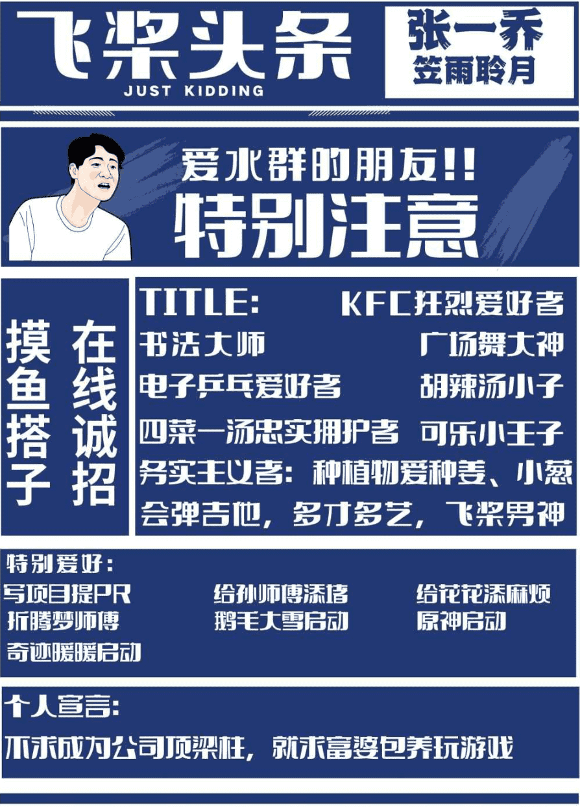
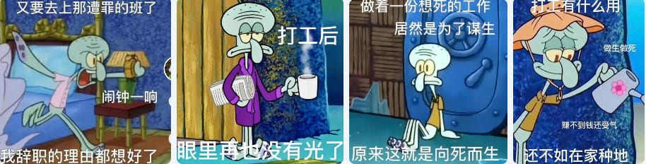

格子衬衫 👕，黑框眼镜 👓，他就是上天钦定的程序员！他狂卷技术，热爱开源；他喜欢摸鱼 🐟，疯狂水群；他“厨艺精湛”，堪称当代厨神。严寒冬日，别人有女朋友温暖手心，而他把 🥤 优乐美捧在手心！凌晨就寝，别人躺平酝酿睡意，他靠咖啡 ☕️ 进入梦境！工作一年半，至今单身汉！他就是来自安徽的吃辣小趴菜——张一乔 😆！
<!-- more -->

<!-- 导入聊天框功能 -->

<!-- 导入聊天框功能 -->

## 一、张一乔专属定制海报
   

       <figure style="width: 50%;">
         
         <figcaption>张师傅专属定制海报</figcaption>
       </figure>
   

> 张师傅注：我不会吉他 🎸，但是有一把！

## 二、采访内容

1. **先介绍一下自己吧，张师傅！**

   **张师傅：** 我是 96 年的，快三十岁了。感觉自己就是一个普普通通的，人到中年也没有女朋友的，独自一人在北京，住在一个小房子里（连个大阳台都没有）的可怜巴巴 🥺 的年轻人。而且，自己做饭还没有特别好吃，但还得自己做饭 😭。买的都是超市里一包一包的菜 🥬，一做就是两个人的饭，根本吃不完，然后剩菜又吃不下去·····大概这么个样子吧！
   > 张师傅注：我就像一整片沙滩上的一粒沙子，就很普通。可能比起其他沙子，更加适合在浪头飘摇而已！
   <!-- 张师傅照片 -->
   

       <figure style="width: 50%;">
         
         <figcaption>左为张师傅的自信照片，右为张师傅一整柜的格子衬衫</figcaption>
       </figure>
   

2. **现在你是在北京做全栈程序员，一个人在北京习惯吗？北京和你的家乡安徽相比，你更想留在哪？为什么？**

   **张师傅：** 首先，在北京不一定是全栈程序员，也有可能是全方位打杂小工 😣。然后和家乡相比那肯定是家乡好，但是当时还是阴差阳错选择来北京！现在很后悔，很想回家。也不是说北京压力大（因为既不买房子，又没有女朋友。每个月生活也挺简单的，就是交个房租，然后吃饭上班睡觉·····钱肯定是够花的！），只是我自己比较思乡，不想离开家乡！家乡并没有给我留下什么糟糕的印象，父母也还不错。所以比起在外面晃悠，自己还是更加愿意回到家乡！

3. **你觉得程序员是一个怎样的工作？这份职业对你的生活中产生了什么影响？**

   **张师傅：** 首先我不知道我自己是不是程序员。在公司，有什么活干什么活！然后工作给我产生的影响大概就是：打工后眼里失去了光！
   > 张师傅名言：公司是用来创造价值的地方，不是学习的地方！
   <!-- 打工人精神状态表情包1 -->
   

       <figure style="width: 80%;">
         
         <figcaption>打工人精神状态表情包集 1</figcaption>
       </figure>
   

   <!-- 打工人精神状态表情包2 -->
   

       <figure style="width: 80%;">
         
         <figcaption>打工人精神状态表情包集 2</figcaption>
       </figure>
   

4. **当初在武汉完成硕士学位后，你谈到过有读博的想法，为什么最终又决定直接工作？**

   **张师傅：** 因为我太弱小了，所以没有导师要我！要是读了博选择可能会多一些，可以选择创业之类的。

5. **是什么时候开始接触到 Paddle 的呢 😂😂？**

   **张师傅：** 硕士期间接触到的，当时闲的没事，打开百度搜了个东西。然后百度搜索引擎就安利了飞桨。

6. **在 Paddle 社区，很多人称张师傅为“002”，这是为什么呢？你对于这个称呼有什么想法 💡 呢？**

   **张师傅：** 因为我是第二个拿 Committer 身份的，所以叫“002”！对于这个称呼我没有什么看法，只是一个称呼罢了（高冷脸.jpg）

7. **社区里的开发者都觉得你在技术上很卷，那可以和我们分享一下你忙碌卷技术的日常么？**

   **张师傅：** 我大概是早上 5 点钟起床 🛏️，磨磨蹭蹭到 6 点钟，然后出门吃一碗香喷喷的豆腐脑！之后回到家里，打开电脑耍会儿游戏，然后去公司上班，开启一天辛苦的忙碌的工作！四点半下班，当然和大多数打工人一样，有时候会加班。一般回到家后开始做饭（黑暗料理）：有时煎个饼，有时来个煎饺！差不多下午六点就打开游戏 🎮，并且下定决心打完这一把后就开始工作，结果打完一把又一把，最终打到八九点钟的样子，打开群水两句，水完洗个澡就去睡觉！

8. **悄悄问下，张师傅花这么多时间做开源，你老板不会生气吗？**

   **张师傅：** 首先我的开源工作都是在下班时间完成的，与工作没关系，这属于生活！第二点呢，如果我的本职工作没有做好，在其他方面大放异彩，那我的老板肯定会生气！所以不要让老板知道我在干什么 🤫。只要让老板知道我有自己的生活，跟工作不冲突就可以了。

9. **我了解到你是“飞桨开源之星”，也是“AI Studio 杰出创作者”，那么张师傅肯定有自己的开源心得。你认为对于刚来到社区的小伙伴，应该怎样学习才能和你一样逐渐成为技术大佬？**

   **张师傅：** 其实没有什么技术路线。可能很多人都在问：“我看你代码写这么好，我怎么样才能像你一样？”这个东西没有任何的窍门可言。就比如你在学 C 的时候，成日成夜的把时间耗费在机房里，然后照着书本或者其他东西一个代码一个代码的敲。可能最开始 Debug 工具不会用，IDE 也不会用，也没有那么多经验，但是得这样一步步走过来。当有了这个基础后，可以去做一些其他事情（eg：修改 Paddle 底层框架），你可能又会发现特别困难，但是我们 Paddle 的快乐开源活动已经把项目拆解好了，你可以凭这些先入入门，上个手，然后一点点进步。

10. **你曾说在社区中你交到了很多开发者朋友，那么哪位开发者令你印象深刻，或者说社区里哪位大佬让你觉得最不像程序员？**

      **张师傅：** 每位开发者都印象深刻，嘿嘿，开始端水了！最印象深刻的当然是笠雨聆月，顶着一个女性的头像，然后 GitHub 还没有地铁站努力。最不像程序员的那必然是 001（[@SigureMo](https://github.com/SigureMo)），虽然他很社恐，头发还很长，但他在我心中就是腼腆的邻家大男孩，他的气质就是腼腆的邻家大男孩。

11. **你是如何定义开源社区的？你认为你在开源社区中收获最大的是什么呢？**

      **张师傅：** 开源社区就是一个开放的用于交流的平台。其实开源社区的定义大家已经给了太多了，我想补充的就是：开源社区从最早的 Linux 到其他一些软件其实都可以接触到！大家在社区无偿贡献代码或者知识，大家一起交流进步。最大的特点可能是公益性！
    
12. **你在 Paddle 社区做过让你最有成就感的项目是哪个呢？为什么？**

      **张师傅：** 在 Paddle 社区里几乎没有做过什么有成就感的项目。一直在烂尾，一直在捡别人剩饭，一直在拾人牙慧。
      > 编者注：张师傅可真是认真努力且谦虚的男人！

13. **在水群时经常看到你说想找个女朋友。那么张师傅想找一个什么类型的呢？给我们描述一下吧 😁😆😂！**

      **张师傅：** 我喜欢温柔一点的，儒雅随和的，不说脏话 🤬 的，遵守交通规则的（过马路看红绿灯 🚥）女孩子。她可以不遵守规则，像我一样。但是交通规则得遵守！最好有一头乌黑的长发 😁！
      > 张师傅注：谁家好人三十岁还没有女朋友啊～ 哇哇哇
14. **张师傅在做饭方面颇有造诣，那么你是如何突发奇思妙想用最简单的食材烹饪出这一道道高级的美食呢？**

      **张师傅：** 做饭心得就是每天睡觉前坚持学习烹饪技巧，比如打开哔哩哔哩观看 「世界美食 official」 的最新视频！我们要谦虚学习别人是如何把这种简单的食材最终做成高级的糊状物的！日常就喜欢观看印度美食的制作过程～～
   <!-- 世界美食 official 照片 -->
   

       <figure style="width: 70%;">
         
         <figcaption>张师傅经常观看的B站up主</figcaption>
       </figure>
   

15. **马上 2024 年了，可以分享一下新的一年里你有什么计划么？**
     
      **张师傅：** 2024 年计划就是 2023 年的计划。女朋友这一条还是可以不完成！
   <!-- 张师傅计划 -->
   

       <figure style="width: 30%;">
         
         <figcaption>张师傅 2023 和 2024 的计划</figcaption>
       </figure>
   

## 三、生活中的点点滴滴——张师傅篇
<!-- 张师傅日常 -->
   

      <figure style="width: 49%">
         
         <figcaption>张师傅的日常</figcaption>
      </figure>
      <figure style="width: 49%">
         
         <figcaption>张师傅的精心制作的黑暗料理</figcaption>
      </figure>
   

---

## 写在最后 💡

**【开源江湖闲聊录】** 是一项专门为 Paddle 社区的开发者打造的特色访谈栏目 📚。在这里，我们邀请到每一位别具一格且富有热情的开发者，通过文字或语音的方式进行深入采访 🎙️，探索并展现他们背后独一无二的故事，将他们的经历、见解和创意整理成精彩内容，呈现给整个社区。

---
