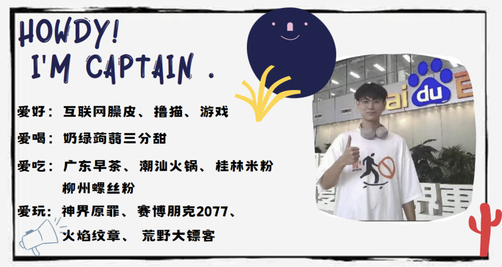

​集百家之阴阳，合一家之糟粕。好消息！好消息！号称 Paddle 社区“最想当 PM 的程序员” 、“Paddle 首席阴阳家”—— Zheng-bicheng，闪亮登场 🥳🎉🎉🎉。你想掌握最前沿的阴阳技巧么？你想成为和他一样优秀的开发者吗？你想和他一样眼神 👀 中透露着睿智的光芒，小脑袋瓜里装满各种各样的知识么？那就快来看看这篇博客吧！🌹

<!-- more -->

<!-- 导入聊天框功能 -->

<!-- 导入聊天框功能 -->

## 一、个人名片

### by 郑师傅（[Zheng-Bicheng](https://github.com/Zheng-Bicheng)）

<MessageBox>
   <Message name="郑师傅" github="Zheng-Bicheng">
   网络上躁皮不用多说，臊皮领域涉及抖音、微博、小红书、贴吧、知乎、B站等多个社交软件。你问我躁皮能力有多强，我得问问你懂不懂活了 23 年，吧龄有 13.4 年的含金量（如下图）。人家小学玩泥巴，我的小学玩贴吧，抽象要从小培养。
    
   
   ​我涉及的游戏领域的主要是 Steam 上的 RPG 游戏和 Switch 上的战旗游戏。我的游戏方式讲究一个另辟蹊径，例如玩神界原罪的时候，大多数人都忙着通主线，我主打一个小偷玩法，所到之处能偷的东西全给我偷光了。与之相反的是，我在游戏里大偷四方，现实里却被称为“电瓶侠”。截止至目前为止，已经被偷了 20 颗电瓶，快说谢谢电瓶侠😭。
    
   
   顺便有没有大佬带我玩《双人成行》的，一缺一现在~
</Message>
</MessageBox>

    <figure style="width: 70%;">
      
      <figcaption>郑师傅吧龄</figcaption>
    </figure>

> 郑师傅注：提一嘴，我玩了 13.4 年贴吧，臊皮能力不足李梦柳十分之一，鬼知道这姐妹经历了啥！

> 编者注✍️：提到的梦柳（@[Ligoml](https://github.com/Ligoml)）是我们飞桨社区非常优秀的美女产品经理❤️！！

## 二、采访内容

1. **先介绍一下自己吧，郑师傅！**

   **郑师傅：** 各位大佬好，我是郑必城（@[Zheng-Bicheng](https://github.com/Zheng-Bicheng)）🐶🐶，开源社区的菜鸟一枚，毕业于普普通通的闽江学院。

2. **大学时你的专业是人工智能，为什么当时选择这个专业？**

   **郑师傅：** 其实我最开始学的是电子信息与工程，无奈于电路天赋极其有限，通宵 4 个晚上做了 13 块板子才搞出一个 5 倍放大电路，与此同时身边的资源大多都开始向 AI 转型，于是随大流转专业到了比较热门的人工智能专业。

3. **在大学的四年，你学习了些什么技术？又是怎么精进你的技术的呢？**

   **郑师傅：** 鉴于闽江学院给我画了 4 年大饼，迟迟升不上本一，我仅代表个人将其本降专，将其简称“闽带”。在闽带的 4 年生活里，承蒙老师关爱，我得以同时加入了软件和硬件的实验室。我的两位指导老师又刚好都是系主任，这就意味着我能比较自由的使用各种电子元器件以及超算，这让我在学习上有了极大的探索空间。软硬都有所了解后，技术栈也从常见的后端研发慢慢转成了嵌入式部署。

4. **听说郑师傅现在在导师公司底下工作，是在哪里工作呢？具体工作是关于哪方面的？**

   **郑师傅：** 目前我在福州凌智电子工作，公司业务主要是仪器仪表（高速信号采集）以及各种 Sensor 的开发。工作内容就比较杂了，小公司没有产品，人手也不足，因此一个对外的产品，我的工作内容覆盖了软件端产品设计，研发，测试三个环节。我在公司主要负责的业务是高速采集卡的上位机，各种模块的对外 SDK 开发以及 AI 边缘端计算项目后端框架开发。

5. **作为一个 01 年的小社畜，平时工作忙么？加班多么 😂😂？**

   **郑师傅：** 忙的时候忙，不忙的时候不忙。加班多的时候多，加班不多的时候少。

   > 编者注✍️：郑师傅是会总结的！！🤭

6. **你对 Paddle 社区的理解是什么样的？你在 Paddle 社区，做过最有影响力的项目是什么？**

   **郑师傅：** Paddle 社区给我的感觉就是包容性强。

   ​从实力上，不管你的实力是强是弱，在社区里都有属于你的位置，各种任务任你挑，研发大哥人也都很好，即使很忙也愿意抽时间出来和你讲思路讲方法。

   ​在 Paddle 社区里，我比较活跃的项目其实就是[FastDeploy](https://github.com/PaddlePaddle/FastDeploy)。FD 的定位是端到端的部署框架，希望让即使是 AI 初学者的用户也能用极少的代码量跑通模型部署。我主要负责的部分都是和移植相关，涉及到的部分包括 Rockchip 推理后端的移植，几个社区 CV 模型的移植，类似人脸对齐这种后端算法的移植。

   ​要是提到影响力，FastDeploy 的定位其实就比较尴尬了。由于适配了非常多的底层推理框架，FD 内部为了兼容性是牺牲了一部分的性能的。从公司的角度看，对于小公司来说，用 FD 基本上会做一些魔改，来达到最优的性能（这也是后期我维护 FD 次数慢慢变少的原因，在我们公司内部，我基于 FD 做了大量的魔改，已经和现在的 FD 主分支几乎不兼容了）；大公司有自己的高水平研发工程师，也不会去用 FD，因此 FD 的使用场景还是有一定的局限性的。

   ​从用户的角度看，对于学生这类 AI 部署水平较差的用户来说，FD 是相当友好的，毕竟几行代码就能搞定深度学习部署，用来做毕业设计再合适不过了；对于编程水平较高的研发工程师来说，FD 更多的还是作为一个项目推理框架的模版代码，各个开发者可以在这个模版上快速定制自己所需要的代码。

7. **可以和我们讲讲你的开源故事么？期待 😚 期待～～～～**

   **郑师傅：** 我第一次接触到 Paddle 开源社区是在 2022 年 Q3 的黑客松第三期活动。

   ​刚开始参加开源时，第一个带我的师傅是 001。谁能想到晚上 11 点，001 这个内向萌骚怪搁那滔滔不绝的教我怎么同步远程仓库代码，我搁那嘎嘎猛困，他搁那嘎嘎猛教。没办法，不能辜负大佬的一番好意，我只能被迫学习。学着学着，把自己的知识用到了开源里，还真一不小心就做出了黑客松的两道题，从此入门了开源。

   > 编者注✍️：黑客松是百度飞桨举办的深度学习领域编程活动，鼓励开发者了解与参与飞桨深度学习开源项目，做出自己的代码贡献。
   >  
   > PPDE(Paddle Paddle Developers Experts):飞桨开发者技术专家。
   >  
   > PFCC(Paddle Framework Contributor Club):飞桨框架贡献者俱乐部。

   ​刚开始做适配时，RK3588 的工具链还不完善，我苦于没办法和 RK 官方的人沟通，效率一直很低。但青姐这人主打就是一个给力，我真敢提代码，她真敢拉群，直接给我这个开源菜鸟拉到了 RK 的适配群里和 RK 的研发工程师真人 1V1 大战。有了 RK 工程师的支持，项目也就慢慢开始推进了。

   在持续将近一年的贡献后，不知不觉的，我这么个一心向钱看齐的人莫名其妙的就成为了仓库的维护者，参与起了和 RK 相关的维护工作。在青姐的支持下，我甚至还参加了 RK 的开发者大会。要知道，在前一年，我还是坐在讲台下听着 RK 工作人员演讲的开发者，第二年就借着 Paddle 的风到 RK 开发者大会上给讲台下的嘉宾讲 FastDeploy 了。
   <!-- 下图为RK开发者大会的合照 -->
   

      <figure style="width: 80%;">
         
         <figcaption>上图为RK开发者大会的合照</figcaption>
      </figure>
   

    
   ​随后就是参加了新的黑客松，认识了 Arm 的 Liliya 姐。Liliya 姐在 Arm 领域给了我很多的帮助，在她的支持下，我了解了很多 Arm 相关的最新技术，也参与到了 Paddle 模型 -> Arm 虚拟硬件部署链路的移植工作中。在她的帮助下，我移植了 Paddle 的多个模型到 Arm 虚拟硬件上，然后就是参加了 Arm 虚拟硬件的小发布会，一不小心成为了 Arm Ambassadors，顺便蹭了她一顿饭。
   ​<!-- 下图为郑师傅和上文的Liliya姐 -->
   

      <figure style="width: 80%;">
         
         <figcaption>上图为郑师傅和上文的Liliya姐</figcaption>
      </figure>
   

8. **郑师傅做开源这么久了，现在开源对你来说是一个什么感觉？你觉得你热爱它么？那又是怎么体现你的这种感觉的？**

   **郑师傅：** 咱主打一个真实。读书的时候，开源是我装逼的方式；工作以后，开源对我来说是生活的调剂品，在心有余力的时候是我放松时的选项之一。我很爱开源，开源既让我拿到了很多 Title，也让我学到很多东西，面子里子都赚到了。

9. **你自诩为“Paddle 社区阴阳怪气第一人”（和阿梦实力相当），那你是如何把阴阳怪气这种 🥰 贱贱的说话方式使用的如此炉火纯青的？可以教教我们么？**

   **郑师傅：** 我这么正直的人怎么会阴阳怪气呢？比起阴阳怪气和口嗨，李梦柳和神可比我强多了。至于练习阴阳怪气嘛，多亏了啵啵姐。世上本没有阴阳师，阴阳啵啵姐多了，也便成了阴阳师。

   > 编者注✍️：啵啵姐是指飞桨社区优优优秀的美女运营花花。

   > 梦师傅本人注✍️：郑必城根本不会阴阳怪气！

10.   **你口中的“神”是谁？ 为什么称他为神呢？**

      **郑师傅：** 神是衍哥，第一次把衍哥叫做神是和梦师傅打嘴炮的时候没过脑子说出来的话。但是后面了解到神的事迹以后，衍哥我只能说比神还神。

11.   **你有谈到想成为一位 PM，那可以和我们简单分享一下你的职业规划么？或者说：你想未来一年在职业上取得什么进展？🆕🆕**

      **郑师傅：** 我职业规划基本上是：先当研发广泛学习，再当产品经理输出价值！

      ​在我的认知里 PM 的知识面首先是广，然后是深。带一个产品，我得懂需求；和研发吵架，我得懂代码大致的底层逻辑；对外输出，我得懂基本商业逻辑；产品的迭代，我得懂客户的工作流程。

      对应我的工作，看上去干的事情和 AI 没啥关系，实际上是 AI 落地的一整套的流程。我的工作涵盖了数据采集，数据标注和数据清洗，模型调参和训练以及模型部署。这几乎覆盖了边缘端 AI 部署的全场景。而其他知识，一般靠和大佬沟通，取长补短搞定。在工作以后，我定期的会去拜访一些上游链路的大佬，如某开发板的硬件负责人，某芯片厂商的事务负责人以及某产商的视觉算法负责人。和大佬沟通是我拓展视野和补充知识面的手段之一，毕竟人能坐到那个位置上，对某个方向一定是有自己的理解的。

      前段时间和百度某个产品已经聊过了。某法师说："真正要做的事，连神明都不要说，不要告诉别人你的计划，让他们看结果。”对于我要做的事，一般是不立 Flag 的，这里就埋个伏笔。

12.   **相信你也接触到很多飞桨以及其他的 PM，哪位 PM 给你留下来最深的印象？哪位 PM 是你未来职业的模板？**

      **郑师傅：** Paddle 的 PM 大佬们其实都很有特色也都给我留下挺深的印象。比如梦柳不但能力很强，嘴炮也很厉害，看上去很渣，其实比谁都纯；雷青姐经常工作到深夜，非常努力；军哥专业素养很高，表面上话不多像是个糙汉子，接触了以后让我感觉居然像个小文青；衍神表面看上去吊儿郎当的，实际上很强，对各种问题看的很透彻；孙哥表面看上去很能嘴，其实我觉得还有点内敛；佳维姐姐人非常漂亮，普通话也超级标准；凯哥居然能用英语和阿三交流的好好的。

      谁是我职业模版的话，我感觉我这 🐶 脑能把大家的优点全学会是不太可能的，但是都学个 10% 当个及格的 PM 还是有可能的
      <!-- 雪糕＋合照 -->
      

         <figure style="width: 90%;">
            
            <figcaption>左图为参观百度时的合照，右图为郑师傅最喜欢的喵喵喵雪糕</figcaption>
         </figure>
      

13.   **最后，你想对和你一样努力 💪 开源的开源者说些什么呢？**

      **郑师傅：** 和张师傅（@[liyulingyue](https://github.com/liyulingyue)）这群开源奋斗逼相比，我实在太摸鱼了。希望大家都能向张师傅学习，在开源中贡献自己的力量。

## 三、从你的全世界路过——Captain 篇

​前几篇博客上都有板块谈大家对被采访者的印象，但是今天郑师傅想来个板块单独谈谈**他对社区大佬的印象** 🤩🤩🤩。由于在 Paddle 社区，大佬实在太多了，郑师傅就抽一部分大佬讲讲他对他们的印象。

### **001**(@[SigureMo](https://github.com/SigureMo))

我对 001 的第一印象就是代码能力很强，但是有点闷骚。作为带我入门的大佬，肯定是要感谢 001 的，因为 001 人实在太好了❤️，不光带我开源还带我“开原”，属于是工作生活两不误了。

### **应晟大佬**（@[yingshengBD](https://github.com/yingshengBD)）

应晟大佬是个很帅的糙汉子，刚认识他的时候给我的第一感觉就是相当的程序员，但是他参加直播的时候打理了一下，卧槽，嘎嘎帅啊。在我第一次参加黑客松的时候他给了我非常多的帮助，帮我积极协调了项目的各种进度内容，也让我了解到了一些职场相关的内容。

### **啵啵姐**（@[Tulip-hua](https://github.com/Tulip-hua)）

原谅我管百度唯一指定童工叫姐。刚开始认识她的时候，她说别人叫她“芋泥妹” 👧，我想着我一 00 后也这么叫不是显得我太老了？所以叫她“啵啵姐”，后来发现大家都挺爱这么叫的。这位更是重量级，又能给我开源资源又能带我玩。世界可以没有耶路撒冷，但开源不能没有啵啵姐。

### **雷青大佬**（@[leiqing1](https://github.com/leiqing1)）

雷青大佬在我参与开源的初期给了我很大很大的帮助，没有她做为桥梁我就没办法认识到那么多的百度研发工程师。雷青姐人也超级好，还记得她来福州的时候我请她吃饭，结账的时候她觉得不能让我一学生请客，把我手机藏起来买单，这才是神仙姐姐 🙍🏻‍♀️ 啊。算起来已经欠她两顿饭了，有机会一定要还了。

### **佳军大佬**（@[jiangjiajun](https://github.com/jiangjiajun)）

蒋大佬的代码我只能说，牛逼，真他妈牛逼。人跟人的差距真大，一个在我看来很难的问题，他总是能一下子就找到关键点。在我开源生涯中他是各种指点，牛逼，真的牛逼。说起来还画了好多的饼给这位大佬，但是这些饼的工作量都有点大，最后大部分都慢慢不了了之了，现在正在慢慢捡起来做。

### **延君大佬**（@[DefTruth](https://github.com/DefTruth)）

延君大佬人很热情，帮我审核了很多的代码，他不但在 coding 上给了我很大的帮助，还对我的职业生涯规划起了很大作用，在我两难的时候给了我很正确的建议。

### **梦柳姐**（@[Ligoml](https://github.com/Ligoml)）

这位也是重量级，Paddle 除了神以外的嘴炮王。她在我这 Title 太多，包括但不限于我的 Github 头像拥有者、最帅猫拥有者、最肥猫拥有者、最傻猫拥有者。

### **孙哥**（@[sunzhongkai588](https://github.com/sunzhongkai588)）

一见如故，和我一样惨。我是扑克牌里的小王那孙哥就是扑克牌里的大王 🤡。

### **军哥**（@[jzhang533](https://github.com/jzhang533)）

很感谢军哥帮忙推动了 Paddle 框架在 Arm 上的 whl 包的适配，没有军哥，Arm 虚拟硬件在百度云上的部署就没办法推动了，就是啥时候能上线 Paddle 官网就更好了。

### **衍哥**(@[blazingsiyan](https://github.com/blazingsiyan))

就一个字，神！

## 四、Captain Zheng 的名言集

   <figure style="width: 70%;">
      
      <figcaption>上图为郑师傅经典语录集</figcaption>
   </figure>

---

## 写在最后 💡

**【开源江湖闲聊录】** 是一项专门为 Paddle 社区的开发者打造的特色访谈栏目📚。在这里，我们邀请到每一位别具一格且富有热情的开发者，通过文字或语音的方式进行深入采访 🎙️，探索并展现他们背后独一无二的故事，将他们的经历、见解和创意整理成精彩内容，呈现给整个社区。

---
