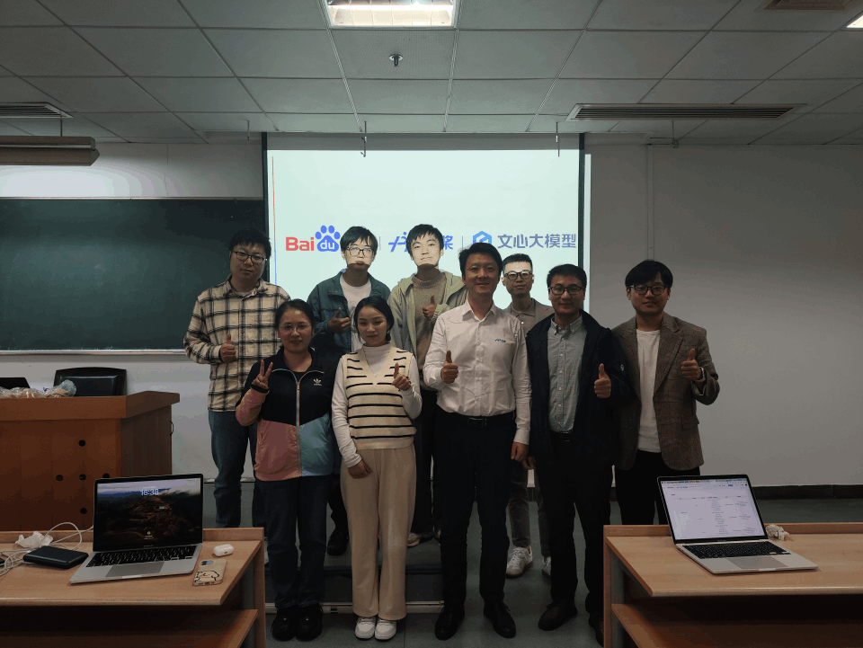
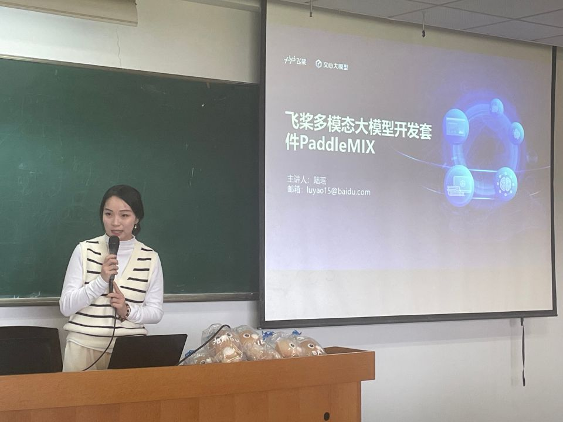
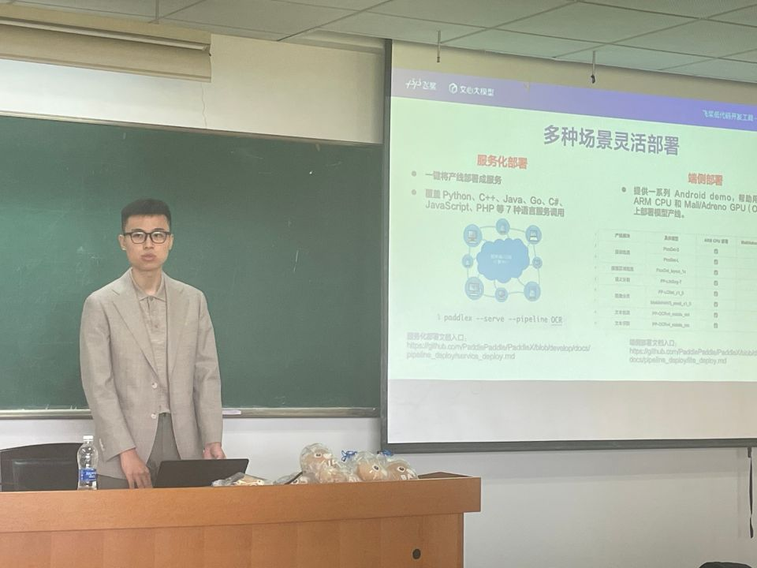
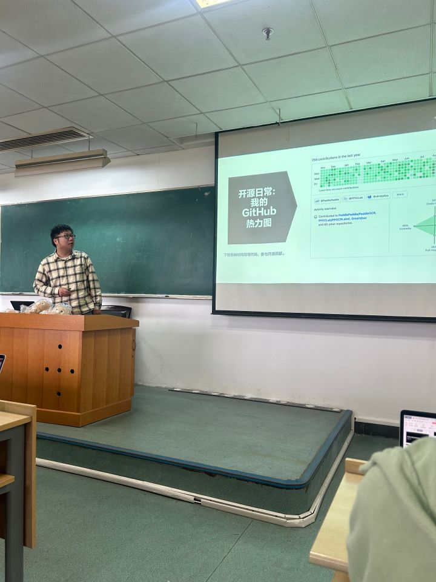
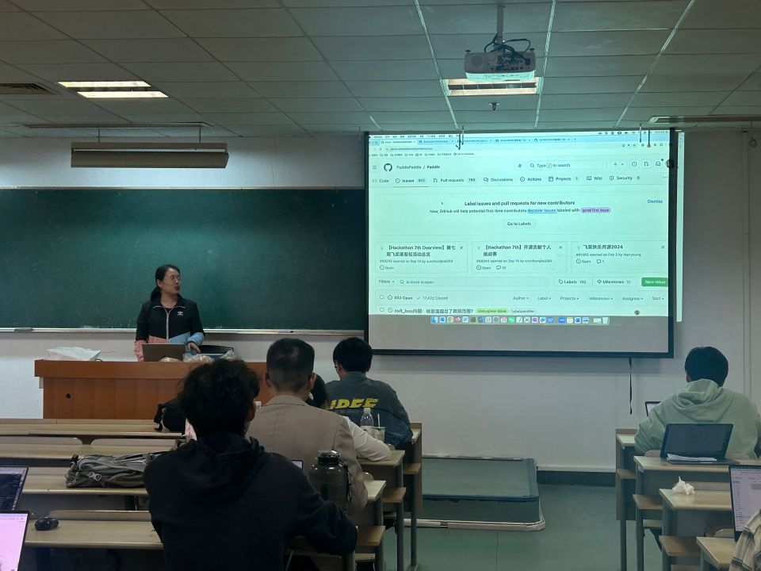

为深入探讨、推动开源人才培养，助力开源生态繁荣向前，10 月 29 日下午，百度“与你一起定义飞桨的未来”主题活动，作为 [“源”来在“浙”里｜开源企业走进校园系列活动](https://mp.weixin.qq.com/s/i05v5HunUogrn0de7SqivA) 之一，在浙江大学软件学院成功举办。

<!-- more -->

---

飞桨高级产品经理张晶，高级研发工程师郜廷权，研发工程师陆瑶、王海涛，AI 生态部邵一鸣，产品运营张子彧，美康生物算法工程师、PaddleOCR PMC Chair、飞桨开发者技术专家 PPDE 汪昕，为同学们带来 AI 前沿技术和百度飞桨开源产品及其应用介绍、开源对技术优化的意义、文心一言大模型案例解读等内容。专家们结合自身的经验经历进行分享，内容具备很强的实践性和启发性，助力同学们开启开源之旅。

## 主题报告

### 1. Shape the future : 开源、飞桨与你我

张晶（百度飞桨高级产品经理 [@openvino-book](https://github.com/openvino-book)）重点分享了全球著名开源项目 PaddlePaddle 的前世今后、当前取得的成绩、共建共享的开源精神；以及如何参与飞桨开源社区，如何在共建飞桨的过程中，提升技术、成长自己、共筑未来。

### 2. 飞奖多模态大模型套件 PaddleMIX 分享及应用

陆瑶（百度飞桨研发工程师 [@luyao-cv](https://github.com/luyao-cv)）作了以《飞桨多模态大模型开发套件 PaddleMIX 》为主题的报告。本报告重点介绍了 PaddleMIX 开源建设活动、多模态大模型能力与场景应用、多模态大模型架构演进及特点以及多模态大模型开发套件 PaddleMIX 。报告详细阐述了多模态大模型的核心能力，包括图像理解、文本生成、跨模态互动等功能，并展示了其在各领域的实际应用场景。在架构方面，陆工程师深入分析了多模态大模型的演进历程，重点讨论了不同架构的特点和优势，为开发者选择合适的模型架构提供了参考。PaddleMIX 开发套件的功能特性得到重点展示，包括模型训练、推理部署、性能优化等关键模块。该套件不仅降低了开发门槛，还提供了丰富的预训练模型和示例，有效支持开发者快速构建多模态应用。这次报告展现了百度在多模态大模型领域的技术实力，为推动人工智能技术发展做出了积极贡献。

### 3. 低代码工具 PaddleX 实践应用

郜廷权（百度飞桨高级研发工程师 [@TingquanGao](https://github.com/TingquanGao)）作了以《低代码工具 PaddleX 实践应用》为主题的报告。报告重点讲解了百度飞桨低代码开发工具 PaddleX ，包括产品设计特点，功能使用等方面。并分享了大模型时代下深度学习落地应用面临的问题，以及 PaddleX 提出的解决方案：低代码开发方式与多模型串联方式。报告体现了百度飞桨在深度学习模型开源建设方面的贡献。

### 4. 从零开始的开源之旅

汪昕（美康生物算法工程师、PaddleOCR PMC Chair、飞桨开发者技术专家 PPDE [@GreatV](https://github.com/GreatV)）分享了自己的开源经历，从薅 GitHub 羊毛到成为开源贡献者，从 typo fix 到深入参与开源项目建设，从成为 PaddleOCR Contributor 到成为 Paddle Committer 的参与开源社区的经历。

### 5. 开源让我越来越领先

王海涛（百度飞桨研发工程师 [@yulangz](https://github.com/yulangz)）作了以《开源让我越来越领先》为主题的报告。重点介绍了自己在学生生涯中是如何接触到开源，如何参与开源，以及开源带给了自己哪些收获。以自己的切身经历，告诉同学们如何参与开源，为什么要参与开源，激发同学们对开源的兴趣与热情。

### 6. 文心一言与文小言：生成式 AI 的案例解读

张子彧（百度飞桨产品运营 [@shiyuasuka](https://github.com/shiyuasuka) ）作了《飞桨领航团开学季高校行 AI 科普》为主题的报告。报告讲解了 AI 这门学科的起源发展和目前的主流分类，分享了百度飞桨领航团在高校的布局以及同学们可以利用 AIstudio 开源平台做出怎样的项目。同时重点以文小言为例子为大家介绍提示词工程师的一些技巧并引导同学现场构建智能体。

### 写在最后：飞桨开源社区活动介绍

骆涛（百度飞桨资深研发工程师 [@luotao1](https://github.com/luotao1)）介绍了飞桨开源社区的活动。我们会不定期走进校园、开展线下 Meetup，线上的启航计划、快乐开源以及进阶的飞桨黑客松。欢迎大家持续关注飞桨的各种活动哦，对于对此有兴趣、愿意贡献力量的开发者，也可以联系 [孙师傅](https://github.com/sunzhongkai588)

