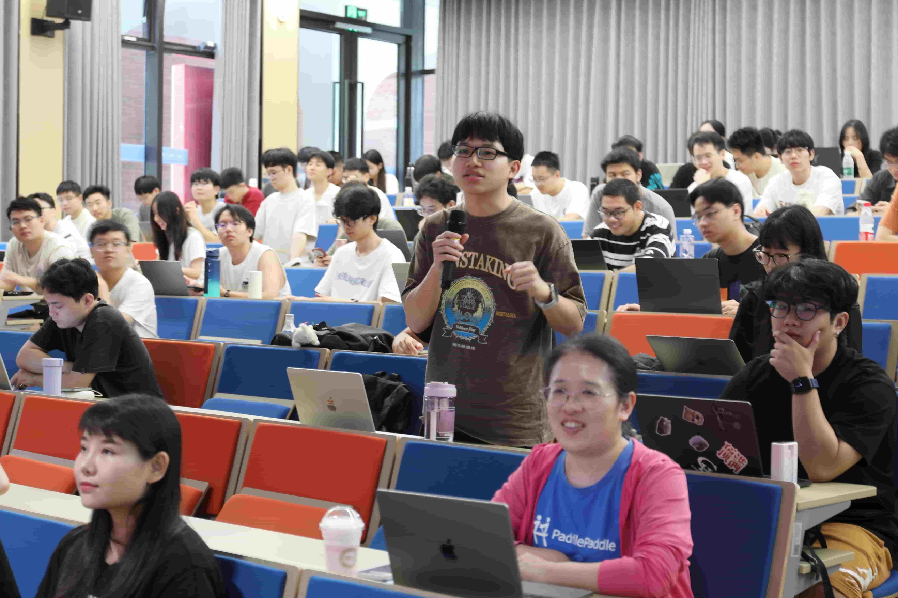

9 月 23 日，飞桨团队携手文心大模型走进浙江大学软件学院，带来一场特别的开源分享活动——“OpenSource in Paddle：浙大限定的开源大冒险”。

活动邀请多位飞桨资深工程师与产品经理，与浙大软院师生面对面交流，分享前沿的开源实践与大模型应用。现场气氛热烈，技术与创意交织，激发了关于开源的深度思考。

<!-- more -->

---

## 精彩议程回顾

### 1. 开场致辞

由浙江大学副教授、特聘研究员、博士生导师倪超老师开场致辞。他鼓励同学积极参与开源实践，为当天议程拉开序幕。

### 2. OpenSource in Paddle：开源大冒险

百度飞桨产品经理刘卓鑫带来主题分享“OpenSource in Paddle：浙大限定的开源大冒险”，系统介绍如何探索飞桨开源生态，快速入门并玩转开源。

### 3. GraphNet：AI 编译器的大规模计算图数据集

百度飞桨高性能计算工程师郑恩嵘分享“GraphNet：面向 AI 编译器的大规模计算图数据集”，解读 GraphNet 在前沿编译器与计算图研究中的作用与价值。

### 4. FastDeploy：大模型高效推理工具实践

百度飞桨高级工程师罗婷丹分享“FastDeploy：大模型高效推理工具实践”，揭秘高效大模型推理工具 FastDeploy 的最新进展与关键技术。

### 5. 开源之旅第一站：来飞桨星河社区交个朋友

百度星河社区产品经理渠剑颖带来“开源之旅第一站：来飞桨星河社区交个朋友”，介绍星河社区的功能模块、玩法与算力资源，助力同学开启开源之旅。

### 6. 开源让我越来越领先

百度飞桨高级工程师詹荣瑞分享“开源让我越来越领先”，从工程师视角讲述开源对职业发展与个人技术成长的长期价值。

### 7. 飞桨 & 文心开源之旅

百度飞桨产品经理孙钟恺分享“飞桨 & 文心开源之旅”，讲述飞桨与文心大模型的开源故事，展现开放生态的无限可能。

### 8. Workshop：基于 ERNIE 大模型快速构建 RAG 知识库问答系统

由飞桨星河社区产品经理杨健文带队开展 Workshop，手把手演示如何基于 ERNIE 大模型快速搭建 RAG 知识库问答应用，实操性十足。

## 活动现场

浙大软院同学积极参与、踊跃提问，与飞桨团队深入交流，现场氛围热烈。

活动最后，大家合影留念，记录这段难忘的开源之旅。

BTW，浙大软院的宁波校区真的很漂亮！

